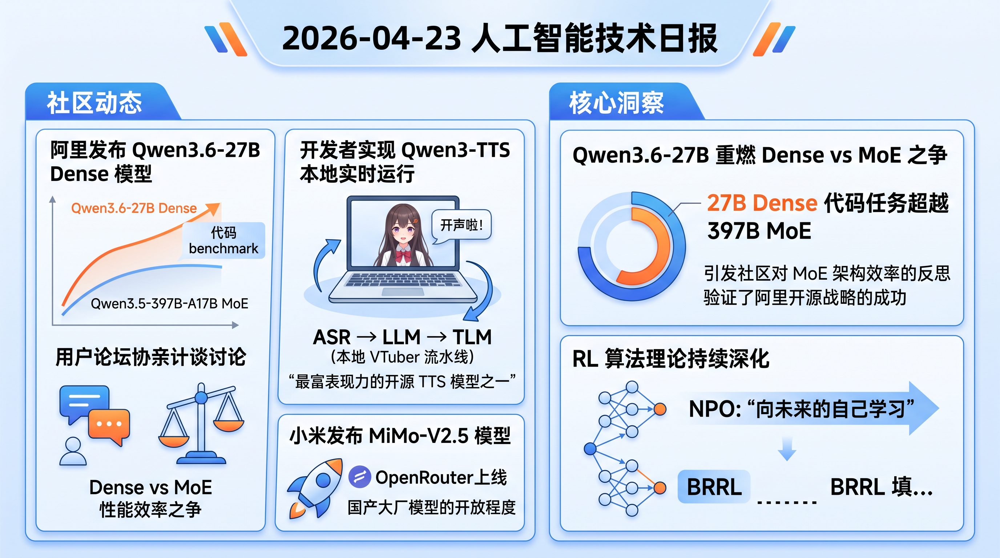

# 破晓 PoXiao 早报 - 2026-04-23

> 数据来源：真实抓取 · 65 条原始内容 · 生成时间：2026-04-23 10:58 UTC+8

---

## 📡 学术概览

### 🔴 Tier 1 - 范式突破/极高热度

1. **NPO: Near-Future Policy Optimization — 向未来的自己学习**

   🔬 领域：RL 推断 & 对齐 · 算法创新 · 热度：arXiv 新论文，Qwen 实验验证

   - **一句话核心贡献**：提出"向未来的自己学习"——用同一训练 run 中稍后的 checkpoint 作为 guide，既比当前策略强又比外部 teacher 更近，解决 RLVR 中 off-policy 轨迹来源问题
   - **摘要精译**：RL with Verifiable Rewards (RLVR) 已成为 LLM 后训练核心范式。引入 off-policy 轨迹可加速收敛并提升性能上限，但轨迹来源是关键挑战：外部 teacher 高质但分布差距大，历史 replay 近但质量有天花板。NPO 提出：用同一训练 run 中稍后的 checkpoint 作为 guide——它比当前策略强（更强 Q），又比任何外部源都近（更低 V）。在 Qwen3-VL-8B-Instruct + GRPO 上验证，NPO 将平均性能从 57.88 提升至 62.84，自动变体 AutoNPO 进一步推至 63.15

   

   
💡 展开详情（方法论 + 实验）

   - **核心创新**：将 RL 视为"向未来的自己学习"，同一训练 run 内部提供 guide 轨迹
   - **手动干预验证**：早期 bootstrapping + 晚期 plateau breakthrough，验证可行性
   - **AutoNPO**：自动触发干预，选择最大化 S（signal strength）的 guide checkpoint
   - **实验结果**：Qwen3-VL-8B 上从 57.88 → 62.84（NPO）→ 63.15（AutoNPO）
   - **链接**：https://arxiv.org/abs/2604.20733v1

   

2. **GRPO-VPS: 用过程监督增强 GRPO 的推理能力**

   🔬 领域：RL 推断 & 对齐 · GRPO 改进 · 热度：arXiv 新论文，数学/通用任务验证

   - **一句话核心贡献**：无需 reward model 和 Monte Carlo rollouts，通过探测模型对正确答案的条件概率来提供 step-level 反馈，解决 GRPO 的信用分配粗粒度问题
   - **摘要精译**：GRPO 消除了 critic model 需求，但对中间步骤的信用分配是粗粒度的，导致无法识别有效推理策略且容易 overthinking。本文引入 model-free 的可验证过程监督：在推理轨迹的每个 segment 边界探测模型对正确答案的条件概率变化，得到可解释的 step-level 进展度量。数学任务上准确率提升 2.6 points，推理长度缩短 13.7%；通用任务上提升 2.4 points，长度缩短 4%

   

   
💡 展开详情（方法论 + 实验）

   - **核心创新**：Segment-wise progress measurement via conditional probability probing
   - **无需额外监督**：区别于 Monte Carlo rollouts 或 reward model，完全基于模型自身信念
   - **实验覆盖**：数学 benchmark（准确率 +2.6，长度 -13.7%）+ 通用 domain（准确率 +2.4，长度 -4%）
   - **链接**：https://arxiv.org/abs/2604.20659v1

   

3. **Bounded Ratio RL: PPO 理论基础的重大修复**

   🔬 领域：RL 推断 & 对齐 · 理论突破 · 热度：arXir 新论文，IsaacLab/Humanoid 验证

   - **一句话核心贡献**：提出 BRRL 框架，推导出 PPO 裁剪目标的解析最优解，证明单调性能提升，填补 trust region 方法与启发式 clipping 之间的理论鸿沟
   - **摘要精译**：PPO 已成为 on-policy RL 的主导算法，但 trust region 方法的理论基础与 PPO 启发式裁剪目标之间存在显著脱节。本文提出 BRRL 框架，形式化新的正则化约束优化问题，推导解析最优解并证明单调提升性质。对参数化策略类，提出 BPO 算法，用 advantage-weighted divergence 最小化逼近最优解。框架还为 PPO 成功提供了新理论解释，并将其与 Cross-Entropy Method 连接。MuJoCo/Atari/IsaacLab（含 Humanoid 运动）实验中，BPO 和 GBPO 在稳定性和最终性能上匹配或超越 PPO/GRPO

   

   
💡 展开详情（方法论 + 实验）

   - **理论贡献**：BRRL 提供单调性能保证，BPO 是参数化策略的实用算法
   - **新视角**：PPO 的 clipping 可解释为 trust region 方法的特例
   - **实验覆盖**：MuJoCo + Atari + IsaacLab（Humanoid locomotion）
   - **扩展**：GBPO 用于 LLM fine-tuning，同样优于 GRPO
   - **链接**：https://arxiv.org/abs/2604.18578v2

   

4. **HiPO: 层次化偏好优化，让 DPO 能处理复杂推理**

   🔬 领域：RL 推断 & 对齐 · DPO 改进 · 热度：arXiv 新论文

   - **一句话核心贡献**：将响应分解为推理片段（问题澄清、推理步骤、答案），对每个片段计算加权 DPO loss，使 DPO 能对多步推理提供细粒度反馈
   - **摘要精译**：DPO 是对齐 LLM 的有效框架，但难以处理复杂推理任务——DPO 只优化整个响应的偏好，无法对多步解法的子步骤提供反馈。本文提出 HiPO，将响应分为 query clarification、reasoning steps、answer 三个 segment，各计算 DPO loss 并加权求和。在 Math Stack Exchange 偏好数据集上 fine-tune 7B LLM，在多个数学 benchmark 上超越 DPO baseline，GPT-4.1 评估显示组织性、逻辑流、一致性显著提升

   

   
💡 展开详情（方法论 + 实验）

   - **核心创新**：Segment-specific training，保持 DPO 的计算效率和训练稳定性
   - **实验结果**：多个 7B 模型在数学 benchmark 上超越 DPO
   - **评估维度**：GPT-4.1 评估 organization、logical flow、consistency
   - **链接**：https://arxiv.org/abs/2604.20140v1

   

---

### 🟡 Tier 2 - 优秀经验/实用工具

5. **MGDA-Decoupled: 多目标 DPO 对齐的去偏优化**

   🔬 领域：RL 推断 & 对齐 · 多目标优化 · 热度：arXiv 新论文

   - **一句话核心贡献**：用几何感知的多目标优化替代固定权重标量化，确保各目标（有用性、真实性、无害性）的公平权衡

   

   
💡 展开详情

   - **核心方法**：MGDA-Decoupled 找到共享下降方向，显式考虑各目标的收敛动态
   - **实验**：UltraFeedback 数据集上，几何感知方法（特别是 MGDA-Decoupled）在整体和单目标 win rate 上最高
   - **链接**：https://arxiv.org/abs/2604.20685v1

   

6. **R2IF: 函数调用的可解释推理对齐**

   🔬 领域：LLM Agent 工程 · reasoning · 热度：arXiv 新论文

   - **一句话核心贡献**：用复合奖励（格式/正确性约束 + CoT 有效性奖励 + SMV 奖励）+ GRPO 优化，解决函数调用中推理过程与工具决策的不对齐问题

   

   
💡 展开详情

   - **复合奖励设计**：CER（CoT Effectiveness Reward）+ SMV（Specification-Modification-Value）reward
   - **实验结果**：BFCL 上 Llama3.2-3B 提升 34.62%，CoT Effectiveness 正向（0.05）
   - **链接**：https://arxiv.org/abs/2604.20316v1

   

7. **V-tableR1: 多模态表格推理的过程监督**

   🔬 领域：多模态推理 · chain-of-thought · 热度：arXiv 新论文

   - **一句话核心贡献**：用专门 critic VLM 对视觉 CoT 提供 step-level 反馈，配合 PGPO 算法优化

   

   
💡 展开详情

   - **实验结果**：V-tableR1 4B 在表格 benchmark 上超越开源模型，达到 SOTA
   - **链接**：https://arxiv.org/abs/2604.20755v1

   

---

## 🔥 社区速递

### 🔴 Tier 1 - 范式突破/极高热度

1. **Qwen3.6-27B 发布：旗舰级代码能力，Dense 超越 MoE（HN Score 725）**

   🔥 热度信号：HN Score 725 | Comments 349 · 来源：HackerNews / Qwen 博客

   - **一句话核心**：阿里发布 Qwen3.6-27B Dense 模型，官方宣称在代码 benchmark 上超越 Qwen3.5-397B-A17B MoE 模型，社区讨论 Dense vs MoE 的性能效率之争
   - **核心共识**：27B 参数量友好（单卡可跑），代码能力达到旗舰水准；Dense 模型在推理任务上仍有独特优势
   - **主要争议/踩坑**：MoE 社区质疑——397B 参数的 MoE 怎么会被 27B Dense 打败？有观点认为是 MoE 的专家利用率问题，也有观点认为 Dense 在代码任务上确实更高效
   - 🔗 [Qwen 博客](https://qwen.ai/blog?id=qwen3.6-27b) | [Reddit 讨论](https://www.reddit.com/r/LocalLLaMA/comments/1ssl6ki/)

2. **Qwen3 TTS 本地实时运行：被低估的开源语音合成**

   🔥 热度信号：Reddit LocalLLaMA 热帖 · 来源：Reddit LocalLLaMA

   - **一句话核心**：开发者实现 Qwen3-TTS 本地实时运行，称其为"最富表现力的开源 TTS 模型之一"，配合 ASR → LLM → TLM 全本地 VTuber 流水线
   - **核心共识**：开源语音合成领域正在追赶闭源方案；Qwen3-TTS 在情感表达上表现突出
   - 🔗 [Reddit 原帖](https://www.reddit.com/r/LocalLLaMA/comments/1ssugid/)

3. **小米 MiMo-V2.5 发布（OpenRouter 已上线）**

   🔥 热度信号：Reddit LocalLLaMA · 来源：Reddit LocalLLaMA

   - **一句话核心**：小米发布 MiMo-V2.5 模型，已在 OpenRouter 上线，社区关注国产大厂模型的开放程度
   - **核心共识**：小米进入大模型开源赛道，与字节、阿里形成竞争格局
   - 🔗 [OpenRouter 链接](https://openrouter.ai/xiaomi/mimo-v2.5) | [Reddit 帖子](https://www.reddit.com/r/LocalLLaMA/comments/1ssqkha/)

4. **乒乓球机器人击败顶级人类选手**

   🔥 热度信号：HN Score 78 | Comments 91 · 来源：HackerNews / Reuters

   - **一句话核心**：Google DeepMind 展示乒乓球机器人，首次在实战中击败人类顶级选手，具身智能里程碑
   - **核心共识**：机器人实时反应速度和策略决策达到竞技水准；对具身智能和实时控制领域是重大进展
   - 🔗 [Reuters 报道](https://www.reuters.com/sports/ping-pong-robot-ace-makes-history-by-beating-top-level-human-players-2026-04-22/)

5. **Google 第八代 TPU 发布：为 Agent 时代设计**

   🔥 热度信号：HN Score 409 | Comments 200 · 来源：HackerNews / Google 博客

   - **一句话核心**：Google 发布第八代 TPU，官方定位为"Agent 纪元的芯片"，强调对长上下文和推理密集型任务的支持
   - **核心共识**：TPU 与 NVIDIA GPU 的竞争从"训练效率"转向"推理成本"；Agent 工作负载成为硬件设计核心考量
   - 🔗 [Google 博客](https://blog.google/innovation-and-ai/infrastructure-and-cloud/google-cloud/eighth-generation-tpu-agentic-era/)

---

### 🟡 Tier 2 - 优秀经验/实用工具

6. **Dense vs MoE 之争：27B 如何打败 397B？**

   🔥 热度信号：Reddit LocalLLaMA 热帖 · 来源：Reddit LocalLLaMA

   - **一句话核心**：社区热议 Qwen3.6-27B Dense 超越 Qwen3.5-397B MoE 的现象，讨论 MoE 的专家利用率问题
   - **核心共识**：Dense 模型在代码任务上可能更高效；MoE 的推理加速优势在编程任务上可能不明显
   - 🔗 [Reddit 讨论](https://www.reddit.com/r/LocalLLaMA/comments/1st11lp/)

7. **Qwen3.6 本地部署实测：双 3090 + 200k context 可用**

   🔥 热度信号：Reddit LocalLLaMA · 来源：Reddit LocalLLaMA

   - **一句话核心**：用户分享 Qwen3.6-27B Q8 GGUF 在双 3090 + 200k 上下文下的部署经验，推理速度 ~50 t/s
   - **踩坑**：性能依赖内存带宽，不同配置速度差异大
   - 🔗 [Reddit 原帖](https://www.reddit.com/r/LocalLLaMA/comments/1sszac8/)

8. **Qwen3.6 + 正确 scaffold = 接近云端代码模型能力**

   🔥 热度信号：Reddit LocalLLaMA · 来源：Reddit LocalLLaMA

   - **一句话核心**：开发者验证 Qwen3.6-35B + 合适的 coding scaffold 后，在真实 Go 任务上达到 9/10 评分
   - 🔗 [Reddit 原帖](https://www.reddit.com/r/LocalLLaMA/comments/1st4cqq/)

9. **Unsloth Qwen3.6-27B GGUF 已发布**

   🔥 热度信号：Reddit LocalLLaMA · 来源：Reddit LocalLLaMA

   - **一句话核心**：Unsloth 快速跟进 Qwen3.6-27B GGUF 量化版，支持 llama.cpp 直接运行
   - 🔗 [HuggingFace](https://huggingface.co/unsloth/Qwen3.6-27B-GGUF) | [Reddit 帖子](https://www.reddit.com/r/LocalLLaMA/comments/1ssnfdb/)

10. **Over-editing: 模型过度修改代码的系统性分析**

    🔥 热度信号：HN Score 306 | Comments 173 · 来源：HackerNews

    - **一句话核心**：开发者分析 LLM coding agent 的"过度编辑"现象——模型倾向于修改超出必要范围的代码，导致引入新问题
    - 🔗 [博客文章](https://nrehiew.github.io/blog/minimal_editing/)

---

## 💰 财经简报

1. **Qwen3.6-27B 发布：阿里开源模型的里程碑**

   - **摘要**：阿里发布 Qwen3.6-27B Dense 模型，官方宣称在代码 benchmark 上超越自家 397B MoE 模型，标志着 Dense 架构在特定任务上的回归。模型已上架 HuggingFace，Unsloth GGUF 同步发布
   - **链接**：https://qwen.ai/blog?id=qwen3.6-27b

2. **腾讯、阿里拟以 200 亿美元估值投资 DeepSeek**

   - **摘要**：路透社报道，腾讯和阿里正在洽谈投资 DeepSeek，估值超过 200 亿美元。DeepSeek V3.2 已成为开源模型标杆，此次融资将巩固其国产大模型地位
   - **链接**：https://www.reuters.com/world/asia-pacific/tencent-alibaba-talks-invest-deepseek-information-reports-2026-04-22/

3. **Google 第八代 TPU 发布：推理成本战升级**

   - **摘要**：Google 发布面向 Agent 纪元的第八代 TPU，强调长上下文和推理密集型任务支持。与 NVIDIA GPU 的竞争从"训练效率"转向"推理成本"
   - **链接**：https://blog.google/innovation-and-ai/infrastructure-and-cloud/google-cloud/eighth-generation-tpu-agentic-era/

---

## 🏢 职场动态

1. **"让 AI 做 100% 编程把我的脑子烧坏了"**

   🔥 热度信号：Reddit 热帖 · 来源：Reddit cscareerquestions

   - **一句话核心**：开发者分享自年初以来完全依赖 vibe coding 的经历，发现认知能力和问题解决能力显著退化，陷入两难：继续用 AI 还是回归传统学习
   - **核心讨论**：AI 辅助 vs AI 替代的边界在哪里？开发者如何保持核心竞争力？
   - 🔗 [Reddit 原帖](https://www.reddit.com/r/cscareerquestions/comments/1st0u7r/)

2. **AI 科学家产生结果但不进行科学推理**

   🔥 热度信号：Reddit MachineLearning · 来源：Reddit MachineLearning

   - **一句话核心**：研究发现在 25,000 次 AI scientist 实验中，68% 的情况下 AI 收集证据后完全忽略，71% 从不更新信念，只有 26% 会根据证据调整
   - 🔗 [Reddit 原帖](https://www.reddit.com/r/MachineLearning/comments/1st02fw/)

3. **9 年经验开发者：现在我的经验好像没用了**

   🔥 热度信号：Reddit 热帖 · 来源：Reddit cscareerquestions

   - **一句话核心**：9 年软件工程师发现最近两年主要工作变成重构 LLM 生成的代码，系统设计也感觉 Gemini 能做得更好，质疑软件工程的未来
   - 🔗 [Reddit 原帖](https://www.reddit.com/r/cscareerquestions/comments/1st14cn/)

4. **被裁 2.5 年后终于拿到 Offer**

   🔥 热度信号：Reddit 热帖 · 来源：Reddit cscareerquestions

   - **一句话核心**：软件工程师分享 2 年求职经历：200 份申请、75 次面试，最终拿到 Offer。年龄大、高 IC 级别、LC 能力弱是劣势，系统设计强、沟通好是优势
   - 🔗 [Reddit 原帖](https://www.reddit.com/r/cscareerquestions/comments/1ssshcx/)

---

## 📊 今日总结

1. **Qwen3.6-27B 重燃 Dense vs MoE 之争**：27B Dense 在代码任务上超越 397B MoE，引发社区对 MoE 架构效率的反思，同时验证了阿里开源战略的成功
2. **RL 算法理论持续深化**：NPO 提出"向未来的自己学习"，BRRL 填补 PPO 理论基础，GRPO-VPS 引入过程监督——RLVR 领域一日三发理论进展
3. **AI 职场焦虑进入新阶段**：从"会不会被替代"转向"用了 AI 后能力退化"——开发者开始反思 AI 辅助的边界和自身核心竞争力

---

**生成时间**：2026-04-23 10:58 CST
**数据来源**：briefs/2026-04-23/raw_context.md（真实抓取，65 条）
**配置文件**：profiles/profile_demo.yaml
**抓取时间**：2026-04-23 02:59 UTC

> ⚠️ **注**：今日 arXiv API 返回 429 速率限制，部分新增学术关键词（语音、视觉、具身智能等）未成功抓取。建议后续增加请求间隔或分批查询。
