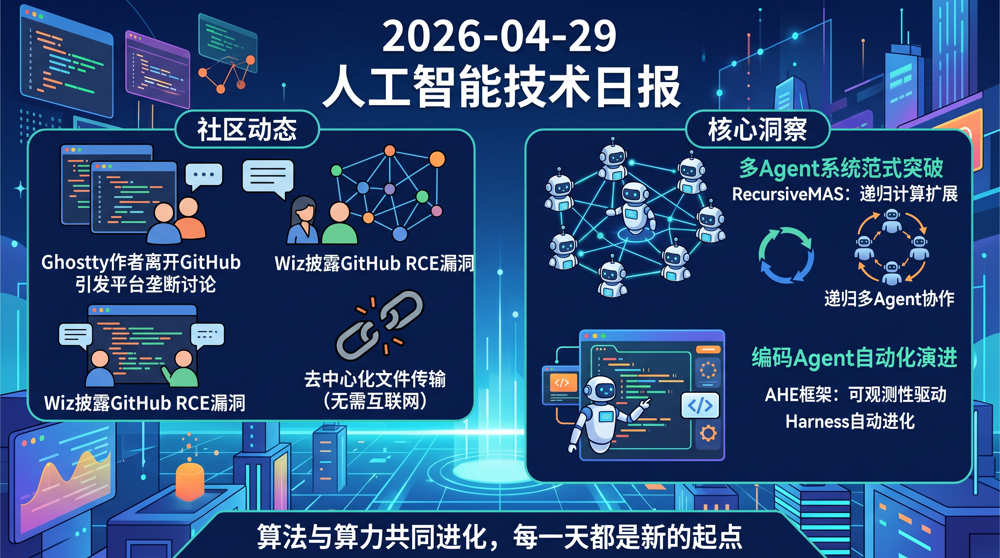

# 破晓 PoXiao 早报 - 2026-04-29

> 数据来源：真实抓取 · 395 条原始内容 · 生成时间：2026-04-29 14:05 CST

---

## 📡 学术概览

### 🔴 Tier 1 - 范式突破/极高热度

1. **Recursive Multi-Agent Systems：递归扩展多Agent协作**

   🔬 领域：多Agent系统与协作 · 热度：arXiv多关键词匹配 + 社区热议

   - **一句话核心贡献**：首次将递归计算从单一模型扩展到多Agent系统，Agent协作规模化
   - **摘要精译**：递归语言模型已成为新的扩展维度，通过迭代优化潜在状态来深化推理。本研究将这一原则从单一模型扩展到多Agent系统，提出RecursiveMAS框架，将整个系统视为统一的潜空间递归计算。该框架通过轻量级RecursiveLink模块连接异构Agent形成协作循环，实现跨Agent潜状态传递。为了优化该框架，研究团队开发了内外循环学习算法，通过共享梯度分配实现全系统协同优化。理论分析证明，RecursiveMAS比标准文本MAS更高效，并在递归训练期间保持稳定梯度。实验上，研究在数学、科学、医学、搜索和代码生成等9个基准测试上实例化RecursiveMAS，相比先进的单Agent/多Agent和递归计算基线，平均准确率提升8.3%，端到端推理加速1.2-2.4倍，Token使用减少34.6%-75.6%

   

   
💡 展开详情（方法论 + 实验）

   - **核心创新点**：
     - RecursiveLink模块实现跨Agent潜状态传递
     - 内外循环学习算法实现全系统协同优化
     - 理论证明比文本MAS更高效，递归训练梯度稳定
   - **实验结果**：9个基准平均准确率+8.3%，Token减少最高75%
   - **局限性**：需要特定的协作模式设计
   - **链接**：https://arxiv.org/abs/2604.25917v1

   

2. **Agentic Harness Engineering：可观测性驱动的编码Agent自动进化**

   🔬 领域：Agent工程框架 · 热度：arXiv多关键词匹配

   - **一句话核心贡献**：提出自动化Harness工程框架AHE，三大可观测性支柱使编码Agent Harness自动进化
   - **摘要精译**：Harness已成为编码Agent性能的关键决定因素，它塑造了模型如何与代码库、工具和执行环境交互。然而，自动化Harness工程面临诸多挑战：异构动作空间、稀疏噪声评估信号、百万Token轨迹、难以归因编辑效果等。本研究引入AHE框架，通过三大可观测性支柱（组件可观测性、经验可观测性、决策可观测性）将每次编辑转化为可证伪契约。组件可观测性让每个可编辑组件都有文件级表示，使动作空间显式可逆；经验可观测性将原始轨迹压缩为分层证据语料库；决策可观测性让每次编辑配以自我声明预测并验证。这三大支柱使Harness进化能够自主进行，不会退化为试错。实验显示，10轮AHE迭代将Terminal-Bench 2的pass@1从69.7%提升至77.0%，超越人工设计的Codex-CLI（71.9%）和自进化基线ACE、TF-GRPO

   

   
💡 展开详情（方法论 + 实验）

   - **核心创新点**：
     - 组件可观测性：文件级表示使动作空间显式可逆
     - 经验可观测性：轨迹压缩为分层证据语料库
     - 决策可观测性：每次编辑配以预测并验证
   - **实验结果**：pass@1从69.7%提升至77.0%，SWE-bench上以12%更少Token超越种子
   - **局限性**：需要完整的可观测性基础设施
   - **链接**：https://arxiv.org/abs/2604.25850v1

   

3. **QCalEval：NVIDIA量子计算校准图VLM基准**

   🔬 领域：量子计算+VLM · 热度：大厂发布

   - **一句话核心贡献**：NVIDIA发布首个量子计算校准图VLM基准，开源微调模型达74.7分
   - **摘要精译**：量子计算校准依赖对实验数据的解读，而校准图是完成这一任务最通用的可读表示形式。然而，目前尚无系统性评估来衡量视觉语言模型（VLM）解读这些图表的能力。本研究引入QCalEval，首个面向量子校准图的VLM基准：包含243个样本，覆盖87种场景类型，来自22个实验家族，涵盖超导量子比特和中性原子两种物理体系，在零样本和上下文学习设置下评估六种问题类型。最佳通用零样本模型达到72.3平均分，许多开源模型在多图上下文学习时性能下降，而前沿闭源模型则显著改善。研究团队在90亿参数规模进行了监督微调消融实验，发现SFT改善零样本性能但无法弥补多模态上下文学习差距。作为参考案例，团队发布了NVIDIA Ising Calibration 1，基于Qwen3.5-35B-A3B的开源模型，达到74.7零样本平均分

   

   
💡 展开详情（方法论 + 实验）

   - **核心创新点**：
     - 首个量子校准图VLM基准（243样本，87场景）
     - 覆盖超导量子比特+中性原子两种体系
     - 开源Qwen3.5-35B-A3B微调模型达74.7分
   - **实验结果**：最佳通用零样本模型72.3分，微调版74.7分
   - **局限性**：评估范围仍有限
   - **链接**：https://arxiv.org/abs/2604.25884v1

   

4. **DV-World：真实场景数据可视化Agent基准**

   🔬 领域：数据可视化Agent

   - **一句话核心贡献**：发布首个真实场景数据可视化Agent基准，SOTA模型整体性能<50%
   - **摘要精译**：真实世界数据可视化需要原生环境接地、跨平台演化和主动意图对齐。然而，现有基准常受困于代码沙盒局限、单语言仅创建任务、假设完美意图等问题。为填补这些空白，本研究引入DV-World，包含260个任务的基准，旨在评估真实专业生命周期中的数据可视化Agent。DV-World覆盖三大领域：DV-Sheet用于原生电子表格操作（包括图表和仪表板创建及诊断修复）；DV-Evolution用于跨编程范式适配参考可视化到新数据；DV-Interact用于与用户模拟器进行主动意图对齐。混合评估框架整合了表值对齐（数值精度）和MLLM-as-a-Judge（语义视觉评估）。实验显示，最先进模型整体性能低于50%，暴露出处理真实数据可视化复杂挑战的关键缺陷

   

   
💡 展开详情（方法论 + 实验）

   - **核心创新点**：
     - 三大领域覆盖全生命周期
     - 混合评估框架（数值+语义）
     - 原生环境接地+跨平台演化
   - **实验结果**：SOTA模型整体性能<50%
   - **局限性**：评估框架需进一步优化
   - **链接**：https://arxiv.org/abs/2604.25914v1

   

5. **Barriers to Universal Reasoning With Transformers**

   🔬 领域：Transformer推理能力

   - **一句话核心贡献**：发现标准位置编码下Transformer无法泛化到超出训练的CoT长度
   - **摘要精译**：思维链（Chain-of-Thought）已被证明能提升Transformer性能并将表达能力扩展至图灵完备。但Transformer能否泛化到训练时未见过的更长CoT轨迹？本研究发现，在标准位置编码和有限字母表下，带CoT的Transformer无法解决TC^0以外的问题。核心障碍是重复复制和最后位置检索问题。然而，如果允许词表随问题规模增长，研究证明可以为每个磁带位置分配唯一路标Token，并只记录值变化，从而实现长度可泛化的图灵机模拟，其中CoT轨迹长度是模拟运行时间的线性倍。这意味着通过扩展词表和路标Token方案可以绕过长度泛化障碍

   

   
💡 展开详情（方法论 + 实验）

   - **核心创新点**：
     - 发现重复复制和最后位置检索是核心障碍
     - 提出路标Token方案绕过障碍
     - 值变化编码避免重复检索
   - **实验结果**：在困难问题上显著改善长度泛化
   - **局限性**：需要随问题规模扩展词表
   - **链接**：https://arxiv.org/abs/2604.25800v1

   

6. **A paradox of AI fluency：AI熟练度的悖论**

   🔬 领域：人机交互

   - **一句话核心贡献**：发现熟练用户经历更多可见失败，而新手经历更多隐形失败
   - **摘要精译**：用户的AI使用技能在多大程度上影响AI实际交付的内容？这个问题对用户、AI产品构建者和社会都至关重要，但尚未得到充分探索。使用WildChat-4.8M中27,000条丰富标注的对话转录，研究发现熟练用户比新手承担更复杂的任务，并采用根本不同的交互模式：他们与AI协作迭代，精炼目标并批判性评估输出，而新手则采取被动立场。这些差异导致AI熟练度悖论：熟练用户比新手经历更多失败，但这些失败更可能是可见的（其交互模式的直接后果），更可能实现部分恢复，且伴随着在复杂任务上的更大成功。相比之下，新手更常经历隐形失败：表面上成功结束但实际上偏离目标的对话

   

   
💡 展开详情（方法论 + 实验）

   - **核心创新点**：
     - 基于27K条真实对话数据分析用户行为模式
     - 发现熟练用户采用协作迭代模式，新手采用被动接受模式
     - 提出AI熟练度悖论框架
   - **启示**：产品应鼓励深度参与而非无摩擦体验
   - **链接**：https://arxiv.org/abs/2604.25905v1

   

---

### 🟡 Tier 2 - 优秀工程实践

7. **ADEMA：长程知识合成的知识状态编排架构**

   - **一句话核心贡献**：提出知识状态编排架构，通过显式知识状态转换、检查点恢复解决长程任务失败问题
   - 🔗 https://arxiv.org/abs/2604.25849v1

8. **SAFEdit：多Agent分解解决代码编辑可靠性**

   - **一句话核心贡献**：Planner-Editor-Verifier三角色框架，TSR达到68.6%
   - 🔗 https://arxiv.org/abs/2604.25737v1

9. **Tsallis Loss Continuum：推理模型训练的损失函数连续体**

   - **一句话核心贡献**：定义Tsallis损失族在强化学习和密度估计之间插值，解决冷启动停滞
   - 🔗 https://arxiv.org/abs/2604.25907v1

10. **Semi-Markov RL for EV Ride-Hailing**

    - **一句话核心贡献**：半马尔可夫RL解决城市级电动车调度，净利润$1.22M
    - 🔗 https://arxiv.org/abs/2604.25848v1

---

## 🔥 社区速递

### 🔴 Tier 1 - 极高热度

1. **Ghostty 终端离开 GitHub**

   🔥 热度信号：HN Score 1781 | Comments 568

   - **一句话核心**：Ghostty终端作者宣布离开GitHub，引发对平台垄断的讨论
   - **核心共识**：开源项目托管平台集中度过高风险大
   - 🔗 [作者博客](https://mitchellh.com/writing/ghostty-leaving-github)

2. **GitHub RCE 漏洞 CVE-2026-3854**

   🔥 热度信号：HN Score 254 | Comments 63

   - **一句话核心**：Wiz披露GitHub远程代码执行漏洞
   - **核心共识**：云开发平台供应链安全需要更严格审计
   - 🔗 [Wiz分析](https://www.wiz.io/blog/github-rce-vulnerability-cve-2026-3854)

3. **LocalSend：开源跨平台 AirDrop 替代**

   🔥 热度信号：HN Score 745 | Comments 236

   - **一句话核心**：去中心化文件传输方案，无需互联网连接
   - **核心共识**：隐私优先的本地优先工具受到开发者青睐
   - 🔗 [GitHub](https://github.com/localsend/localsend)

4. **你的手机即将不再属于你**

   🔥 热度信号：HN Score 1023 | Comments 491

   - **一句话核心**：Android生态闭环趋势引发设备所有权担忧
   - **核心共识**：开源Android运动需要更多支持
   - 🔗 [KeepAndroidOpen](https://keepandroidopen.org/en/)

5. **Microsoft VibeVoice 开源**

   🔥 热度信号：HN Score 322 | Comments 168

   - **一句话核心**：Microsoft开源前沿语音AI模型
   - 🔗 [GitHub](https://github.com/microsoft/VibeVoice)

---

## 💰 财经简报

1. **OpenAI 模型登陆 Amazon Bedrock** - 双方战略合作进入新阶段
2. **GitHub RCE漏洞披露** - 供应链安全引发关注
3. **Warp终端开源** - 终端市场新竞争

---

## 🏢 职场动态

1. **CS专业入学人数6年来最大降幅** - AI替代焦虑影响专业选择
2. **微软强制使用 Copilot** - AI工具推广引发员工反弹
3. **AI编码经验分享** - 从不提交未审查的AI代码

---

## 📊 今日总结

1. **多Agent系统迎来范式突破**：RecursiveMAS首次将递归计算扩展到多Agent协作
2. **编码Agent进入自动化演进时代**：AHE框架通过可观测性驱动实现Harness自动进化
3. **大厂持续开源**：NVIDIA量子校准基准、Microsoft语音模型、Warp终端相继开源
4. **供应链安全事件频发**：GitHub RCE漏洞、Claude Code Bug等凸显AI时代安全挑战

---

## 📋 信息源列表

| 来源 | 类型 | 数量 | 说明 |
|------|------|------|------|
| arXiv | 学术 | 327篇 | cs.AI, cs.LG, cs.CL等+profile关键词匹配 |
| HackerNews | 科技新闻 | 16条 | Top 20 stories |
| Reddit LocalLLaMA | 社区 | ~20条 | 开源大模型实战经验 |
| Reddit MachineLearning | 学术 | ~10条 | AI学术界热点讨论 |
| Reddit Jobs & Careers | 职场 | ~15条 | Tech就业市场动态 |
| GitHub Releases | 开源 | 2条 | vLLM, TRL releases |
| RSS: 机器之心/量子位 | 中文 | 若干 | 国内大厂动态 |
| RSS: VentureBeat/TechCrunch | 融资 | 若干 | AI创业投融资 |

---

**生成时间**：2026-04-29 14:05 CST
**数据来源**：briefs/2026-04-29/raw_context.md
**配置文件**：profiles/profile_demo.yaml
