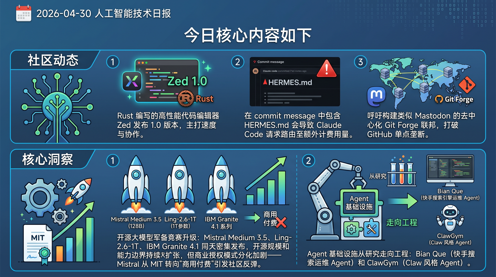

# 破晓 PoXiao 早报 - 2026-04-30

> 数据来源：真实抓取 · 多平台原始内容 · 生成时间：2026-04-30 10:51 UTC+8

---

## 📡 学术概览

### 🔴 Tier 1 - 范式突破/极高热度

1. **Bian Que: An Agentic Framework with Flexible Skill Arrangement for Online System Operations**

   🔬 领域：多 Agent 系统与协作 · 热度：快手搜索引擎工程实战，线上部署验证

   - **一句话核心贡献**：面向大规模在线引擎运维，通过灵活技能编排显著提升 LLM Agent 运维效率。
   - **摘要精译**：大规模在线引擎系统（搜索、推荐、广告）的运维工作负担极重，LLM-Agent 天然适合处理这类任务，但真正的瓶颈不在推理能力，而在编排能力——即如何为每个运维事件精准选取相关数据和知识。本文提出 Bian Que，包含三大创新：① 统一运维范式，将日常 O&M 抽象为发布拦截、主动巡检、告警根因分析三类场景；② Flexible Skill Arrangement，每个 Skill 指定特定业务模块应抓取的数据和知识，可由 LLM 自动生成或工程师用自然语言迭代优化；③ 统一自演化机制，一条纠错信号同时驱动案例记忆蒸馏和 Skill 精炼两条并行路径。该系统已在快手电商搜索引擎上线，告警量减少 75%，根因分析准确率 80%，平均修复时间缩短 50%+，离线评测通过率 99.0%。

   

   
💡 展开详情（方法论 + 实验）

   - **核心创新点**：
     1. 将复杂 O&M 场景抽象为三种统一范式，降低系统设计复杂度
     2. Flexible Skill Arrangement 解决了数据/知识选取的编排瓶颈，支持 LLM 自动生成和工程师迭代
     3. 自演化机制使系统能从线上纠错信号中持续学习，无需人工标注
   - **实验结果**：告警量 -75%，根因分析准确率 80%，MTTR 缩短 >50%，离线 pass rate 99.0%
   - **局限性**：当前评估场景局限于电商搜索引擎，跨领域泛化能力待验证
   - **链接**：https://arxiv.org/abs/2604.26805v1

   

2. **GLM-5V-Turbo: Toward a Native Foundation Model for Multimodal Agents**

   🔬 领域：多 Agent 系统与协作 · 基础大模型 · 热度：智谱 AI 多模态 Agent 基础模型

   - **一句话核心贡献**：将多模态感知作为推理核心而非接口，打造原生多模态 Agent 基础模型。
   - **摘要精译**：随着基础模型越来越多地被部署到真实环境中，Agent 能力不仅依赖语言推理，还需要感知和处理图像、视频、网页、文档、GUI 等异构上下文的能力。GLM-5V-Turbo 围绕这一目标构建：多模态感知被整合为推理、规划、工具使用和执行的核心组件，而非 LLM 的辅助接口。本报告总结了 GLM-5V-Turbo 在模型设计、多模态训练、强化学习、工具链扩展以及 Agent 框架集成方面的主要改进。这些进展使其在多模态编码、视觉工具使用和基于框架的 Agent 任务上表现强劲，同时保留了具有竞争力的纯文本编码能力。研究过程也为构建多模态 Agent 提供了实践洞见：多模态感知的核心地位、分层优化策略以及可靠的端到端验证至关重要。

   

   
💡 展开详情（方法论 + 实验）

   - **核心创新点**：
     1. 多模态感知深度融合进推理链路，而非作为外挂模块
     2. 引入分层优化（hierarchical optimization）策略
     3. 强化学习结合工具链扩展，提升 Agent 执行稳定性
     4. 端到端可靠性验证机制
   - **实验结果**：多模态编码、视觉工具使用、框架 Agent 任务均实现强劲表现
   - **局限性**：技术报告形式，部分实验细节和对比基准待完善
   - **链接**：https://arxiv.org/abs/2604.26752v1

   

3. **ClawGym: A Scalable Framework for Building Effective Claw Agents**

   🔬 领域：多 Agent 系统与协作 · 热度：多关键词高频命中

   - **一句话核心贡献**：提供 Claw 风格个人 Agent 全生命周期开发框架，含合成数据、训练、评测三位一体。
   - **摘要精译**：Claw 风格环境支持基于本地文件、工具调用和持久工作区状态的多步工作流，但缺乏系统化框架，特别是可验证训练数据合成和 Agent 训练与诊断评测的一体化方案。本文提出 ClawGym：① ClawGym-SynData，从 persona 驱动的意图和技能操作出发，合成 13,500 个高质量过滤任务，配套真实感 mock 工作区和混合验证机制；② ClawGym-Agents，通过对黑盒 rollout 轨迹的 SFT，训练了一系列 Claw 风格模型，并探索了基于轻量级流水线并行化 rollout 的强化学习；③ ClawGym-Bench，通过自动过滤和人工-LLM 联合审核，构建了 200 个标定实例的评测基准。

   

   
💡 展开详情（方法论 + 实验）

   - **核心创新点**：
     1. Claw 风格数据合成流水线，规模 13.5K 任务
     2. SFT + RL 混合训练策略，per-task 沙箱并行
     3. 人工-LLM 联合审核的 Benchmark 构建方法论
   - **实验结果**：ClawGym-Bench 200 实例评测，验证有效性
   - **局限性**：数据合成偏向 persona-driven 场景，真实用户分布覆盖待评估
   - **链接**：https://arxiv.org/abs/2604.26904v1

   

4. **TIDE: Cross-Architecture Distillation for Diffusion Large Language Models**

   🔬 领域：基础大模型 & 预训练 · 热度：首个跨架构 dLLM 蒸馏框架

   - **一句话核心贡献**：首创跨架构扩散语言模型蒸馏框架，0.6B 学生超越 AR 基线 1.53 分。
   - **摘要精译**：扩散大语言模型（dLLMs）具有并行解码和双向上下文的优势，但最先进的 dLLM 需要数十亿参数才能达到竞争性性能。现有 dLLM 蒸馏方法局限于同架构内减少推理步骤，无人解决跨架构知识迁移（teacher 和 student 在架构、注意力机制、tokenizer 均不同）。本文提出 TIDE 框架，包含三个模块化组件：① TIDAL，在训练进度和扩散时间步两个维度联合调节蒸馏强度，适应 teacher 的噪声依赖可靠性；② CompDemo，通过互补 mask 分割丰富 teacher 上下文，改善重遮蔽下的预测；③ Reverse CALM，一种跨 tokenizer 目标，反转块级似然匹配，产生有界梯度和双端噪声过滤。将 8B dense 和 16B MoE teacher 蒸馏进 0.6B student，在 8 个 benchmark 上平均超越基线 1.53 分，代码生成提升显著（HumanEval 48.78 vs. AR 基线 32.3）。

   

   
💡 展开详情（方法论 + 实验）

   - **核心创新点**：
     1. 首次解决 dLLM 跨架构蒸馏问题（架构/注意力/tokenizer 均异构）
     2. TIDAL 自适应蒸馏强度，解决 teacher 噪声可靠性随时间步变化问题
     3. Reverse CALM 跨 tokenizer 对齐，解决 tokenizer 不一致导致的监督信号问题
   - **实验结果**：8 个 benchmark 平均 +1.53 分；HumanEval 48.78（vs. 32.3 AR 基线）
   - **局限性**：当前 student 规模较小（0.6B），更大规模效果待验证
   - **链接**：https://arxiv.org/abs/2604.26951v1

   

5. **World2VLM: Distilling World Model Imagination into VLMs for Dynamic Spatial Reasoning**

   🔬 领域：基础大模型 & 预训练 · 热度：VLM 空间推理新范式

   - **一句话核心贡献**：从生成式世界模型蒸馏空间想象力到 VLM，训练时消除推理时昂贵的世界模型调用。
   - **摘要精译**：视觉语言模型（VLMs）在静态视觉理解上表现优秀，但在需要根据自我中心运动想象场景演变的动态空间推理任务上仍存在明显不足。现有方案要么缺乏运动条件状态转换的显式建模，要么推理阶段计算开销巨大。本文提出 World2VLM：给定初始观测和参数化相机轨迹，使用视角一致的世界模型合成几何对齐的未来视图，为正向（动作→结果）和逆向（结果→动作）空间推理生成结构化监督信号。在紧凑数据集上用两阶段方案对 VLM 进行后训练，在 SAT-Real、SAT-Synthesized、VSI-Bench 和 MindCube 多个空间推理基准上实现一致提升，同时优于推理时耦合世界模型的方案，且无需昂贵的推理时生成。

   

   
💡 展开详情（方法论 + 实验）

   - **核心创新点**：
     1. 训练时蒸馏世界模型的空间想象力，避免推理时开销
     2. 正向/逆向双路空间推理监督信号设计
     3. 视角一致世界模型生成几何对齐的未来帧
   - **实验结果**：在 SAT-Real、SAT-Synthesized、VSI-Bench、MindCube 均优于基线和推理时世界模型方案
   - **局限性**：依赖世界模型质量，场景多样性受世界模型覆盖范围限制
   - **链接**：https://arxiv.org/abs/2604.26934v1

   

6. **MoRFI: Monotonic Sparse Autoencoder Feature Identification**

   🔬 领域：基础大模型 & 预训练 · 热度：揭示微调引入幻觉的机制

   - **一句话核心贡献**：用稀疏自编码器定位 SFT 引入幻觉的因果特征方向，实现单潜变量干预恢复知识。
   - **摘要精译**：LLM 在预训练阶段获取大部分事实知识，而 post-training 阶段引入的新知识往往导致幻觉，其底层机制尚不清晰。本研究对 Llama 3.1 8B、Gemma 2 9B 和 Mistral 7B v03 进行受控微调实验（闭卷 QA），在七个不同单 QA 数据集上控制新知识比例和训练轮数，验证了新知识引入越多幻觉越严重、训练时间越长效果越差的规律。通过预训练稀疏自编码器（SAE）分析各检查点的残差流激活，提出 Monotonic Relationship Feature Identification（MoRFI）捕捉因果相关的潜变量。研究发现，接触未知事实会沿残差流中特定方向破坏模型检索已存储知识的能力，且通过单个潜变量干预即可恢复知识。

   

   
💡 展开详情（方法论 + 实验）

   - **核心创新点**：
     1. MoRFI 方法：利用单调性关系过滤 SAE 特征，精准捕捉因果相关潜变量
     2. 控制变量实验设计：新知识比例 × 训练轮数，量化幻觉产生机制
     3. 单潜变量干预可恢复知识，提供可解释性和干预路径
   - **实验结果**：在三个模型（Llama/Gemma/Mistral）上均验证规律，单潜变量干预有效
   - **局限性**：仅针对闭卷 QA 场景，开放域任务泛化性待验证
   - **链接**：https://arxiv.org/abs/2604.26866v1

   

---

### 🟡 Tier 2 - 优秀经验/实用工具

1. **FaaSMoE: A Serverless Framework for Multi-Tenant Mixture-of-Experts Serving**

   🔬 领域：基础大模型 & 预训练（MoE） · 热度：MoE 推理工程化

   - **一句话核心贡献**：基于 FaaS 平台部署 MoE 专家为无状态函数，资源占用降至基线 1/3。

   

   
💡 展开详情

   - **关键内容**：FaaSMoE 将 MoE 控制面与执行面解耦，专家按需调用，支持 scale-to-zero；用 Qwen1.5-moe-2.7B 在多租户负载下评测，资源 <1/3，实现高弹性 MoE 推理。
   - **链接**：https://arxiv.org/abs/2604.26881v1

   

2. **Select to Think (S2T): Unlocking SLM Potential with Local Sufficiency**

   🔬 领域：基础大模型 & 预训练 · 热度：SLM 推理提效

   - **一句话核心贡献**：发现"局部充分性"现象，将 LLM 角色从生成改为在 SLM 候选中选择，大幅提升小模型推理。

   

   
💡 展开详情

   - **关键内容**：1.5B SLM 的 Top-8 候选可捕获 32B LLM 的选择（95% 命中率）。S2T-LOCAL 将选择逻辑蒸馏进 SLM，贪心解码平均提升 24.1%，效果接近 8-path 自洽，但仅需单次推理。
   - **链接**：https://arxiv.org/abs/2604.26940v1

   

3. **Three-Step Nav: A Hierarchical Global-Local Planner for Zero-Shot VLN**

   🔬 领域：多 Agent 系统与协作 · 热度：零样本 VLN SOTA

   - **一句话核心贡献**：三视图协议（前看、当下、回望）解决零样本视觉语言导航漂移与过早停止问题。

   

   
💡 展开详情

   - **关键内容**：无需梯度更新或任务特定微调，直接插入现有 VLN 流水线；在 R2R-CE 和 RxR-CE 数据集上实现零样本 SOTA。
   - **链接**：https://arxiv.org/abs/2604.26946v1

   

4. **FutureWorld: A Live Environment for Training Predictive Agents with Real-World Outcome Rewards**

   🔬 领域：多 Agent 系统与协作 · 热度：真实世界强化学习环境

   - **一句话核心贡献**：构建基于真实事件预测的 RL 环境，用结果实现闭环训练，持续改善 Agent 预测能力。

   

   
💡 展开详情

   - **关键内容**：FutureWorld 利用真实世界事件预测作为 RL 信号，防止答案泄露；三个开源基础模型连续多日训练结果表明训练有效；同时构建了 daily benchmark 评测多个前沿 Agent。
   - **链接**：https://arxiv.org/abs/2604.26733v1

   

5. **Preserving Disagreement: Architectural Heterogeneity in Multi-Agent Policy Simulation**

   🔬 领域：多 Agent 系统与协作 · 热度：多 Agent 政策模拟研究

   - **一句话核心贡献**：架构异构显著降低多 Agent 审议中的人工共识，但与一致性验证存在保真度-多样性权衡。

   

   
💡 展开详情

   - **关键内容**：120 次审议实验，异构架构将首选项集中度从 70.9% 降至 46.1%（儿童福利场景）、46% 降至 22.9%（住房场景），p<0.001；提出"可信张力率"作为小模型审议能力诊断指标。
   - **链接**：https://arxiv.org/abs/2604.26561v1

   

---

## 🔥 社区速递

### 🔴 Tier 1 - 范式突破/极高热度

1. **Zed 编辑器 1.0 正式发布**

   🔥 热度信号：HN Score 1569 | Comments 502 · 来源：HackerNews

   - **一句话核心**：Rust 编写的高性能代码编辑器 Zed 发布 1.0 版本，主打速度与协作。
   - **核心共识**：社区对其性能表现和原生协作功能评价积极，被视为 VSCode 的有力竞争者。
   - **主要争议/踩坑**：生态系统和插件支持仍不及 VSCode 丰富，部分用户担忧长期维护。
   - 🔗 [原帖链接](https://zed.dev/blog/zed-1-0)

2. **HERMES.md 触发 Claude Code 额外计费 Bug**

   🔥 热度信号：HN Score 996 | Comments 426 · 来源：HackerNews

   - **一句话核心**：在 commit message 中包含 HERMES.md 会导致 Claude Code 请求路由至额外计费用量。
   - **核心共识**：这是 Anthropic Claude Code 的工程 bug，被安全研究人员和社区广泛关注。
   - **主要争议/踩坑**：涉及 AI 工具计费逻辑的透明度和安全合规问题。
   - 🔗 [原帖链接](https://github.com/anthropics/claude-code/issues/53262)

3. **We need a federation of forges（Git 平台联邦化倡议）**

   🔥 热度信号：HN Score 524 | Comments 332 · 来源：HackerNews

   - **一句话核心**：呼吁构建类似 Mastodon 的去中心化 Git Forge 联邦，打破 GitHub 单点垄断。
   - **核心共识**：大量开发者认同 GitHub 依赖的风险，支持开放协议推进代码平台互联。
   - **主要争议/踩坑**：实现标准统一难度大，现有尝试（如 Gitea/Forgejo）生态碎片化。
   - 🔗 [原帖链接](https://blog.tangled.org/federation/)

4. **Copy Fail（剪贴板 UX 反模式展览）**

   🔥 热度信号：HN Score 636 | Comments 270 · 来源：HackerNews

   - **一句话核心**：一个收集各类「复制失败」体验的网站，引发开发者对剪贴板 UX 的大讨论。
   - **核心共识**：产品设计中剪贴板操作反模式极为普遍，影响用户体验。
   - **主要争议/踩坑**：Web 安全策略限制 vs. 用户体验便利性的经典矛盾。
   - 🔗 [原帖链接](https://copy.fail/)

5. **Mistral Medium 3.5 128B 开源发布**

   🔥 热度信号：多帖热议 · 来源：Reddit LocalLLaMA

   - **一句话核心**：Mistral 发布首个旗舰级合并模型 Medium 3.5（128B dense，256k 上下文），但商用需授权。
   - **核心共识**：参数量/性能比令人印象深刻，社区对 256k 上下文窗口表示期待。
   - **主要争议/踩坑**：许可证由 MIT 修改版变为"非商业免费，商用付费"，引发开源社区批评。
   - 🔗 [原帖链接](https://www.reddit.com/r/LocalLLaMA/comments/1sz2mgw/mistral_medium_35_launched/)

---

### 🟡 Tier 2 - 优秀经验/实用工具

1. **16x DGX Sparks 家庭集群：2TB 统一内存能跑什么？**

   🔥 热度信号：热帖 · 来源：Reddit LocalLLaMA

   - **一句话核心**：玩家在家组建 16 节点 DGX Spark 集群（200Gbps 交换机），征集推荐运行场景。
   - **核心共识**：本地 LLM 硬件军备竞赛进入"家庭数据中心"阶段，2TB 统一内存可运行超大规模模型。
   - 🔗 [原帖链接](https://www.reddit.com/r/LocalLLaMA/comments/1sz0lyk/16x_dgx_sparks_what_should_i_run/)

2. **IBM Granite 4.1 系列（3B/8B/30B）发布**

   🔥 热度信号：社区关注 · 来源：Reddit LocalLLaMA

   - **一句话核心**：IBM 推出 Granite 4.1 多尺寸模型系列，含语音版 Granite Speech 4.1。
   - **核心共识**：企业级开源模型生态持续扩充，Granite 系列注重合规与可解释性。
   - 🔗 [原帖链接](https://www.reddit.com/r/LocalLLaMA/comments/1sz23wn/introducing_the_ibm_granite_41_family_of_models/)

3. **Ling-2.6-1T：万亿参数开源模型**

   🔥 热度信号：社区关注 · 来源：Reddit LocalLLaMA

   - **一句话核心**：inclusionAI 开源 Ling-2.6-1T，面向复杂任务的万亿参数综合旗舰模型。
   - **核心共识**：开源超大模型愈发普遍，推理效率和 token 优化成为差异化竞争点。
   - 🔗 [原帖链接](https://www.reddit.com/r/LocalLLaMA/comments/1sz59l4/inclusionailing261t_hugging_face/)

4. **Cursor Camp（Neal.fun 互动小游戏）**

   🔥 热度信号：HN Score 679 | Comments 110 · 来源：HackerNews

   - **一句话核心**：Neal.fun 推出 Cursor Camp 趣味小游戏，开发者社区大量分享。
   - **核心共识**：创意类 Web 项目仍能引发大规模传播。
   - 🔗 [原帖链接](https://neal.fun/cursor-camp/)

5. **Nous Research AMA：Hermes Agent 与本地模型未来**

   🔥 热度信号：社区热帖 · 来源：Reddit LocalLLaMA

   - **一句话核心**：Nous Research 联合创始人 emozilla 在 LocalLLaMA 举办 AMA，讨论 Hermes Agent 与开源模型方向。
   - **核心共识**：本地 Agent 能力被视为下一阶段重点，工具调用和长上下文支持是关键。
   - 🔗 [原帖链接](https://www.reddit.com/r/LocalLLaMA/comments/1sz2y76/ama_with_nous_research_ask_us_anything/)

6. **Qwen 推出 FlashQLA：高性能线性注意力内核**

   🔥 热度信号：社区关注 · 来源：Reddit LocalLLaMA

   - **一句话核心**：Qwen 发布 FlashQLA，基于 TileLang 的线性注意力内核，前向 2-3× 加速，后向 2× 加速。
   - **核心共识**：专为端侧 Agent AI 设计，门控驱动自动卡内 CP，硬件友好代数重构。
   - 🔗 [原帖链接](https://www.reddit.com/r/LocalLLaMA/comments/1syx4sg/qwen_introduced_flashqla/)

7. **PS5 破解可运行 Linux，或为本地推理带来新可能**

   🔥 热度信号：社区讨论 · 来源：Reddit LocalLLaMA

   - **一句话核心**：PS5 已可破解运行 Linux，社区探讨能否利用其 GPU 进行本地 LLM 推理。
   - **核心共识**：社区对低成本推理硬件保持热情，期待 llama.cpp 移植。
   - 🔗 [原帖链接](https://www.reddit.com/r/LocalLLaMA/comments/1sz1y8d/ps5s_can_now_be_hacked_to_run_linux_perhaps_some/)

---

## 💰 财经简报

> 今日财经数据源（VentureBeat AI、TechCrunch AI、36kr AI）抓取条目为零，以下提取 HackerNews 与社区中相关科技投融资及行业动态信息：

1. **Joby Aviation 在纽约 JFK 机场完成历史性电动飞行出租车演示飞行**

   - **摘要**：Joby Aviation 在纽约市 JFK 机场完成电动空中出租车的历史性演示飞行，标志着城市空中出行（UAM）商业化进程加速。
   - **链接**：https://www.flyingmag.com/joby-nyc-electric-air-taxi-jfk-airport/

2. **Ramp Sheets AI 金融数据泄露安全漏洞披露**

   - **摘要**：安全研究机构 PromptArmor 披露 Ramp 的 Sheets AI 功能存在财务数据外泄风险，引发企业级 AI 工具安全讨论。
   - **链接**：https://www.promptarmor.com/resources/ramps-sheets-ai-exfiltrates-financials

3. **开源听诊器：生产成本 2.5-5 美元**

   - **摘要**：GliaX 开源医疗设备项目发布低成本听诊器方案，成本仅为商业产品的极小分之一，体现 AI+开源在医疗公平领域的潜力。
   - **链接**：https://github.com/GliaX/Stethoscope

---

## 📊 今日总结

1. **开源大模型军备竞赛升级**：Mistral Medium 3.5（128B）、Ling-2.6-1T（1T参数）、IBM Granite 4.1 系列在同一天密集发布，开源模型规模和能力边界持续扩张，但商业授权模式分化加剧——Mistral 从 MIT 转向"商用付费"引发社区反弹。

2. **Agent 基础设施从研究走向工程**：Bian Que（快手搜索引擎运维 Agent）和 ClawGym（Claw 风格 Agent 全栈框架）均代表 Agent 技术从 Paper 走向生产实践，快手场景下告警 -75%、MTTR 缩短 >50% 的数据印证了 LLM-Agent 在真实工程中的规模化价值。

3. **开发者工具生态加速演进**：Zed 1.0 发布（HN 1569 分）和 Git Forge 联邦化倡议（HN 524 分）共同指向开发者对工具链掌控权和去中心化的强烈诉求；同时 HERMES.md 引发的 Claude Code 计费 Bug（HN 996 分）警示 AI coding 工具的工程可靠性仍需持续打磨。

---

**生成时间**：2026-04-30 10:51 CST
**数据来源**：briefs/2026-04-30/raw_context.md（真实抓取）
**配置文件**：profiles/profile_demo.yaml
**抓取时间**：2026-04-30 02:50 UTC
