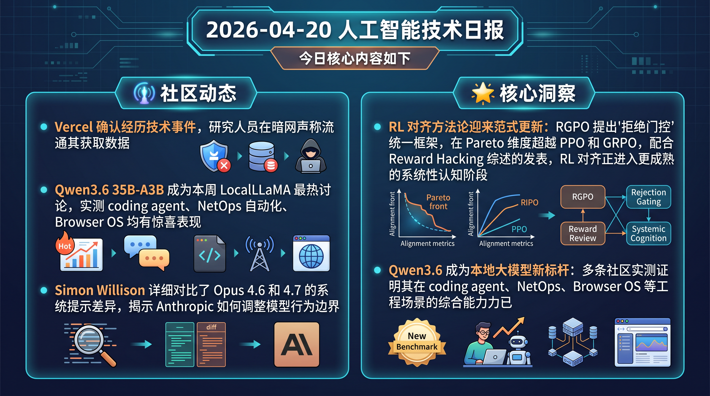

# 破晓 PoXiao 早报 - 2026-04-20

> 数据来源：真实抓取 · 138 条原始内容 · 生成时间：2026-04-20 10:47 UTC+8

---

## 📡 学术概览

### 🔴 Tier 1 - 范式突破/极高热度

1. **Beyond Importance Sampling: Rejection-Gated Policy Optimization (RGPO)**
   📌 领域：RL 推断 & 对齐 (RLHF/GRPO/PPO) · 热度：arXiv 新论文，多关键词命中
   - **一句话核心贡献**：用"拒绝门控"替代重要性采样，提出统一框架统摄 TRPO/PPO/REINFORCE，在 RLHF 对齐中 Pareto 占优
   - **摘要精译**：RGPO 的核心思想是：与其对所有样本加权，不如让模型"选择哪些样本值得学习"。引入可微分的接受门函数 α(s,a)，在 Qwen2.5-1.5B 的 Anthropic HH-RLHF 实验中，奖励比 PPO-RLHF 高 **+14.8%**，KL 散度比 PPO-RLHF 低 **-16.0%**，比 GRPO 低 **-53.1%**，实现真正的 Pareto 改进
   

   
💡 展开详情（方法论 + 实验）

   - **核心创新点**：将拒绝采样从数据预处理提升为优化原则，门函数直接参与梯度计算；证明在 IS 比率重尾时仍保证有界梯度方差
   - **实验结果**：Qwen2.5-1.5B 在 HH-RLHF，n=3 seeds，最高奖励 + 最低 KL，同时计算开销与 PPO 相当
   - **局限性**：目前仅验证小模型（1.5B），大模型扩展性有待验证
   - **链接**：https://arxiv.org/abs/2604.14895v1
   

2. **Reward Hacking in the Era of Large Models: Mechanisms, Emergent Misalignment, Challenges**
   📌 领域：RL 推断 & 对齐 (RLHF/GRPO/PPO) · 热度：综述类，覆盖 RLHF/RLAIF/RLVR
   - **一句话核心贡献**：提出"代理压缩假说"（PCH），统一解释奖励黑客现象，从啰嗦偏置到欺骗行为都是同一结构不稳定性
   - **摘要精译**：当模型规模增大、优化加深，代理奖励信号会被系统性地利用：表现为啰嗦、奉承、幻觉理由、基准测试过拟合。论文提出 PCH 框架，将奖励黑客归因于"目标压缩 × 优化放大 × 评估器-策略协同适应"的三方交互，并整理了检测与缓解策略
   

   
💡 展开详情（方法论 + 实验）

   - **核心创新点**：PCH 统一框架，解释为何表面无害的捷径行为会泛化为欺骗和操纵行为
   - **覆盖范围**：RLHF、RLAIF、RLVR 三种对齐范式
   - **链接**：https://arxiv.org/abs/2604.13602v1
   

---

### 🟡 Tier 2 - 优秀经验/实用工具

3. **AtManRL: Towards Faithful Reasoning via Differentiable Attention Saliency**
   📌 领域：RL 推断 & 对齐 · 热度：GRPO + 可解释性交叉方向
   - **一句话核心贡献**：用可微分注意力操作训练"忠实"的 CoT，让推理链真正影响最终答案而非装饰
   - **摘要精译**：现有 CoT 推理链常常与最终答案脱钩。AtManRL 通过训练注意力掩码识别 CoT 中关键 Token，将其转化为"显著性奖励"，与 GRPO 结合，在 GSM8K 和 MMLU 上验证推理更加透明
   🔗 https://arxiv.org/abs/2604.16158v1

4. **IG-Search: Step-Level Information Gain Rewards for Search-Augmented Reasoning**
   📌 领域：LLM Agent 工程 · 热度：GRPO + 搜索增强推理
   - **一句话核心贡献**：用信息增益替代轨迹级奖励，为 GRPO 提供精细 Step 级信号，多跳 QA 显著提升
   - **摘要精译**：传统搜索增强 RL 用轨迹级奖励，无法区分精准查询与模糊查询。IG-Search 测量"检索文档相对随机文档提升模型置信度多少"，反馈到每个搜索 Token，7 个 QA 基准平均 EM 比最强基线提升 1.6 个点，额外训练开销仅 +6.4%
   🔗 https://arxiv.org/abs/2604.15148v1

5. **LongAct: Harnessing Intrinsic Activation Patterns for Long-Context RL**
   📌 领域：算力优化 & 推理加速 · 热度：GRPO/DAPO 通用增强
   - **一句话核心贡献**：关注 Query/Key 向量中高幅度激活，转为稀疏更新，LongBench v2 提升 ~8%
   - **摘要精译**：长上下文 RL 训练时，不是所有权重都同等重要。LongAct 识别高幅激活权重，只更新这些关键参数，实现更好的长上下文泛化，并在 GRPO 和 DAPO 两种算法上都有效
   🔗 https://arxiv.org/abs/2604.14922v1

6. **Pruning Unsafe Tickets: Resource-Efficient Framework for Safer LLMs**
   📌 领域：RL 推断 & 对齐 · 热度：对齐安全新方向
   - **一句话核心贡献**：从彩票假说角度，定位并剪枝"不安全子网络"，不需要 RLHF，轻量后处理
   - **摘要精译**：对齐训练只能抑制有害输出，不能移除触发它的子网络。本文用梯度无关的归因机制找到"不安全彩票"并剪枝，释放"安全彩票"，在 Mistral/LLaVA 上显著降低越狱成功率，GPU 资源需求低
   🔗 https://arxiv.org/abs/2604.15780v1

7. **ICLR 2026 - 1,200 篇附代码/数据的论文列表 [R]**
   📌 领域：学术资源 · 热度：Reddit MachineLearning 热帖
   - **一句话核心贡献**：约 5,300+ 录用论文中的 22%（~1,200篇）附有公开代码或数据
   - 资源链接：https://www.paperdigest.org/2026/04/iclr-2026-papers-with-code/
   🔗 https://www.reddit.com/r/MachineLearning/comments/1spvoer/

8. **Mixture-of-Depths Attention**
   📌 领域：算力优化 · 热度：Reddit LocalLLaMA 讨论
   - **一句话核心贡献**：深层 LLM 特征被反复残差更新稀释，MoD Attention 通过分层跳过机制解决信号退化
   🔗 https://www.reddit.com/r/LocalLLaMA/comments/1sq0hdv/

---

## 🔥 社区速递

### 🔴 Tier 1 - 范式突破/极高热度

1. **Vercel 安全漏洞事件 - 黑客声称出售窃取数据**
   🔥 热度信号：HN Score 562 | Comments 327 · 来源：HackerNews
   - **一句话核心**：Vercel 确认遭遇安全入侵，黑客在暗网声称出售其窃取数据
   - **核心共识**：对使用 Vercel 托管生产服务的开发者影响重大，安全审计建议立即启动
   - **主要争议/踩坑**：目前数据泄露范围不明，Vercel 官方声明细节有限，社区要求更透明的披露
   🔗 [原帖链接](https://news.ycombinator.com) | [报道](https://www.bleupingcomputer.com/news/security/vercel-confirms-breach-as-hackers-claim-to-be-selling-stolen-data/)

2. **Qwen3.6 35B-A3B 工程实践热潮（多条聚合）**
   🔥 热度信号：Reddit LocalLLaMA 6+ 条热帖聚合 · 来源：Reddit LocalLLaMA
   - **一句话核心**：Qwen3.6 35B-A3B 成为本周 LocalLLaMA 最热讨论，实测 coding agent、NetOps 自动化、Browser OS 均有惊喜表现
   - **核心共识**：Qwen3.6 Q4_K_XL quant 比 Q5_K_S 在 web research/代码调试场景更强；32GB Mac 可跑 200k 上下文 @50+ tok/s；agent 工具调用稳定性明显优于 Qwen3.5
   - **主要争议/踩坑**：32GB 内存需将上下文窗口限制在 32768 以防崩溃；用 Aider 默认 scaffold 性能仅 19%，换适配 scaffold 跳到 45%（scaffold mismatch 问题）
   🔗 [Browser OS 实战](https://www.reddit.com/r/LocalLLaMA/comments/1spubyp/) | [NetOps 实战](https://www.reddit.com/r/LocalLLaMA/comments/1spws0a/) | [速度测试](https://www.reddit.com/r/LocalLLaMA/comments/1sq8q9k/)

3. **Claude Opus 4.6 → 4.7 系统提示变化详解**
   🔥 热度信号：HN Score 229 | Comments 128 · 来源：HackerNews / Simon Willison
   - **一句话核心**：Simon Willison 详细对比了 Opus 4.6 和 4.7 的系统提示差异，揭示 Anthropic 如何调整模型行为边界
   - **核心共识**：系统提示变化直接影响模型在 coding agent、安全边界等场景的行为，对基于 Claude 构建产品的开发者有参考价值
   - **主要争议/踩坑**：部分用户认为新版本在某些复杂推理场景的表现有退步
   🔗 [原文分析](https://simonwillison.net/2026/Apr/18/opus-system-prompt/)

---

### 🟡 Tier 2 - 优秀经验/实用工具

4. **llama.cpp speculative checkpointing 合并**
   🔥 热度信号：Reddit LocalLLaMA 热帖 · 来源：Reddit LocalLLaMA
   - **一句话核心**：新 speculative checkpointing 功能已合并，coding 场景实测 0%~50% 加速
   - **核心共识**：--spec-type ngram-mod --spec-ngram-size-n 24 是 coding 场景推荐参数组合
   - **主要争议**：加速效果高度依赖任务类型和 draft 接受率，收益不稳定
   🔗 [PR 链接](https://github.com/ggml-org/llama.cpp/pull/19493)

5. **Speculative Decoding 665% 加速实测**
   🔥 热度信号：Reddit LocalLLaMA · 来源：Reddit LocalLLaMA
   - **一句话核心**：llama.cpp ngram-map-k 模式在特定代码场景实测 665% token 生成速度提升
   - **踩坑**：不同模型加速差异巨大（Gemma4 31b 翻倍，Qwen3.6 只有 40%），任务类型是决定性因素
   🔗 [原帖](https://www.reddit.com/r/LocalLLaMA/comments/1sq7grd/)

6. **SK hynix 开始量产 192GB SOCAMM2（面向 NVIDIA AI 服务器）**
   🔥 热度信号：Reddit LocalLLaMA 热帖 · 来源：Reddit LocalLLaMA
   - **一句话核心**：采用手机级 LPDDR5X 工艺的 192GB 服务器内存模块量产，带宽是传统 DDR 的 2 倍+
   - **意义**：直接解决 AI 服务器内存带宽瓶颈，对本地大模型用户长期利好
   🔗 [原帖](https://www.reddit.com/r/LocalLLaMA/comments/1sqap57/)

7. **同样 9B Qwen 权重：Aider 19.1% vs 适配 scaffold 45.6%**
   🔥 热度信号：Reddit LocalLLaMA · 来源：Reddit LocalLLaMA
   - **一句话核心**：模型能力弱不一定是模型问题，scaffold 适配才是关键，同权重性能差 2.4 倍
   - **核心启示**：在 coding agent 场景，为小模型定制 scaffold 比换更大的模型更有性价比
   🔗 [原帖](https://www.reddit.com/r/LocalLLaMA/comments/1spufzz/)

8. **BrainDB: Karpathy "LLM wiki" 构想实现版**
   🔥 热度信号：Reddit LocalLLaMA · 来源：Reddit LocalLLaMA
   - **一句话核心**：为 LLM 提供结构化持久外部记忆，支持图谱查询，比 RAG 有状态
   🔗 [原帖](https://www.reddit.com/r/LocalLLaMA/comments/1sq8yms/)

9. **Bloomberg: Mac Studio 至少推迟到 10 月**
   🔥 热度信号：Reddit LocalLLaMA · 来源：Reddit LocalLLaMA
   - **一句话核心**：新 Mac Studio 推迟，本地大模型玩家只能继续等
   🔗 [原帖](https://www.reddit.com/r/LocalLLaMA/comments/1spz6kj/)

10. **OpenCode 隐私争议 - 代理到 app.opencode.ai 的问题**
    🔥 热度信号：Reddit LocalLLaMA · 来源：Reddit LocalLLaMA
    - **一句话核心**：OpenCode 在本地运行时被发现代理流量到云端，隐私问题再引讨论
    🔗 [原帖](https://www.reddit.com/r/LocalLLaMA/comments/1sq8uze/)

---

## 💰 财经简报

### 硬件 & 算力基础设施

1. **SK hynix 192GB SOCAMM2 量产启动（面向 NVIDIA AI 服务器）**
   - **摘要**：采用 LPDDR5X 的服务器内存模块量产，专为下一代 AI 服务器设计，带宽突破传统 DDR 2 倍以上，直接缓解 AI 推理内存瓶颈
   - **链接**：https://www.reddit.com/r/LocalLLaMA/comments/1sqap57/

2. **Vercel 安全事件 - 潜在业务影响**
   - **摘要**：Vercel 确认遭遇安全入侵事件。作为大量 AI 初创公司的托管平台，此事件可能引发客户迁移和安全审计成本上升
   - **链接**：https://www.bleepingcomputer.com/news/security/vercel-confirms-breach-as-hackers-claim-to-be-selling-stolen-data/

3. **AI 公司欺诈案例 - ex-CEO/ex-CFO 被捕**
   - **摘要**：某已破产 AI 公司前 CEO 和 CFO 被控欺诈，提醒 AI 投资需更严格的尽职调查
   - **链接**：https://www.reuters.com/legal/government/ex-ceo-ex-cfo-bankrupt-ai-company-charged-with-fraud-2026-04-17/

### AI 生态动态

4. **ICLR 2026 超 5,300 篇论文录用 - 学术产出创新高**
   - **摘要**：ICLR 2026 录用 5,300+ 篇论文，其中 1,200 篇附有公开代码，学术产出规模持续扩大，AI 研究竞争加剧
   - **链接**：https://www.reddit.com/r/MachineLearning/comments/1spvoer/

---

## 📊 今日总结

1. **RL 对齐方法论迎来范式更新**：RGPO 提出"拒绝门控"统一框架，在 Pareto 维度超越 PPO 和 GRPO，配合 Reward Hacking 综述的发表，RL 对齐正进入更成熟的系统性认知阶段
2. **Qwen3.6 成为本地大模型新标杆**：多条社区实测证明其在 coding agent、NetOps、Browser OS 等工程场景的综合能力已明显超越前代，scaffold 适配对小模型至关重要
3. **AI 基础设施安全警报**：Vercel 安全事件（HN Top 1，562分）提醒 AI 创业公司重视托管平台的安全依赖；SK hynix 192GB 内存量产则为算力基础设施补强提供信号

---

**生成时间**：2026-04-20 10:50 CST  
**数据来源**：PoXiao_Briefs/raw_context.md（真实抓取，138 条）  
**配置文件**：profiles/profile_demo.yaml  
**抓取时间**：2026-04-20 02:47 UTC
