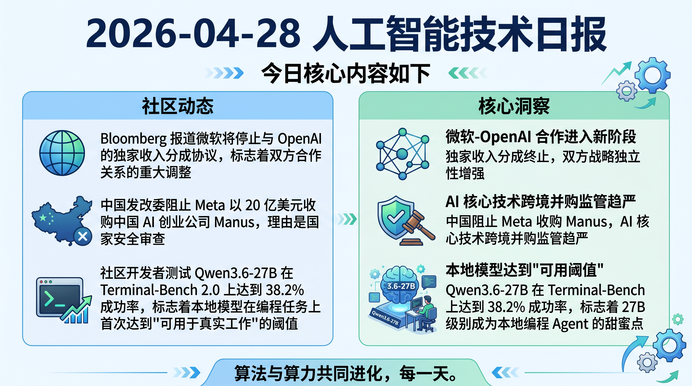

# 破晓 PoXiao 早报 - 2026-04-28

> 数据来源：真实抓取 · 199 条原始内容 · 生成时间：2026-04-28 11:50 UTC+8

---

## 📡 学术概览

### 🔴 Tier 1 - 大厂技术报告/范式突破

1. **vLLM v0.20.0 发布：DeepSeek V4 支持 + 752 commits**

   🔬 领域：训练与推理框架 · 大厂开源 · 热度：GitHub Release

   - **一句话核心贡献**：vLLM 正式支持 DeepSeek V4 模型，新增 DSA + MTP IMA 修复，单次发布整合 320 位贡献者的 752 个 commits
   - **摘要精译**：vLLM v0.20.0 是一次重大版本更新，核心亮点包括：(1) DeepSeek V4 初始支持落地，修复了 DSML token 泄露问题；(2) DSA + MTP IMA 修复；(3) 共享专家 silu clamp 限制。此次发布由 320 位贡献者贡献了 752 个 commits，其中 123 位是新贡献者。版本同时包含了大量 bug 修复、性能优化和文档改进

   

   
💡 展开详情

   - **DeepSeek V4 支持**：初始实现 landed，包含 token 泄露修复 (#40860)
   - **核心修复**：DSA + MTP IMA fix (#40772)，silu clamp limit (#40950)
   - **贡献规模**：320 位贡献者，123 位新人，752 commits
   - **链接**：https://github.com/vllm-project/vllm/releases/tag/v0.20.0

   

2. **Microsoft TRELLIS.2：4B 参数图像到 3D 生成模型**

   🔬 领域：生成模型 · 3D 生成 · 热度：Reddit 热帖

   - **一句话核心贡献**：微软开源 4B 参数图像到 3D 生成模型，支持高达 1536³ PBR 纹理资源，基于原生 3D VAE 实现 16x 空间压缩
   - **摘要精译**：TRELLIS.2 是一个 SOTA 大型 3D 生成模型（4B 参数），专为高保真图像到 3D 生成设计。它利用新型"无场"稀疏体素结构 O-Voxel 来重建和生成任意拓扑结构的 3D 资产，支持复杂拓扑、锐利特征和高保真输出

   

   
💡 展开详情

   - **核心创新**：O-Voxel 稀疏体素结构，无场表示
   - **输出规格**：1536³ PBR 纹理资源
   - **压缩技术**：原生 3D VAE 实现 16x 空间压缩
   - **链接**：https://www.reddit.com/r/LocalLLaMA/comments/1sxf2u0/

   

3. **Luce DFlash：Qwen3.6-27B 推理速度 2x 提升**

   🔬 领域：推理优化 · Speculative Decoding · 热度：Reddit 热帖

   - **一句话核心贡献**：独立 C++/CUDA 实现 DFlash 推测解码，单张 RTX 3090 运行 Qwen3.6-27B，吞吐量提升约 2x
   - **摘要精译**：基于 ggml 的独立 C++/CUDA 栈，实现 DFlash 推测解码，在单张 24GB RTX 3090 上托管 Qwen3.6-27B，实测约 1.98x 吞吐量提升。MIT 开源，代码已发布在 GitHub

   

   
💡 展开详情

   - **技术栈**：C++/CUDA，基于 ggml
   - **硬件要求**：单张 RTX 3090 24GB
   - **性能提升**：~1.98x throughput
   - **链接**：https://github.com/Luce-Org/lucebox-hub

   

---

### 🟡 Tier 2 - 优秀工程实践

4. **The Chameleon's Limit：多 Agent 模拟中的"人设崩塌"问题**

   🔬 领域：多 Agent 系统 · 论文研究

   - **一句话核心贡献**：发现多 Agent 模拟中普遍存在的"人设崩塌"现象——不同人设的 Agent 最终收敛到相同行为模式

   

   
💡 展开详情

   - **核心发现**：人设忠实度最高的模型反而产生最刻板化的群体
   - **量化框架**：Coverage（覆盖度）、Uniformity（均匀度）、Complexity（复杂度）
   - **链接**：https://arxiv.org/abs/2604.24698v1

   

5. **SciCrafter：发现到应用闭环的 Minecraft 基准测试**

   🔬 领域：Agent 能力评估 · Benchmark

   - **一句话核心贡献**：GPT-5.2、Gemini-3-Pro、Claude-Opus-4.5 在 Minecraft 红石电路任务上成功率均仅约 26%

   

   
💡 展开详情

   - **任务设计**：红石电路搭建，强迫 Agent 进行真实发现而非依赖记忆
   - **关键发现**：瓶颈从"解决问题"转向"提出正确问题"
   - **链接**：https://arxiv.org/abs/2604.24697v1

   

---

## 🔥 社区速递

### 🔴 Tier 1 - 极高热度

1. **Microsoft 与 OpenAI 终止独家收入分成协议**

   🔥 热度信号：HN Score 783 | Comments 678 · 来源：Bloomberg / HackerNews

   - **一句话核心**：Bloomberg 报道微软将停止与 OpenAI 的独家收入分成协议，标志着双方合作关系的重大调整
   - **核心共识**：OpenAI 商业化独立性增强，微软正在调整其 AI 战略布局
   - **主要争议**：这是否意味着 OpenAI 将更自由地与其他合作伙伴合作？
   - 🔗 [Bloomberg 报道](https://www.bloomberg.com/news/articles/2026-04-27/microsoft-to-stop-sharing-revenue-with-main-ai-partner-openai)

2. **Meta 20 亿美元收购 Manus 被中国阻止**

   🔥 热度信号：HN Score 325 | Reddit 热帖 · 来源：CNBC / HackerNews

   - **一句话核心**：中国发改委阻止 Meta 以 20 亿美元收购中国 AI 创业公司 Manus，理由是国家安全审查
   - **核心共识**：AI 核心技术跨境并购面临更严格的监管审查
   - 🔗 [CNBC 报道](https://www.cnbc.com/2026/04/27/meta-manus-china-blocks-acquisition-ai-startup.html)

3. **本地模型在编程任务上达到"可行阈值"**

   🔥 热度信号：Reddit 热帖 · 来源：Reddit LocalLLaMA

   - **一句话核心**：社区开发者测试 Qwen3.6-27B 在 Terminal-Bench 2.0 上达到 38.2% 成功率，标志着本地模型在编程任务上首次达到"可用于真实工作"的阈值
   - **核心共识**：27B 参数量级成为本地编程 Agent 的甜蜜点
   - 🔗 [Reddit 原帖](https://www.reddit.com/r/LocalLLaMA/comments/1sxn7x2/)

4. **Mercor 4TB 语音数据泄露事件**

   🔥 热度信号：HN Score 456 | Comments 169 · 来源：HackerNews

   - **一句话核心**：AI 招聘平台 Mercor 发生严重数据泄露，4TB 语音样本被窃取，涉及 40,000 名 AI 合同工
   - **核心共识**：AI 数据安全事件频发，语音数据的隐私风险被严重低估
   - 🔗 [事件分析](https://app.oravys.com/blog/mercor-breach-2026)

5. **Skymizer 单卡运行 700B 模型推理突破**

   🔥 热度信号：Reddit 热帖 · 来源：Reddit LocalLLaMA

   - **一句话核心**：台湾公司 Skymizer 发布突破性架构，单张 PCIe 卡（6 颗 HTX301 芯片 + 384GB 显存）可运行 700B 参数模型推理，功耗仅 240W
   - **核心共识**：专用推理芯片可能改变 LLM 部署格局
   - 🔗 [Reddit 原帖](https://www.reddit.com/r/LocalLLaMA/comments/1sx2vxp/)

---

### 🟡 Tier 2 - 优秀经验

6. **GBNF 语法优化：Qwen3.6 推理加速**

   🔥 热度信号：Reddit LocalLLaMA

   - **一句话核心**：开发者分享针对 Qwen3.6-35B-A3B 和 Qwen3.6-27B 的 GBNF 语法优化，提升编码和解谜任务效率
   - 🔗 [Reddit 原帖](https://www.reddit.com/r/LocalLLaMA/comments/1sx7w55/)

7. **双 5060Ti 配置优化 Qwen3.6**

   🔥 热度信号：Reddit LocalLLaMA

   - **一句话核心**：用户分享双卡 5060Ti 16GB 配置下 Qwen3.6-27B/35B 的最佳配置经验
   - 🔗 [Reddit 原帖](https://www.reddit.com/r/LocalLLaMA/comments/1sxe861/)

8. **本地编码 Agent：Gemma 4 + 教程**

   🔥 热度信号：Reddit LocalLLaMA

   - **一句话核心**：Google 开发者分享使用 Gemma 4 构建本地编码 Agent 的详细教程
   - 🔗 [教程链接](https://www.reddit.com/r/LocalLLaMA/comments/1sx5h1t/)

---

## 💰 财经简报

1. **微软终止与 OpenAI 独家收入分成**

   - **摘要**：Bloomberg 独家报道，微软将停止与 OpenAI 的独家收入分成协议。此举标志着双方战略合作进入新阶段，OpenAI 将拥有更大的商业化自主权
   - **链接**：https://www.bloomberg.com/news/articles/2026-04-27/microsoft-to-stop-sharing-revenue-with-main-ai-partner-openai

2. **中国阻止 Meta 20 亿美元收购 Manus**

   - **摘要**：中国国家发改委以国家安全为由阻止 Meta 对 AI 创业公司 Manus 的收购案。这是继 TikTok 之后又一跨境 AI 并购受阻案例
   - **链接**：https://www.cnbc.com/2026/04/27/meta-manus-china-blocks-acquisition-ai-startup.html

3. **vLLM v0.20.0 发布，DeepSeek V4 支持落地**

   - **摘要**：开源推理框架 vLLM 发布重大版本更新，正式支持 DeepSeek V4 模型，可能影响推理框架竞争格局
   - **链接**：https://github.com/vllm-project/vllm/releases/tag/v0.20.0

---

## 🏢 职场动态

1. **工作 25 年后被裁，如何在 2026 年找工作**

   🔥 热度信号：Reddit 热帖 · 来源：Reddit cscareerquestions

   - **一句话核心**：开发者分享 25 年职业生涯后被裁的经历，上次找工作还是 2001 年，完全不知道 2026 年的求职方式
   - **核心讨论**：LinkedIn、内部推荐、AI 招聘平台成为主流，简历投递效率大幅下降
   - 🔗 [Reddit 原帖](https://www.reddit.com/r/cscareerquestions/comments/1sxlzrr/)

2. **为什么软件质量在持续下降的同时开发者却被裁？**

   🔥 热度信号：Reddit 热帖 · 来源：Reddit cscareerquestions

   - **一句话核心**：用户质疑为什么几乎所有软件都在变差（更臃肿、更慢、更多 bug），但开发者却在被裁
   - **核心讨论**：AI 编码工具降低了门槛，但可能牺牲了代码质量；产品经理主导功能堆砌
   - 🔗 [Reddit 原帖](https://www.reddit.com/r/cscareerquestions/comments/1sx3i3x/)

3. **教实习生的 AI 编码经验**

   🔥 热度信号：Reddit 热帖 · 来源：Reddit cscareerquestions

   - **一句话核心**：资深开发者总结指导实习生使用 AI 编码的经验教训：从不提交 AI 生成的代码（必须审查）、用 AI 解释而非生成、测试驱动开发仍是王道
   - 🔗 [Reddit 原帖](https://www.reddit.com/r/cscareerquestions/comments/1sx2z1e/)

---

## 📊 今日总结

1. **微软-OpenAI 合作进入新阶段**：独家收入分成终止，双方战略独立性增强；同时中国阻止 Meta 收购 Manus，AI 核心技术跨境并购监管趋严
2. **本地模型达到"可用阈值"**：Qwen3.6-27B 在 Terminal-Bench 上达到 38.2% 成功率，标志着 27B 级别成为本地编程 Agent 的甜蜜点
3. **推理框架竞争加剧**：vLLM 率先支持 DeepSeek V4，Skymizer 发布单卡 700B 推理芯片，推理成本优化进入专用芯片时代

---

**生成时间**：2026-04-28 11:50 CST
**数据来源**：briefs/2026-04-28/raw_context.md（真实抓取，199 条）
**配置文件**：profiles/profile_demo.yaml
**抓取时间**：2026-04-28 03:44 UTC

> ⚠️ **注**：arXiv API 仍有间歇性 429 限流，已将关键词从 94 个精简到 72 个，请求延迟从 3s 提升到 5s。如持续限流可进一步精简关键词。
