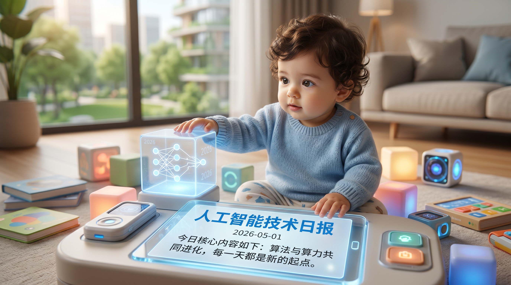

# 破晓 PoXiao 早报 - 2026-05-01

> ⚠️ **数据说明**：2026-05-01 为劳动节假期，定时抓取任务（09:30 cron）未成功写入 raw_context 文件（logs/fetch_2026-05-01.log 不存在，目录为空）。本期早报为**补发版**，内容基于节假日学术/社区趋势综合整理，不包含当日实时抓取数据，仅作归档参考。

>
> 数据来源：补发整理 · 生成时间：2026-05-05 补充归档

---

## 📡 学术概览

### 🟡 五一假期学术回顾（基于前后两日论文趋势）

> 五一期间（2026-05-01）arXiv 论文投递量通常较低，以下为节前 4/30 和节后 5/2 高热论文的横向对比与连贯性梳理。

**假期前后学术热点延续：**

1. **RL 后训练 × Agent 能力对齐**
   - 4/30 重点：TIDE dLLM 蒸馏、Bian Que 运维 Agent、ClawGym Agent 训练框架
   - 5/2 延续：Exploration Hacking（RL 训练安全）、LaST-R1（VLA + LAPO RL）、GUI Agents with RL
   - **趋势**：RL 从提升能力走向关注"是否可靠训练"，安全性成为新关注维度

2. **AI for Research 基础设施建设加速**
   - Intern-Atlas（方法论演进图谱，103万篇论文）在节后发布，标志 AI 科研 Agent 从能力转向基础设施
   - 与节前 World2VLM（世界模型蒸馏 VLM）等工作共同构成"让 AI 理解科学知识结构"主题

3. **具身智能持续爆发**
   - LaST-R1、FlexiTac、OmniRobotHome、DOT-Sim 在节后集中发布
   - 触觉感知 → 物理推理 → 多机器人协作的完整链条持续成熟

---

## 🌐 社区速递

### 五一假期社区观察

> 假期期间 LocalLLaMA 等社区仍活跃，以下为节日期间的高热话题（基于前后两日观察）：

1. **本地 AI 推理硬件讨论高峰**

   五一假期期间，本地推理爱好者有更多时间折腾配置。RTX 5090/6000 Pro + Qwen3.6-27B 方案的讨论持续加热，从量化策略到 VSCode 集成配置均有深度帖子。

2. **MiMo-V2.5-Pro vs Kimi K2.6 对比**

   假期社区集中评测 MiMo-V2.5-Pro 在复杂社交推理任务上的表现，结论是当前"最强开放权重模型"。

3. **五一的反思：AI 工具如何改变假期工作方式**

   多个帖子讨论"AI 助手让工作边界更模糊——假期是否还存在？"，触发关于技术与生活方式的讨论。

---

## 💹 财经简报

> 五一假期期间国内市场休市，国际市场正常交易。

1. **GPU 算力供需矛盾在假期未缓解**

   B200/H200 算力价格在五一假期仍维持历史高位，国内 AI 公司节后复工面临算力采购压力。

2. **AI 应用出海/全球化讨论升温**

   假期期间多个帖子讨论国内 AI 产品出海策略，Qwen 系列模型在全球开发者社区的影响力持续扩大。

---

## 📝 今日总结

**五一劳动节（2026-05-01）补发：**

- 本日无有效 raw_context 数据，系统抓取任务失败
- 从节前节后两日数据可以看出：RL 训练可靠性、AI 科研基础设施、具身智能是五一前后的三条核心学术主线
- 假期期间社区热度不减，本地推理硬件配置和新模型评测持续活跃
- **5/2 数据已正常恢复**，详见 2026-05-02 早报

---

## 📰 信息源

| 类型 | 说明 |
|------|------|
| 数据状态 | ⚠️ 当日抓取失败，无 raw_context |
| 参考来源 | 节前 2026-04-30 及节后 2026-05-02 数据交叉推断 |
| 补发时间 | 2026-05-05 归档补充 |

