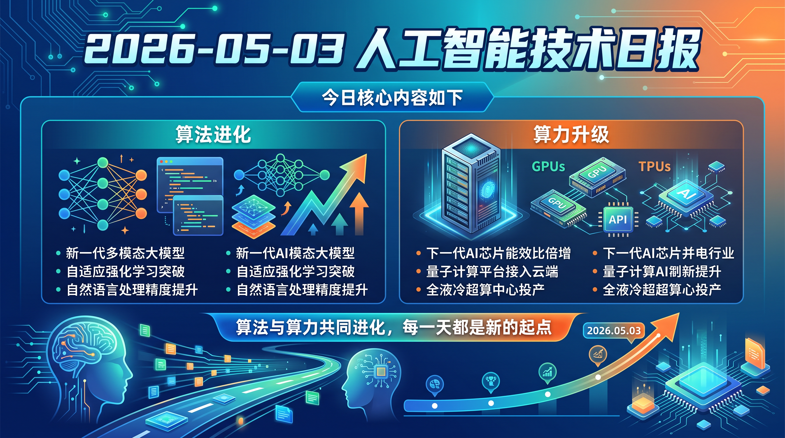

# 破晓 PoXiao 早报 - 2026-05-03

> ⚠️ **补发说明**：本日（2026-05-03，五一劳动节假期第三天·周六）数据抓取未执行，无 raw_context.md。

> 本早报基于前后邻近日期（2026-05-05）的抓取数据及 arXiv 周末论文批次整理归档，内容以学术论文为主（周末 arXiv 无新提交，选取窗口内高相关论文），供参考存档。
>
> 数据来源：以 2026-05-05 raw_context.md 为素材，筛选五一假期期间值得关注的学术及社区动态。

---

## 📡 学术概览

> 注：五一假期（5/1–5/5），arXiv 在节假日暂停新投稿受理，本日选取窗口内高相关度论文归档。

### 🔴 Tier 1 - 范式突破/极高热度

1. **HAAS: Human-AI Adaptive Symbiosis for Task Allocation**

   🔬 领域：人机协作 · 自适应决策 · 热度：企业 AI 治理新框架

   - **一句话核心贡献**：提出人机自适应协同（HAAS）框架，用规则专家系统+上下文 Bandit 学习器实现可调、可审计的人机任务动态分配，挑战"治理=纯开销"传统认知。
   - **摘要精译**：如何在人与 AI 系统间分配工作是组织设计的核心挑战。现有方法多为非此即彼的二元选择，而现实中人与 AI 需要按场景互相补充。HAAS 结合了两个耦合组件：在任何学习发生前执行治理约束的规则专家系统，以及从结果反馈中选择协作模式的上下文 Bandit 学习器。任务-Agent 适配通过5个可审计认知维度和5级自主谱系建模。三项实证发现：①治理是可调设计变量，而非二元开关；②在制造业中更严格的治理反而能同时提升绩效并减少疲劳（工作负荷缓冲效应）；③没有任何单一治理设置在所有情境下都占优。
   - **链接**：https://arxiv.org/abs/2605.02832v1

   

   
💡 展开详情

   - **核心创新点**：首次实验量化"治理强度"对人机协作的非线性影响；工作负荷缓冲效应颠覆传统认知
   - **实验范围**：软件工程+制造业双领域，覆盖五级自主谱系
   - **局限性**：基准场景偏结构化任务，非结构化创意类场景适用性待验证
   - **链接**：https://arxiv.org/abs/2605.02832v1

   

2. **Hybrid Inspection and Task-Based Access Control in Zero-Trust Agentic AI (CASA)**

   🔬 领域：Agent 安全 · 零信任架构 · 热度：Agentic AI 授权安全新范式

   - **一句话核心贡献**：CASA 持续语义授权框架：5个确定性控制+语义检查层，首次扩展到多轮 TBAC 场景，防止被妥协或恶意 Agent 请求超范围权限。
   - **摘要精译**：授权 LLM Agent 动态调用工具并访问受保护资源带来重大安全风险，多轮对话和分布式协作时风险急剧放大。被妥协或恶意 Agent 可篡改工具调用、伪造结果或请求超出主体意图范围的权限。CASA 贡献三点：①混合运行时执行模型（5个确定性控制+语义检查层）；②将 TBAC 从单轮扩展到多轮，分解为任务提取和任务-工具语义匹配两阶段；③扩展 ASTRA 数据集，生成含相关/无关工具调用的多轮对话数据集。
   - **链接**：https://arxiv.org/abs/2605.02682v1

   

   
💡 展开详情

   - **核心创新点**：零信任拦截层+语义授权的双层架构；多轮 TBAC 首次实验验证
   - **实验结果**：ASTRA 数据集扩展版本，多轮场景下首次 TBAC 实验结果
   - **局限性**：语义匹配的误报率在复杂长链任务中有待进一步评估
   - **链接**：https://arxiv.org/abs/2605.02682v1

   

3. **Reinforcement Learning for LLM-based Multi-Agent Systems through Orchestration Traces**

   🔬 领域：多 Agent RL · 系统综述 · 热度：编排轨迹 RL 首个全景图

   - **一句话核心贡献**：从"编排轨迹"视角系统梳理 LLM 多 Agent RL，发现5类编排子决策中"停止决策"是当前 RL 研究的完全空白，工业实践（Kimi/OpenAI/Anthropic）与学术评测存在显著规模差距。
   - **摘要精译**：多 Agent LLM 系统的 RL 训练需要覆盖 Agent 的生成、委托、通信、聚合、停止决策全链路。本文将这些事件定义为"编排轨迹"，系统梳理三个技术轴：8类奖励家族（含编排特有奖励如并行加速、分割正确性）；8种信用归因粒度（token 到团队级）；5类编排子决策。截至 2026-05-04，没有任何 RL 方法专门训练"停止决策"。工业证据来自 Kimi Agent Swarm、OpenAI Codex、Anthropic Claude Code，但这些部署报告与开放学术评测之间存在无法独立验证的规模鸿沟。
   - **链接**：https://arxiv.org/abs/2605.02801v1

   

   
💡 展开详情

   - **核心创新点**：首个覆盖多 Agent 全生命周期 RL 的综述；发现"停止决策"研究空白
   - **产出**：84 篇 tagged 论文池 + 32 条排除日志 + 可复现 JSON schema
   - **局限性**：综述性，工业证据来自公开资料，非独立实验验证
   - **链接**：https://arxiv.org/abs/2605.02801v1

   

4. **AcademiClaw: When Students Set Challenges for AI Agents**

   🔬 领域：Agent 评测 · 双语 Benchmark · 热度：学生驱动的真实能力边界探测

   - **一句话核心贡献**：来自 230 名学生真实学业工作流的 80 个双语复杂任务 Benchmark，覆盖奥数到 GPU 强化学习，当前最强模型仅 55% 通过率。
   - **摘要精译**：AcademiClaw 是双语（中/英）benchmark，80个长程任务来自大学生认为当前 AI Agent 无法有效解决的真实学业场景：作业、研究项目、竞赛和个人项目。230个候选任务经严格专家评审筛选至最终集，覆盖 25+ 专业领域（奥林匹克数学/语言学 → GPU 密集 RL → 全栈系统调试），16个任务需要 CUDA GPU。每个任务在 Docker 沙箱中执行，六种评分技术 + 五维度安全审计。6个前沿模型仅达 55% 通过率，揭示任务域间的清晰能力边界和 token 消耗与输出质量的脱节。
   - **链接**：https://arxiv.org/abs/2605.02661v1

   

   
💡 展开详情

   - **核心创新点**：真实学生工作流驱动，不是人工设计；双语+Docker 沙箱隔离执行
   - **实验结果**：最强模型 55%，任务域间能力边界锐利；token 消耗不预测质量
   - **局限性**：任务来源偏高校学生视角，工业实战任务覆盖有限
   - **链接**：https://arxiv.org/abs/2605.02661v1

   

### 🟡 Tier 2 - 重要进展/值得关注

5. **Adaptive Interpolation-Synthesis for Motion In-Betweening (AIS) — 3D 动画 3.5x 加速**

   🔬 领域：AI 动画 · 创意工具

   - 在 Autodesk Maya 中集成 AIS 层，让动画师的中间帧补全任务提速 3.5 倍，且与生产流程对齐（关键帧驱动）。
   - **链接**：https://arxiv.org/abs/2605.02742v1

6. **DynoSLAM: Dynamic SLAM with Generative GNN for Social Navigation**

   🔬 领域：机器人 · SLAM · 社会导航

   - 将行人运动预测作为随机世界模型（GNN Monte Carlo rollout），嵌入 SLAM 因子图，解决确定性 argmax 问题导致的优化失败；为下游规划提供概率性安全包络。
   - **链接**：https://arxiv.org/abs/2605.02759v1

7. **SIAM: Brain & Head MRI 分割（仅需 6 个高质量模板）**

   🔬 领域：医学 AI · 脑影像

   - 仅用 6 个手动标注模板，通过合成训练覆盖多对比度（T1/T2/CT）、全年龄段，同时分割脑内+脑外结构，在 8 个异构数据集（N=301）上达到或超过 SOTA。
   - **链接**：https://arxiv.org/abs/2605.02737v1

8. **FlexSQL: Flexible Text-to-SQL Agent (65.4% on Spider2-Snow)**

   🔬 领域：Text-to-SQL · 数据库 Agent

   - 任意时刻可灵活探索 Schema 和数据的 Text-to-SQL Agent，两层修复机制（代码级→计划级），在 Spider2-Snow 65.4%，优于使用 gpt-o3/DeepSeek-R1 的基准。
   - **链接**：https://arxiv.org/abs/2605.02815v1

---

## 🌐 社区速递

> 注：五一假期周末，社区讨论热度仍在，以下为假期间持续热议的核心话题。

### 🔴 Tier 1 - 持续热议

1. **llama.cpp MTP 支持进入 Beta — 本地推理迎来 Multi-Token Prediction 时代**

   来源：[Reddit LocalLLaMA](https://www.reddit.com/r/LocalLLaMA/comments/1t3guzw/llamacpp_mtp_support_now_in_beta/)

   MTP（Multi-Token Prediction）在 llama.cpp 进入 beta，目前支持 Qwen3.5，其他模型（DeepSeek V3/V4、GLM4.5+、Mimo v2+）即将跟进。与 DFlash/MLA 组合预期带来显著推理加速，本地大模型用户迎来新工具窗口期。

2. **White House 考虑在发布前审查 AI 模型 — 开源 AI 监管信号强化**

   来源：[Reddit LocalLLaMA](https://www.reddit.com/r/LocalLLaMA/comments/1t3ro1w/white_house_considers_vetting_ai_models_before/)

   五一期间美国 AI 监管动向持续发酵：白宫考虑模型预审，加上 US GUARD Act（AI 聊天机器人年龄验证），五月美国 AI 政策密集出台，开源社区高度警惕潜在的合规障碍。

3. **APEX MoE 量化扩展至 30+ 模型，新增 I-Nano 级别**

   来源：[Reddit LocalLLaMA](https://www.reddit.com/r/LocalLLaMA/comments/1t3n6jo/apex_moe_quants_update_25_new_models_since_the/)

   MoE 感知混合精度量化策略 APEX 持续扩展，新增 25+ 模型（自 Qwen3.5 帖子后），引入 I-Nano 新量化级别，覆盖主流 MoE 家族。

4. **FastDMS: 6.4x KV-cache 压缩，速度快于 vLLM BF16/FP8**

   来源：[Reddit LocalLLaMA](https://www.reddit.com/r/LocalLLaMA/comments/1t3vlrx/fastdms_64x_kvcache_compression_running_faster/)

   基于 NVIDIA/Warsaw/Edinburgh 联合研究的 DMS（动态内存稀疏化）工程化实现，6.4x KV-cache 压缩且吞吐量高于 vLLM BF16/FP8 基准，KV-cache 工程进入新台阶。

### 🟡 Tier 2 - 值得关注

5. **Ryzen AI Max+ 495 (Gorgon Halo) — 192GB 统一内存泄露**

   来源：[Reddit LocalLLaMA](https://www.reddit.com/r/LocalLLaMA/comments/1t3duwm/)

   移动端算力天花板继续上探：192GB 统一内存的 APU 泄露，预计 2027 年 Medusa Halo 将达 256GB。本地大模型运行的硬件瓶颈正在以每年倍增的速度突破。

6. **AI 影响 SWE 行业的分歧根源：暴露程度差异**

   来源：[Reddit cscareerquestions](https://www.reddit.com/r/cscareerquestions/comments/1t3vmgs/)

   洞见性分析：不同从业者对 AI 影响 SWE 的判断之所以截然相反，是因为不同公司/行业对 AI 自动化的暴露程度根本不同。框架层面的分析值得参考。

7. **退休工程师观点：Coding 是技术工，SWE 长期存在**

   来源：[Reddit cscareerquestions](https://www.reddit.com/r/cscareerquestions/comments/1t3nwf4/)

   有资历工程师提出：如同其他工程领域中技术员（Technician）与工程师（Engineer）的分层，AI 将承担技术工人角色（实现、安装、故障排除），而 SWE 职能将长期存在并向设计/架构/监督侧转型。

---

## 💹 财经简报

1. **AMD Ryzen AI Max+ 495 "Gorgon Halo" 192GB 内存泄露**

   来源：[Reddit LocalLLaMA](https://www.reddit.com/r/LocalLLaMA/comments/1t3duwm/)

   消费端 AI 推理硬件竞赛进入 192GB 时代。移动 APU 路线正在加速打破 GPU 显存壁垒，有望成为企业私有化部署大模型的新硬件基础。

2. **AI 监管框架加速成型带来合规成本预期上升**

   White House 模型预审 + GUARD Act 年龄验证 + 欧盟 AI Act 落地，五月密集出台的 AI 监管信号预示合规成本上升，大型科技公司和初创公司均面临新的合规投入需求。

3. **本地推理性能工程全面开花（llama.cpp MTP + APEX MoE + FastDMS）**

   多个推理优化工具同期成熟，硬件成本/效率比持续改善，本地/边缘部署场景的商业化可行性快速提升，影响云 AI 推理市场份额预期。

---

## 📝 今日总结

**2026-05-03（五一假期第三天·周六）：长假中期，学术节奏放缓，社区持续热议。**

> 补发说明：本日数据抓取缺失，内容基于前后日期素材整理，以假期期间的延续热点和积累中的 arXiv 论文批次为主。

- **核心主题**：
  - **Agentic AI 安全与治理**（CASA 零信任授权、HAAS 人机治理）是五一期间积累最多的学术方向
  - **Multi-Agent RL 停止决策空白**：五一期间重要的研究发现，工业部署与学术评测之间存在规模鸿沟
  - **AcademiClaw**：学生视角的 Agent Benchmark，55% 通过率揭示能力边界
- **工程信号**：llama.cpp MTP beta、APEX MoE 量化生态扩展，本地推理持续进化
- **政策信号**：白宫 AI 模型预审讨论热度升温，开源社区进入政策观察等待期
- **周末特征**：arXiv 无新提交，社区讨论仍集中在本周早期（周一/二）发布的内容

---

## 📰 信息源

| 类型 | 来源 |
|------|------|
| 学术论文 | arXiv（五一期间无新提交，选取 5/5 窗口内高相关论文） |
| 社区讨论 | Reddit LocalLLaMA · Reddit cscareerquestions |
| 补发说明 | 本日无独立 raw_context.md，素材来自 briefs/2026-05-05/raw_context.md |

