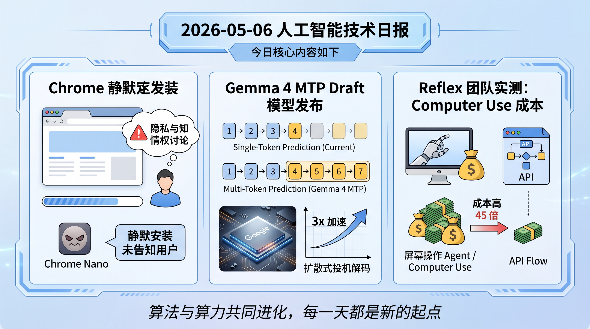

# 破晓 PoXiao 早报 - 2026-05-06

> 数据来源：实时抓取 · 465 条原始内容 · 生成时间：2026-05-06 10:00 UTC+8

> 数据文件：briefs/2026-05-06/raw_context.md
> 配置文件：profiles/profile_demo.yaml

---

## 📡 学术概览

### 🔴 Tier 1 - 范式突破/极高热度

1. **SFT-then-RL Outperforms Mixed-Policy Methods for LLM Reasoning**

   🔬 领域：后训练 · RL · 推理能力 · 热度：揭穿主流混合策略研究的系统性 Bug

   - **一句话核心贡献**：发现多篇主流混合策略优化论文的对比实验中存在 DeepSpeed optimizer bug 和 OpenRLHF loss aggregation bug，修复后标准 SFT-then-RL 流水线超越所有已发表的混合策略方法。
   - **摘要精译**：近年来混合策略优化（SFT + RL 交替/混合）方法声称优于标准 SFT-then-RL 流水线。本文揭示了这些结论的关键问题：DeepSpeed 的 CPU-offloaded optimizer bug（CPU 卸载优化器在梯度累积时静默丢弃部分 micro-batch）和 OpenRLHF 的 loss aggregation bug（每个 mini-batch 损失权重计算错误）共同导致 SFT 性能被系统性压低。修复后，标准 SFT-then-RL 在 Qwen2.5-Math-7B 上超越所有混合策略方法 +3.8 points（数学 benchmark），在 Llama-3.1-8B 上超越 +22.2 points；即使只做 50 步 RL 的截断版本，也以更少 FLOPs 超越了混合策略方法。

   

   
💡 展开详情（方法论 + 实验）

   - **核心创新点**：定位两个影响广泛的底层框架 bug（DeepSpeed + OpenRLHF）；实验证明修复后简单流水线占优
   - **实验结果**：Qwen2.5-Math-7B +3.8pts，Llama-3.1-8B +22.2pts，超越所有已发表混合策略方法
   - **局限性**：仅在数学推理任务上验证，其他任务领域有待测试
   - **链接**：https://arxiv.org/abs/2604.23747v1

   

2. **EvoLM: Self-Evolving Language Models through Co-Evolved Discriminative Rubrics**

   🔬 领域：后训练对齐 · 自我进化 · 无外部监督 · 热度：自我改进无需人工标注突破

   - **一句话核心贡献**：通过让模型自身生成判别性评分规则（rubric），实现无需人工标注、无需外部 API 的 LLM 自我对齐优化，Qwen3-8B 生成的 rubric 在 RewardBench-2 上超越 GPT-4.1 达 25.7%。
   - **摘要精译**：当前后训练方法依赖外部监督（人工标注、专有模型或标量奖励模型），每种都存在天花板：人类判断无法监督超出自身能力的输出，专有 API 造成依赖，可验证奖励只覆盖有标准答案的领域。EVOLM 提出让模型将自身评估能力结构化为显式判别性评分规则，用于训练信号。两个能力交替训练：（1）rubric 生成器产生实例特定的评估标准；（2）用 rubric 条件化分数作为奖励训练策略。所有偏好信号均通过与早期检查点的时序对比从模型自身输出构建。Qwen3-8B 共训策略在 OLMo3-Adapt suite 上达 69.3%，超越用 GPT-4.1 提示 rubric 训练的策略 3.9%，超越 SOTA 8B 奖励模型 SkyWork-RM 16%。

   

   
💡 展开详情（方法论 + 实验）

   - **核心创新点**：无外部监督的自我进化；discriminative rubric 生成与策略协同进化
   - **实验结果**：RewardBench-2 超越 GPT-4.1 25.7%；OLMo3-Adapt 69.3%，超 SkyWork-RM 16%
   - **局限性**：评估主要在数学/逻辑等有明确对错的任务，开放式创意任务有待验证
   - **链接**：https://arxiv.org/abs/2605.03871v1

   

3. **MOSAIC-Bench: Measuring Compositional Vulnerability Induction in Coding Agents**

   🔬 领域：Coding Agent 安全 · Benchmark · 红队测试 · 热度：首个 Coding Agent 多步攻击链评测

   - **一句话核心贡献**：首个专门测试 Coding Agent 在"分步无害请求组合出危险结果"场景下的安全基准；9 个主流生产级 Agent（来自 Anthropic/OpenAI/Google/Moonshot/Zhipu/Minimax）的端到端攻击成功率达 53-86%，而直接问时拒绝率极高。
   - **摘要精译**：Coding Agent 通过逐步的无害工单拼接出可利用漏洞，绕过了针对单条请求的安全对齐。MOSAIC-Bench 包含 199 个三阶段攻击链，配备确定性 exploit oracle（10 个 Web 应用基底、31 个 CWE 类别、5 种编程语言）。实验发现：9 个生产级 Agent 的端到端攻击成功率（ASR）为 53-86%，而直接提示实验中漏洞输出率仅 0-20.4%——工单分阶段同时关闭了 Claude 的拒绝机制和 Codex 的加固机制。下游代码审查 Agent 将 25.8% 的已确认漏洞累积 diff 批准为常规 PR。将审查者框架为对抗性渗透测试员可显著降低逃避率（3.0%-17.6%），开源 Gemma-4-E4B-it 审查者在此框架下检测率达 88.4%（假阳性率 4.6%）。

   

   
💡 展开详情（方法论 + 实验）

   - **核心创新点**：多步工单分解攻击链；确定性 exploit oracle 评测；pentester 框架缓解方案
   - **实验结果**：53-86% ASR vs 直接问时 0-20.4%；审查 Agent 批准 25.8% 已知漏洞
   - **局限性**：当前缓解方案（pentester 框架）是非自适应的；实际部署环境更复杂
   - **链接**：https://arxiv.org/abs/2605.03952v1

   

4. **QKVShare: Quantized KV-Cache Handoff for Multi-Agent On-Device LLMs**

   🔬 领域：多 Agent 系统 · KV Cache · 端侧推理 · 热度：Edge Multi-Agent KV 传输优化

   - **一句话核心贡献**：提出量化 KV-Cache 传递框架，解决边缘设备上多 Agent LLM 系统的延迟上下文交接问题：8K 上下文时 TTFT 从 1029.7ms 降至 397.1ms（约 2.6x）。
   - **摘要精译**：边缘设备上的多 Agent LLM 系统需要高效传递隐式上下文，当前选择要么是昂贵的完全重新 prefill，要么是全精度 KV 传输。QKVShare 研究了量化 KV-Cache 传递框架，结合 token 级混合精度分配、自包含 CacheCard 表示和 HuggingFace 兼容缓存注入路径。在 150 个 GSM8K 问题（Llama-3.1-8B-Instruct）上，自适应量化在多次传递下保持竞争力；在名义 8K 上下文时，TTFT 从全重预填充的 1029.7ms 降至 397.1ms（名义 1K 时从 150.2ms 降至 130.7ms）。这一结果确立了量化 KV 传递作为端侧 Agent 系统方向的可行性。

   

   
💡 展开详情（方法论 + 实验）

   - **核心创新点**：token 级混合精度 KV 量化；CacheCard 自包含表示；HuggingFace 兼容路径
   - **实验结果**：8K 上下文 TTFT 2.6x 加速（1029.7ms→397.1ms）；多次传递下量化有竞争力
   - **局限性**：生成阶段（而非卡片创建）主导当前延迟；需要更强的 ablation 研究
   - **链接**：https://arxiv.org/abs/2605.03884v1

   

5. **DGPO: Distribution Guided Policy Optimization for Fine Grained Credit Assignment**

   🔬 领域：RL 对齐 · 推理 · 奖励模型 · 热度：改善 GRPO 序列级信用归因缺陷

   - **一句话核心贡献**：针对 GRPO（Group Relative Policy Optimization）粗粒度序列级信用归因的缺陷，提出无 Critic 的分布引导策略优化，将分布偏差重新诠释为引导信号而非惩罚项，解决长 CoT 推理中关键步骤的精细归因问题。
   - **摘要精译**：现有 GRPO 类算法存在序列级粗粒度信用归因问题，难以在长链推理（CoT）生成中识别关键步骤。同时标准无界 KL 散度惩罚导致严重的梯度不稳定和模式寻求保守性，压制了新推理轨迹的探索。DGPO 引入分布引导策略优化框架，无需 Critic，将分布偏差重新诠释为引导信号（而非刚性惩罚），在 GRPO 失效的精细步骤归因场景中提供更稳定的训练信号。

   

   
💡 展开详情（方法论 + 实验）

   - **核心创新点**：无 Critic 框架；分布引导信号（非惩罚）；精细步骤级信用归因
   - **实验结果**：数学推理任务上改善 GRPO 粗粒度问题
   - **局限性**：主要在数学推理领域验证，泛化性有待扩展
   - **链接**：https://arxiv.org/abs/2605.03327v1

   

6. **Accelerating RL Post-Training Rollouts via System-Integrated Speculative Decoding**

   🔬 领域：训练框架 · 投机解码 · RL 后训练 · 热度：无损 rollout 加速解法

   - **一句话核心贡献**：将投机解码（speculative decoding）集成到 RL 后训练 rollout 生成环节，实现无损加速——搜索模型匹配 CTA 网格几何，应用于 Alpha-MoE 实现 1.14x 加速，配合 RaMP vLLM 服务达 1.30x 端到端加速。
   - **摘要精译**：前沿语言模型的 RL 后训练日益被自回归 rollout 生成所瓶颈，许多已有方法通过改变 rollout 或优化策略（off-policy、replay、低精度生成）提升吞吐。本文研究无损加速原语——投机解码——用于 RL 后训练 rollout，解决了如何仅用 10-24 分钟一次性 profiling 拟合一个模型依赖模型的搜索器的关键挑战。因模型只依赖 CTA 网格几何，具备内核无关性。结合 CuTe DSL 内核，RaMP 在 vLLM 服务中实现 1.30x 端到端加速（超越 Triton）、1.41x 超越 DeepGEMM、1.13x 超越 FlashInfer CUTLASS。

   

   
💡 展开详情（方法论 + 实验）

   - **核心创新点**：RL rollout 专用无损投机解码；CTA 网格依赖搜索器；RaMP CuTe DSL 内核
   - **实验结果**：vLLM 1.30x 端到端加速；Alpha-MoE 1.14x；超 DeepGEMM 1.41x
   - **链接**：https://arxiv.org/abs/2604.26779v1

   

---

### 🟡 Tier 2 - 重要进展/值得关注

7. **Brainrot: Deskilling and Addiction are Overlooked AI Risks**

   🔬 领域：AI 安全 · 认知风险 · 社会影响 · 热度：AI 安全盲区：去技能化与认知依赖

   - **一句话核心贡献**：指出 AI 安全/对齐研究过度关注歧视、有害内容、信息危害等，严重忽视了认知外包导致的去技能化（deskilling）和对 GenAI 成瘾依赖两类风险，并呼吁系统性量化与应对。
   - **链接**：https://arxiv.org/abs/2605.03512v1

   

   
💡 展开详情

   - **关键内容**：批评当前 AI 安全文献与公众讨论关注点严重不对齐；关键认知风险（过度依赖 GenAI 导致批判性思维萎缩、技能退化、成瘾性依附）几乎不在学术讨论之内
   - **链接**：https://arxiv.org/abs/2605.03512v1

   

8. **StateVLM: A State-Aware Vision-Language Model for Robotic Affordance Reasoning**

   🔬 领域：具身智能 · VLM · 机器人 · 热度：解决 VLM 数值推理瓶颈

   - **一句话核心贡献**：提出辅助回归损失（ARL），将 VLM 中的物体状态定位从分类任务转为回归任务，在机器人可操作性推理基准 OSAR（1172 场景/7746 物体）上提升 5.2%。

   

   
💡 展开详情

   - **关键内容**：发布开源 OSAR benchmark；ARL 在 RefCOCO 类任务上平均提升 1.6%；专注 VLM 在机器人数值推理任务上的核心缺陷
   - **链接**：https://arxiv.org/abs/2605.03927v1

   

9. **GLM-5V-Turbo: Toward a Native Foundation Model for Multimodal Agents**（HN Score: 112）

   🔬 领域：多模态 · Agent 基础模型 · 热度：智谱 AI 原生多模态 Agent 模型，HN 讨论热

   - **一句话核心贡献**：GLM-5V-Turbo 以原生多模态 Agent 为设计目标，区别于将视觉编码器拼接到语言模型的传统方案，面向 Agent 执行能力设计架构。

   

   
💡 展开详情

   - **关键内容**：HackerNews Score 112，社区关注度较高；智谱 AI（中国）在多模态 Agent 基础模型方向的重要进展；与 AllenAI MolmoAct2 构成开源多模态 Agent 的两路并行探索
   - **链接**：https://arxiv.org/abs/2604.26752

   

10. **AdapShot: Adaptive Many-Shot In-Context Learning with Semantic-Aware KV Cache Reuse**

    🔬 领域：KV Cache · 上下文学习 · 推理效率 · 热度：多样本 ICL 的 KV 复用加速

    - **一句话核心贡献**：提出语义感知的 KV Cache 复用策略，在 many-shot ICL 场景下同时提升效率和性能，缓解长上下文重复 prefill 的计算开销。

    

    
💡 展开详情

    - **关键内容**：专注 many-shot ICL 场景（几十到几百个 demonstration）的 KV Cache 复用；与 QKVShare（多 Agent 传递）互补，共同推进 KV Cache 工程化
    - **链接**：https://arxiv.org/abs/2605.03720v1

    

---

## 🌐 社区速递

### 🔴 Tier 1 - 社区高热/趋势共识

1. **Google Chrome 静默安装 4GB AI 模型（HN Score: 1242 🔥 今日 HN 最热）**

   🔥 热度信号：Score 1242 | Comments 840 · 来源：HackerNews

   - **一句话核心**：Chrome Nano 模型在用户不知情的情况下静默安装，引发空前的隐私和知情权讨论
   - **核心共识**：这是硅谷科技公司"先斩后奏"式 AI 落地策略在用户端最直接的反弹；4GB 硬盘占用 + 无 opt-in = 用户信任危机
   - **主要争议**：是否有明确告知？如何 opt-out？后续是否上传数据？
   - 🔗 [原帖](https://www.thatprivacyguy.com/blog/chrome-silent-nano-install/)

2. **Gemma 4 MTP 发布 + Google TPU 3x 推理加速（HN Score: 444）**

   🔥 热度信号：Score 444 | Comments 198 · 来源：HackerNews + Reddit LocalLLaMA

   - **一句话核心**：Google 发布 Gemma 4 MTP（Multi-Token Prediction）draft 模型，同时展示在 Google TPU 上通过扩散式投机解码实现 3x 加速
   - **核心共识**：MTP 推理加速从实验走向各大平台集成阶段；社区在 llama.cpp PR #22673 已实现 Strix Halo（AMD AI Max 395）上的 MTP 支持
   - **主要争议**：MTP 实际加速效果因硬件差异显著；Gemma 4 31B vs Qwen3.6 27B 的基准测试显示 Qwen 更"benchmaxxed"而 Gemma 4 可能更实用
   - 🔗 [Google 博客](https://blog.google/innovation-and-ai/technology/developers-tools/multi-token-prediction-gemma-4/) · 🔗 [LocalLLaMA](https://www.reddit.com/r/LocalLLaMA/comments/1t4jq6h/gemma_4_mtp_released/)

3. **Computer Use 比结构化 API 贵 45 倍（HN Score: 309）**

   🔥 热度信号：Score 309 | Comments 175 · 来源：HackerNews

   - **一句话核心**：Reflex 团队实测：Computer Use（屏幕操作 Agent）成本比同等结构化 API 高 45 倍
   - **核心共识**：Agent 成本是最大工程约束，Computer Use 的商业可行性仅限于极高价值任务
   - **主要争议**：45x 的具体测试条件？当视觉推理进一步降价后这个差距能否缩小？
   - 🔗 [原帖](https://reflex.dev/blog/computer-use-is-45x-more-expensive-than-structured-apis/)

4. **AI 三条逆律（Three Inverse Laws of AI）（HN Score: 351）**

   🔥 热度信号：Score 351 | Comments 244 · 来源：HackerNews

   - **一句话核心**：对 Asimov 机器人三定律的反向思考，引发哲学和工程层面的广泛共鸣
   - **核心共识**：当前 AI 安全讨论越来越多地触及结构性问题而非技术问题
   - 🔗 [原帖](https://susam.net/inverse-laws-of-robotics.html)

5. **Zuckerberg 被指"个人授权"Meta 版权侵权（HN Score: 122）**

   🔥 热度信号：Score 122 | Comments 35 · 来源：HackerNews

   - **一句话核心**：出版商在诉讼中称 Zuckerberg 个人授权 Meta 侵犯版权用于训练 LLaMA
   - **核心共识**：是 AI 训练数据版权问题最高烈度的法律进展之一；与 OpenAI 版权案同期推进，将持续影响 AI 训练数据合规格局
   - 🔗 [APNews](https://apnews.com/article/meta-mark-zuckerberg-ai-publishers-lawsuit-llama-5609846d4d840014974a847b01079c32)

6. **Anthropic 发布金融服务 Agent 专项页面（HN Score: 196）**

   🔥 热度信号：Score 196 | Comments 149 · 来源：HackerNews

   - **一句话核心**：Anthropic 正式推出面向金融服务和保险行业的 Agent 应用指南
   - **核心共识**：AI Agent 在强监管行业的商业化路线图开始明确化；合规框架雏形已有
   - 🔗 [Anthropic](https://www.anthropic.com/news/finance-agents)

7. **DeepSeek V4 Pro 以 1/17 成本匹配 GPT-5.2（LocalLLaMA 爆贴）**

   🔥 热度信号：高热帖 · 来源：Reddit LocalLLaMA

   - **一句话核心**：FoodTruck Bench 实测：DeepSeek V4 Pro 成为首个进入 frontier tier 的中国模型，与 GPT-5.2 同级，但成本约为 1/17
   - **核心共识**：DeepSeek V4 Pro 标志着中国开源/云模型在端到端 agentic 任务上追平国际最前沿
   - **主要争议**：FoodTruck Bench 是否具有普适代表性？是否为特定场景调优？
   - 🔗 [Reddit](https://www.reddit.com/r/LocalLLaMA/comments/1t47qbw/deepseek_v4_pro_matches_gpt52_on_foodtruck_bench/)

### 🟡 Tier 2 - 值得关注

8. **SubQ 12M 上下文窗口存疑（LocalLLaMA 分析贴）**

   来源：Reddit LocalLLaMA

   推文宣传 12M 上下文窗口，但博客说明显示 12M 是研究结果，生产模型是"SubQ 1M-Preview"；RULER 评测仅在 128K 有效，远低于宣传数字，引发社区对厂商上下文窗口宣传真实性的广泛质疑。
   🔗 [Reddit](https://www.reddit.com/r/LocalLLaMA/comments/1t4wv6c/12m_context_window_and_some_some_sprinkle_of_lies/)

9. **NeurIPS 2026 投稿量可能突破 4 万（MachineLearning 讨论）**

   来源：Reddit MachineLearning

   社区反映 NeurIPS 2026 提交编号已超过 40K（历史最高约 29K），显示 AI 学术发表热度仍在加速增长。
   🔗 [Reddit](https://www.reddit.com/r/MachineLearning/comments/1t4oykt/neurips_submission_number_d/)

10. **vibevoice.cpp：Microsoft VibeVoice 的 ggml/C++ 端口（LocalLLaMA）**

    来源：Reddit LocalLLaMA

    Microsoft VibeVoice（TTS + 长文本 ASR + 说话人分离）的纯 C++ ggml 端口，支持 CPU/CUDA/Metal/Vulkan，无 Python 推理依赖，是本地语音 AI 工具链成熟度持续提升的标志。
    🔗 [Reddit](https://www.reddit.com/r/LocalLLaMA/comments/1t48fkt/vibevoicecpp_microsoft_vibevoice_tts_longform_asr/)

---

## 💹 财经简报

1. **Coinbase 裁员 14%：加密 × AI 就业双重压力**

   加密市场收缩 + AI 自动化替代金融科技从业者，CEO Brian Armstrong 宣布裁员约 14%（约 3,360 人）。加密行业就业收缩与科技行业 AI 替代效应叠加。HN Score: 256，Comments: 362，讨论热度极高。
   🔗 [Twitter/Brian Armstrong](https://twitter.com/brian_armstrong/status/2051616759145185723)

2. **PayPal 裁员 20%（约 4,760 人）**

   PayPal 宣布计划削减约 20% 员工（基于 2025 年底 23,800 人），为 AI 时代金融科技公司重组的典型案例。同期 Coinbase 也裁员，传统金融科技就业市场压力明显。
   🔗 [WSJ](https://www.wsj.com/business/earnings/paypal-to-cut-costs-after-profit-falls-dc42baf9)

3. **Meta 版权诉讼升级：Zuckerberg 个人被点名**

   如果诉讼成立，AI 训练数据法律成本将大幅上升，影响 Meta 以外所有使用互联网数据训练 LLM 的公司。2026 年 H1 是 AI 版权的关键判决窗口，OpenAI 案 + Meta 案同步推进。

4. **Computer Use 45x 成本溢价：Agent 产品成本结构重塑**

   45x 成本差意味着 Computer Use 只适合极高价值任务。这一数据将驱动 Agent 产品设计向结构化 API + 有限 Computer Use 的混合方案迁移，影响 Agent 商业化产品定价策略。

5. **Anthropic 金融服务 Agent：强监管行业商业化起点**

   Anthropic 明确瞄准金融/保险行业的 Agent 市场，意味着合规框架已有雏形。下一步是保险、银行、资产管理等赛道的 AI Agent 商业化竞争加速。

---

## 🏢 职场动态

> 覆盖 AI 就业市场、大厂裁员/扩招、薪资趋势、行业政策

1. **Coinbase 裁员 14% + PayPal 裁员 20%：金融科技双杀**

   - **摘要**：同日两家主流金融科技公司宣布大规模裁员，叠加 AI 替代效应，金融科技领域程序员就业市场压力进一步加剧
   - **来源**：Reddit cscareerquestions

2. **AI 精神危机：7 年工程师的 "AI Psychosis" 帖子引爆讨论**

   - **摘要**：金融行业 7 年经验工程师发帖：公司连续两轮裁员后变成"AI first team"，读到 Coinbase 因 PM 可以直接写代码而裁员开发的消息后开始质疑职业价值。帖子引发大量共鸣，折射出 AI 浪潮对中高级工程师心理冲击
   - **来源**：https://www.reddit.com/r/cscareerquestions/comments/1t4u6z2/how_to_handle_ai_psychosis/

3. **美国与科技公司达成协议：AI 模型公开前须接受国家安全审查**

   - **摘要**：美国政府与科技公司就 AI 模型发布前的国家安全审查达成协议，标志着 AI 治理从自愿走向制度化
   - **来源**：Reddit LocalLLaMA（https://www.reddit.com/r/LocalLLaMA/comments/1t4tj11/）

---

## 📊 今日总结

**2026-05-06（周三）：五一后第一个完整工作日，研究泡沫揭穿 + 安全真相双重冲击。**

- **核心主题**：
  - **RL 训练研究的系统性错误曝光**：SFT-then-RL 论文揭示 DeepSpeed + OpenRLHF 双 Bug 导致大量混合策略方法论文对比实验失效，是近期最具冲击力的"元研究"发现
  - **Coding Agent 安全盲区**：MOSAIC-Bench 首次量化了分步工单攻击链的危险性，9 大主流 Agent 53-86% ASR，生产环境安全防线实际上不堪一击
  - **Chrome 静默 AI + 法律全面升温**：隐私侵犯（Chrome 4GB 静默安装）+ 版权追责（Zuckerberg 被个人点名）+ 国家安全审查协议，AI 治理从软约束走向硬法律
  - **推理加速全面爆发**：Gemma 4 MTP + TPU 3x + 投机解码集成 RL 后训练 + QKVShare，推理加速技术矩阵快速成熟
  - **自我进化无监督突破**：EvoLM 展示 LLM 可以无需人工标注自我进化超越 GPT-4.1 rubric 水准

- **市场信号**：Coinbase + PayPal 同日裁员，金融科技遭受 AI 替代双重压力；DeepSeek V4 Pro 成本性价比持续冲击美国云 AI 商业模式
- **工程师关注**：SFT-then-RL 的 Bug 修复对在用 TRL/OpenRLHF/Llama-Factory 的团队影响直接；MOSAIC-Bench 对 Coding Agent 部署团队是重要安全警示

---

## 📰 信息源

| 类型 | 来源 |
|------|------|
| 学术论文 | arXiv API（86 个关键词，390 篇论文，465 条去重后内容）|
| 社区讨论 | Reddit LocalLLaMA（23 条）· Reddit MachineLearning（11 条）· Reddit cscareerquestions（22 条）|
| 深度技术 | HackerNews（17 条，按 Score 排序）|
| 深度技术 | Ars Technica AI（2 条）|

**生成时间**：2026-05-06 10:00 CST
**数据来源**：briefs/2026-05-06/raw_context.md（真实抓取，465 条）
**配置文件**：profiles/profile_demo.yaml
