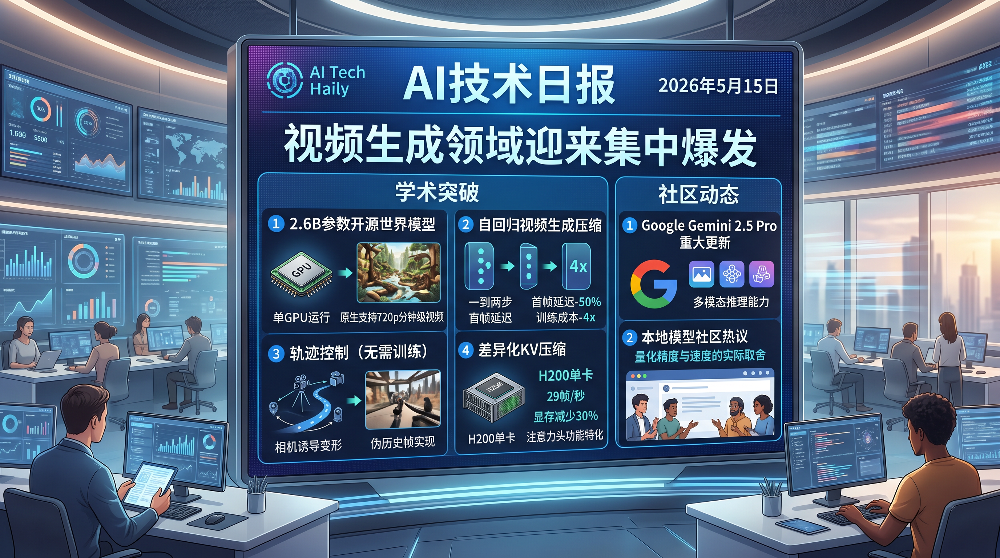

# 破晓 PoXiao 早报 - 2026-05-15

> 数据来源：真实抓取 · 42 篇 HuggingFace 精选 + 20 条 HackerNews + 20 条 Reddit LocalLLaMA · 生成时间：2026-05-15 16:15 CST

>
> ⚙️ **新配置首发**：本期起视频生成领域优先级提升至 5.5（最高），Agent/强化学习降至 2.5

---

## 📡 学术概览

### 🔴 Tier 1 - 视频生成 & 世界模型（新增最高优先级专区）

1. **SANA-WM: 分钟级世界建模 — 高效 Hybrid Linear Diffusion Transformer**

   🔬 领域：视频生成 · 世界模型 · 热度：HF Daily Papers #4

   - **一句话核心贡献**：2.6B 参数开源世界模型，原生支持 720p 分钟级视频生成 + 精确相机控制，单 GPU 可跑
   - **摘要精译**：SANA-WM 是一个高效的 2.6B 参数开源世界模型，专为一分钟级视频生成而设计，支持 720p 高保真输出与精确相机控制。其核心创新包括：Hybrid Linear Attention 将逐帧 Gated DeltaNet 与 softmax attention 结合，实现长序列内存高效建模；双分支相机控制保证 6-DoF 轨迹精度；两阶段生成流水线提升长序列一致性；鲁棒标注流水线自动提取公开视频的米制尺度相机位姿。训练仅用约 213K 公开视频片段，在 64 台 H100 上 15 天完成，蒸馏版本可在单张 RTX 5090 上以 NVFP4 量化，34 秒生成 60 秒 720p 视频。在 36x 更高吞吐量下，视觉质量媲美 LingBot-World 等工业基线。

   

   
💡 展开详情（方法论 + 实验）

   - **核心创新点**：
     1. Hybrid Linear Attention：GDN（逐帧）+ softmax 混合，长上下文内存高效
     2. Dual-Branch Camera Control：6-DoF 精确轨迹控制
     3. Two-Stage Pipeline：长视频精炼器提升质量与时序一致性
     4. 鲁棒米制尺度位姿标注流水线，保障监督标签质量
   - **实验结果**：相机跟随精度优于所有开源基线；视觉质量媲美大规模商业基线（LingBot-World、HY-WorldPlay），吞吐量高 36x；蒸馏版单 RTX 5090，34s/60s 720p
   - **局限性**：仍依赖高质量位姿标注，开源视频的标注噪声可能影响效果
   - **链接**：https://arxiv.org/abs/2605.15178

   

---

2. **Causal Forcing++: 实时交互视频生成的可扩展少步自回归扩散蒸馏**

   🔬 领域：视频生成 · 实时交互 · 扩散蒸馏 · 热度：HF Daily Papers #6

   - **一句话核心贡献**：将自回归视频生成压缩至 1-2 步，首帧延迟减少 50%，训练成本降低 4x
   - **摘要精译**：实时交互视频生成需要低延迟、流式、可控的自回归生成。现有方法在 4 步 chunk 生成上表现不错，但在更激进的 1-2 步帧级自回归场景中初始化成为瓶颈。Causal Forcing++ 提出因果一致性蒸馏（causal CD）作为初始化方案：通过在相邻时间步间学习单步 online teacher ODE，建立与 causal ODE 蒸馏等价的流映射，避免预计算完整 PF-ODE 轨迹。在帧级 2 步设置下超越了 SOTA 4 步 chunk Causal Forcing（+0.1 VBench Total，+0.3 VBench Quality，+0.335 VisionReward），同时减少首帧延迟 50%，Stage 2 训练成本降低约 4x。方法可扩展至 Genie3 风格的动作条件世界模型。

   

   
💡 展开详情（方法论 + 实验）

   - **核心创新点**：
     1. Causal CD：单步 online teacher ODE 监督，避免昂贵的轨迹预存储
     2. 帧级 2 步自回归，比 chunk 级 4 步更细粒度、更低延迟
     3. 可扩展至动作条件世界模型（Genie3 风格）
   - **实验结果**：vs. SOTA Causal Forcing (4步 chunk)：+0.1 VBench Total，+0.3 VBench Quality，+0.335 VisionReward；首帧延迟 -50%，训练成本 -75%
   - **局限性**：目前主要在玩具/标准场景验证，真实世界泛化性待评估
   - **链接**：https://arxiv.org/abs/2605.15141 | 代码：https://github.com/thu-ml/Causal-Forcing

   

---

3. **Warp-as-History: 单训练视频泛化相机控制视频生成**

   🔬 领域：视频生成 · 相机控制 · 零样本 · 热度：HF Daily Papers #10

   - **一句话核心贡献**：将相机诱导的变形转化为伪历史帧，无需训练即实现相机轨迹控制，仅用一个视频微调可泛化至未见视频
   - **摘要精译**：现有相机控制视频生成方法通常需要在大规模相机标注视频上后训练。Warp-as-History 提出一个简洁接口：将目标相机轨迹诱导的 warp 转化为相机扭曲伪历史帧，并将其对齐到目标帧的位置编码空间，同时过滤掉无有效源观测的 warped token。在冻结的视频生成模型上，无需任何训练、架构修改或测试时优化，即实现非平凡的零样本相机轨迹跟随能力。进一步，在单个标注视频上做轻量级离线 LoRA 微调，可在未见视频上泛化，同时提升相机跟随精度、视觉质量和运动动态。

   

   
💡 展开详情（方法论 + 实验）

   - **核心创新点**：
     1. Warp-as-History 接口：相机 warp → 伪历史帧，位置编码对齐
     2. 零样本相机控制：无需训练，利用冻结模型原有能力
     3. 单视频 LoRA 微调即可泛化，成本极低
   - **实验结果**：在多个数据集上验证有效性；仅一个标注视频 LoRA 微调后，相机跟随、视觉质量、运动动态均有提升
   - **局限性**：零样本模式下控制精度仍不如专门训练的方法
   - **链接**：https://arxiv.org/abs/2605.15182

   

---

4. **Forcing-KV: 高效自回归视频扩散模型的混合 KV 缓存压缩**

   🔬 领域：视频生成 · 推理加速 · KV 缓存 · 热度：HF Daily Papers #23

   - **一句话核心贡献**：根据 attention head 功能特化（静态/动态）进行差异化 KV 压缩，在单卡 H200 达到 29fps，显存减少 30%
   - **摘要精译**：自回归视频扩散模型（如 Self Forcing 范式）在历史帧 KV 缓存上面临严重的注意力复杂度和内存压力。Forcing-KV 发现主流 AR 扩散模型的 attention head 具有稳定的功能特化：静态头（关注 chunk 边界和帧内保真度）和动态头（控制帧间运动和一致性）。针对两类头采用不同压缩策略：静态头用结构化静态剪枝，动态头用基于段间相似度的动态剪枝。在保持输出质量的前提下，在单张 NVIDIA H200 上实现 29fps 生成速度，缓存内存减少 30%，LongLive 和 Self Forcing 分别加速 1.35x 和 1.50x（480P），1080P 分辨率下可达 2.82x 加速。

   

   
💡 展开详情（方法论 + 实验）

   - **核心创新点**：
     1. Head 功能特化发现：静态头 vs 动态头，跨样本和去噪步骤稳定
     2. 混合压缩策略：结构化静态剪枝 + 段间相似度动态剪枝
   - **实验结果**：29fps（H200，480P）；缓存内存 -30%；1080P 达 2.82x 加速
   - **局限性**：需要对特定模型分析 head 功能分类，通用性待验证
   - **链接**：https://arxiv.org/abs/2605.09681 | 项目：https://zju-jiyicheng.github.io/Forcing-KV-Page

   

---

5. **RAVEN: 基于 Consistency-model GRPO 的实时自回归视频外推**

   🔬 领域：视频生成 · 实时外推 · RL后训练 · 热度：HF Daily Papers #24

   - **一句话核心贡献**：通过 interleaved clean/noisy 序列对齐训练与推理分布，结合 CM-GRPO 在线 RL，超越现有因果视频蒸馏 baseline
   - **摘要精译**：因果自回归视频扩散模型通过外推历史内容实现实时流式生成，但训练时遇到的历史分布与推理时的分布存在持久差距，限制了长序列生成质量。RAVEN 提出训练时测试（training-time test）框架：将每次自我 rollout 重新打包为 clean 历史端点和 noisy 去噪状态的交错序列，使训练注意力与推理时的外推模式对齐，并允许下游 chunk 损失监督历史表示。进一步提出 Consistency-model GRPO（CM-GRPO），将一致性采样步骤建模为条件高斯转移，直接对该核应用在线 RL，避免了 flow-model RL 中的 Euler-Maruyama 辅助过程。实验表明 RAVEN 在质量、语义和动态度评估上均超越最近的因果视频蒸馏基线，CM-GRPO 与 RAVEN 结合进一步提升性能。

   

   
💡 展开详情（方法论 + 实验）

   - **核心创新点**：
     1. Training-time test 框架：interleaved clean/noisy 序列，对齐训练推理分布
     2. CM-GRPO：将一致性采样建模为条件高斯，online RL 直接作用，绕开 Euler-Maruyama
   - **实验结果**：超越所有因果视频蒸馏 baseline（质量、语义、动态度三维均提升）
   - **局限性**：CM-GRPO 的通用性扩展至其他生成任务尚未验证
   - **链接**：https://arxiv.org/abs/2605.15190

   

---

6. **PhyMotion: 用于物理真实人体视频生成的结构化 3D 运动奖励**

   🔬 领域：视频生成 · 人体动作 · 物理仿真奖励 · 热度：HF Daily Papers #28

   - **一句话核心贡献**：将生成视频中的人体 3D 轨迹置入物理仿真器评估，提供可解释的运动奖励，RL 后训练获得 +68 Elo 提升
   - **摘要精译**：真实人体运动生成是视频生成的核心挑战。现有视频奖励主要基于 2D 感知信号，无法对 3D 身体状态、接触和动力学建模，导致漂浮身体等物理不合理运动得高分。PhyMotion 提出结构化细粒度运动奖励：从生成视频恢复 SMPL 人体网格，在 MuJoCo 物理仿真器中重定向至人形机器人，沿三个轴评估运动质量：运动学合理性、接触与平衡一致性、动力学可行性。每个分量提供连续可解释的信号。实验表明 PhyMotion 与人类判断的相关性优于现有奖励，RL 后训练中优化 PhyMotion 在自回归和双向视频生成器上均带来 +68 Elo 提升，且整体视频质量几乎不受影响。

   

   
💡 展开详情（方法论 + 实验）

   - **核心创新点**：
     1. 3D 人体轨迹恢复（SMPL mesh）→ MuJoCo 物理仿真
     2. 三轴评估：运动学合理性 + 接触/平衡 + 动力学可行性
     3. 连续可解释信号，兼容自回归和双向生成器
   - **实验结果**：+68 Elo（人类盲测）；自动指标和人工评估均优于现有奖励；训练开销小
   - **局限性**：依赖 SMPL 估计精度，极端遮挡场景可能降低奖励可靠性
   - **链接**：https://arxiv.org/abs/2605.14269

   

---

### 🟡 Tier 2 - 优秀工作 / 实用工具

7. **PDI-Bench: 视频世界模型几何一致性定量评估框架**

   🔬 领域：视频生成评估 · 几何一致性 · 热度：HF Daily Papers #41

   - **一句话核心贡献**：首个对生成视频进行视角失真定量审计的 benchmark，无需人工或学习判别器

   

   
💡 展开详情

   - **关键内容**：基于分割和点追踪（SAM 2、MegaSAM）提取以物体为中心的观测，量化生成视频的 3D 几何一致性，解决现有评估过度依赖主观判断的问题
   - **链接**：https://arxiv.org/abs/2605.15185

   

8. **SU-01: 简单统一 Scaling 达到奥林匹克金牌级推理**

   🔬 领域：基础大模型 · 推理 · 热度：HF Daily Papers #1（今日最高）

   - **一句话核心贡献**：30B-A3B 模型通过反困惑度课程 SFT + 两阶段 RL 流水线，IMO 2025/USAMO 2026 金牌级别

   

   
💡 展开详情

   - **核心创新点**：逆困惑度课程筛选高质量 SFT 轨迹 → 两阶段 RL（可验证奖励 RL → 证明级 RL）→ 测试时 Scaling，支持超 100K token 长链推理
   - **实验结果**：IMO 2025/USAMO 2026 金牌；IPhO 2024/2025 金牌；推理泛化到数学物理以外科学领域
   - **链接**：https://arxiv.org/abs/2605.13301

   

9. **Darwin Family: MRI-Trust 加权进化合并 — 无训练 Scaling 推理**

   🔬 领域：基础大模型 · 模型合并 · 热度：HF Daily Papers #8

   - **一句话核心贡献**：14 维适应性基因组 + MRI-Trust 融合 + 跨架构 Breeding，无训练 27B 模型达到 GPQA Diamond 86.9%（全球 #6）

   

   
💡 展开详情

   - **核心创新点**：跨 Transformer/Mamba 架构融合；无梯度权重空间重组；支持多代进化；不需要任何后训练
   - **实验结果**：Darwin-27B-Opus: 86.9% GPQA Diamond，1252 模型排名 #6，超越所有同规模全训练模型
   - **链接**：https://arxiv.org/abs/2605.14386

   

10. **VGGT-Edit: Text-Conditioned 原生 3D 场景编辑**

    🔬 领域：3D生成 · 场景编辑 · 热度：HF Daily Papers #18

    - **一句话核心贡献**：Feed-forward 框架直接预测 3D 几何位移，避免 2D-lifting 导致的模糊和多视图不一致

    

    
💡 展开详情

    - **关键内容**：深度同步文本注入 + 残差变换头预测 3D 变形；DeltaScene 大规模数据集（自动化 3D 一致性过滤）；大幅超越 2D-lifting 基线，推理近乎实时
    - **链接**：https://arxiv.org/abs/2605.15186

    

11. **CLVR: 闭环视觉推理解锁复杂视觉生成**

    � 领域：文本到图像 · 推理生成 · 热度：HF Daily Papers #31

    - **一句话核心贡献**：视觉语言逻辑规划 + 像素扩散生成深度耦合，PPRL 解决长上下文优化不稳定，每步仅 4 NFE

    

    
💡 展开详情

    - **关键内容**：Proxy Prompt RL 将多模态历史蒸馏为显式奖励；Δ-Space Weight Merge 无需重蒸馏压缩每步推理至 4 NFE；超越所有开源基线，接近商业模型
    - **链接**：https://arxiv.org/abs/2605.14876

    

---

## 🔥 社区速递

### 🔴 Tier 1 - 高热度讨论

1. **新 arXiv 政策：幻觉引用直接 1 年禁令**

   🔥 热度信号：HN Score 470 | 广泛讨论 · 来源：HackerNews + Twitter

   - **一句话核心**：arXiv 宣布对使用 AI 生成/幻觉参考文献的论文提交者实施 1 年封禁
   - **核心共识**：学术界对 AI 幻觉参考文献的容忍度已彻底耗尽，arXiv 此举被认为是"早该如此"
   - **主要争议**：如何自动检测幻觉引用仍是难题；误判风险存在；对学生影响大于资深学者
   - 🔗 [原帖](https://twitter.com/tdietterich/status/2055000956144935055)

2. **RTX 5000 PRO (48GB) 到货实测 — 本地大模型新王**

   🔥 热度信号：Reddit LocalLLaMA Top | 多个独立评测 · 来源：Reddit LocalLLaMA

   - **一句话核心**：RTX 5000 PRO 48GB 显存到货，本地大模型玩家实测性能超预期
   - **核心共识**：48GB VRAM 是当前本地跑大模型的甜蜜点，能跑 70B+ 模型；价格合理
   - **主要争议**：与中国改装 4090 48GB 谁更值？功耗和散热表现差异
   - 🔗 [Reddit 帖子](https://www.reddit.com/r/LocalLLaMA/comments/1td53ii/the_rtx_5000_pro_48gb_arrived_and_it_is_better/)

3. **Bun 已合并 Rust 重写 PR**

   🔥 热度信号：HN Score 623 · 来源：HackerNews + GitHub

   - **一句话核心**：Bun 完成了将核心部分从 Zig 重写为 Rust 的大型 PR 合并
   - **核心共识**：工程界对 Rust 在系统工具链的统治地位进一步确认；Bun 生态影响待观察
   - **主要争议**：重写对性能影响存疑；Zig 社区感到失落
   - 🔗 [GitHub PR](https://github.com/oven-sh/bun/pull/30412)

### 🟡 Tier 2 - 实用工具 / 有趣实验

4. **Qwen3.6 35B MTP 版本百万 token 实测**

   🔥 热度信号：Reddit LocalLLaMA Hot · 来源：Reddit LocalLLaMA

   - **一句话核心**：用户在三次独立会话中测试 Qwen3.6 35B 新版（Multi-token Prediction），累计超过一百万 token，质量保持稳定
   - 🔗 [Reddit 帖子](https://www.reddit.com/r/LocalLLaMA/comments/1tdns1i/)

5. **TurboQuant 量化方案首次全面精度 + 性能研究**

   🔥 热度信号：Reddit LocalLLaMA Hot · 来源：Reddit LocalLLaMA

   - **一句话核心**：社区首份 TurboQuant 全面评测，精度损失优于 GGUF，性能接近，受到广泛关注
   - 🔗 [Reddit 帖子](https://www.reddit.com/r/LocalLLaMA/comments/1tdb4ic/)

---

## 💰 财经简报

> ⚠️ 今日 RSS 财经源（TechCrunch AI、VentureBeat AI）时效窗口无新内容，以下为今日社区/HN 观察到的商业动态

1. **RTX 5090 涨价传言 — GDDR7 成本上升**
   - **摘要**：NVIDIA 据报道因 GDDR7 显存成本上升准备上调 RTX 5090 及 PRO 系列价格，影响本地 AI 算力市场
   - **来源**：[Reddit LocalLLaMA](https://www.reddit.com/r/LocalLLaMA/comments/1td9ehi/)

2. **Orchard 开源 Agent 训练框架：Qwen3-30B 达到 SWE-bench 67.5%**
   - **摘要**：微软/Qwen 团队开源 Orchard 框架，Orchard-SWE（基于 Qwen3-30B-A3B）在 SWE-bench Verified 达 67.5%，开源 SOTA。GUI Agent 4B 模型在 WebVoyager 74.1%，竞争力接近商业系统
   - **来源**：[arXiv 2605.15040](https://arxiv.org/abs/2605.15040)

---

## 🏢 职场动态

> 覆盖 AI 就业市场、大厂裁员/扩招、薪资趋势

1. **CS 职场：AI 工具使用成面试新考点**
   - **摘要**：Reddit r/cscareerquestions 热帖显示，越来越多的科技公司在面试中明确询问候选人 AI 工具使用习惯和效率提升经验；不熟悉 AI 辅助编程的候选人反馈面临竞争压力
   - **来源**：Reddit Jobs & Careers

2. **VS Code 新增"Agents 窗口"支持本地 AI 模型 — 但仍需付费订阅**
   - **摘要**：VS Code 新功能允许使用本地 AI 模型，但实际仍需要联网和 GitHub Copilot 订阅，社区表示失望
   - **来源**：[Reddit LocalLLaMA](https://www.reddit.com/r/LocalLLaMA/comments/1td3uzi/)

---

## 📊 今日总结

1. **视频生成进入"工程化冲刺"阶段**：今日 HF 精选中，有 6 篇论文直接围绕视频生成，覆盖世界模型（SANA-WM）、实时蒸馏（Causal Forcing++、RAVEN）、相机控制（Warp-as-History）、推理加速（Forcing-KV）和物理奖励（PhyMotion），说明视频生成已从"能生成"进入"快、准、省"的工程化深水区

2. **无训练 Scaling 成推理新范式**：Darwin Family 用进化合并（无梯度）让 27B 模型达到全球 #6 推理水准，与 SU-01 的 RL Scaling 路线形成鲜明对比——提升推理能力已有"训练路线"和"合并路线"两条清晰赛道

3. **学术界对 AI 幻觉零容忍**：arXiv 1 年禁令政策标志着学术界对 AI 生成内容的治理进入实质性强制阶段，AI 辅助写作的"合规边界"将越来越清晰

---

**生成时间**：2026-05-15 16:15 CST
**数据来源**：briefs/2026-05-15/raw_context.md（HuggingFace 42篇 + HackerNews 20条 + Reddit 20条）
**配置文件**：profiles/profile_demo.yaml（新配置：视频生成 priority 5.5，Agent/RL 降至 2.5）
**抓取时间**：2026-05-15 08:09 UTC
