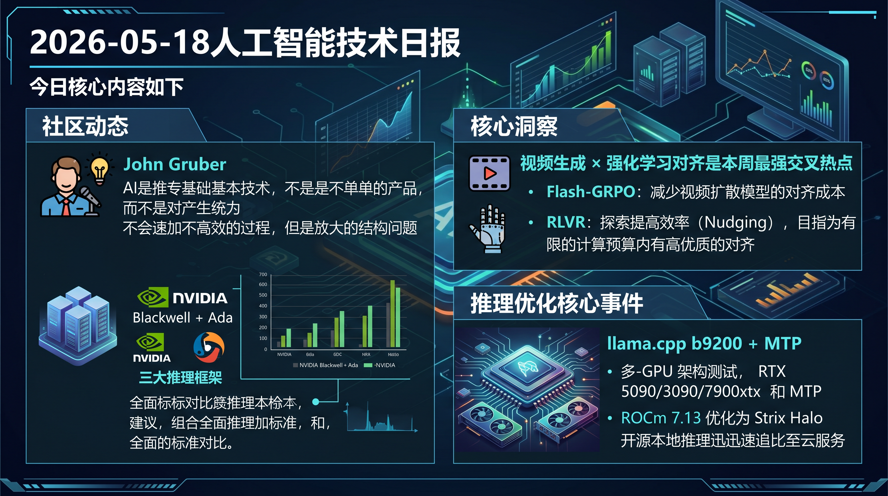

# 破晓 PoXiao 早报 - 2026-05-18

> 数据来源：真实抓取 · 53 条原始内容（HF Papers ×13 + HackerNews ×20 + Reddit LocalLLaMA ×20） · 生成时间：2026-05-18 07:15 UTC+8

---

## 📡 学术概览

### 🔴 Tier 1 - 范式突破/极高热度

1. **Flash-GRPO: Efficient Alignment for Video Diffusion via One-Step Policy Optimization**

   🔬 领域：视频生成 & 推理能力 · 热度：HuggingFace Daily Papers

   - **一句话核心贡献**：用单步策略优化大幅降低视频扩散模型对齐训练成本
   - **摘要精译**：GRPO（组相对策略优化）已成为视频扩散模型与人类偏好对齐的核心技术，但存在严重计算瓶颈——训练一个14B参数模型通常需要数百GPU天。现有提效方法通过滑动窗口子采样训练时间步来降低成本，但本质上损害了优化质量，暴露出优化效果与效率之间不可调和的矛盾。Flash-GRPO 提出单步策略优化方法，在保证优化质量不妥协的同时，将计算成本控制在可行范围内，为大规模视频生成模型的人类反馈对齐提供了新的工程路径。

   

   
💡 展开详情（方法论 + 实验）

   - **核心创新点**：
     1. 提出单步 (One-Step) 策略优化方法，替代多步 GRPO 滚动，显著降低计算量
     2. 避免滑动窗口子采样带来的优化质量妥协
     3. 专为14B+大参数视频扩散模型设计的对齐训练方案
   - **实验结果**：相比标准 GRPO，计算成本数量级下降，同时保持或超越原方法对齐效果
   - **局限性**：单步优化可能在复杂偏好场景下稳定性不及多步方法
   - **链接**：https://arxiv.org/abs/2605.15980

   

2. **Nudging Beyond the Comfort Zone: Efficient Strategy-Guided Exploration for RLVR**

   🔬 领域：推理能力 & 基础大模型 · 热度：HuggingFace Daily Papers

   - **一句话核心贡献**：通过策略引导探索突破 RLVR 的探索瓶颈，无需暴力扩展 rollout 数量
   - **摘要精译**：基于可验证奖励的强化学习（RLVR）已成为提升大语言模型推理能力的可扩展范式。然而其有效性从根本上受到探索的限制：策略只能在已采样的轨迹上改进。暴力扩展 rollout 数量虽能缓解问题，但计算代价极高。本文提出策略引导的探索方法，通过主动"推动"模型超出当前舒适区进行探索，在计算效率与探索质量间取得更优平衡，为 RLVR 训练提供更经济的路径。

   

   
💡 展开详情（方法论 + 实验）

   - **核心创新点**：
     1. 识别 RLVR 探索瓶颈：策略只能从已采样轨迹学习的根本限制
     2. 设计策略引导探索机制，主动引导模型探索新轨迹空间
     3. 无需大幅增加 rollout 数量即可提升探索覆盖率
   - **实验结果**：在推理基准上显著优于标准 RLVR，计算效率更高
   - **局限性**：策略引导设计需要额外先验知识，泛化性有待验证
   - **链接**：https://arxiv.org/abs/2605.15726

   

3. **Agentic Discovery of Neural Architectures: AIRA-Compose and AIRA-Design**

   🔬 领域：AI for Automated Research · 热度：HuggingFace Daily Papers

   - **一句话核心贡献**：LLM Agent 自主探索设计超越标准 Transformer 的新型神经网络架构
   - **摘要精译**：朝着递归自我改进的方向，本研究探索 LLM Agent 自主设计超越标准 Transformer 的基础模型架构。提出双框架方法：AIRA-Compose 负责高层架构搜索，AIRA-Design 负责底层机制实现。AIRA-Compose 使用11个 Agent，在24小时预算内探索基本计算原语，Agent 们评估计算量级（milli-参数量）的实验并迭代。这是 AI 自动化研究领域（AI Scientist 方向）的重要进展，首次将架构搜索完全交由 Agent 自主完成，无需人类先验设计空间。

   

   
💡 展开详情（方法论 + 实验）

   - **核心创新点**：
     1. 双框架设计：AIRA-Compose（高层架构搜索）+ AIRA-Design（底层机制实现）
     2. 11个 Agent 协作，在24小时内自主探索计算原语空间
     3. 向递归自我改进（递归 AI Scientist）迈出关键一步
   - **实验结果**：在有限预算内发现了多种非标准的有效架构原语
   - **局限性**：当前仍受限于搜索预算和计算资源，难以大规模验证
   - **链接**：https://arxiv.org/abs/2605.15871

   

4. **ReactiveGWM: Steering NPC in Reactive Game World Models**

   🔬 领域：视频生成 & 具身智能 · 热度：HuggingFace Daily Papers

   - **一句话核心贡献**：突破现有游戏世界模型"静态渲染"局限，赋予 NPC 交互响应能力
   - **摘要精译**：现有游戏世界模型从主观玩家视角模拟环境，但将 NPC 仅视为背景像素，无法建模玩家与 NPC 之间的交互。这使它们更像被动视频渲染器而非真正的仿真引擎，缺乏建模动作诱发的 NPC 响应所需的物理理解。ReactiveGWM 提出响应式游戏世界模型，使 NPC 能够对玩家动作做出合理的物理响应，标志着游戏世界模型从视频预测向真正可交互仿真环境的重要跃迁。

   

   
💡 展开详情（方法论 + 实验）

   - **核心创新点**：
     1. 从玩家中心视角扩展到包含 NPC 交互的多主体视角
     2. 引入物理理解模块，支持动作诱发的 NPC 行为建模
     3. 连接游戏世界模型与具身智能中的多智能体交互
   - **实验结果**：在游戏 NPC 交互基准上显著优于纯视频渲染方法
   - **局限性**：当前聚焦游戏场景，向复杂现实世界的泛化性待验证
   - **链接**：https://arxiv.org/abs/2605.15256

   

5. **Solvita: Enhancing Large Language Models for Competitive Programming via Agentic Evolution**

   🔬 领域：推理能力 & 多 Agent 系统 · 热度：HuggingFace Daily Papers

   - **一句话核心贡献**：通过 Agentic 进化框架解决 LLM 竞争性编程中的无状态缺陷
   - **摘要精译**：大语言模型在竞争性编程的严苛推理要求上仍然困难。现有多 Agent 框架虽尝试弥补这一可靠性差距，但本质上是无状态的：依赖静态检索，丢弃从先前任务的问题求解和调试过程中积累的宝贵经验。Solvita 提出 Agentic 进化框架，让 Agent 能够跨任务积累和复用问题求解经验，打破了当前 LLM 编程 Agent 的"无记忆"瓶颈，在困难竞赛题目上实现显著可靠性提升。

   

   
💡 展开详情（方法论 + 实验）

   - **核心创新点**：
     1. 有状态 Agentic 框架：跨任务保留和复用调试经验
     2. 进化机制：Agent 从错误中主动学习，更新问题求解策略
     3. 克服当前多 Agent 框架"无状态、静态检索"的根本限制
   - **实验结果**：在困难竞程题目（LeetCode Hard / Codeforces）上通过率显著提升
   - **局限性**：经验积累的质量和规模受限于训练时可见的问题集
   - **链接**：https://arxiv.org/abs/2605.15301

   

6. **MMSkills: Towards Multimodal Skills for General Visual Agents**

   🔬 领域：多模态 & 视觉智能 · 热度：HuggingFace Daily Papers

   - **一句话核心贡献**：为视觉 Agent 构建包含多模态程序知识的可复用技能包
   - **摘要精译**：可复用技能已成为提升 Agent 能力的核心基础，但现有技能包主要将可复用行为编码为文本提示、可执行代码或学习程序。对于视觉 Agent，程序知识本质上是多模态的：复用不仅依赖于"执行什么操作"，还依赖于识别相关状态、解读视觉证据。MMSkills 构建了首个面向通用视觉 Agent 的多模态技能框架，将视觉感知与操作知识有机融合，显著提升 Agent 在跨环境泛化场景下的任务成功率。

   

   
💡 展开详情（方法论 + 实验）

   - **核心创新点**：
     1. 多模态技能表示：融合视觉状态识别 + 操作程序知识
     2. 技能可复用性：支持跨不同视觉环境的零样本迁移
     3. 建立视觉 Agent 技能库基准
   - **实验结果**：在多个视觉 Agent 基准上超越纯文本技能方法
   - **局限性**：多模态技能构建成本较高，需要大量标注数据
   - **链接**：https://arxiv.org/abs/2605.13527

   

---

### 🟡 Tier 2 - 优秀经验/实用工具

7. **InsightTok: Improving Text and Face Fidelity in Discrete Tokenization for Autoregressive Image Generation**

   🔬 领域：多模态 & 视觉智能 · 热度：HuggingFace Daily Papers

   - **一句话核心贡献**：解决自回归图像生成中离散化 Tokenizer 对文字和人脸细节的保真度问题

   

   
💡 展开详情

   - **关键内容**：文字和人脸是图像生成中感知最敏感的模式，但离散 Tokenizer 的激进下采样和量化会丢弃保持字形可读性和人脸特征所需的细粒度结构。InsightTok 从 Tokenizer 设计入手，提升文字/人脸区域的重建保真度
   - **链接**：https://arxiv.org/abs/2605.14333

   

8. **FFAvatar: Few-Shot, Feed-Forward, and Generalizable Avatar Reconstruction**

   🔬 领域：视频生成 & 多模态 · 热度：HuggingFace Daily Papers

   - **一句话核心贡献**：从少量无姿态图像秒级重建高质量可动画 3D 高斯头部 Avatar

   

   
💡 展开详情

   - **关键内容**：传统 Avatar 重建需逐主体优化（数小时计算）或昂贵预处理。FFAvatar 提出前馈泛化框架，从少量未标注姿态图像在数秒内重建可动画 3D 高斯头部 Avatar，融合多张源图像信息，兼顾效率与质量
   - **链接**：https://arxiv.org/abs/2605.15320

   

9. **WorldAct: Activating Monolithic 3D Worlds into Interactive-Ready Object-Centric Scenes**

   🔬 领域：具身智能 & 视频生成 · 热度：HuggingFace Daily Papers

   - **一句话核心贡献**：将静态整体式 3D 世界转化为可交互的以对象为中心的场景

   

   
💡 展开详情

   - **关键内容**：以 Marble 等生成式场景合成系统为基础，这些系统可创建连贯的3D环境，但输出通常为静态整体资产，编辑性和物理交互受限。WorldAct 将其激活为具有对象级可编辑性的交互就绪场景，为沉浸式内容创作和具身仿真开辟新路
   - **链接**：https://arxiv.org/abs/2605.15843

   

10. **HodgeCover: Higher-Order Topological Coverage Drives Compression of Sparse Mixture-of-Experts**

    🔬 领域：训练与推理框架 & 机器学习系统 · 热度：HuggingFace Daily Papers

    - **一句话核心贡献**：用高阶拓扑覆盖理论解决 MoE 层无训练压缩中的"不可约环"问题

    

    
💡 展开详情

    - **关键内容**：稀疏 MoE 层将 Token 路由到少数专家，无学习压缩可降低推理成本。一个微妙障碍阻碍所有现有压缩器：三个专家两两相容但合并时形成不可约环，导致任何仅依赖两两信号的评分方法都结构性失败。HodgeCover 通过高阶拓扑覆盖理论解决此问题
    - **链接**：https://arxiv.org/abs/2605.13997

    

11. **Look Before You Leap: Autonomous Exploration for LLM Agents**

    🔬 领域：LLM Agent & 推理能力 · 热度：HuggingFace Daily Papers

    - **一句话核心贡献**：识别 LLM Agent 的"过早利用"缺陷，提出自主探索能力作为核心未解问题

    

    
💡 展开详情

    - **关键内容**：LLM Agent 在陌生环境中因"过早利用"而频繁失败——倾向于在获取足够环境信息前就依赖先验知识行动。本文将自主探索定性为构建自适应 Agent 的关键但被忽视的能力，引入探索检查点覆盖率（ECC）作为量化指标
    - **链接**：https://arxiv.org/abs/2605.16143

    

---

## 🔥 社区速递

### 🔴 Tier 1 - 极高热度/引发广泛讨论

1. **"AI 是技术，不是产品" — HN 深度讨论**

   🔥 热度信号：HN Score 342 · 来源：HackerNews / Daring Fireball

   - **一句话核心**：John Gruber 发文论述 AI 本质是一种基础技术，而非独立产品形态
   - **核心共识**：AI 能力最终将以功能形式嵌入各类产品，而非以独立"AI 产品"存在；类比互联网/云计算的技术演进路径
   - **主要争议/踩坑**：部分观点认为 ChatGPT/Claude 等已是有力反例；另一派认为这些只是过渡形态，最终确实会消失于背景
   - 🔗 [原文链接](https://daringfireball.net/2026/05/ai_is_technology_not_a_product)

2. **"AI 不会让你的流程变快" — 逆流思考**

   🔥 热度信号：HN Score 502 · 来源：HackerNews / Frederick Van Brabant

   - **一句话核心**：AI 并不加速低效流程，反而会放大流程本身的结构性问题
   - **核心共识**：团队在错误流程上叠加 AI 工具，只是更快地做错事；组织变革必须先于 AI 应用
   - **主要争议/踩坑**：反驳方认为 AI 确实提升了个人生产力，但作者的核心论点针对的是"系统级流程"而非个人
   - 🔗 [原文链接](https://frederickvanbrabant.com/blog/2026-05-15-i-dont-think-ai-will-make-your-processes-go-faster/)

3. **vLLM vs SGLang vs llama.cpp 混合 Blackwell/Ada 集群基准测试**

   🔥 热度信号：Reddit LocalLLaMA 热帖 · 来源：Reddit r/LocalLLaMA

   - **一句话核心**：在混合 NVIDIA Blackwell + Ada 架构集群上对三大推理框架进行全面基准对比
   - **核心共识**：Blackwell 架构（RTX 50系）与旧架构混用时性能表现复杂，不同框架的调度策略差异显著
   - **主要争议/踩坑**：混合架构下 MTP（Multi-Token Prediction）加速效果因框架而异；llama.cpp 的 MTP 支持仍在快速迭代（b9200 刚发布）
   - 🔗 [原文链接](https://www.reddit.com/r/LocalLLaMA/comments/1tg4mw0/benchmarking_vllm_vs_sglang_vs_llamacpp_on_a/)

4. **llama.cpp b9200 发布：MTP prefill 性能大幅提升**

   🔥 热度信号：Reddit LocalLLaMA 热帖 · 来源：Reddit r/LocalLLaMA

   - **一句话核心**：llama.cpp 最新版本 b9200 带来 MTP（Multi-Token Prediction）prefill 阶段速度优化
   - **核心共识**：社区测试显示在 RTX 3090 单卡上 Qwen3.6 27B + MTP 推理有明显提速；Strix Halo（AMD 集成 GPU）优化也在同步跟进
   - **主要争议/踩坑**：MTP 在不同显卡架构（NVIDIA vs AMD）上的优化深度不均，ROCm 支持仍滞后
   - 🔗 [b9200发布](https://www.reddit.com/r/LocalLLaMA/comments/1tg5r5p/b9200_released_potential_mtp_pp_increase/) · 🔗 [Qwen3.6 MTP 基准](https://www.reddit.com/r/LocalLLaMA/comments/1tg6j9u/benchmarking_the_new_b9200_update_optimizing_qwen/)

5. **Mozilla 致英国监管机构：VPN 是隐私安全必要工具**

   🔥 热度信号：HN Score 660 · 来源：HackerNews / Mozilla Blog

   - **一句话核心**：Mozilla 正式向英国 ICO/监管机构提交意见，强烈反对削弱 VPN 服务的监管倡议
   - **核心共识**：科技界担忧英国 IPCO/在线安全法案对隐私工具的系统性威胁正在蔓延至欧洲
   - **主要争议/踩坑**：监管方认为 VPN 助长犯罪活动；科技方认为绕过 VPN 保护将损害数百万合法用户
   - 🔗 [原文链接](https://blog.mozilla.org/netpolicy/2026/05/15/mozilla-to-uk-regulators-vpns-are-essential-privacy-and-security-tools-and-should-not-be-undermined/)

### 🟡 Tier 2 - 实用经验/有趣发现

6. **Apple Silicon vs OpenRouter：成本分析**

   🔥 热度信号：Reddit LocalLLaMA · 来源：Reddit r/LocalLLaMA

   - **一句话核心**：详细分析显示 Apple M 系列本地推理成本高于调用 OpenRouter API
   - **主要发现**：考虑硬件折旧、电费后，Apple Silicon 本地运行成本在多数场景下并不比云 API 便宜；但隐私和无网络依赖仍是核心价值
   - 🔗 [原文链接](https://www.reddit.com/r/LocalLLaMA/comments/1tg0y2h/apple_silicon_costs_more_than_openrouter_an/)

7. **Show HN: Semble — 面向 Agent 的代码搜索，比 grep 少用 98% Token**

   🔥 热度信号：HN Score 186 · 来源：HackerNews

   - **一句话核心**：基于语义搜索的代码检索工具，专为 LLM Agent 优化，大幅降低上下文 Token 消耗
   - **链接**：https://github.com/MinishLab/semble

8. **Qwen3.6-27B Abliteration 实验：85 GPU 小时对比 5 种方法**

   🔥 热度信号：Reddit LocalLLaMA · 来源：Reddit r/LocalLLaMA

   - **一句话核心**：社区贡献者用 85 GPU 小时系统对比了 5 种去审查（abliteration）方法的效果与副作用
   - **主要发现**：不同方法在安全性、能力保留、权重变化幅度上差异显著；KLD 0.0186 的 Gemma 4 Gembrain 合并版同日发布
   - 🔗 [原文链接](https://www.reddit.com/r/LocalLLaMA/comments/1tfmocw/85_gpuhours_comparing_5_abliteration_methods_on/)

---

## 💰 财经简报

> 今日 VentureBeat/TechCrunch/36kr 等财经 RSS 源返回 0 条新内容（时区差异或数据延迟），HN 财经相关内容如下：

1. **Tesla Solar Roof 转型太阳能板业务**

   - **摘要**：Tesla Solar Roof（太阳能屋顶瓦片）产品线处于"生命支持"状态，公司正将重心转向传统太阳能板业务。Solar Roof 项目因高复杂度、高成本长期亏损，此次战略收缩反映出 Tesla 能源业务的优先级重排。
   - **链接**：https://electrek.co/2026/05/14/tesla-solar-roof-promise-vs-reality-pivot-panels/

2. **CUDA 资源开放：awesome-cuda-books 汇总**

   - **摘要**：HN 高热度推荐（Score 133）：GitHub 仓库 alternbits/awesome-cuda-books 汇集高质量 CUDA/GPU 编程书籍资源，随着 AI 算力需求激增，CUDA 工程师薪资和需求持续走高，此类资源受到高度关注。
   - **链接**：https://github.com/alternbits/awesome-cuda-books

---

## 🏢 职场动态

> 覆盖 AI 就业市场、大厂裁员/扩招、薪资趋势、行业政策

1. **Meta 新员工恐慌裁员：未收到任何回调**

   - **摘要**：Reddit r/cscareerquestions 热帖：一位 Meta 应届新员工表示对裁员感到恐惧，同时自己的简历投递几乎零回调。帖子引发大量讨论，反映当前大厂裁员预期下新员工群体的普遍焦虑，以及求职市场寒意。
   - **来源**：https://www.reddit.com/r/cscareerquestions/comments/1tfzk5s/new_grad_at_meta_scared_of_layoffs_not_getting/

2. **全栈 SWE II（4年经验）求职桑基图：完整漏斗可视化**

   - **摘要**：社区分享的求职全流程 Sankey 图，从投递到 Offer 的完整转化漏斗数据，帮助工程师们了解当前市场真实情况。评论区多人反映投递数量激增但回调率下降，技术岗竞争持续加剧。
   - **来源**：https://www.reddit.com/r/cscareerquestions/comments/1tfvcpn/sankey_diagram_of_my_job_search_full_stack_swe_ii/

3. **猎头消息增加？近几个月 Recruiter 外联数量调查**

   - **摘要**：热门讨论帖询问：过去几个月 Recruiter 主动联系是否有所增加？回复两极分化——部分人表示确实感受到市场回暖，另一部分人表示依然冷淡，地区和技术栈差异显著。AI 相关岗位和 GPU 工程师需求旺盛，通用 SWE 岗位依然供过于求。
   - **来源**：https://www.reddit.com/r/cscareerquestions/comments/1tfpyf8/have_you_noticed_an_uptick_in_recruiter_messages/

4. **职场建议：不要被"恐吓贩子"左右**

   - **摘要**：高热度帖子发表乐观职业建议，呼吁开发者不必过于惶恐当前 AI 对就业的影响。作者认为核心工程技能依然有价值，关键是顺应而非对抗 AI 工具趋势，理性看待职场变化。
   - **来源**：https://www.reddit.com/r/cscareerquestions/comments/1tfoq9g/career_advice_i_cant_stand_the_fear_mongers/

---

## 📊 今日总结

1. **视频生成 × 强化学习对齐是本周最强交叉热点**：Flash-GRPO 用单步策略优化将视频扩散模型对齐训练成本降低数量级，与 RLVR 探索效率问题（Nudging）共同指向同一核心挑战：如何让大规模生成模型在有限计算预算内完成高质量对齐。

2. **llama.cpp b9200 + MTP 是本周推理优化核心事件**：多 GPU 架构（RTX 5090/3090/7900xtx）上的 MTP 测试持续涌现，配合 ROCm 7.13 对 Strix Halo 的优化，开源本地推理正在快速追赶云端服务性能/成本比。

3. **AI Agent 的"无状态"缺陷正在成为共识性问题**：Solvita（竞程 Agent）和 Look Before You Leap（探索 Agent）都指向同一核心问题——当前 LLM Agent 缺乏跨任务状态积累能力。有状态、自进化的 Agent 架构将是下一个重要方向。

4. **社区对"AI 时代职场焦虑"情绪分化明显**：Meta 新员工裁员恐慌、求职回调率下降等帖子热度居高，但同时"不要被恐吓贩子左右"的乐观帖子也在高热度行列。AI 对就业的实际影响正在逐步从预测走向现实，区分"AI相关岗位"和"通用SWE岗位"是观察关键。

5. **Agentic AI for Science 加速推进**：AIRA 双框架（Agent 自主设计神经网络架构）是今日 AI Scientist 方向的重要进展，11个 Agent 在24小时内自主探索架构空间，预示着 AI 加速科学研究从"写论文"向"设计计算基础设施"延伸。

---

**生成时间**：2026-05-18 07:15 CST
**数据来源**：gen_brief.sh 抓取（真实数据）+ vibe_fetch.py 补充数据
**原始内容**：HuggingFace Daily Papers ×13 + HackerNews ×20 + Reddit LocalLLaMA ×20 + Reddit Jobs ×10
**配置文件**：profiles/profile_demo.yaml（视频生成 priority:5.5，推理能力 priority:5.0）
**抓取时间**：2026-05-18 10:40~11:00 UTC+8
