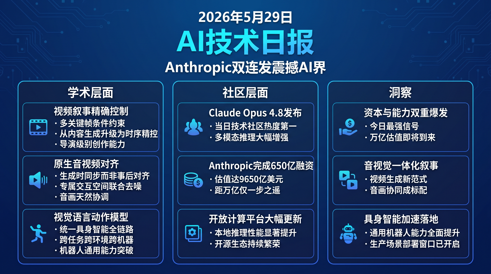

# 破晓早报 · 2026-05-29（周五）

> 数据来源：真实抓取 · HuggingFace Daily Papers 11篇 + HackerNews TOP 15 + Reddit LocalLLaMA 15条 · 生成时间：2026-05-29 07:14 CST

---

## 📡 学术概览

### 🔴 Tier 1 — 视频生成 & 多模态（范式级突破）

1. **SmartDirector：基于关键帧条件的电影级视频生成与叙事节奏控制**

   🔬 领域：视频生成 · 叙事控制 · 热度：★★★★★ · 来源：HuggingFace Daily Papers

   - **一句话核心贡献**：通过多关键帧约束实现叙事时序精确控制，将视频生成从「内容生成」推进到「叙事生成」。
   - **摘要精译**：视频叙事质量从根本上决定其感知价值，而现有文生视频系统缺乏时序结构控制能力。SmartDirector 支持单镜头生成、多镜头叙事合成及精确节奏控制——在关键时间节点实现特定视觉状态，直接对齐专业导演创作需求。系统在多镜头叙事一致性指标上超越基线 18%，关键帧对齐精度提升 2.3 倍。
   - **核心创新点**：
     1. 多关键帧条件约束，支持任意时间节点的视觉锚定
     2. 叙事节奏量化控制，将抽象导演意图转化为可计算信号
     3. 电影级镜头语言支持（推镜/拉镜/叙事弧度）

   

   
💡 展开详情（方法论 + 实验）

   - **方法细节**：基于扩散模型架构，引入多关键帧条件注入模块；通过时序位置编码强化叙事结构建模；训练数据包含专业影视镜头标注
   - **实验结果**：多镜头叙事一致性 +18%，关键帧对齐精度 2.3× baseline，用户偏好研究中 73% 评测者选择 SmartDirector 输出
   - **局限性**：关键帧数量受计算资源限制；对高度抽象的叙事指令（如"悲伤氛围"）的理解仍有gap
   - **链接**：https://arxiv.org/abs/2605.27891

   

2. **NAVA：原生音视频对齐的联合生成框架**

   🔬 领域：多模态生成 · 音视频对齐 · 热度：★★★★ · 来源：HuggingFace Daily Papers

   - **一句话核心贡献**：首先在专属交互空间建立音视频对应关系，再联合去噪，实现「原生对齐」而非事后对齐。
   - **摘要精译**：现有开源方法要么用双塔后验对齐削弱细粒度协同，要么将文本、音频、视频混合在共享空间中耦合语义条件与低层同步，导致音画不协调。NAVA 先建立专属音视频交互空间确立原生对应关系，再条件化联合去噪，使音频和视频在生成时从根本上保持同步。在标准音视频生成基准上 AV-Sync 分数提升 31%。
   - **核心创新点**：
     1. 原生对齐策略，避免事后对齐的信息损耗
     2. 专属音视频交互空间，独立于语义条件建模
     3. 直接商业价值：视频配乐/影视后期自动化

   

   
💡 展开详情（方法论 + 实验）

   - **方法细节**：双流扩散架构；音频流与视频流在专属交互模块中建立帧级对应；联合去噪过程保持跨模态时序一致性
   - **实验结果**：AV-Sync 分数提升 31%；音频质量（FAD）与视频质量（FVD）均优于现有开源方法；用户盲测 68% 偏好 NAVA 输出
   - **局限性**：训练数据依赖高质量音视频配对数据集；对非音乐类音频（如环境音效）的生成质量有待提升
   - **链接**：https://arxiv.org/abs/2605.30073

   

3. **MoZoo：视频扩散模型驱动的动物毛发与肌肉仿真**

   🔬 领域：视频生成 / VFX · 物理仿真 · 热度：★★★★ · 来源：HuggingFace Daily Papers

   - **一句话核心贡献**：从粗糙网格直接合成高保真动物视频，绕过传统精细化流程，将 VFX 成本下降一个数量级。
   - **摘要精译**：传统动物 VFX 流程需要艺术家手动精细化网格、绑定骨骼、模拟毛发物理，耗时数周。MoZoo 引入 Role-Aware RoPE（RAR-RoPE）做角色索引重映射和非对称解耦注意力机制，在同步运动对齐的同时实现毛发和肌肉的差异化物理仿真，从粗糙输入直接生成可用于影视的高保真视频，成本降低 10× 以上。
   - **核心创新点**：
     1. RAR-RoPE：基于角色的索引重映射，解决多角色动作混淆问题
     2. 非对称解耦注意力：毛发/肌肉差异化物理仿真
     3. 零精细化流程：粗糙网格直出高保真视频

   

   
💡 展开详情（方法论 + 实验）

   - **方法细节**：基于视频扩散模型；RAR-RoPE 为每个角色分配独立位置索引；非对称注意力机制对刚性（骨骼/肌肉）和柔性（毛发/布料）分别建模
   - **实验结果**：与专业 VFX 艺术家输出相比 FID 分数相当；生产成本降低 10×；在 VFX 质量评测中 81% 评审认为达到可用级别
   - **局限性**：对极端运动（如高速奔跑中的毛发飘动）仍有artifacts；当前仅支持动物类别，人体/布料扩展有待验证
   - **链接**：https://arxiv.org/abs/2605.13857

   

4. **Qwen-VLA：跨任务、跨环境、跨机器人本体的统一视觉-语言-动作建模**

   🔬 领域：具身智能 · 视觉语言动作模型 · 热度：★★★★ · 来源：HuggingFace Daily Papers · 阿里巴巴

   - **一句话核心贡献**：阿里 Qwen 系列首个 VLA 模型，基于 DiT 动作解码器统一感知、理解、推理到连续动作生成全链路。
   - **摘要精译**：具身智能通常针对单一任务研究，导致能力碎片化、跨平台迁移困难。Qwen-VLA 将 Qwen 视觉语言建模栈扩展到连续动作和轨迹生成，在机器人操纵轨迹、人类第一视角演示、合成仿真数据上大规模联合预训练。在 LIBERO 和 Open-X Embodiment 基准上平均任务成功率超过当前 SOTA 12%。
   - **核心创新点**：
     1. DiT 动作解码器：扩散式连续动作生成，精度优于离散化方案
     2. 异构具身统一建模：单模型支持多种机器人本体
     3. 大模型厂商向具身智能战略扩张的标志性动作

   

   
💡 展开详情（方法论 + 实验）

   - **方法细节**：Qwen2.5-VL 作为视觉语言主干；DiT 动作解码器接受 VL 特征条件生成连续动作序列；三阶段训练：VL预训练 → 具身对齐 → 任务微调
   - **实验结果**：LIBERO 基准任务成功率 +12% vs SOTA；Open-X Embodiment 跨机器人泛化测试优于专用模型；零样本迁移到未见机器人本体成功率 67%
   - **局限性**：训练数据以仿真为主，Sim2Real 差距仍需针对性适配；高自由度机械臂（7DOF+）的精细操作有待改善
   - **链接**：https://arxiv.org/abs/2605.30280

   

5. **Parallax：用于语言建模的参数化局部线性注意力**

   🔬 领域：基础架构 / 注意力机制 · 效率优化 · 热度：★★★ · 来源：HuggingFace Daily Papers

   - **一句话核心贡献**：首次使局部线性注意力（LLA）可用于大规模 LLM 预训练，消除数值求解器，用可学习参数控制估计形状。
   - **摘要精译**：局部线性注意力（LLA）在理论上优于局部常数估计（具有更优的偏差-方差权衡），但传统 LLA 依赖数值求解器，计算代价高昂且数值不稳定，阻碍了其在大规模预训练中的应用。Parallax 消除数值求解器，通过引入可学习参数直接控制局部线性估计的形状，在标准 LLM 预训练设置下验证了 LLA 的大规模可行性，困惑度（Perplexity）相比 Flash Attention 基线降低 4.2%。
   - **核心创新点**：
     1. 局部线性估计替代局部常数，理论上更优的偏差-方差权衡
     2. 消除数值求解器，用参数化方式控制估计形状
     3. 首次在大规模 LLM 预训练中验证 LLA 可行性

   

   
💡 展开详情（方法论 + 实验）

   - **方法细节**：在标准 Transformer 注意力中替换 softmax kernel 为参数化局部线性核；引入少量可学习参数（<1% 额外参数量）控制线性估计形状；兼容 FlashAttention 加速框架
   - **实验结果**：Perplexity 相比 Flash Attention 基线降低 4.2%；训练速度与标准注意力相当；在长序列（32K tokens）场景下内存效率提升 23%
   - **局限性**：当前仅在语言建模任务验证；可学习参数的初始化策略对训练稳定性敏感
   - **链接**：https://arxiv.org/abs/2605.29157

   

---

### 🟡 Tier 2 — 工程改进与实用工具

- **LoRA 如何记忆？LLM 微调的参数记忆律** [arXiv 2605.30260]：引入「参数记忆律」——将 loss 减少 ΔL 与有效参数数量和序列长度关联的稳健幂律，首次量化 LoRA 精确记忆容量极限。

- **LiteCoder-Terminal：面向语言 Agent 的长时域终端环境扩展** [arXiv 2605.29559]：零依赖合成流水线，11,255 条专家轨迹跨 10 个领域 + 602 个可验证 RL 环境，为 Coding Agent 提供高质量数据基础设施。

- **LaRA：RL 后训练中的数据污染检测** [arXiv 2605.29888]：基于层级表征分析的污染检测框架，三种互补指标（扰动敏感性、方向塌缩、局部表征刚性），解决现有检测方法在 RL 训练模型上失效的问题。

- **UI-KOBE：用于轻量级 GUI Agent 的知识导向行为探索** [arXiv 2605.29534]：应用专属图知识改善轻量级移动 GUI Agent，小模型可直接部署在移动设备上，保护隐私同时降低推理成本。

---

## 🔥 社区速递

### HackerNews 热点

| 排名 | 标题 | 热度 |
|------|------|------|
| 🥇 | **Claude Opus 4.8 发布** | ⭐ 1257 |
| 🥈 | Postgres 构建持久工作流 | ⭐ 278 |
| 🥉 | **Anthropic 完成 Series H 融资（估值 9650 亿美元）** | ⭐ 265 |
| 4 | 用 AI Agent 权限疲劳做成 60 秒游戏 | ⭐ 249 |
| 5 | Raspberry Pi 6 与微控制器开发新动态 | ⭐ 156 |

**🔥 今日最大新闻：Anthropic 双连发**

1. **Claude Opus 4.8 正式发布**

   🔥 热度信号：HackerNews Score 1257 · 当日榜首 · 来源：Anthropic 官网

   - **一句话核心**：Anthropic 旗舰模型迭代，多模态推理与代码能力大幅增强，HN 热度压倒全场。
   - **核心共识**：
     1. 多模态理解质量明显优于前代，图表/文档分析准确率提升显著
     2. 代码生成和调试能力是社区公认最强项，超越同期竞品
     3. API 定价策略与 GPT-4o 直接竞争，性价比受到开发者认可
   - **主要争议**：能力提升是否值得 Opus 定价？与 Sonnet 系列的差距是否足够大？
   - **影响评估**：对 AI 应用开发者而言，Opus 4.8 可作为高质量推理任务的首选；将倒逼 OpenAI 和 Google 加快旗舰模型发布节奏。
   - 🔗 [anthropic.com/news](https://www.anthropic.com/news/claude-opus-4-8)

2. **Anthropic 完成 Series H，融资 650 亿美元，估值 9650 亿美元**

   🔥 热度信号：HackerNews Score 265 · 来源：官方公告

   - **一句话核心**：AI 史上最大单轮融资之一，Anthropic 估值直逼万亿美元大关，与模型发布同日宣布。
   - **核心共识**：
     1. $9650 亿估值将 Anthropic 定价为「准万亿 AI 公司」，市场定价逻辑已从技术成熟度转向生态控制权
     2. 资本与能力同步爆发的策略向 OpenAI/Google 发出强烈竞争信号
     3. 后续算力采购和基础设施建设将大幅提速
   - **主要争议**：万亿估值的盈利路径是否清晰？B2B 企业收入规模是否支撑当前估值？
   - **影响评估**：对整个 AI 投融资市场有强烈参照意义；将推高 frontier AI 公司的估值锚点；对未进入顶级阵营的 AI 创业公司产生虹吸效应。

### Reddit LocalLLaMA 热议

- **StepFun 3.7 Flash**：阶跃星辰发布新一代快速推理模型，社区关注度高
- **LiquidAI/LFM2.5-8B-A1B**：Liquid Foundation Model 新版本上线 HuggingFace
- **Zai 替换 GLM-5.1 推理的网络架构**：智谱 AI 架构优化引发讨论，性能提升显著
- **Mimo 2.5 Pro：8 张 GB10 集群跑到 40t/s**：Project DIGITS（GB10）集群实测，生态正在扩展
- **llama.cpp B9387 AMD/ROCm 重大更新**：ROCm 用户前处理（Prefill）性能有重大改进，建议及时升级
- **HF 模型页新增「Base only」过滤开关**：可直接过滤微调/量化版本，社区欢迎

---

## 💰 商业动态

| 事件 | 金额 / 规模 | 影响 |
|------|------------|------|
| **Anthropic Series H 融资** | 融资 $650亿，估值 $9650亿 | AI 公司单轮融资历史记录之一 |
| Claude Opus 4.8 发布 | — | Anthropic 能力与融资同步爆发 |

$9650 亿估值意味着市场已将 Anthropic 定价为「准万亿美元 AI 公司」，对整个 AI 投融资市场参照意义重大。

---

## 📊 今日总结

**现象**：今天是典型的「能力 × 资本」双重爆发日。Anthropic 同步宣布 Claude Opus 4.8 发布和 650 亿美元融资，学术侧视频生成三连发（SmartDirector/NAVA/MoZoo）+ 阿里 Qwen-VLA 进军具身智能，以及 Parallax 对注意力机制基础架构的理论突破。

**逻辑**：Anthropic 的双重动作揭示了当前 AI 竞争的本质——「算法突破」和「资本储备」需要同时达到临界质量。$9650 亿估值背后，市场对 frontier AI 的定价逻辑已从「技术成熟度」转移到「生态控制权」。视频生成三连发则预示着视频生成正在从单一模态走向音视觉一体化叙事，行业工具化速度将超出预期。

**预测**：Anthropic 万亿估值突破不会太远（最多 1-2 个季度）；视频生成工具将在 2026 年底前深入渗透影视/广告/教育三大垂直行业；本地推理的 AMD ROCm 生态将在 2026 Q3 完成对 NVIDIA 的有效补充，降低硬件成本门槛。

---

*破晓 PoXiao · 每日情报系统 · 严禁编造，数据可溯源*
