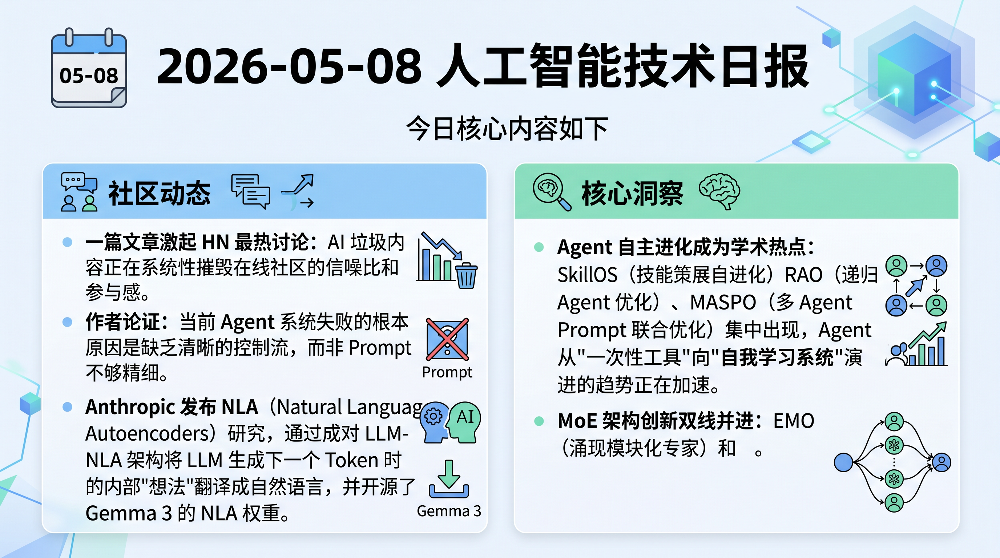

# 破晓 PoXiao 早报 - 2026-05-08

> 数据来源：真实抓取 · 477 条原始内容 · 生成时间：2026-05-08 10:40 UTC+8

---

## 📡 学术概览

### 🔴 Tier 1 - 范式突破/极高热度

1. **AI Co-Mathematician: Accelerating Mathematicians with Agentic AI**

   🔬 领域：AI for Automated Research · 多 Agent 系统 · 热度：多关键词高频命中 · 来源：DeepMind 团队

   - **一句话核心贡献**：DeepMind 发布 AI 联合数学家，在 FrontierMath Tier 4 上得到 48% 的新高分，实现对开放性数学研究的端到端支持。
   - **摘要精译**：AI Co-Mathematician 是一个面向数学研究者的工作台，通过 AI 智能体协作支持开放式研究全流程，包括假设生成、文献检索、计算探索、定理证明和理论构建。系统提供异步、有状态的工作空间，能够管理不确定性、细化用户意图、追踪失败假设并输出原生数学制品。在 FrontierMath Tier 4 基准上得分 48%，创所有 AI 系统评估的历史新高，并已帮助研究者解决开放性问题、发现新研究方向和挖掘被忽视的文献引用。

   

   
💡 展开详情（方法论 + 实验）

   - **核心创新点**：
     1. 异步有状态工作台，镜像人类协作研究工作流
     2. 多 Agent 协作：支持假设生成、计算探索、定理证明并行推进
     3. 失败假设追踪与意图细化机制，减少人工重复
   - **实验结果**：FrontierMath Tier 4 得分 48%，为所有已评估 AI 系统的最高分
   - **局限性**：目前集中于数学领域，对物理/化学等其他科学领域的迁移能力有待验证
   - **链接**：https://arxiv.org/abs/2605.06651v1

   

2. **SkillOS: Learning Skill Curation for Self-Evolving Agents**

   🔬 领域：多 Agent 系统 · LLM Agent 自进化 · 热度：多平台高频命中

   - **一句话核心贡献**：通过强化学习驱动的技能策展机制，使 LLM Agent 从过去交互中蒸馏出可复用技能，实现真正的自进化。
   - **摘要精译**：SkillOS 提出了一种基于经验驱动 RL 训练的技能策展学习框架，用于解决 LLM Agent 无法从历史交互中学习的难题。框架将冻结的 Agent 执行器与可训练的技能策展器配对，策展器从累积经验中持续更新外部 SkillRepo。通过复合奖励设计和基于技能相关任务依赖的分组任务流训练，在多轮 Agent 任务和单轮推理任务上均超越了无记忆和有记忆的强基线。学习到的技能策展器可跨不同 Agent 执行器和任务域泛化，SkillRepo 中的技能随时间演化成更富结构化的 Markdown 文件，编码更高级别的元技能。

   

   
💡 展开详情（方法论 + 实验）

   - **核心创新点**：
     1. 经验驱动 RL 训练配方：通过延迟奖励信号训练长周期策展策略
     2. 复合奖励 + 基于技能相关任务依赖的分组任务流设计
     3. 技能自动进化：SkillRepo 内容随时间演化为高级元技能
   - **实验结果**：在多轮 Agent 任务和单轮推理任务上均超越无记忆和强记忆基线，技能策展器跨执行器后台和任务域泛化
   - **局限性**：外部 SkillRepo 的规模扩展和检索效率有待优化
   - **链接**：https://arxiv.org/abs/2605.06614v1

   

3. **Recursive Agent Optimization (RAO)**

   🔬 领域：多 Agent 系统 · 推理能力 · 推理时扩展 · 热度：多关键词高频命中

   - **一句话核心贡献**：提出递归 Agent 优化框架，训练能够递归生成并委托子任务给自身实例的 Agent，实现分治式推理时扩展。
   - **摘要精译**：RAO 是一种强化学习方法，用于训练递归 Agent：这类 Agent 能够递归地生成新的自身实例并向其委托子任务。递归 Agent 实现了一种推理时扩展算法，通过分治策略自然地扩展到更长上下文并泛化到更难的问题。RAO 教会模型何时以及如何进行委托和通信，训练得到的递归 Agent 具有更好的训练效率，可扩展到超出模型上下文窗口的任务，在比训练任务难得多的场景上泛化，并与单 Agent 系统相比缩短了挂钟时间。

   

   
💡 展开详情（方法论 + 实验）

   - **核心创新点**：
     1. 递归自委托机制：Agent 可生成自身实例并委托子任务，天然实现分治
     2. 推理时扩展：通过递归深度扩展，突破单次推理的上下文限制
     3. 跨难度泛化：训练于简单任务的 Agent 可泛化到更难的任务
   - **实验结果**：训练效率提升，可扩展到超出上下文窗口的任务，泛化能力和挂钟时间均优于单 Agent 系统
   - **局限性**：递归深度的控制和终止条件设计有潜在复杂性
   - **链接**：https://arxiv.org/abs/2605.06639v1

   

4. **MASPO: Joint Prompt Optimization for LLM-based Multi-Agent Systems**

   🔬 领域：多 Agent 系统 · Prompt 优化 · 热度：高频命中

   - **一句话核心贡献**：提出 MASPO 框架，通过联合评估机制自动迭代优化多 Agent 系统中所有 Agent 的 Prompt，平均准确率提升 2.9 个点。
   - **摘要精译**：MASPO 是针对 LLM 多 Agent 系统（MAS）的 Prompt 联合优化框架，解决多 Agent 交互中局部 Agent 目标与整体系统目标错位的核心难题。框架的关键创新是联合评估机制：不仅评估本地 Prompt 的有效性，还评估其促进下游 Agent 成功的能力，无需 Ground-Truth 标签即可弥合局部交互与全局结果的差距。配合数据驱动的进化 Beam Search，在 6 个多样化任务上的实验表明，MASPO 始终优于最先进的 Prompt 优化方法，平均准确率提升 2.9 个点。

   

   
💡 展开详情（方法论 + 实验）

   - **核心创新点**：
     1. 联合评估机制：跨 Agent 下游成功率驱动 Prompt 更新
     2. 无需 Ground-Truth 标签的全局目标对齐
     3. 数据驱动进化 Beam Search：高效搜索高维 Prompt 空间
   - **实验结果**：6 个多样化任务上平均准确率提升 2.9 个点，超越 SOTA Prompt 优化方法
   - **局限性**：联合评估的计算开销随 Agent 数量增加
   - **链接**：https://arxiv.org/abs/2605.06623v1

   

5. **POPO: Positive-Only Policy Optimization (Beyond Negative Rollouts)**

   🔬 领域：后训练 & 对齐 · 推理能力 · 热度：多关键词命中

   - **一句话核心贡献**：提出仅用正样本 Rollout 的 RLVR 框架 POPO，通过隐式负梯度机制超越 GRPO，在 AIME 2025 上以 Qwen-Math-7B 达到 36.67%。
   - **摘要精译**：RLVR（可验证奖励强化学习）已成为提升 LLM 推理能力的主流范式。POPO 提出一种新颖框架：仅通过在线正样本 Rollout 进行学习，利用正样本集上的有界重要性采样替代 GRPO 中的正负 Rollout 对比。隐式负梯度通过 Rollout 重新分配自然涌现，无需分离的负样本提供梯度指导。POPO 通过孪生策略网络 + 动量自适应律稳定策略演化，在 Qwen 家族模型上的数学推理基准实验中，Qwen-Math-7B 在 AIME 2025 上达到 36.67%，显著超越 GRPO 的 30.00%。

   

   
💡 展开详情（方法论 + 实验）

   - **核心创新点**：
     1. 仅正样本 Rollout 学习：无需负样本，通过 Rollout 重分配涌现隐式负梯度
     2. 孪生策略网络 + 动量自适应律：稳定策略进化
     3. 有界相似度惩罚替代 KL 散度
   - **实验结果**：Qwen-Math-7B 在 AIME 2025 上达到 36.67%，超越 GRPO 30.00%；在多级数学基准上均达到可比或更优性能
   - **局限性**：仅在数学推理任务上验证，其他领域泛化性有待确认
   - **链接**：https://arxiv.org/abs/2605.06650v1

   

6. **EMO: Pretraining Mixture of Experts for Emergent Modularity**

   🔬 领域：基础大模型 & 预训练 · MoE 架构 · 热度：多关键词高频命中

   - **一句话核心贡献**：EMO 通过文档边界约束 Expert 路由，使 MoE 模型的专家子集涌现出语义级模块化，实现仅用 25% 专家就能保持完整性能的内存高效部署。
   - **摘要精译**：当前 MoE 模型在限制某领域只用部分专家推理时会严重退化，限制了内存受限场景的实用性。EMO 的核心思想是让同一文档中的 Token 倾向于依赖相同专家池，不同文档可使用不同池。这个简单约束使专家分组在预训练中仅通过文档边界自发涌现。对 1B 活跃参数、14B 总参数的 EMO 在 1T Token 上预训练，作为完整模型时匹配标准 MoE 性能；关键在于：保留 25%（12.5%）的专家仅导致 1%（3%）的绝对性能下降，而标准 MoE 在相同设置下直接崩溃。专家子集在语义层面（如数学、代码领域）实现专业化，不同于标准 MoE 的低级句法专业化。

   

   
💡 展开详情（方法论 + 实验）

   - **核心创新点**：
     1. 文档边界约束路由：同文档 Token 共享专家池，跨文档独立
     2. 语义级专家模块化：Expert 子集专注数学/代码等语义领域
     3. 内存高效部署：25% 专家即可保持完整性能的 99%
   - **实验结果**：1B-active/14B-total EMO 在 1T Token 上训练，保留 25% 专家仅下降 1%；标准 MoE 在相同设置下完全崩溃
   - **局限性**：文档边界约束在跨文档复合任务中的效果有待探讨
   - **链接**：https://arxiv.org/abs/2605.06663v1

   

7. **UniPool: A Globally Shared Expert Pool for Mixture-of-Experts**

   🔬 领域：基础大模型 & 预训练 · MoE 架构 · Transformer 架构 · 热度：高频命中

   - **一句话核心贡献**：UniPool 用全局共享专家池替代 MoE 的逐层独立专家，使专家参数不必随深度线性增长，在 5 个模型规模上一致改善困惑度。
   - **摘要精译**：现代 MoE 架构对每层分配独立专家集，导致专家参数随深度线性增长。UniPool 发现深层的路由可用随机路由替代而几乎无损（1.0-1.6 点），基于此提出全局共享专家池架构：所有层共享一个池，各层有独立路由器。引入池级辅助损失和 NormRouter 保证训练稳定性。在 5 个 LLaMA 架构规模（182M-978M 参数）上训练 30B Token，UniPool 一致改善困惑度；reduced-pool 变体仅用 41.6%-66.7% 的专家预算即可匹配或超越逐层 MoE，验证了专家参数可次线性增长。

   

   
💡 展开详情（方法论 + 实验）

   - **核心创新点**：
     1. 全局共享专家池：打破逐层独立专家的约束
     2. 池级辅助损失 + NormRouter：稳定共享池训练
     3. 专家参数次线性增长：deep scaling 更高效
   - **实验结果**：5 个规模（182M-978M）一致改善困惑度，reduced-pool 变体用 41.6%-66.7% 预算匹配逐层 MoE
   - **局限性**：共享池在超大规模（10B+）模型上的效果有待验证
   - **链接**：https://arxiv.org/abs/2605.06665v1

   

---

### 🟡 Tier 2 - 优秀经验/实用工具

1. **The Structural Origin of Attention Sink: Variance Discrepancy, Super Neurons, and Dimension Disparity**

   🔬 领域：Transformer 架构 · 机制解释 · 热度：中等

   - **一句话核心贡献**：从机制层面解释 LLM 注意力汇聚（Attention Sink）现象的根源：方差差异 → 超级神经元激活 → 维度不对称，并提出 head-wise RMSNorm 作为预训练架构修正。

   

   
💡 展开详情

   - **关键内容**：通过两个受控干预（注意力掩码修改 + 目标 Token 方差放大）验证了因果链，提出 head-wise RMSNorm 可在预训练中显著加速收敛
   - **链接**：https://arxiv.org/abs/2605.06611v1

   

2. **Long Context Pre-Training with Lighthouse Attention**

   🔬 领域：训练与推理框架 · 长序列训练 · 热度：中等

   - **一句话核心贡献**：提出 Lighthouse Attention，通过次二次复杂度的层次注意力算法加速超长序列预训练，训练期后可恢复为全注意力模型。

   

   
💡 展开详情

   - **关键内容**：对称压缩策略同时池化 Q/K/V，保持因果性；两阶段训练（大部分用 Lighthouse，尾部恢复全注意力）；小规模 LLM 预训练实验验证更快训练和更低 loss
   - **链接**：https://arxiv.org/abs/2605.06554v1

   

3. **BAMI: Training-Free Bias Mitigation in GUI Grounding**

   🔬 领域：多模态 & 视觉智能 · LLM Agent · 热度：高频命中

   - **一句话核心贡献**：提出无需训练的 BAMI 方法，通过粗到细聚焦 + 候选选择消除 GUI 定位中的分辨率偏差和歧义偏差，将 TianXi-Action-7B 在 ScreenSpot-Pro 上的准确率从 51.9% 提升至 57.8%。

   

   
💡 展开详情

   - **关键内容**：使用 MPD（掩码预测分布）归因方法定位误差来源；无训练设置；在多个 GUI 定位模型上验证鲁棒性
   - **链接**：https://arxiv.org/abs/2605.06664v1

   

4. **Verifier-Backed Hard Problem Generation for Mathematical Reasoning (VHG)**

   🔬 领域：后训练 & 对齐 · 推理能力 · 热度：中等

   - **一句话核心贡献**：提出三方自博弈框架 VHG，引入独立验证器约束问题生成有效性，解决 RLVR 训练中"奖励黑客"导致的无效难题生成问题。

   

   
💡 展开详情

   - **关键内容**：验证器（Hard 符号验证器 / Soft LLM 验证器）+ 求解器共同决定问题难度；在不定积分和通用数学推理任务上大幅超越所有基线
   - **链接**：https://arxiv.org/abs/2605.06660v1

   

5. **StraTA: Incentivizing Agentic RL with Strategic Trajectory Abstraction**

   🔬 领域：多 Agent 系统 · 后训练 & 对齐 · 热度：中等

   - **一句话核心贡献**：StraTA 在 Agentic RL 中引入显式轨迹级策略，在 ALFWorld 达 93.1%、WebShop 达 84.2%，在 SciWorld 以 63.5% 超越前沿闭源模型。

   

   
💡 展开详情

   - **关键内容**：从初始任务状态采样紧凑策略，后续动作以该策略为条件；层次 GRPO 风格 Rollout；在 ALFWorld/WebShop/SciWorld 上一致超越强基线
   - **链接**：https://arxiv.org/abs/2605.06642v1

   

---

## 🔥 社区速递

### 🔴 Tier 1 - 范式突破/极高热度

1. **AI slop is killing online communities**

   🔥 热度信号：HN Score 471 | Comments 453 · 来源：HackerNews

   - **一句话核心**：一篇文章激起 HN 最热讨论：AI 垃圾内容正在系统性摧毁在线社区的信噪比和参与感。
   - **核心共识**：AI 生成内容大量涌入讨论区、问答站和创作平台，内容质量急剧下降，真实社区成员被迫离开。
   - **主要争议/踩坑**：如何区分"AI 辅助"和"AI 垃圾"尚无共识；平台审核压力极大但工具滞后。
   - 🔗 [AI slop is killing online communities](https://rmoff.net/2026/05/06/ai-slop-is-killing-online-communities/)

2. **Agents need control flow, not more prompts**

   🔥 热度信号：HN Score 344 | Comments 186 · 来源：HackerNews

   - **一句话核心**：作者论证：当前 Agent 系统失败的根本原因是缺乏清晰的控制流，而非 Prompt 不够精细。
   - **核心共识**：Prompt 驱动的 Agent 在复杂任务中容易漂移和失控，显式控制流（如状态机、工作流引擎）是可靠 Agent 的关键基础设施。
   - **主要争议/踩坑**：控制流增加工程复杂度，与"自然语言编程"的愿景存在张力；大量评论在讨论何时用 Prompt、何时用代码。
   - 🔗 [Agents need control flow, not more prompts](https://bsuh.bearblog.dev/agents-need-control-flow/)

3. **Natural Language Autoencoders: Turning Claude's Thoughts into Text（Anthropic）**

   🔥 热度信号：HN Score 206 | Comments 69 · 来源：HackerNews + Reddit LocalLLaMA

   - **一句话核心**：Anthropic 发布 NLA（Natural Language Autoencoders）研究，通过成对 LLM-NLA 架构将 LLM 生成下一个 Token 时的内部"想法"翻译成自然语言，并开源了 Gemma 3 的 NLA 权重。
   - **核心共识**：这是 LLM 可解释性的重要突破，让"读懂模型想法"成为可能。
   - **主要争议/踩坑**：NLA 输出的是近似表示还是真实内部状态？因果性与相关性的争论持续存在。
   - 🔗 [Natural Language Autoencoders](https://www.anthropic.com/research/natural-language-autoencoders)

4. **AlphaEvolve: Gemini-powered Coding Agent Scaling Impact across Fields（Google DeepMind）**

   🔥 热度信号：HN Score 247 | Comments 104 · 来源：HackerNews

   - **一句话核心**：Google DeepMind 发布 AlphaEvolve，基于 Gemini 的编码 Agent + 进化算法，在矩阵乘法、芯片设计、编译器优化等多个科学领域取得超越人类的实际突破，已在 Google 生产环境落地。
   - **核心共识**：AI for Science 的里程碑，进化算法 + LLM 的组合威力巨大。
   - **主要争议/踩坑**：可解释性和可复现性受限于 Google 内部工具链；开源计划未明。
   - 🔗 [AlphaEvolve: Gemini-powered coding agent](https://deepmind.google/blog/alphaevolve-impact/)

5. **DeepSeek 4 Flash local inference engine for Metal**

   🔥 热度信号：HN Score 306 | Comments 88 · 来源：HackerNews

   - **一句话核心**：antirez（Redis 作者）开发的 DeepSeek 4 Apple Silicon Metal 本地推理引擎在 HN 引发热议，展示了个人开发者推动本地推理的技术活力。
   - **核心共识**：Apple Silicon 本地 LLM 推理生态持续繁荣，社区开发者效率极高。
   - **主要争议/踩坑**：Metal 后端性能与 CUDA 仍有差距；跨平台兼容性有限。
   - 🔗 [DeepSeek 4 Flash inference engine](https://github.com/antirez/ds4)

---

### 🟡 Tier 2 - 优秀经验/实用工具

1. **Multi-Token Prediction (MTP) for LLaMA.cpp - Gemma 4 speedup by 40%**

   🔥 热度信号：社区讨论热 · 来源：Reddit LocalLLaMA

   - **一句话核心**：为 LLaMA.cpp 实现多 Token 预测（MTP），量化 Gemma 4 在 MacBook Pro M5Max 上推理速度提升 40%（97 → ~136 tokens/s）。
   - **核心共识**：Speculative Decoding 进一步成熟，Apple Silicon 本地推理体验快速改善。
   - **主要争议/踩坑**：MTP 对不同模型架构的加速效果差异较大。
   - 🔗 [MTP for LLaMA.cpp](https://www.reddit.com/r/LocalLLaMA/comments/1t6se6r/multitoken_prediction_mtp_for_llamacpp_gemma_4/)

2. **AMD Intros Instinct MI350P Accelerator: CDNA 4 Comes to PCIe Cards**

   🔥 热度信号：社区讨论热 · 来源：Reddit LocalLLaMA

   - **一句话核心**：AMD 推出 Instinct MI350P，基于 CDNA 4 架构的 PCIe 推理卡，面向企业 AI 部署，为本地大模型玩家提供新硬件选项（价格和发货时间未公布）。
   - **核心共识**：AMD GPU 生态持续完善，对 NVIDIA 的竞争压力加大。
   - **主要争议/踩坑**：ROCm 软件栈成熟度仍是最大痛点，训练支持讨论热度明显。
   - 🔗 [AMD MI350P Accelerator](https://www.reddit.com/r/LocalLLaMA/comments/1t6b2x8/amd_intros_instinct_mi350p_accelerator_cdna_4/)

3. **Xiaomi MiMo V2.5: 310B 稀疏 MoE + 1M 上下文 + 多模态**

   🔥 热度信号：社区讨论中等 · 来源：Reddit LocalLLaMA

   - **一句话核心**：小米发布 MiMo V2.5，310B 总参数 / 15B 激活参数的稀疏 MoE，支持 1M Token 上下文，集成视觉/音频/文本多模态。
   - **核心共识**：国内大厂开源模型能力持续追赶，MoE + 长上下文组合成标配。
   - **主要争议/踩坑**：74GB 量化版本对消费级硬件仍有较高门槛。
   - 🔗 [MiMo V2.5](https://www.reddit.com/r/LocalLLaMA/comments/1t67lvx/feat_add_mimo_v25_model_support_by_aessedai_pull/)

4. **Dirtyfrag: Universal Linux LPE（本地提权漏洞）**

   🔥 热度信号：HN Score 445 | Comments 198 · 来源：HackerNews

   - **一句话核心**：Linux 内核发现通用本地提权漏洞 Dirtyfrag，HN 评论区热议影响范围和修复时间线。
   - **核心共识**：内核安全领域重大事件，影响广泛 Linux 部署。
   - **主要争议/踩坑**：影响版本范围和打补丁优先级各平台有差异。
   - 🔗 [Dirtyfrag: Universal Linux LPE](https://www.openwall.com/lists/oss-security/2026/05/07/8)

---

## 💰 财经简报

1. **Cloudflare 宣布全球裁员 1,100+ 人（约占员工总数 15%）**

   - **摘要**：Cloudflare 在题为 "Building for the Future" 的博客中宣布裁员，约 1,100 人受影响，占全球约 7,200 名员工的 15%。公司将此定位为为未来增长优化运营结构，HN 同期报道此事引发大量讨论（Score: 282, Comments: 164）。
   - **链接**：https://blog.cloudflare.com/building-for-the-future/

2. **Microsoft 预计未来几季度员工数量下降（AI 驱动裁员信号）**

   - **摘要**：微软 CFO Amy Hood 在财报中表示，公司将持续演进运营模式以提升节奏和敏捷性，预计员工人数在未来几个季度将有所下降。这被广泛解读为 AI 替代人力的大厂信号。
   - **链接**：https://www.reddit.com/r/cscareerquestions/comments/1t6jvcm/microsoft_expects_headcount_to_decrease_in_coming/

3. **Mozilla 采用 AI（Mythos）进行漏洞发现，271 个漏洞几乎零误报**

   - **摘要**：Mozilla 表示已"完全投入" Mythos AI 辅助漏洞发现工具，该工具在 Firefox 代码库中发现 271 个漏洞，"几乎无误报"。这标志着大型开源项目系统性采用 AI 安全审计。
   - **链接**：https://arstechnica.com/information-technology/2026/05/mozilla-says-271-vulnerabilities-found-by-mythos-have-almost-no-false-positives/

---

## 🏢 职场动态

> 覆盖 AI 就业市场、大厂裁员/扩招、薪资趋势、行业政策

1. **Cloudflare 全球裁员 1,100+ 人（约 15% 员工）**

   - **摘要**：根据 LinkedIn 数据，Cloudflare 约有 7,200 名员工，此次裁员约 15%。裁员原因与 AI 化转型和效率优化有关，Reddit 职场社区引发大量讨论。
   - **来源**：https://www.reddit.com/r/cscareerquestions/comments/1t6nfcw/cloudflare_to_lay_off_1100_globally/

2. **Microsoft 明确表示未来将持续减少员工人数**

   - **摘要**：微软 CFO 财报表态预计未来几季度员工数下降，引发科技求职者担忧。大厂通过 AI 实现"更少人做更多事"趋势明确。
   - **来源**：https://www.reddit.com/r/cscareerquestions/comments/1t6jvcm/microsoft_expects_headcount_to_decrease_in_coming/

3. **"AI isn't going to take your job" vs. 企业用 AI 裁员的语言伤害**

   - **摘要**：多个热帖讨论企业在裁员公告中吹嘘 AI 化带来了"美好的裁员机会"，被认为极度不尊重员工。求职者对"AI 不会取代你，用 AI 的人会取代你"等表述深感不满。
   - **来源**：https://www.reddit.com/r/cscareerquestions/comments/1t6r2vv/the_way_companies_talk_about_ai_and_layoffs_is/

4. **南非政府 AI 幻觉事件：两名移民官员因使用 AI 虚假结论被停职**

   - **摘要**：南非内政部两名官员因在官方文件中引用 AI"幻觉"内容而被停职，这是 AI 生成内容被滥用于政府决策的典型负面案例。
   - **来源**：https://www.citizen.co.za/news/home-affairs-officials-suspended-ai-hallucinations/

---

## 📊 今日总结

1. **Agent 自主进化成为学术热点**：SkillOS（技能策展自进化）、RAO（递归 Agent 优化）、MASPO（多 Agent Prompt 联合优化）集中出现，Agent 从"一次性工具"向"自我学习系统"演进的趋势正在加速。

2. **MoE 架构创新双线并进**：EMO（涌现模块化专家）和 UniPool（全局共享专家池）从不同方向挑战 MoE 逐层独立专家的惯例，内存高效部署的 MoE 时代正在到来。

3. **AI 裁员浪潮加速，科技就业市场承压**：Cloudflare 裁员 15%、微软明确预告员工数下降，AI 驱动的人力压缩从趋势变为现实；企业将裁员包装为"AI 战略成功"的表述引发强烈反弹。

4. **AI 可解释性迎来突破**：Anthropic NLA 开放 LLM 内部思考翻译，Attention Sink 机制被从根本上解释清楚，AI 黑盒的"玻璃屋化"趋势持续深化。

5. **本地推理生态爆发**：LLaMA.cpp MTP 加速 40%、DeepSeek 4 Metal 引擎、AMD MI350P PCIe 卡、Apple Silicon 最快 AI 引擎接连出现，2026 年本地 LLM 推理正进入"消费级可用"阶段。

---

**生成时间**：2026-05-08 10:40 CST
**数据来源**：briefs/2026-05-08/raw_context.md（真实抓取，477 条）
**配置文件**：profiles/profile_demo.yaml
**抓取时间**：2026-05-08 02:54 UTC
