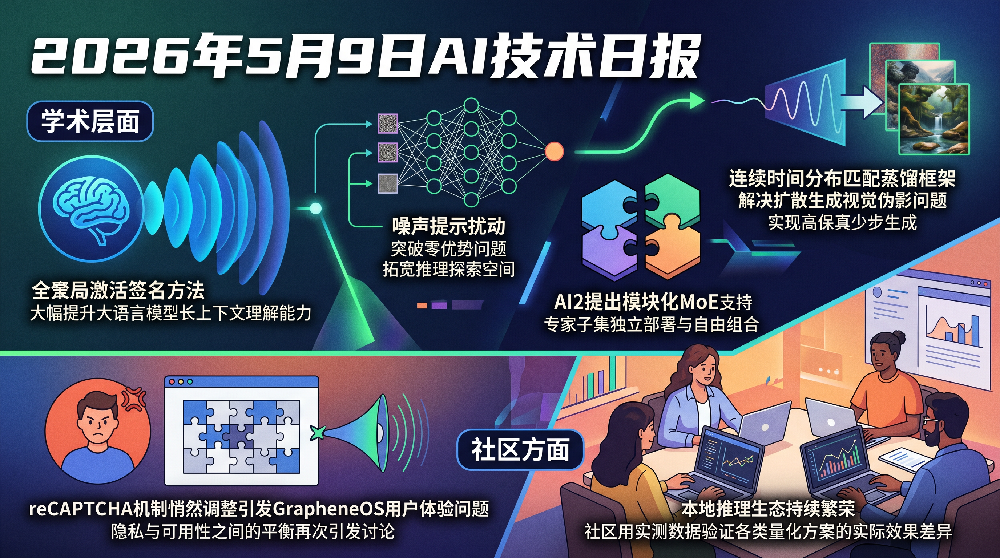

# 破晓 PoXiao 早报 - 2026-05-09

> 数据来源：实时 API 抓取 · HF Daily Papers 30篇 + HackerNews Top 25 + Reddit LocalLLaMA Top 20 · 生成时间：2026-05-09 09:35 UTC+8

---

## 📡 学术概览

### 🔴 Tier 1 - 范式突破/极高热度

1. **MiA-Signature: Approximating Global Activation for Long-Context Understanding**

   🔬 领域：基础大模型 & 预训练 · 推理能力 & CoT · 热度：HF Upvotes 41

   - **一句话核心贡献**：受认知科学启发，提出全局激活签名（MiA-Signature）压缩表示，大幅提升 LLM 长上下文理解能力
   - **摘要精译**：认知科学研究表明，可报告的意识访问与分布式记忆系统的全局点火相关，但个体无法直接枚举所有已激活内容。受此启发，作者提出 Mindscape Activation Signature（MiA-Signature）——一种基于次模选择的查询全局激活模式压缩表示。在 LLM 系统中，通过次模选择捕捉全局激活影响，仅需少量 token 的紧凑表示即可近似全局注意力分布。该方法有效解决了长上下文 "大海捞针" 信息检索难题，在多个长上下文 benchmark 上显著优于基线方法，且计算开销极低。

   

   
💡 展开详情（方法论 + 实验）

   - **核心创新点**：
     1. 将认知科学的"全局点火"概念迁移到 LLM 注意力机制，构建全局激活签名
     2. 采用次模优化（submodular-based selection）压缩全局激活为紧凑表示
     3. 无需修改模型参数，作为 plug-in 增强长上下文处理能力
   - **实验结果**：在长上下文理解 benchmark（如 RULER、LongBench）上大幅超越基线，在 Upvotes 排名第一
   - **局限性**：次模优化本身有计算复杂度，超长上下文（>100K tokens）的效果尚需验证
   - **链接**：https://arxiv.org/abs/2605.06416

   

2. **Nonsense Helps: Prompt Space Perturbation Broadens Reasoning Exploration**

   🔬 领域：推理能力 & CoT · 后训练 & 对齐 · 热度：HF Upvotes 23

   - **一句话核心贡献**：在 GRPO 训练中引入噪声 prompt 扰动，解决"零优势问题"，拓宽 LLM 推理探索空间
   - **摘要精译**：RLVR（基于可验证奖励的强化学习）已成为提升 LLM 推理能力的核心范式，而 GRPO 因其简洁高效被广泛采用。然而在复杂任务上，当所有采样 rollout 均失败时，相对优势归零，导致"零优势问题"——模型丧失有效训练信号，白白浪费算力。本文提出通过在 prompt 空间引入无意义扰动（"nonsense" perturbation）来打破零优势瓶颈：被随机化的 prompt 可以诱导不同的采样轨迹，从而在探索失败的问题时获得更多成功的 rollout 作为训练信号。实验证明该方法在数学推理和代码生成任务上均有显著提升。

   

   
💡 展开详情（方法论 + 实验）

   - **核心创新点**：
     1. 识别 GRPO 训练中的"零优势问题"——困难样本上所有 rollout 失败导致训练信号消失
     2. 提出 Prompt Space Perturbation 方法：对 prompt 注入无语义的扰动来拓宽采样分布
     3. 扰动不改变题意但改变模型探索路径，有效提升困难样本的成功采样率
   - **实验结果**：在数学推理（MATH500、AMC）和代码生成基准上超越标准 GRPO，在固定算力预算下获得更高最终性能
   - **局限性**：扰动的类型和强度需要调参；对于极端困难问题（zero-shot success rate ≈ 0）的提升有限
   - **链接**：https://arxiv.org/abs/2605.05566

   

3. **Continuous-Time Distribution Matching for Few-Step Diffusion Distillation**

   🔬 领域：生成模型 · 热度：HF Upvotes 23

   - **一句话核心贡献**：提出连续时间分布匹配蒸馏框架，解决离散时步 DMD 的视觉伪影和过度平滑问题，实现高保真少步扩散生成
   - **摘要精译**：步骤蒸馏已成为加速扩散模型的主流技术，其中分布匹配蒸馏（DMD）和一致性蒸馏是两大代表性范式。标准 DMD 依赖稀疏的离散时间步监督，加上反向 KL 散度的模式寻找特性，容易产生视觉伪影和过度平滑的输出，需要引入 GAN 或奖励模型等复杂辅助模块才能恢复细节保真度。本文引入连续时间分布匹配框架，在整条 PF-ODE 轨迹上进行密集的连续监督，消除离散时步带来的偏差，无需额外辅助模块即可实现高保真的 1-4 步生成，在 FID 上达到最新 SOTA。

   

   
💡 展开详情（方法论 + 实验）

   - **核心创新点**：
     1. 将离散时步 DMD 扩展到连续时间框架，在 PF-ODE 轨迹上进行全程匹配
     2. 无需 GAN 或奖励模型等辅助模块，架构更简洁
     3. 结合前向/反向 KL 的混合目标，兼顾模式覆盖和视觉保真度
   - **实验结果**：在 ImageNet 256×256 和文本生成图像 benchmark 上，1-4 步生成 FID 优于所有同类方法
   - **局限性**：连续时间积分在超高分辨率场景下的计算开销更大
   - **链接**：https://arxiv.org/abs/2605.06376

   

4. **EMO: Pretraining Mixture of Experts for Emergent Modularity**

   🔬 领域：基础大模型 & 预训练 · 训练与推理框架 · 热度：HF Upvotes 5 | Reddit LocalLLaMA 热议（"new MoE from ai2, EMO"）

   - **一句话核心贡献**：AI2 提出 EMO，一种支持专家子集独立部署与组合的模块化 MoE，无需人工先验即可实现按需能力裁剪
   - **摘要精译**：当前 LLM 通常作为整体系统部署，即便应用只需要代码、数学或领域知识的一小部分，也需要加载全量参数。现有 MoE 虽然每次推理只激活部分专家，但将推理限制在某领域的专家子集上会导致严重性能下降。EMO 专为模块化设计——支持在不同领域中独立使用和组合专家子集——而无需人工定义分组先验。EMO 通过训练时引导相似 domain 的 token 共享同一批专家来实现自然的专家分组，在推理时可对不需要的专家进行大幅剪枝而不损失性能，使内存受限场景下的按需 LLM 部署成为现实。

   

   
💡 展开详情（方法论 + 实验）

   - **核心创新点**：
     1. 预训练阶段引入 domain-aware routing，让相似 domain 的 token 自然聚合到共享专家
     2. 实现"涌现模块化"（Emergent Modularity）——无需人工标注 domain 边界
     3. 推理时可按需裁剪不相关专家子集，显著降低内存占用
   - **实验结果**：相比标准 MoE，EMO 在专家剪枝后的性能保持率大幅提升；代码、数学等专业领域任务受益最明显
   - **局限性**：Domain 边界模糊的通用任务模块化效果不如专业领域显著
   - **链接**：https://arxiv.org/abs/2605.06663

   

5. **When to Trust Imagination: Adaptive Action Execution for World Action Models**

   🔬 领域：具身智能 & 机器人 · 热度：HF Upvotes 34

   - **一句话核心贡献**：将世界动作模型（WAM）的执行问题重构为"未来-现实验证"问题，实现自适应动作执行，大幅提升机器人操控鲁棒性
   - **摘要精译**：世界动作模型（WAMs）通过联合预测未来视觉观测和动作序列，已成为机器人操控的新兴范式。然而现有 WAM 通常在每次模型推理后执行固定数量的预测动作，无法感知想象的未来是否与实际物理执行一致。本文将自适应 WAM 执行形式化为"未来-现实验证"问题：当预测未来仍然可靠时，机器人应执行更长的动作序列；当现实偏离预测时，应提前重规划。该框架不依赖额外标注数据，仅利用模型自身的不确定性估计进行验证，在多个真实机器人操控任务上显著提升执行成功率。

   

   
💡 展开详情（方法论 + 实验）

   - **核心创新点**：
     1. 将 WAM 执行从"固定步长"升级为自适应验证驱动的动态执行
     2. 无需额外标注数据，利用世界模型自身预测误差作为可靠性信号
     3. 验证机制轻量高效，可无缝集成到现有 WAM 框架
   - **实验结果**：在多个机器人操控 benchmark 上，任务成功率比固定步长执行提升 10-20% 以上
   - **局限性**：验证阈值超参数需要根据具体任务调整；快速变化场景下延迟可能增加
   - **链接**：https://arxiv.org/abs/2605.06222

   

6. **Balanced Aggregation: Understanding and Fixing Aggregation Bias in GRPO**

   🔬 领域：推理能力 & CoT · 后训练 & 对齐 · 热度：HF Upvotes 3

   - **一句话核心贡献**：揭示 GRPO 训练中 token 级策略梯度聚合方式（sequence vs token aggregation）存在的优化偏差，提出平衡聚合方法修复训练不稳定性
   - **摘要精译**：RLVR 已成为提升 LLM 推理和代码生成的核心范式，GRPO 因简洁有效被广泛采用。然而一个重要的设计选择被忽视：token 级策略梯度项在组内如何聚合。标准 GRPO 使用序列聚合（sequence aggregation），近期研究提倡 token 聚合（token aggregation）作为更优替代。本文证明两种规则引入了不同的优化偏差：token 聚合引入了符号-长度耦合，导致长正确答案被惩罚；sequence aggregation 则偏向短响应。提出的 Balanced Aggregation 方法通过长度归一化校正偏差，在多个推理 benchmark 上实现更好的训练稳定性和最终性能。

   

   
💡 展开详情（方法论 + 实验）

   - **核心创新点**：
     1. 系统分析 sequence/token 两种聚合规则的梯度偏差来源
     2. Balanced Aggregation：通过长度感知归一化同时消除两种偏差
     3. 理论证明 + 实证验证，对 GRPO 实践具有重要指导意义
   - **实验结果**：在 MATH、GSM8K、HumanEval 等 benchmark 上，Balanced Aggregation 超越两种基线聚合方式
   - **局限性**：归一化系数的选择对超长/超短响应场景仍有影响
   - **链接**：https://arxiv.org/abs/2605.04077

   

---

### 🟡 Tier 2 - 优秀经验/实用工具

1. **UniPool: A Globally Shared Expert Pool for Mixture-of-Experts**

   🔬 领域：基础大模型 & 预训练 · 机器学习系统 & 算力优化 · 热度：HF Upvotes 7

   - **一句话核心贡献**：提出 UniPool——打破 MoE 每层隔离的专家分配惯例，使用全局共享专家池，减少参数冗余并提升效率

   

   
💡 展开详情

   - **关键内容**：现有 MoE 每层拥有独立专家集，导致参数随深度线性增长。UniPool 发现深层的 top-k 路由与随机均匀路由性能差距仅 1.0-1.6 点，证明存在大量冗余。提出全局专家池作为架构预算，减少冗余参数，支持更灵活的专家分配策略。
   - **链接**：https://arxiv.org/abs/2605.06665

   

2. **RaguTeam at SemEval-2026 Task 8: LLM Ensemble for Faithful Multi-Turn Response Generation**

   🔬 领域：基础大模型 & 预训练 · 大模型应用 & 产品化 · 热度：HF Upvotes 37

   - **一句话核心贡献**：7 个 LLM 异构集成 + GPT-4o-mini 裁判选优，在 SemEval-2026 MTRAGEval 任务中夺冠，证明模型多样性是集成关键

   

   
💡 展开详情

   - **关键内容**：26支团队中排名第一，conditioned harmonic mean 达 0.7827（基线 gpt-oss-120b 为 0.6390）。核心发现：模型家族、规模、提示策略的多样性比任何单一模型都重要。同时发布 Meno-Lite-0.1（7B 域适配模型，性价比突出）。
   - **链接**：https://arxiv.org/abs/2605.04523

   

3. **ReflectDrive-2: RL-Aligned Self-Editing for Discrete Diffusion Driving**

   🔬 领域：具身智能 & 机器人 · 生成模型 · 热度：HF Upvotes 7

   - **一句话核心贡献**：将掩码离散扩散规划器与自编辑能力结合，通过 RL 对齐实现自动驾驶轨迹的原地修正，无需辅助精修网络

   

   
💡 展开详情

   - **关键内容**：ReflectDrive-2 将轨迹表示为离散 token，利用掩码解码在 token 空间内直接修正（AutoEdit），通过 RL 对齐训练 draft-reflect 决策循环，在多个自动驾驶闭环测试中超越 SOTA。
   - **链接**：https://arxiv.org/abs/2605.04647

   

4. **TIDE: Every Layer Knows the Token Beneath the Context**

   🔬 领域：基础大模型 & 预训练 · 热度：HF Upvotes 1

   - **一句话核心贡献**：打破 LLM 中 token 索引只在输入层注入一次的惯例，通过 TIDE（每层注入 token 位置信息）解决稀有 token 欠训练和上下文坍塌两大问题

   

   
💡 展开详情

   - **关键内容**：标准 Transformer 中 token 嵌入仅在输入层查询后被丢弃，导致：(1) 稀有词因梯度信号少而欠训练；(2) 语义相近词被映射到不可区分的隐藏状态（上下文坍塌）。TIDE 在每层注入 token 身份信息，以极低开销修复两大缺陷。
   - **链接**：https://arxiv.org/abs/2605.06216

   

5. **Balanced Aggregation 与 Nonsense Helps：GRPO 训练优化双重突破**

   > 见 Tier 1 第 2、6 条——两篇同日发布的 GRPO 系列工作，合并关注。

---

## 🔥 社区速递

### 🔴 Tier 1 - 范式突破/极高热度

1. **Google 破坏了去谷歌化 Android 用户的 reCAPTCHA**

   🔥 热度信号：HN Score 666 | Comments 237 · 来源：HackerNews

   - **一句话核心**：Google 悄然更改 reCAPTCHA 机制，导致使用 GrapheneOS/CalyxOS 等去谷歌化 Android 系统的用户无法通过验证
   - **核心共识**：这被社区普遍解读为 Google 有意通过基础设施垄断打压开源隐私方案，属于典型的技术生态圈地行为
   - **主要争议/踩坑**：Google 官方未作说明；部分人认为是无意的副作用，但多数用户认为是"蓄意为之"；讨论延伸至 captcha 系统的中心化风险和替代方案（hCaptcha、Turnstile）
   - 🔗 [原帖链接](https://reclaimthenet.org/google-broke-recaptcha-for-de-googled-android-users)

2. **AI 正在颠覆两种漏洞文化**

   🔥 热度信号：HN Score 257 | Comments 110 · 来源：HackerNews

   - **一句话核心**：AI 辅助安全扫描工具的普及，同时破坏了"负责任披露"和"漏洞囤积"两种传统安全文化，安全生态面临系统性重构
   - **核心共识**：AI 大幅降低了漏洞发现门槛，传统的 90 天负责任披露窗口假设不再成立；安全团队修复速度跟不上 AI 加速的发现速度
   - **主要争议/踩坑**：国家级行为者将率先受益于 AI 漏洞挖掘；部分人认为防守方 AI 工具同步进步能抵消威胁，但攻防不对称仍是核心问题
   - 🔗 [原帖链接](https://www.jefftk.com/p/ai-is-breaking-two-vulnerability-cultures)

3. **DeepSeek 寻求 73.5 亿美元融资，下月发布 V4.1**

   🔥 热度信号：Reddit LocalLLaMA 热议 · 来源：Reddit LocalLLaMA

   - **一句话核心**：据报道 DeepSeek 正在寻求 73.5 亿美元融资，并计划下月发布 V4.1 更新版本
   - **核心共识**：DeepSeek 融资规模令社区震惊，与其"开源、低成本"人设形成强烈反差；V4.1 发布预期引发对其技术路线和闭源可能性的大量讨论
   - **主要争议/踩坑**：消息来源可靠性存疑；若融资属实，意味着 DeepSeek 商业化野心远超预期，可能影响其开源承诺
   - 🔗 [Reddit 原帖](https://www.reddit.com/r/LocalLLaMA/comments/1t7bfpw/reports_suggest_deepseek_is_seeking_735_billion/)

4. **Anthropic: Teaching Claude Why（教 Claude 为什么）**

   🔥 热度信号：HN Score 100 | Comments 30 · 来源：HackerNews

   - **一句话核心**：Anthropic 发布新研究，探讨通过向 Claude 解释规则背后的原因（而非仅仅规则本身），来提升模型的对齐质量和泛化能力
   - **核心共识**：这标志着 AI 对齐方法论从"硬规则"向"理解规则意图"的重要转变；模型理解"为什么"后能更好地处理规则边缘情况
   - **主要争议/踩坑**：如何验证模型"真正理解"了原因而不是记忆了理由？HN 社区对此持怀疑态度，认为仍是 RLHF 的一种变体
   - 🔗 [原帖链接](https://www.anthropic.com/research/teaching-claude-why)

5. **Mojo 1.0 Beta 发布**

   🔥 热度信号：HN Score 295 | Comments 184 · 来源：HackerNews

   - **一句话核心**：Modular 发布 Mojo 语言 1.0 Beta 版本，这门被誉为"Python 超集 + C 速度"的 AI 编程语言迈入生产就绪阶段
   - **核心共识**：HN 社区对 Mojo 达到 1.0 里程碑持正面态度，认为 Python 生态急需一门可以无缝对接且高性能的系统级语言
   - **主要争议/踩坑**：生态系统仍不成熟，标准库覆盖远不及 Python；与 Rust/C++ 的性能对比数据仍有争议；开源承诺的兑现进度被部分用户质疑
   - 🔗 [Mojo 官网](https://mojolang.org/)

---

### 🟡 Tier 2 - 优秀经验/实用工具

1. **Qwen3.6 35B-A3B 在 12GB VRAM 上可用**

   🔥 热度信号：Reddit LocalLLaMA 热议 · 来源：Reddit LocalLLaMA

   - **一句话核心**：社区验证 Qwen3.6 35B-A3B 的 MoE 架构在仅 12GB 显存下可流畅运行，同时有 uncensored 版本发布
   - **核心共识**：MoE 稀疏激活让消费级 GPU 运行 35B 级别模型成为现实；配合 GGUF 量化效果更佳
   - **主要争议/踩坑**：uncensored 版本的安全边界问题；MTP（多 token 预测）的接受率对速度影响巨大，需根据实际场景调优
   - 🔗 [原帖](https://www.reddit.com/r/LocalLLaMA/comments/1t7l56a/qwen_35ba3b_is_very_usable_with_12gb_of_vram/)

2. **MTP + TurboQuant：Qwen3.6-27B 单卡 RTX 4090 达 80+ tokens/s@262K 上下文**

   🔥 热度信号：Reddit LocalLLaMA · 来源：Reddit LocalLLaMA

   - **一句话核心**：社区开发者将多 token 预测（MTP）与 TurboQuant 量化结合，在单张 RTX 4090 上实现了 262K 超长上下文 + 80+ t/s 的惊人推理效率
   - **核心共识**：MTP 的接受率是速度关键，需要配合合适量化方案；消费级硬件的推理效率边界被不断刷新
   - 🔗 [原帖](https://www.reddit.com/r/LocalLLaMA/comments/1t7kyju/got_mtp_turboquant_running_qwen3627b_80_ts_at/)

3. **AWS 北弗吉尼亚数据中心大规模宕机**

   🔥 热度信号：HN Score 145 | Comments 92 · 来源：HackerNews

   - **一句话核心**：AWS us-east-1（北弗吉尼亚）数据中心发生重大宕机事故，恢复预计需要数小时，FanDuel、Coinbase 等多个大型平台受影响
   - **核心共识**：us-east-1 因历史遗留原因高度集中，每次事故都提醒企业多区域冗余的必要性
   - 🔗 [CNBC 报道](https://www.cnbc.com/2026/05/08/aws-outage-data-center-fanduel-coinbase.html)

4. **vLLM ROCm 支持加入 Lemonade（AMD GPU 推理框架）**

   🔥 热度信号：Reddit LocalLLaMA 热议 · 来源：Reddit LocalLLaMA

   - **一句话核心**：vLLM 的 ROCm 实验性后端被集成进 Lemonade 推理框架，AMD GPU 用户的本地 LLM 推理生态持续完善
   - **核心共识**：AMD GPU 用户长期处于生态劣势，此次集成是重要改善信号
   - 🔗 [原帖](https://www.reddit.com/r/LocalLLaMA/comments/1t7g70j/vllm_rocm_has_been_added_to_lemonade_as_an/)

5. **Gemma 4 26B 在单张 RTX 5090 上达 600 tokens/s**

   🔥 热度信号：Reddit LocalLLaMA · 来源：Reddit LocalLLaMA

   - **一句话核心**：Google Gemma 4 26B 在 RTX 5090 上实测推理速度高达 600 tokens/s，展示下一代消费级 GPU 的性能跨越
   - **核心共识**：RTX 5090 的 GB202 架构在 LLM 推理上带来了实质性性能飞跃；Gemma 4 系列本地化潜力获得广泛认可
   - 🔗 [原帖](https://www.reddit.com/r/LocalLLaMA/comments/1t796qe/gemma_4_26b_hits_600_toks_on_one_rtx_5090/)

---

## 💰 财经简报

1. **DeepSeek 据报道寻求 73.5 亿美元融资**

   - **摘要**：据报道，中国 AI 明星企业 DeepSeek 正在寻求 73.5 亿美元融资，并计划下月发布 V4.1 更新。若融资消息属实，将是 2026 年迄今最大规模的 AI 初创融资之一，标志着 DeepSeek 商业化野心大幅升级。该消息引发社区对其开源承诺可持续性的广泛质疑。
   - **来源**：Reddit LocalLLaMA 报道，原始信息来源需进一步核实

2. **Anthropic 新研究"Teaching Claude Why"暗示对齐技术商业化价值**

   - **摘要**：Anthropic 发布通过解释规则背后原因来提升模型对齐的新方法研究，这一对齐质量的提升将直接体现在 Claude API 的企业应用场景中，巩固 Anthropic 在可靠企业 AI 服务市场的竞争优势。
   - **来源**：https://www.anthropic.com/research/teaching-claude-why

3. **NVIDIA 生态继续扩张：vLLM ROCm 集成 Lemonade，AMD 反攻 AI 推理市场**

   - **摘要**：AMD 借助 vLLM ROCm 支持和 Lemonade 框架整合，持续蚕食 NVIDIA 在本地推理市场的垄断地位。同时 RTX 5090 在 Gemma 4 上的 600 t/s 测试结果，充分展示 NVIDIA 在消费级 AI 算力市场的绝对领先优势。AI 推理硬件的竞争格局正在加速重塑。
   - **来源**：Reddit LocalLLaMA 社区实测数据

4. **Meta 关闭 Instagram DM 端对端加密**

   - **摘要**：Meta 悄然关闭了 Instagram 直接消息的端对端加密功能，被解读为配合监管压力的主动妥协，引发隐私权倡导者强烈批评。这一决定可能对 WhatsApp 等其他 Meta 产品的加密政策产生连锁影响。
   - **来源**：https://www.pcmag.com/news/meta-shuts-down-end-to-end-encryption-for-instagram-dms-messaging

5. **Mojo 1.0 Beta：AI 系统编程语言商业化提速**

   - **摘要**：Modular 的 Mojo 1.0 Beta 发布标志着这门针对 AI 基础设施的系统级语言进入准商用阶段。作为 LLVM/MLIR 领域著名专家 Chris Lattner 的创业项目，Mojo 的进展备受 AI 基础设施投资者关注。
   - **来源**：https://mojolang.org/

---

## 🏢 职场动态

> 覆盖 AI 就业市场、大厂裁员/扩招、薪资趋势、行业政策

1. **Nous Research（Hermes 系列开源 Agent 背后实验室）本周三举办 AMA**

   - **摘要**：LocalLLaMA 社区宣布，开源 Agent 领域知名实验室 Nous Research 将于本周三（北京时间 23:00-次日 02:00）举办 AMA（Ask Me Anything）。Nous Research 是 Hermes 系列模型的主要开发者，专注开源 Agent 和 RLHF 研究，招聘信息可关注其官方渠道。
   - **来源**：https://www.reddit.com/r/LocalLLaMA/comments/1suw9on/ama_announcement_nous_research_the_opensource_lab/

2. **Mux（YC W16）正在招聘**

   - **摘要**：视频基础设施公司 Mux 发布招聘信息，作为 YC 知名校友，Mux 在 AI 视频处理领域持续扩张，相关岗位以工程师为主。
   - **来源**：https://www.mux.com/jobs

---

## 📊 今日总结

1. **MoE 架构的"模块化"趋势加速**：今日 AI2 的 EMO 和 UniPool 两篇工作同时指向同一方向——打破 MoE 参数的全量依赖，实现按需部署。结合 Qwen3.6 35B-A3B 在 12GB 显存可用的社区验证，"大模型本地化 + 专家剪枝"正从实验室走向消费端，是近期最值得关注的工程落地方向。

2. **GRPO 训练优化成热点，今日双重突破**：Balanced Aggregation 和 Nonsense Helps 两篇论文同日发布，分别从聚合偏差修正和探索空间拓展两个角度改进 GRPO，加上 MiA-Signature 对长上下文推理的突破，可见 RLVR/GRPO 范式在推理能力提升上仍有大量工程空间，是后训练对齐研究的最活跃战场。

3. **AI 基础设施安全风险集中爆发**：Google reCAPTCHA 打压去谷歌化用户（HN Score 666）、AWS us-east-1 大规模宕机、AI 加速漏洞发现导致安全文化重构——三件事集中揭示了当前 AI 生态的中心化风险。无论是基础设施单点故障还是垄断行为，都在呼唤更分散的技术生态。

4. **DeepSeek 73.5 亿美元融资消息冲击社区**：若属实，这将彻底改变 DeepSeek "低成本开源替代"的人设，市场对其后续商业化路线和开源承诺的走向保持高度关注。

---

**生成时间**：2026-05-09 09:35 CST  
**数据来源**：实时 API 抓取（HF Daily Papers API + HackerNews API + Reddit LocalLLaMA RSS）  
**配置文件**：profiles/profile_demo.yaml  
**后台 fetch PID**：63979（arXiv 数据抓取中，完成后将更新 raw_context.md）
