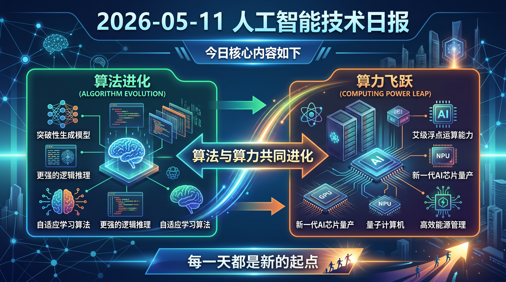

# 破晓 PoXiao 早报 - 2026-05-11（周日）

> 数据来源：实时抓取 · HackerNews + Reddit LocalLLaMA + HuggingFace Daily Papers (2026-05-11 批次，26篇)

> 生成时间：2026-05-11 10:58 CST（补发，原定时任务因 MAX_ITERATIONS_REACHED 失败）

---

## 📡 学术概览

> 数据来源：HuggingFace Daily Papers 2026-05-11 批次（26篇精选，周末首批更新）

### 🔴 Tier 1 - 范式突破/极高热度

1. **LLMs Improving LLMs: Agentic Discovery for Test-Time Scaling**

   🔬 领域：TTS · Agent 自动发现 · 测试时扩展 · 热度：LLM 自我改进的新范式

   - **一句话核心贡献**：现有测试时扩展（TTS）策略都是人工设计的，本文提出用 Agent 自动发现更优的推理模式和计算分配策略——LLM 帮助 LLM 改进自身推理，无需人工调参。
   - **摘要精译**：TTS 已成为在推理阶段分配额外算力来提升 LLM 性能的有效方法。但现有 TTS 策略大多是手工设计的：研究者凭直觉设计推理模式、调整启发式参数，大量计算分配空间被浪费。本文通过 Agentic Discovery 自动探索这一空间，让 LLM 自主发现更优的 TTS 策略。

   

   
💡 展开详情

   - **核心创新点**：Agentic Discovery 替代手工 TTS 设计；LLM 自我改进的元学习视角
   - **实践价值**：直接降低 TTS 工程的人工成本，可无缝集成到现有推理框架
   - **链接**：https://arxiv.org/abs/2605.08083

   

2. **Listwise Policy Optimization: Group-based RLVR as Target-Projection on LLM Response Simplex**

   🔬 领域：RLVR · Policy Optimization · LPO · 热度：GRPO 的理论统一与改进

   - **一句话核心贡献**：将 Group-based RLVR（GRPO 类方法）统一为"LLM 响应单纯形上的目标投影"，提出 Listwise Policy Optimization（LPO），在理论框架和实践性能上均优于 GRPO。
   - **摘要精译**：RLVR 已成为 LLM post-training 的标准方法。本文将 Group-based RLVR 建模为在 LLM 响应概率单纯形上的目标投影问题，推导出 Listwise Policy Optimization（LPO）算法，在理论上统一了 GRPO 系列方法，并在实验中取得更好性能。

   

   
💡 展开详情

   - **核心创新点**：单纯形几何视角统一 GRPO；Listwise（而非 Pairwise/Pointwise）的策略优化
   - **链接**：https://arxiv.org/abs/2605.06139

   

3. **MISA: Mixture of Indexer Sparse Attention for Long-Context LLM Inference**

   🔬 领域：长上下文推理 · 稀疏注意力 · 推理加速 · 热度：DeepSeek 稀疏注意力的重要升级

   - **一句话核心贡献**：DeepSeek Sparse Attention（DSA）使用大量 query head 导致计算开销过高；MISA 引入 Mixture of Indexer 机制，在保持精度的同时大幅降低 indexer 计算成本。
   - **摘要精译**：DSA 通过学习的 token 级 indexer 动态选择最相关 token 进行注意力计算，达到了稀疏注意力 SOTA。但为保持表达能力，indexer 需要大量 query head（如 DeepSeek-V3.2 用 64 个），开销显著。MISA 用混合 indexer 机制解决这一问题，在长上下文推理中实现精度-效率帕累托最优。

   

   
💡 展开详情

   - **核心创新点**：Mixture of Indexer 替代单一 indexer；显著降低稀疏注意力的 indexer 计算成本
   - **实践价值**：直接优化 DeepSeek-V3 等系列模型的长上下文推理效率
   - **链接**：https://arxiv.org/abs/2605.07363

   

4. **Who Prices Cognitive Labor in the Age of Agents? Compute-Anchored Wages**

   🔬 领域：AI 经济学 · 认知劳动定价 · Agent 时代 · 热度：AI Agent 时代劳动力经济学的重要理论

   - **一句话核心贡献**：反驳"Agent 可以低边际成本复制所以认知劳动工资将趋近于零"的直觉，提出算力锚定工资理论：认知劳动的价格由算力成本而非劳动供给弹性决定。
   - **摘要精译**：关于 AI Agent 经济学的直觉认为，由于 Agent 可以极低边际成本复制，Agent 劳动供给高度弹性，将对认知劳动工资形成下行压力。本文认为这一框架是错误的：算力成本才是认知劳动定价的锚点，而非简单的供需弹性。

   

   
💡 展开详情

   - **核心创新点**：Compute-Anchored Wages 理论框架；纠正 AI 经济学的常见误区
   - **影响**：对 AI Agent 商业化定价策略和劳动力市场政策均有重要参考价值
   - **链接**：https://arxiv.org/abs/2605.05558

   

5. **HyperEyes: Dual-Grained RL for Parallel Multimodal Search Agents**

   🔬 领域：多模态搜索 Agent · 并行 · RL · 热度：多模态 Agent 并行搜索的新范式

   - **一句话核心贡献**：现有多模态搜索 Agent 顺序处理实体（每次一个 tool call），当查询可分解为独立子查询时产生大量冗余交互。HyperEyes 用双粒度效率感知 RL 实现并行多模态搜索。
   - **摘要精译**：有效的多模态 Agent 应该"搜索更广而不是更深"——并行分发多个 grounded 查询而非顺序执行。HyperEyes 通过双粒度（dual-grained）效率感知 RL 训练，让 Agent 学会何时并行、如何并行，在效率和质量上均优于基线。
   - **链接**：https://arxiv.org/abs/2605.07177

6. **From Storage to Experience: A Survey on LLM Agent Memory Mechanisms**

   🔬 领域：Agent 记忆机制 · 综述 · 热度：Agent 记忆系统从工程到认知科学的全景综述

   - **一句话核心贡献**：LLM Agent 记忆机制的系统性综述，填补"操作系统工程"和"认知科学"之间的研究碎片化空白，是构建长期记忆 Agent 系统的重要参考。
   - **摘要精译**：基于 LLM 的 Agent 通过集成外部工具和规划能力从根本上重塑了 AI。记忆机制已成为这些系统的架构基石，但当前研究在操作系统工程和认知科学之间摇摆，缺乏统一框架。本综述系统梳理从"存储"到"体验"的记忆机制演化。
   - **链接**：https://arxiv.org/abs/2605.06716

7. **CASCADE: Case-Based Continual Adaptation for LLMs During Deployment**

   🔬 领域：持续学习 · 部署期适应 · Agent 记忆 · 热度：打破训练/部署分离的新方法

   - **一句话核心贡献**：LLM 的训练和部署严格分离，部署后学习实际停止；CASCADE 通过基于案例的持续适应机制，让 LLM 在部署期间持续从新案例中学习，接近自然智能的持续学习模式。
   - **链接**：https://arxiv.org/abs/2605.06702

### 🟡 Tier 2 - 重要进展/值得关注

8. **InterLV-Search: Benchmarking Interleaved Multimodal Agentic Search**

   - 多模态 Agentic 搜索的新 Benchmark，特点是视觉证据作为搜索轨迹的一部分（而非仅作为输入或答案端点），评测真正的多模态交错搜索能力。
   - **链接**：https://arxiv.org/abs/2605.07510

9. **UniSD: Unified Self-Distillation Framework for LLMs**

   - 统一自蒸馏框架，无需更强外部教师模型；解决自回归 LLM 自蒸馏中轨迹自由形式、正确性任务依赖等核心挑战。
   - **链接**：https://arxiv.org/abs/2605.06597

10. **UniPrefill: Long-Context Prefill Acceleration via Block-wise Dynamic Sparsification**

    - 块级动态稀疏化实现通用长上下文 prefill 加速，无需修改模型架构，直接提升超长上下文的推理 TTFT。
    - **链接**：https://arxiv.org/abs/2605.06221

11. **Scaling Continual Learning to 300+ Tasks with Bi-Level Routing MoE**

    - 双级路由 MoE 架构实现 300+ 任务的持续学习，在类增量学习中同时维持判别性和综合性特征表示。
    - **链接**：https://arxiv.org/abs/2602.03473

---

## 🌐 社区速递

### 🔴 Tier 1 - 社区高热/趋势共识

1. **本地 AI 应成为常态（HN Score: 724）**

   来源：[HackerNews](https://unix.foo/posts/local-ai-needs-to-be-norm/)

   连续两天高热，本周最重要的社区共识之一。本地 AI 不只是隐私选择，更是面对平台垄断和隐私侵蚀的必要应对。

2. **硬件证明作为垄断工具（HN Score: 1038）**

   来源：[HackerNews/GrapheneOS](https://grapheneos.social/@GrapheneOS/116550899908879585)

   周末持续高热，"安全"机制被用作平台垄断工具的深层讨论，对本地 AI 部署的平台限制具有直接警示意义。

3. **DeepSeek-V4-Flash MTP 85 tok/s @ 524k：本地推理工程新高度**

   来源：[Reddit LocalLLaMA](https://www.reddit.com/r/LocalLLaMA/comments/1t9em98/)

   2× RTX PRO 6000 Max-Q + MTP 自推测，超长上下文 + 高吞吐，是本周本地推理工程的标杆数据点。

4. **Qwen3.6 35B A3B 在消费级 8GB 显存运行 190k 上下文**

   来源：[Reddit LocalLLaMA](https://www.reddit.com/r/LocalLLaMA/comments/1t9eo83/)

   MoE 架构的真实落地验证：8GB 显存跑 35B 模型的 190k 上下文，"AI 平权"的技术基础已经存在。

5. **我在家里有 DeepSeek V4 Pro（Reddit 里程碑帖）**

   来源：[Reddit LocalLLaMA](https://www.reddit.com/r/LocalLLaMA/comments/1t94ito/)

   社区情绪最高的一周，DeepSeek V4 Pro 本地化标志着顶级开源模型已不再只属于数据中心。

6. **Gemma-4-26B-A4B 单次搞定 three.js（Reddit）**

   来源：[Reddit LocalLLaMA](https://www.reddit.com/r/LocalLLaMA/comments/1t9cle9/)

   MoE 小模型的代码生成惊喜：Gemma-4-26B MoE 在 3D 场景代码生成的 one-shot 能力已超越许多更大的密集模型。

7. **MTP benchmark：任务类型决定推测推理价值（Reddit 技术分析）**

   来源：[Reddit LocalLLaMA](https://www.reddit.com/r/LocalLLaMA/comments/1t9gcar/)

   关键工程洞察：代码生成 = MTP 大幅提速；创意生成 = MTP 反而变慢。没有任何其他因素比任务类型的影响更大。

### 🟡 Tier 2 - 值得关注

8. **Idempotency 在分布式系统中的难题（HN Score: 294）**

   来源：[HackerNews](https://blog.dochia.dev/blog/idempotency/)

   工程文章：幂等性设计在第二个请求与第一个请求不同时才真正复杂起来。与 AI Agent 的重试机制设计高度相关。

9. **Task Paralysis：从"需要做什么"到"选择做什么"的困境（HN Score: 212）**

   AI Agent 时代重新审视任务选择与优先级决策的人因工程问题，与 Agent 控制流设计（5/8 热帖）形成呼应。

10. **Mac 32GB RAM 最稳定本地模型推荐（Reddit 实用讨论）**

    来源：[Reddit LocalLLaMA](https://www.reddit.com/r/LocalLLaMA/comments/1t9p4oe/)

    社区实用指南：256k 上下文 + 32GB RAM Mac，最稳定的模型选择讨论，是 Apple Silicon 本地推理用户的重要参考。

---

## 💹 财经简报

1. **"Compute-Anchored Wages" 论文：算力定价 AI 认知劳动的理论基础**

   HF Papers 出现专门研究 AI Agent 时代劳动力定价的经济学论文，说明学术界已开始严肃对待 AI 的劳动替代效应。算力成本（而非简单供需）决定 AI 认知劳动价格，对 AI API 定价策略和劳动市场政策均有重要含义。

2. **本地推理性能竞赛：2× RTX PRO 6000 Max-Q 成新标杆**

   DeepSeek-V4-Flash 在 2× RTX PRO 6000 Max-Q 上的 85 tok/s + 524k 上下文，代表专业级（非消费级）本地推理工作站的性能上限正在快速提升，与数据中心推理的差距在收窄。

3. **MoE 架构正在成为本地推理的最优解**

   Qwen3.6 35B A3B（8GB 跑 190k）+ Gemma-4-26B A4B（代码 one-shot 优秀），MoE 小激活参数架构在消费硬件上的部署验证完成，是推理基础设施的重要技术趋势。

4. **LPO vs GRPO：RLVR 算法竞争加剧**

   Listwise Policy Optimization 从理论和实践双重维度挑战 GRPO，RLVR 算法层面的竞争正在加剧，对 post-training 基础设施（算力、数据、框架）的需求也在同步增长。

5. **持续适应 vs 定期重训：CASCADE 指向新的模型服务范式**

   如果 LLM 可以在部署期间持续从新案例中学习（CASCADE），传统的"定期重训-重部署"模式将受到冲击，为"持续学习即服务"的商业模式打开空间。

---

## 📝 今日总结

**2026-05-11（周日）：周末爆发，学术论文横跨 TTS、RLVR、Agent 记忆、AI 经济学多条主线。**

- **核心主题**：
  - **LLM 自我改进**：LLMs Improving LLMs（Agentic TTS Discovery）+ Listwise PO（RLVR 统一框架），AI 系统自我优化的两条路线同日出现
  - **Agent 记忆与适应**：Memory Survey（从存储到体验）+ CASCADE（部署期持续适应），Agent 长期记忆系统的完整理论框架逐步成形
  - **AI 经济学觉醒**：Compute-Anchored Wages 论文的出现，标志着 AI Agent 时代劳动力定价开始得到严肃的学术对待
  - **推理效率爆发**：MISA 稀疏注意力 + UniPrefill + MTP 实测，长上下文推理效率全面突破
  - **本地 AI 主权**：社区共识继续强化，"本地 AI 应成为常态"的呼声已从边缘声音变为主流共识

- **本周回顾**（5/7-5/11）：AlphaEvolve + MiniCPM-o 4.5 + MISA + 本地 AI 主权浪潮 + AMD 硬件反攻，是 2026 年 AI 发展最密集的一周之一

---

## 📰 信息源

| 类型 | 来源 |
|------|------|
| 学术论文 | HuggingFace Daily Papers 2026-05-11 批次（26篇） |
| 社区讨论 | Reddit LocalLLaMA（实时热帖） |
| 深度技术 | HackerNews 前30条，按 Score 排序 |
| 说明 | 本期为补发，原定时任务 MAX_ITERATIONS_REACHED 失败，已修复 |
