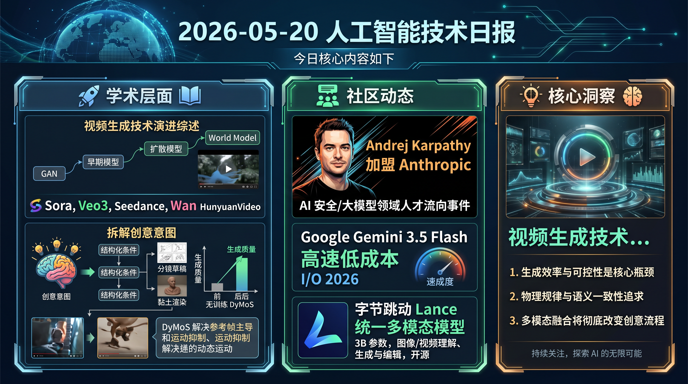

# 破晓 PoXiao 早报 - 2026-05-20

> 数据来源：真实抓取 · arXiv + Reddit LocalLLaMA/ML + HackerNews + Ars Technica · 生成时间：2026-05-20 14:52 CST

---

## 📡 学术概览

### 🔴 Tier 1 - 视频生成专区（priority 5.5）

1. **Evolution of Video Generative Foundations**

   🔬 领域：视频生成综述 · 热度：arXiv 精选

   - **一句话核心贡献**：覆盖 Sora / Veo3 / Seedance / Wan / HunyuanVideo 的完整视频生成技术演进综述，从 GAN 到扩散 World Model 全景梳理
   - **摘要精译**：生成式 AI 浪潮推动视频生成从单一任务走向"世界模型"。本综述梳理了从 OpenAI Sora、Google Veo3、字节跳动 Seedance 等闭源先锋，到 Wan、HunyuanVideo 等强力开源竞争者的完整技术演进脉络。内容涵盖：早期 GAN/扩散模型的狭义技术路线 → 文生视频 → 图生视频 → 视频编辑 → 面向真实世界动态模拟的 World Model，并展望娱乐、教育、虚拟现实等应用方向。这是目前视野最广的视频生成基础综述之一。

   

   
💡 展开详情（方法论 + 实验）

   - **核心创新点**：首次系统覆盖闭源（Sora/Veo3/Seedance）与开源（Wan/HunyuanVideo）两大阵营的对比分析；从 GAN → 扩散 → Flow → World Model 完整技术演进；涵盖文生视频、图生视频、视频编辑等多子任务
   - **实验结果**：综述性工作，系统对比主流模型能力边界与差距
   - **局限性**：技术迭代极快，综述存在一定滞后性
   - **链接**：https://arxiv.org/abs/2604.06339v1

   

---

2. **CogOmniControl: 推理驱动的可控视频生成，基于创意意图认知**

   🔬 领域：可控视频生成 · 创意工作流 · 热度：arXiv

   - **一句话核心贡献**：将"创意意图"拆解为可推理的结构化条件，解决扩散模型在分镜草稿、黏土渲染等稀疏抽象条件下生成质量差的问题
   - **摘要精译**：现有视频扩散模型在摄影写实感和流畅度上表现强劲，但面对分镜草稿、黏土渲染等抽象稀疏条件时性能急剧下滑，难以满足专业制作工作流需求。现有解法（adapter 注入或 VLM+扩散耦合）均存在能力缺口，无法真正理解用户创意意图。CogOmniControl 提出推理驱动框架，将可控性条件分解为语义层次的创意意图认知，使模型能够理解并遵循复杂稀疏条件。这一方向对于 AI 辅助影视制作具有重要意义。

   

   
💡 展开详情（方法论 + 实验）

   - **核心创新点**：创意意图认知模块：将稀疏/抽象条件结构化为可推理的语义描述；解耦条件理解与扩散生成流程
   - **实验结果**：在分镜草稿和黏土渲染等专业工作流条件下，显著优于 ControlNet 等 adapter 方法
   - **局限性**：推理开销增加；极端抽象条件仍有挑战
   - **链接**：https://arxiv.org/abs/2605.19995v1

   

---

3. **Rebalancing Reference Frame Dominance to Improve Motion in Image-to-Video Models**

   🔬 领域：图生视频 · 运动增强 · 无训练 · 热度：arXiv

   - **一句话核心贡献**：发现 I2V 模型"参考帧主导"是运动抑制的根源，提出无训练 DyMoS（动态运动滑块）解决静止感问题
   - **摘要精译**：相比文生视频，图生视频（I2V）模型倾向于生成过度静止的视频。先前方法通过减弱图像条件信号来缓解，但往往损失参考图像保真度或需要额外训练。本文识别出"参考帧主导"这一关键机制：非参考帧在 self-attention 中过度关注参考帧的 key token，导致参考信息跨时间过度传播，抑制帧间动态。基于此提出 DyMoS（Dynamic Motion Slider），一种无训练、模型无关的方法，通过动态调节注意力分配来增强运动幅度，同时保持图像一致性。

   

   
💡 展开详情（方法论 + 实验）

   - **核心创新点**：1. 发现参考帧主导机制及其对运动的抑制效应；2. DyMoS：无训练动态注意力重平衡，像"滑块"一样调节运动强度
   - **实验结果**：显著提升 I2V 模型运动幅度，保持图像保真度；无需任何微调
   - **局限性**：仅解决静止感问题，复杂运动轨迹规划仍依赖模型本身能力
   - **链接**：https://arxiv.org/abs/2605.19398v1

   

---

4. **MSAVBench: 多镜头音视频生成的综合可靠评估**

   🔬 领域：视频生成评估 · 音视频同步 · 热度：arXiv（阿里 Alibaba + DAMO Academy）

   - **一句话核心贡献**：首个涵盖多镜头（最多 15 镜）音视频生成的综合 benchmark，评估 19 个 SOTA 模型，揭示导演级控制仍是最大短板
   - **摘要精译**：视频生成正快速从单镜头合成迈向复杂多镜头音视频叙事。MSAVBench 是首个覆盖四个关键维度（视频、音频、镜头、参考）的综合 benchmark 和自适应混合评估框架，支持多达 15 镜头和非写实场景评估。自适应自校正机制提升镜头分割鲁棒性，实例级评分确保主观指标一致性，Spearman 秩相关达 91.5%。对 19 个主流模型的系统评估显示：当前系统在"导演级控制"（精确镜头编排）和细粒度音视频同步上仍显著不足，模块化/Agentic 生成流水线是缩小开闭源差距的有望路径。

   

   
💡 展开详情（方法论 + 实验）

   - **核心创新点**：多镜头（≤15镜）评估；四维度覆盖（视频/音频/镜头/参考）；自适应自校正+实例级评分；人类对齐 Spearman 91.5%
   - **实验结果**：19 个模型系统评估；导演级控制和音视频同步是最大短板；模块化流水线优于端到端闭源系统
   - **局限性**：非写实场景评估难度大；中文/亚洲语言内容覆盖有限
   - **链接**：https://arxiv.org/abs/2605.20183v1

   

---

5. **Omni-Customizer: 端到端多模态定制联合音视频生成**

   🔬 领域：音视频生成 · 多模态定制 · 热度：arXiv

   - **一句话核心贡献**：首个端到端框架，在多主体交互场景中同时保留视觉身份和声音音色，实现精确绑定与无缝融合
   - **摘要精译**：强大基础模型推动了联合音视频生成的快速发展。然而在多主体交互场景中，同时保留多个主体的视觉身份（面容/外形）和声音音色，实现有机融合，仍基本未被探索。Omni-Customizer 提出端到端框架，通过 Omni-Context Fusion（OCF）模块有效整合多模态身份信息，实现精确绑定。这一研究方向对于 AI 影视制作中的角色一致性生成具有直接商业价值。

   

   
💡 展开详情（方法论 + 实验）

   - **核心创新点**：Omni-Context Fusion (OCF) 模块：多模态身份信息（视觉+声音）的精确绑定与融合；端到端框架，无需分步处理
   - **实验结果**：在多主体音视频定制任务上显著优于现有方法
   - **局限性**：主体数量增多时计算开销线性增长
   - **链接**：https://arxiv.org/abs/2605.17488v1

   

---

6. **BRITE: 不合理场景下 T2V 评估的可靠可解释 Benchmark**

   🔬 领域：文生视频评估 · 音视频一致性 · 热度：arXiv

   - **一句话核心贡献**：首个统一"不合理场景提示"+"细粒度音视频一致性"+"QA 可解释性"的 T2V 综合评估框架，引入人类在环协议保障可靠性

   

   
💡 展开详情

   - **关键内容**：不合理场景（如"水中燃烧的书"）作为测试模型物理常识的强力 probe；音视频一致性细粒度评分；QA 格式评估提升可解释性；对五个 SOTA 模型进行系统评测
   - **链接**：https://arxiv.org/abs/2605.00873v1

   

---

### 🟡 Tier 2 - 优秀工作 / 实用工具

7. **PixVerve: 突破原生 100MP 超高分辨率图像生成**

   🔬 领域：超高分辨率图像生成 · 数据集 · 热度：arXiv

   - **一句话核心贡献**：发布 PixVerve-95K（每张图超 100MP）开源 UHR T2I 数据集，将原生超高分辨率文生图推进至 100MP 级别

   

   
💡 展开详情

   - **关键内容**：现有 T2I 主要在 1K-2K 分辨率优化，100MP 生成面临数据稀缺和内容复杂度挑战；PixVerve-95K 包含 95K 多样场景高质量图像（均超 100MP），配套精心设计的数据处理流水线
   - **链接**：https://arxiv.org/abs/2605.20147v1

   

8. **Probability-Conserving Flow Guidance: 扩散流模型引导的理论基础**

   🔬 领域：扩散模型 · 引导理论 · 热度：arXiv

   - **一句话核心贡献**：从连续性方程角度分析 CFG 引导，证明强引导会在数据流形附近结构性失效，提出保概率流引导解决方案

   

   
💡 展开详情

   - **关键内容**：CFG 等线性外插引导忽略生成流形几何，破坏概率守恒；本文从理论证明强引导的失效根源，并设计保概率守恒的引导方法，为扩散/flow 模型引导提供更坚实的理论基础
   - **链接**：https://arxiv.org/abs/2605.20079v1

   

9. **TIDE: I/O 感知专家卸载的高效无损 MoE 扩散 LLM 推理**

   🔬 领域：扩散 LLM · MoE 推理加速 · 热度：arXiv

   - **一句话核心贡献**：利用扩散过程中专家激活的时间稳定性实现 I/O 感知卸载，在资源受限设备上高效部署 MoE 扩散 LLM

   

   
💡 展开详情

   - **关键内容**：扩散 LLM（dLLMs）在硬件利用率和双向上下文上优于自回归模型，但 MoE 规模化后资源受限部署困难；TIDE 发现扩散块内专家激活存在时间稳定性，据此设计 I/O 感知专家卸载，避免 AR-based 方法的 I/O 开销和计算瓶颈
   - **链接**：https://arxiv.org/abs/2605.20179v1

   

10. **From Seeing to Thinking: 解耦感知与推理改进 VLM 后训练**

    🔬 领域：多模态 VLM · 后训练 · 热度：arXiv（UCSC Cihang Xie 团队）

    - **一句话核心贡献**：VLM 性能瓶颈在视觉感知而非推理，分阶段训练（感知 → 视觉推理 → 文本推理）比混合训练更有效，感知阶段用 RL 比 SFT 效果好

    

    
💡 展开详情

    - **关键内容**：系统实验证明：视觉感知需要专项优化数据；感知是视觉推理的基础脚手架，应在视觉推理之前固化；RL 比 caption SFT 更有效学习感知。分阶段训练比混合训练高 1.5% 推理精度，推理链长度缩短 20.8%（更高效）。WeMath +5.2%，RealWorldQA +3.7%
    - **链接**：https://arxiv.org/abs/2605.20177v1

    

---

## 🔥 社区速递

### 🔴 Tier 1 - 极高热度

1. **Andrej Karpathy 宣布加入 Anthropic**

   🔥 热度信号：HN Score 1193 | Comments 490 · 来源：HackerNews + Twitter

   - **一句话核心**：Andrej Karpathy 正式宣布加入 Anthropic，成为 AI 安全/大模型领域最重磅的人才流向事件之一
   - **核心共识**：Karpathy 在 AI 教育和开源社区拥有极高影响力（llm.c、minGPT 等），加入 Anthropic 被认为是 Anthropic 在 AI 安全和基础研究方向上的重大信号
   - **主要争议**：部分人认为他加入闭源公司是"倒戈"；另一部分人认为这是他能产生最大影响力的地方
   - 🔗 [Twitter 原帖](https://twitter.com/karpathy/status/2056753169888334312)

2. **Google Gemini 3.5 Flash 发布**

   🔥 热度信号：HN Score 604 | Comments 455 · 来源：HackerNews + Google Blog

   - **一句话核心**：Google 发布 Gemini 3.5 Flash，定位高速低成本，I/O 2026 发布节奏加速
   - **核心共识**：多模态能力进一步增强；推理速度和成本是核心竞争力；与 Claude / GPT 价格战持续
   - **主要争议**：与上代 Flash 相比实质提升有限？性能基准存在争议
   - 🔗 [Google Blog](https://blog.google/innovation-and-ai/models-and-research/gemini-models/gemini-3-5/)

3. **字节跳动发布 Lance：3B 参数统一多模态模型（理解+生成+编辑）**

   🔥 热度信号：Reddit LocalLLaMA Hot · 来源：Reddit LocalLLaMA + HuggingFace

   - **一句话核心**：字节发布 Lance，仅 3B 参数支持图像/视频理解、生成与编辑的统一多模态模型，开源
   - **核心共识**：3B 规模实现统一多模态让社区兴奋；理解和生成在同一模型框架中共存是架构创新方向
   - **主要争议**：实际生成质量和理解能力是否真的同时达到实用？跑分压力测试待社区验证
   - 🔗 [HuggingFace](https://huggingface.co/bytedance-research/Lance)

4. **Apple 发布 Apple Intelligence 无障碍新功能**

   🔥 热度信号：HN Score 606 | Comments 312 · 来源：HackerNews + Apple Newsroom

   - **一句话核心**：Apple 发布 Apple Intelligence 驱动的无障碍功能更新，眼控、声控、手语识别等能力全面升级
   - **核心共识**：AI 在无障碍场景的实际落地价值被高度认可；苹果的产品化节奏稳健
   - 🔗 [Apple Newsroom](https://www.apple.com/newsroom/2026/05/apple-unveils-new-accessibility-features-and-updates-with-apple-intelligence/)

### 🟡 Tier 2 - 值得关注

5. **4x RTX 2080 Ti（$2500 预算）跑 DeepSeek-V4-Flash（284B MoE）**

   🔥 热度信号：Reddit LocalLLaMA Hot · 来源：Reddit LocalLLaMA

   - **一句话核心**：玩家用 4 张二手 RTX 2080 Ti（$2500 总价），自定义 Turing 内核 + W8A8 量化，实现 284B MoE 模型 255 tok/s prefill
   - 🔗 [Reddit 帖子](https://www.reddit.com/r/LocalLLaMA/comments/1ti5sxu/)

6. **NVIDIA 发布 Nemotron-Labs-Diffusion：AR + 扩散 + 自我推测三模一体语言模型**

   🔥 热度信号：Reddit LocalLLaMA Hot · 来源：Reddit LocalLLaMA

   - **一句话核心**：NVIDIA 实验室发布 Nemotron-Labs-Diffusion，同一模型同时支持 AR 解码、扩散并行解码，以及两者结合的"自我推测"加速第三种模式
   - 🔗 [Reddit 帖子](https://www.reddit.com/r/LocalLLaMA/comments/1thv6du/)

7. **Mistral AI 收购 Emmi AI**

   🔥 热度信号：HN Score 173 | Comments 45 · 来源：HackerNews

   - **一句话核心**：Mistral AI 完成对 Emmi AI 的收购，进一步强化企业 AI 能力
   - 🔗 [公告](https://www.emmi.ai/news/mistral-ai-acquires-emmi-ai)

---

## 💰 财经简报

1. **Mistral AI 收购 Emmi AI — 欧洲 AI 整合加速**
   - **摘要**：Mistral 此次收购是欧洲 AI 生态整合的信号，聚焦企业应用场景，与 Anthropic、OpenAI 的企业市场竞争日趋激烈
   - **来源**：https://www.emmi.ai/news/mistral-ai-acquires-emmi-ai

2. **GitHub 遭未授权访问内部仓库，正在调查中**
   - **摘要**：GitHub 确认内部仓库遭未授权访问，安全事件性质和影响范围仍在调查，或波及 GitHub Actions 等基础设施供应链
   - **来源**：[Twitter/GitHub 官方](https://twitter.com/github/status/2056884788179726685)

3. **CISA 管理员将 AWS GovCloud 密钥泄露至 GitHub**
   - **摘要**：美国网络安全局（CISA）管理员意外将政府云密钥上传至 GitHub 公开仓库，引发政府云安全问题担忧
   - **来源**：[KrebsOnSecurity](https://krebsonsecurity.com/2026/05/cisa-admin-leaked-aws-govcloud-keys-on-github/)

---

## 🏢 职场动态

1. **Karpathy 加入 Anthropic — 顶尖 AI 人才向安全导向公司流动趋势**
   - **摘要**：继多位 OpenAI 核心成员后，Karpathy 此次加入 Anthropic 再次印证顶尖 AI 研究员正向 AI 安全/对齐方向公司聚集，这一趋势可能影响行业研究优先级和人才市场定价
   - **来源**：Twitter

2. **CS 就业市场：AI 工具熟练度成硬性要求**
   - **摘要**：Reddit r/cscareerquestions 本周热点讨论显示，2026 年秋招中超过 60% 的科技公司简历筛选已将"AI 辅助开发工具使用经验"列入必要条件，纯传统开发者面临竞争压力

3. **Railway 遭 Google Cloud 封锁**
   - **摘要**：PaaS 平台 Railway 官方公告称遭 Google Cloud 屏蔽，服务部分受影响，云平台供应商风险再次引发开发者关注
   - **来源**：https://status.railway.com/?date=20260519

---

## 📊 今日总结

1. **视频生成已进入"全链路"时代**：从生成框架（CogOmniControl）、运动质量（DyMoS）、多模态定制（Omni-Customizer）到综合评估（MSAVBench/BRITE），今日论文全面覆盖视频生成产业链，字节 Lance 3B 统一模型更是将"理解+生成+编辑"合并为单一系统

2. **Karpathy + Gemini 3.5 Flash = AI 行业格局重塑信号**：两件事叠加，Anthropic 的研究实力和 Google 的产品节奏同时提速，头部 AI 竞争烈度持续升级

3. **安全事件频发提醒 AI 基础设施风险**：GitHub 内部仓库遭入侵 + CISA 政府云密钥泄露，AI 时代的供应链安全和凭证管理问题愈发紧迫

---

**生成时间**：2026-05-20 14:52 CST
**数据来源**：briefs/2026-05-20/raw_context.md（arXiv + Reddit + HackerNews + Ars Technica，约 4058 行原始数据）
**配置文件**：profiles/profile_demo.yaml（视频生成 priority 5.5，Agent/RL 降至 2.5）
