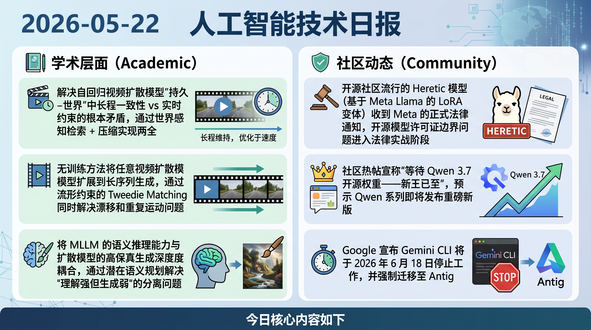

# 破晓 PoXiao 早报 - 2026-05-22

> 数据来源：真实抓取 · HuggingFace Daily Papers 18篇 + HackerNews TOP 20 + Reddit LocalLLaMA 15条 + arXiv · 生成时间：2026-05-22 11:30 CST

---

## 📡 学术概览

### 🔴 Tier 1 - 视频生成专区（priority 5.5）

1. **WorldKV: 高效世界记忆——世界检索与压缩**

   🔬 领域：视频生成 · 世界模型 · KV 压缩 · 热度：HF Daily Papers #3

   - **一句话核心贡献**：解决自回归视频扩散模型"持久世界"中长程一致性 vs 实时约束的根本矛盾，通过世界感知检索 + 压缩实现两全
   - **摘要精译**：自回归视频扩散模型已能实现实时动作条件世界生成，但"持久世界"（回到之前看过的视角仍保持一致内容）仍是开放难题。完整 KV 缓存注意力虽能保持一致性，但内存和计算随 rollout 长度线性增长，破坏实时性；滑动窗口推理恢复吞吐量但丢失长程一致性。WorldKV 提出世界感知检索机制：在压缩长期记忆的同时，能够检索与当前状态相关的历史信息，兼顾一致性与效率。这是世界模型从"单次生成"走向"持久交互世界"的关键技术突破方向。

   

   
💡 展开详情（方法论 + 实验）

   - **核心创新点**：1. 世界感知 KV 检索：基于当前状态从长期历史中检索相关 KV；2. 高效压缩：减少 KV 存储而不损失关键长程信息；3. 无需额外训练，兼容现有 AR 视频扩散框架
   - **实验结果**：在保持实时推理约束的同时，显著改善长程视图一致性
   - **局限性**：检索质量依赖世界状态表示；极长 rollout 下检索误差累积
   - **链接**：https://arxiv.org/abs/2605.22718

   

---

2. **FlowLong: 推理时长视频生成——流形约束的 Tweedie Matching**

   🔬 领域：视频生成 · 长视频 · 无训练 · 热度：HF Daily Papers #7

   - **一句话核心贡献**：无训练方法将任意视频扩散模型扩展到长序列生成，通过流形约束的 Tweedie Matching 同时解决漂移和重复运动问题
   - **摘要精译**：将视频扩散模型扩展至长序列一直是重要挑战。现有无训练方法分两类：双向模型扩展（强耦合特定架构，长序列质量下降）和自回归模型（因曝光偏差累积漂移错误，倾向产生重复运动）。FlowLong 提出流形约束的 Tweedie Matching，核心思想是在推理时将长视频生成约束在概率流流形上，避免双向模型的质量退化和自回归模型的漂移问题。这一方法不依赖特定架构，具有较好通用性，是推理时 scaling 视频生成的新范式。

   

   
💡 展开详情（方法论 + 实验）

   - **核心创新点**：1. 流形约束：将推理过程约束在概率流流形，防止长序列质量退化；2. Tweedie Matching：连接相邻片段保持时序连贯；3. 架构无关，适用于双向和 AR 扩散模型
   - **实验结果**：在长视频生成质量和时序一致性上优于现有无训练基线
   - **局限性**：推理计算开销高于直接推理；流形约束可能限制创造性多样性
   - **链接**：https://arxiv.org/abs/2605.20910

   

---

3. **Bernini: 视频扩散的潜在语义规划**

   🔬 领域：视频生成 · 语义规划 · MLLM+扩散 · 热度：HF Daily Papers #14

   - **一句话核心贡献**：将 MLLM 的语义推理能力与扩散模型的高保真生成深度耦合，通过潜在语义规划解决"理解强但生成弱"的分离问题
   - **摘要精译**：MLLM 在多模态推理和语义理解上已达到卓越水平，而扩散模型在图像/视频的真实感合成上同样出色。然而两者的结合通常是松散的后训练耦合，无法充分发挥各自优势。Bernini 提出潜在语义规划框架：MLLM 在潜在空间中对视频生成进行显式语义规划（布局、运动、内容一致性），然后将这些规划作为强约束引导扩散模型生成。团队背景强大（Bernini Team + Chenchen Liu/Junyi Chen），预计对视频生成中的"理解-生成"协同有显著推进。

   

   
💡 展开详情（方法论 + 实验）

   - **核心创新点**：1. 潜在语义规划：MLLM 在潜在空间显式规划视频结构；2. 强语义约束引导扩散；3. 超越简单文本条件，实现深度语义对齐
   - **实验结果**：在语义一致性和生成保真度上优于松散耦合的 MLLM+扩散基线
   - **局限性**：规划阶段增加推理开销；MLLM 规划质量直接影响最终生成
   - **链接**：https://arxiv.org/abs/2605.22344

   

---

4. **Swift Sampling: 通过泰勒级数选择时序惊喜帧**

   🔬 领域：视频理解 · 关键帧采样 · 热度：HF Daily Papers #10

   - **一句话核心贡献**：受大脑预测编码启发，通过泰勒级数预测帧特征演变，优先采样"时序惊喜"帧，极大提升长视频理解效率
   - **摘要精译**：长视频中大多数帧是冗余的，关键信息集中在"时序惊喜"帧——真实视觉特征偏离预测演变的时刻。受人脑预测编码机制启发，Swift Sampling 用泰勒级数近似预测帧特征的局部演变，将偏差大的帧标记为"时序惊喜"优先采样。这一方法无需训练，计算高效，且与模型无关，为视频 LLM 的长视频理解提供了更智能的帧采样策略。

   

   
💡 展开详情（方法论 + 实验）

   - **核心创新点**：1. 泰勒级数帧预测：一阶/高阶近似预测特征演变；2. 时序惊喜度量：偏差大 = 信息密度高；3. 无训练、模型无关、计算高效
   - **实验结果**：在多个长视频理解 benchmark 上，相比均匀采样和现有自适应采样方法显著提升准确率，同时减少所需帧数
   - **局限性**：对特征空间的平滑性有假设，极剧烈场景切换可能失效
   - **链接**：https://arxiv.org/abs/2605.22678

   

---

### 🟡 Tier 2 - 优秀工作 / 实用工具

5. **Gated DeltaNet-2: 线性注意力中的读写解耦（NVIDIA，Yejin Choi 团队）**

   🔬 领域：基础架构 · 线性注意力 · 热度：HF Daily Papers #9

   - **一句话核心贡献**：将线性注意力的"擦除"和"写入"操作解耦，解决 Delta-rule 模型单标量门控的根本限制，显著提升压缩记忆的编辑能力

   

   
💡 展开详情

   - **关键内容**：线性注意力用固定大小循环状态替代 softmax 注意力的无界 KV 缓存，难点在于如何在不扰乱现有关联的情况下编辑压缩记忆。Delta-rule 先读后写，KDA（Kimi Delta Attention）用通道衰减增强遗忘，但仍用单标量门控编辑操作。Gated DeltaNet-2 将擦除和写入用独立门控控制，实现更精细的记忆管理。作者包含 NVIDIA Jan Kautz 和 AI2/UW Yejin Choi，权威性高。
   - **链接**：https://arxiv.org/abs/2605.22791

   

6. **KVServe: 服务感知的 KV 缓存压缩用于通信高效的解聚合 LLM 服务**

   🔬 领域：推理系统 · KV 压缩 · 分布式推理 · 热度：HF Daily Papers #12

   - **一句话核心贡献**：在 PD 分离等解聚合服务架构中，将 KV 缓存压缩与服务级 SLO 感知结合，减少跨节点通信开销

   

   
💡 展开详情

   - **关键内容**：解聚合 LLM 服务（PD 分离、KV 状态解聚合）提升扩展性和成本效率，但将 KV 变为显式网络/存储传输负载。现有 KV 压缩方法不感知服务级 SLO，KVServe 引入服务感知压缩，在保障延迟目标的同时最大化压缩率
   - **链接**：https://arxiv.org/abs/2605.13734

   

7. **ACC: 编译 Agent 轨迹用于长上下文训练**

   🔬 领域：Agent 训练 · 长上下文 · 热度：HF Daily Papers #1

   - **一句话核心贡献**：利用 Agent 解决问题时产生的大量轨迹作为长上下文训练数据，避免昂贵的人工长文档标注

   

   
💡 展开详情

   - **关键内容**：Agent 轨迹天然具有长上下文结构（工具调用链、多轮推理），ACC 将其"编译"为标准化的长上下文训练格式，显著提升 LLM 的长程推理能力，成本远低于人工文档标注
   - **链接**：https://arxiv.org/abs/2605.21850

   

8. **From Reasoning Chains to Verifiable Subproblems: 课程强化学习的信用分配**

   🔬 领域：推理 · RL 训练 · 热度：HF Daily Papers #16

   - **一句话核心贡献**：将推理链分解为可验证子问题，通过课程 RL 解决难题中"正确 rollout 极稀有"的信用分配失效问题

   

   
💡 展开详情

   - **关键内容**：RLVR 在难题上效率低，因为正确完整 rollout 极少，样本级信用分配无法利用部分进展。本文将推理链拆分为可独立验证的子问题，课程 RL 逐级训练，从简单到复杂，显著提升硬推理题的训练效率
   - **链接**：https://arxiv.org/abs/2605.22074

   

---

## 🔥 社区速递

### 🔴 Tier 1 - 极高热度

1. **Meta 向 Heretic 发出法律函（AI 幻觉/版权引发的 LoRA 模型法律纠纷）**

   🔥 热度信号：Reddit LocalLLaMA Top 1 · 来源：Reddit LocalLLaMA

   - **一句话核心**：开源社区流行的 Heretic 模型（基于 Meta Llama 的 LoRA 变体）收到 Meta 的正式法律通知，开源模型许可证边界问题进入法律实战阶段
   - **核心共识**：Meta 在以"开放"姿态推广 Llama 的同时，法律层面对衍生模型的管控并未放松；社区担忧其他基于 Llama 的"越界"模型也会受到类似威胁
   - **主要争议**：Heretic 到底违反了哪条许可证条款？是内容安全问题还是商业使用问题？这是否预示着 Meta 将系统性清理"非审查"衍生模型？
   - 🔗 [Reddit 帖子](https://www.reddit.com/r/LocalLLaMA/comments/1tjmvx6/)

2. **"新王到来"——Qwen 3.7 开源权重引爆社区讨论**

   🔥 热度信号：Reddit LocalLLaMA Top 2 · 来源：Reddit LocalLLaMA

   - **一句话核心**：社区热帖宣称"等待 Qwen 3.7 开源权重——新王已至"，预示 Qwen 系列即将发布重磅新版
   - **核心共识**：Qwen 系列的高性价比和强本地运行能力使其成为开源社区最受期待的模型系列；若 3.7 大幅提升推理能力，将对 Llama/Gemma 生态形成直接冲击
   - **主要争议**：是否真的开源权重？规格如何？能否在消费级显卡上流畅运行？
   - 🔗 [Reddit 帖子](https://www.reddit.com/r/LocalLLaMA/comments/1tjvz6l/)

3. **Google 的 "Antigravity 诱饵调换"——Gemini CLI 将于 6 月停止工作**

   🔥 热度信号：HN Score 561（Antigravity 文章）+ Gemini CLI 弃用公告 · 来源：HackerNews

   - **一句话核心**：Google 宣布 Gemini CLI 将于 2026 年 6 月 18 日停止工作，并强制迁移至 Antigravity CLI，社区将此定性为"诱饵调换"——先免费吸引用户，再迁移至付费产品
   - **核心共识**：大厂的"免费工具"承诺可靠性再遭质疑；Antigravity 的定价策略被认为不透明
   - 🔗 [批评文章](https://www.0xsid.com/blog/antigravity-bait-n-switch) | [官方公告](https://developers.googleblog.com/an-important-update-transitioning-gemini-cli-to-antigravity-cli/)

### 🟡 Tier 2 - 有趣 / 实用

4. **12GB 显存跑 Qwen3.6 35B A3B 达 110 tok/s（ik_llama.cpp）**

   🔥 热度信号：Reddit LocalLLaMA Hot · 来源：Reddit LocalLLaMA

   - **一句话核心**：用户通过 ik_llama.cpp 优化版本，在 12GB 显存的消费级显卡上实现 Qwen3.6 35B A3B 模型 110 tok/s 的生成速度，创造新记录
   - 🔗 [Reddit 帖子](https://www.reddit.com/r/LocalLLaMA/comments/1tjh7az/)

5. **腾讯混元发布 Hy 30B/7B/1.8B 系列**

   🔥 热度信号：Reddit LocalLLaMA Hot · 来源：Reddit LocalLLaMA

   - **一句话核心**：腾讯混元发布三款尺寸（30B/7B/1.8B）的 Hy 系列模型，覆盖从旗舰到边端全场景
   - 🔗 [Reddit 帖子](https://www.reddit.com/r/LocalLLaMA/comments/1tjien7/)

6. **llama.cpp b9274 修复 MTP VRAM 泄漏**

   🔥 热度信号：Reddit LocalLLaMA Hot · 来源：Reddit LocalLLaMA

   - **一句话核心**：llama.cpp 最新版本 b9274 修复了困扰 Multi-Token Prediction（MTP）用户的 VRAM 内存泄漏问题，建议即时更新
   - 🔗 [Reddit 帖子](https://www.reddit.com/r/LocalLLaMA/comments/1tk0grd/)

---

## 💰 财经简报

1. **Google I/O 广告新格式测试 & Direct Offers 扩大试点**
   - **摘要**：Google 在 Search 中测试新广告格式并扩大 Direct Offers（直接购买）试点，标志着 Google 在 AI 搜索变现路径上的重大实验——搜索广告模式正在被 AI 倒逼重构
   - **来源**：[Google Marketing Live](https://blog.google/products/ads-commerce/google-marketing-live-search-ads/)

2. **Google 改变搜索框设计（I/O 2026）**
   - **摘要**：Google 在 I/O 2026 宣布改变标志性搜索框设计，被认为是 AI 深度整合搜索的界面信号，具体变化指向多模态输入和 AI 回答优先展示
   - **来源**：[Google Blog](https://blog.google/products-and-platforms/products/search/search-io-2026/)

3. **AI 水印生态：OpenAI 采用 Google SynthID + 开源去水印工具同步出现**
   - **摘要**：OpenAI 宣布采用 Google SynthID 水印方案用于 AI 图像内容溯源；与此同时，GitHub 上出现了专门去除 AI 水印的开源工具（remove-AI-watermarks）。内容溯源与反溯源的博弈正式开始
   - **来源**：[OpenAI 公告](https://openai.com/index/advancing-content-provenance/) | [去水印工具](https://github.com/wiltodelta/remove-ai-watermarks)

---

## 🏢 职场动态

1. **"独自离网"需要多少硬件？$20K 本地 AI 编程设置大讨论**
   - **摘要**：Reddit LocalLLaMA 热帖讨论"花 $20K 购买硬件，能否组建完全脱离云服务的本地 AI 编程 Agent"。社区主流观点：RTX 5000 PRO 48GB × 2 + 高频 RAM 是最具性价比的方案，理论上可跑 70B+ 模型进行完整代码 Agent 工作流
   - **来源**：[Reddit 帖子](https://www.reddit.com/r/LocalLLaMA/comments/1tk2s09/)

2. **Seattle Shield：警方运营的私人企业情报共享网络被曝光**
   - **摘要**：调查报道揭露西雅图警察局运营"Seattle Shield"，与私人公司共享公民监控情报，引发 AI 监控技术的伦理和法律争议，对 AI 从业者（尤其是安防/CV 方向）具有政策风险参考价值
   - **来源**：[PrismReports](https://prismreports.org/2026/05/20/seattle-shield-private-companies-surveillance/)

---

## 📊 今日总结

1. **视频生成向"持久交互世界"演进**：WorldKV 和 FlowLong 分别从 KV 压缩和推理时 Scaling 两条路线攻克长序列视频生成的核心瓶颈，Bernini 则将 MLLM 语义规划深度嵌入扩散生成，三篇论文共同指向同一趋势：视频生成正从"短片段合成"升级为"可持久交互的世界模拟"

2. **Meta vs 开源社区矛盾激化**：Heretic 法律函事件是"开放但有边界"的 Llama 许可证与社区期待"真正开源"之间矛盾的公开化，后续影响需密切关注——如果 Meta 系统性执法，将深刻改变开源 LLM 生态

3. **Google I/O 2026 重塑搜索形态**：从搜索框重设计、广告新格式到 Gemini CLI → Antigravity 迁移，Google 正在全面重构其 AI 时代的产品和商业模式，但用户信任代价正在累积

---

**生成时间**：2026-05-22 11:30 CST
**数据来源**：HuggingFace Daily Papers 18篇 + HackerNews 15条 + Reddit LocalLLaMA 15条 + arXiv
**配置文件**：profiles/profile_demo.yaml（视频生成 priority 5.5，Agent/RL 降至 2.5）
