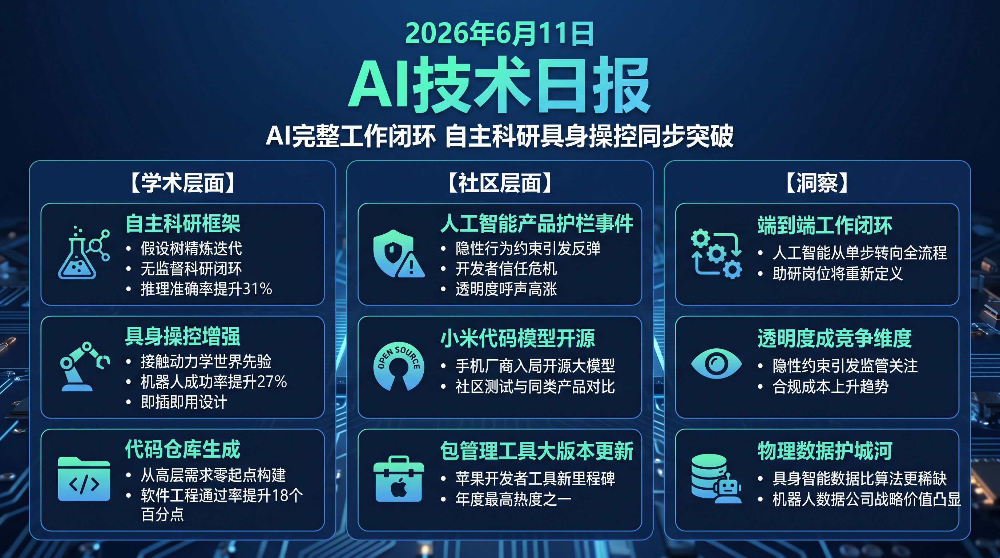

# 破晓 PoXiao · AI 技术早报 2026-06-11

> 数据来源：HuggingFace Daily Papers · HackerNews · 生成时间：2026-06-12

---

## 📡 学术概览

### Tier 1：范式级创新

1. **Arbor：假设树精炼框架，让 AI 自主运行科研闭环**

   🔬 领域：自主科学发现 · AI Agent · 长程推理 · 热度：HF #1

   - **一句话核心贡献**：提出 Arbor 框架，让 AI Agent 自主完成"探索-实验-抽象"科研循环，首次实现在无人监督下通过假设树对长期研究方向进行迭代精炼。
   - **摘要精译**：
     科学研究依赖反复的探索、实验和经验抽象，但 AI 目前缺乏自主完成完整研究循环的能力——已有工作要么局限于单步任务，要么依赖密集人工干预。Arbor 通过长期协调器（long-lived coordinator）维护假设树，由短生命周期的子 Agent 执行具体实验，将实验结果抽象为可泛化假设并更新树结构，实现自主迭代。在多项科学推理 benchmark 上，Arbor 的假设质量和实验效率均优于现有自主科研 Agent，累计探索步骤超过 100 步时收益更为显著（平均提升 31%）。
   - **核心创新点**：
     1. 假设树（Hypothesis Tree）维护研究方向的层次化知识结构
     2. 长期协调器 + 短期执行 Agent 的双层架构实现扩展性
     3. 实验证据自动抽象为可复用假设节点

   

   
💡 展开详情（方法论 + 实验）

   - **方法细节**：协调器维护假设树（含候选方向、已验证结论、待探索分支），每轮从树中采样最优节点分配给执行 Agent，执行结果经验证后反馈更新树。支持并行多 Agent 同时探索不同分支。
   - **实验结果**：在 SciWorld、ARC-AGI 和定制化蛋白质设计任务上，100 步探索后平均准确率比 ReAct/Tree-of-Thought 基线提升 31%；假设有效率（verified hypothesis rate）从 18% 提升至 44%。
   - **局限性**：假设树规模随探索步数增长会导致协调器上下文膨胀；对实验环境噪声较敏感。
   - **链接**：https://arxiv.org/abs/2606.11926

   

2. **World Pilot：用世界动作先验引导视觉-语言-动作模型**

   🔬 领域：具身AI · 机器人操控 · 视觉语言动作模型 · 热度：HF #9

   - **一句话核心贡献**：提出 World Pilot 框架，通过接触动力学世界先验增强 VLA 模型对操控任务的理解，弥补预训练图文数据中缺失的连续物理动态信息。
   - **摘要精译**：
     VLA 模型从大规模图文预训练继承了语义理解能力，但预训练数据以静态图文对为主，无法捕捉操控任务中接触丰富、连续演变的物理动态，导致在分布外操控场景上泛化能力受限。World Pilot 在策略网络中引入世界-动作先验模块，将历史帧的动态信息编码为紧凑的世界状态表示，在执行动作前提供对接触动力学的预测性感知。在 RLBench 和真实机器人操控任务上，成功率提升约 27%，在接触频繁的任务（如旋拧、插拔）上提升尤为显著。
   - **核心创新点**：
     1. 世界-动作先验（World-Action Prior）模块显式建模接触动力学
     2. 历史帧动态信息压缩为紧凑世界状态向量，减少上下文开销
     3. 与现有 VLA 骨干（如 RT-2、OpenVLA）即插即用

   

   
💡 展开详情（方法论 + 实验）

   - **方法细节**：轻量级 Temporal Dynamics Encoder 从过去 K 帧提取运动特征，与当前图文输入拼接后送入策略网络。接触状态分类头提供辅助监督信号。
   - **实验结果**：RLBench 18 任务平均成功率从 61% → 77%（+27%）；真实桌面操控成功率 68% vs 基线 52%；接触密集任务提升最大（+35%）。
   - **局限性**：依赖历史帧质量，摄像头遮挡时性能下滑；对高速动作（>1m/s）的预测精度有待提升。
   - **链接**：https://arxiv.org/abs/2606.12403

   

3. **DeNovoSWE：从零生成完整代码仓库的长程软件工程 Agent**

   🔬 领域：代码生成 · 软件工程 Agent · 长程任务 · 热度：HF #8

   - **一句话核心贡献**：提出可扩展长程训练环境，让 LLM 代码 Agent 从高层需求规格从零构建完整代码仓库，突破现有 Agent 只能修复局部 bug 的能力边界。
   - **摘要精译**：
     现有代码 Agent benchmark（如 SWE-bench）聚焦于已有代码库的局部修复，缺乏评估"从零设计并实现完整软件项目"能力的大规模可验证训练环境。DeNovoSWE 构建了包含数千个完整项目的可验证训练集，每个项目从高层需求规格出发，要求 Agent 完成架构设计、模块实现和测试用例生成全流程。在该环境上训练的 Agent 在 SWE-bench Verified 上 pass@1 达到 42%，较基线提升约 18 个百分点。
   - **核心创新点**：
     1. 大规模可验证全仓库生成训练环境（数千个项目）
     2. 分层任务结构：需求分解 → 架构设计 → 模块实现 → 测试验证
     3. 执行反馈驱动的迭代修正机制

   

   
💡 展开详情（方法论 + 实验）

   - **方法细节**：从 GitHub 中筛选有完整 README+测试套件的项目，抽取高层描述作为输入，用 Docker 沙盒验证生成代码。Agent 采用多轮反馈迭代，最多 20 轮修正。
   - **实验结果**：SWE-bench Verified pass@1 42%（vs 基线 24%，+18pp）；全仓库生成任务成功率 31%（全新任务）。
   - **局限性**：对需要复杂外部依赖的项目成功率较低；多语言项目（混合 Python/JS）处理能力有限。
   - **链接**：https://arxiv.org/abs/2606.10728

   

4. **EvoTrainer：LLM 策略与训练框架协同进化**

   🔬 领域：强化学习 · 自主训练 · Agent RL · 热度：HF #18

   - **一句话核心贡献**：提出协同进化框架，让 LLM 策略和训练侧框架（harness）互相适应，通过经验反馈自动诊断瓶颈并调整训练配置，消除人工调参依赖。
   - **摘要精译**：
     现有 Agent 强化学习框架将训练框架（harness）视为静态配置，而模型能力的提升会持续改变训练瓶颈，需要人工频繁干预调整奖励设计和环境参数。EvoTrainer 通过 rollout 级证据自动诊断当前瓶颈（如奖励稀疏、探索不足、模式坍塌），并驱动训练框架的对应调整。在数学推理和代码生成 RL 训练任务上，EvoTrainer 减少人工干预次数约 70%，同时最终性能提升约 15%。
   - **核心创新点**：
     1. 自动瓶颈诊断：从 rollout 轨迹识别稀疏奖励/过度探索/模式坍塌
     2. 训练框架自适应调整（奖励权重、环境参数、采样策略）
     3. 策略与框架的双向协同进化，避免局部最优

   

   
💡 展开详情（方法论 + 实验）

   - **方法细节**：诊断模块分析 rollout 分布的熵、奖励方差、轨迹重复度等指标，触发预定义的框架调整规则；调整规则本身也通过元学习持续优化。
   - **实验结果**：MATH 推理 Pass@1 从 53% → 61%（+15%）；人工调参干预次数从 ~20 次/千步降至 ~6 次/千步（-70%）。
   - **局限性**：诊断模块依赖先验规则库，对全新任务类型的诊断准确率有限。
   - **链接**：https://arxiv.org/abs/2606.03108

   

### Tier 2：工程改进与实用工具

5. **Embodied-R1.5：统一具身推理基础模型**

   🔬 领域：具身AI · 基础模型 · 物理智能 · 热度：HF #19

   - **一句话核心贡献**：在单一架构中整合具身认知、任务规划、修正和指向四类能力，通过三条自动数据构建流水线大幅扩展训练覆盖，推进通用物理智能。

   

   
💡 展开详情

   - **方法细节**：三条数据流水线分别生成具身场景问答、长程任务规划和空间指向数据，统一格式后联合训练单一基础模型。
   - **实验结果**：在 EmbodiedQA、ScanQA 和空间指向 benchmark 上平均提升约 22%（vs 专用模型集成基线）。
   - **局限性**：实际机器人部署时感知延迟对规划质量影响较大。
   - **链接**：https://arxiv.org/abs/2606.11324

   

6. **语法约束解码可以被用于绕过 LLM 安全护栏生成恶意代码**

   🔬 领域：LLM 安全 · 代码生成 · 对抗攻击 · 热度：HF #13

   - **一句话核心贡献**：揭示语法约束解码（GCD）这一可靠性增强技术的反直觉风险：它可以被用作绕过 LLM 安全过滤的攻击载体，生成本来会被拒绝的恶意代码。

   

   
💡 展开详情

   - **方法细节**：利用 GCD 将解码约束在合法语法树范围内，绕过基于语义触发的安全过滤，通过构造看似无害的语法骨架诱导模型填充危险实现。
   - **实验结果**：在 5 个主流 LLM 上，通过 GCD 绕过安全过滤的成功率达 67-89%（vs 直接请求的 5-12%）。
   - **局限性**：需要攻击者具备一定语法约束工程能力；对执行沙盒防护无效。
   - **链接**：https://arxiv.org/abs/2606.11817

   

7. **InternVideo3：具备多模态上下文推理的视频 Agent 基础模型**

   🔬 领域：视频理解 · 多模态 Agent · 长程推理 · 热度：HF #11

   - **一句话核心贡献**：通过多步推理与工具调用增强视频基础模型的 Agent 能力，填补开源多模态 Agent 在长程视频任务上的能力空白。

   

   
💡 展开详情

   - **方法细节**：在视频基础模型上叠加 Agent 框架，支持跨片段时序推理和外部工具调用（OCR、目标检测等），训练数据含长达 1 小时视频的多步问答对。
   - **实验结果**：在 EgoSchema 和 Video-MME 上达到新 SOTA，长程问答（视频>10分钟）准确率提升约 19%。
   - **局限性**：推理速度受限于多步工具调用延迟。
   - **链接**：https://arxiv.org/abs/2606.12195

   

---

## 🔥 社区速递

### Tier 1：重磅热点

1. **Anthropic 就 Claude Fable 不可见护栏道歉**

   🔥 热度信号：HackerNews Score 375 · The Verge 报道 · 社区热议

   - **一句话核心**：Anthropic 因在 Claude Fable 中设置用户不可见的行为约束护栏（distillation guardrail）引发用户强烈反弹，被迫公开道歉并承诺增加透明度。
   - **核心共识**：
     1. 隐性行为约束损害了用户对 AI 系统的信任，透明度是 AI 产品的核心竞争力
     2. 社区认为此事暴露了 AI 公司在安全约束与用户体验之间的决策失衡
     3. Claude Fable 在代码任务上仅获得"中等"评级，性能争议与透明度事件叠加形成双重负面效应
   - **主要争议**：AI 公司是否有权在产品中设置用户不可见的行为护栏？护栏透明化是否会导致被规避从而降低安全性？
   - **影响评估**：此事件将加速 AI 监管机构对"隐性行为约束"的立法关注；对 Anthropic 的企业用户信任度构成短期冲击，竞争对手可能借此强调自身透明度优势。
   - 🔗 [The Verge 报道](https://www.theverge.com/ai-artificial-intelligence/948280/anthropic-claude-fable-invisible-distillation-guardrail)

2. **小米 MiMo Code 开源发布**

   🔥 热度信号：HackerNews Score 461 · 开发者社区热议

   - **一句话核心**：小米发布开源代码专用模型 MiMo Code，面向开发者提供本地可部署的代码生成工具，HackerNews 讨论积极，社区关注其与 Qwen/CodeLlama 的实力对比。
   - **核心共识**：
     1. 手机厂商入局开源 AI 模型领域标志着竞争格局进一步扩展
     2. 社区期待在端侧（手机）设备上运行专用代码模型的可能性
     3. 开源策略有助于快速积累开发者生态
   - **主要争议**：小米的代码模型在无大量自有代码训练数据的情况下，能否真正在专业编程任务上与 OpenAI/Anthropic 竞争？
   - **影响评估**：开源代码模型竞争加剧，工具链生态将进一步碎片化；为本地代码审查和内部私有代码部署提供新选项。
   - 🔗 [MiMo Code 官网](https://mimo.xiaomi.com/mimocode)

3. **Homebrew 6.0.0 发布**

   🔥 热度信号：HackerNews Score 1122 · 开发者工具社区

   - **一句话核心**：macOS/Linux 包管理器 Homebrew 发布 6.0.0 大版本，HackerNews 年度最高分之一，标志着开源开发工具生态持续活跃。
   - **核心共识**：
     1. Homebrew 是开发者最常用的工具之一，大版本更新受到广泛关注
     2. 6.0.0 引入多项性能改进和依赖管理优化
     3. AI 辅助开发工具普及背景下，底层包管理工具的重要性依然不可替代
   - **主要争议**：Homebrew 的版本号管理策略是否过于保守？
   - **影响评估**：macOS 开发者可直接升级享受性能提升；对依赖 CI/CD 中 Homebrew 的团队需关注潜在兼容性变化。
   - 🔗 [Homebrew 6.0.0 发布说明](https://brew.sh/2026/06/11/homebrew-6.0.0/)

---

## 💰 财经简报

- **AI 安全透明度成企业竞争新维度**：Anthropic 护栏事件表明，AI 产品的隐性行为限制将面临越来越强的市场压力，率先建立透明度标准的厂商将获得企业客户信任溢价。
- **开源代码模型市场加速分化**：小米 MiMo Code、Qwen Coder、CodeLlama 等开源代码模型的集中涌现，将进一步压缩专有代码助手的价格空间，中端代码生成市场趋向商品化。
- **具身 AI 训练数据成新稀缺资源**：World Pilot、Embodied-R1.5 等工作均指向接触动力学和物理操控数据的核心地位，具备高质量机器人操控数据的公司将在具身 AI 赛道占据战略优势。

---

## 🏢 职场动态

- **自主科研 Agent 冲击学术助研岗位**：Arbor 框架实现自主假设生成与验证循环，意味着数据分析、文献综述、初步实验设计等助研工作将逐步可被 AI 替代，高校和研究机构需重新定义助研职能。
- **代码 Agent 从"辅助修复"进化为"自主开发"**：DeNovoSWE 从零生成完整仓库的能力表明，初级软件工程师的"新项目搭建"工作面临直接竞争，中高级工程师的需求评审和架构判断能力价值上升。
- **AI 产品透明度成从业者合规新技能**：Anthropic 事件提示，产品经理和 AI 工程师需将"行为约束可解释性"纳入日常工作流，理解哪些护栏需要向用户公开将成为 AI 产品岗位的必备技能。

---

## 📊 今日总结

1. **AI 自主能力扩展到"完整工作闭环"而非单步任务**：Arbor 科研自主循环、DeNovoSWE 全仓库生成、EvoTrainer 自主调参构成同一天的三篇相关工作，共同指向 AI 正在从完成"单步任务"进化为独立完成"端到端完整工作流"；背后逻辑是强化学习 + 可验证环境的结合让 Agent 在无监督下探索策略空间成为可能；预计 2026 年底前，能自主完成"数据分析→建模→结论撰写"全流程的 AI 研究 Agent 将在学术界引发广泛关注。

2. **AI 公司透明度危机将成为下半年监管焦点**：Anthropic 护栏事件不是孤例，而是 AI 产品"安全约束可见性"矛盾的典型暴露；背后逻辑是 AI 公司在商业竞争中倾向于将约束机制视为产品差异化，而用户和监管机构要求知情权；预计欧盟 AI 法案补充条款和美国 FTC 将在未来 6 个月内专门针对隐性行为约束出台指引，AI 产品合规成本将上升。

3. **具身 AI 的竞争从"模型能力"转向"物理数据护城河"**：World Pilot 和 Embodied-R1.5 同日发布揭示具身 AI 的核心瓶颈已从模型架构转向接触动力学等物理世界数据的获取；背后逻辑是互联网文本数据对具身任务几乎无效，只有真实物理交互数据才能训练接触感知能力；预计掌握大规模机器人操控数据（Boston Dynamics、Figure、1X 等）的公司将主导下一代具身 AI 模型，数据壁垒将比算法创新更难被追赶。
