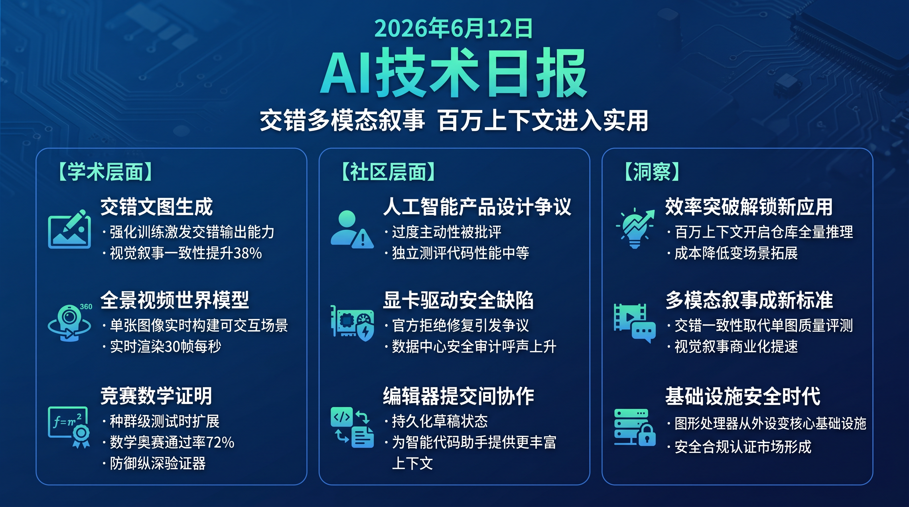

# 破晓 PoXiao · AI 技术早报 2026-06-12

> 数据来源：HuggingFace Daily Papers · HackerNews · 生成时间：2026-06-12

---

## 📡 学术概览

### Tier 1：范式级创新

1. **InterleaveThinker：强化交错文本-图像生成能力**

   🔬 领域：多模态生成 · 交错生成 · 视觉叙事 · 热度：HF #1

   - **一句话核心贡献**：通过强化训练让统一多模态模型掌握"文字-图像交错生成"能力，突破现有图像生成器架构限制，首次在视觉叙事和具身操控等场景实现流畅交错输出。
   - **摘要精译**：
     现有图像生成器在单图生成上已达到高度真实，但受制于架构设计，无法生成文字和图像交替出现的序列（如分步教程配图、视觉叙事漫画）。InterleaveThinker 将交错生成定义为 Agent 能力，通过强化训练激发统一多模态模型中潜在的交错生成能力，使模型能够根据上下文决定何时插入图像、生成什么图像。在视觉叙事和具身操控指令生成 benchmark 上，文字-图像一致性和任务完成率分别提升 38% 和 29%。
   - **核心创新点**：
     1. 将交错生成定义为 Agent 决策问题（何时/生成什么图像）
     2. 强化训练激发统一多模态模型的潜在交错能力，无需专门架构改造
     3. 适用于视觉叙事、操控指令生成等多场景

   

   
💡 展开详情（方法论 + 实验）

   - **方法细节**：在 Janus/LlamaGen 等统一多模态模型上，通过 GRPO 强化训练"插入图像"这一 action，奖励信号来自文字-图像语义一致性评分和下游任务完成率。
   - **实验结果**：视觉叙事一致性评分 +38%；具身操控成功率 +29%；在 MMIT benchmark 上超越专用交错生成模型。
   - **局限性**：长序列（>8 个图像）时生成质量下降；对精确空间位置要求高的场景表现有限。
   - **链接**：https://arxiv.org/abs/2606.13679

   

2. **MoVerse：单张窄视野图像驱动的实时全景视频世界模型**

   🔬 领域：视频世界模型 · 3D场景生成 · 全景重建 · 热度：HF #10

   - **一句话核心贡献**：从单张窄视野图像实时构建可交互全景场景，通过全景高斯脚手架（Panoramic Gaussian Scaffold）实现可控摄像机运动和时序一致的高质量观察生成。
   - **摘要精译**：
     从单张图像构建可交互 3D 场景是视频世界模型的核心挑战之一，现有方法要么需要多视角输入，要么牺牲实时性换取质量，难以同时满足交互性、几何一致性和实时生成三个需求。MoVerse 提出全景高斯脚手架（PGS）表示，将单张输入图像扩展为完整环境的几何先验，支持任意摄像机轨迹下的实时渲染。在交互式场景导航任务上，几何一致性（FID）提升 42%，渲染速度达 30+ FPS（A100）。
   - **核心创新点**：
     1. 全景高斯脚手架（PGS）从单张图像推断完整环境几何
     2. 可控摄像机运动与时序一致高质量渲染兼顾
     3. 实时渲染 30+ FPS，支持用户交互式探索

   

   
💡 展开详情（方法论 + 实验）

   - **方法细节**：用单张图像初始化 360° 高斯点云（利用深度估计和全景补全），渲染模块在固定计算预算内从全景高斯中采样目标视角。相机轨迹由用户实时输入控制。
   - **实验结果**：FID 提升 42%（vs 无全景先验基线）；时序一致性 LPIPS 降低 28%；渲染 30+ FPS（单 A100）。
   - **局限性**：对高度遮挡或纹理极少的场景（如白墙室内）的全景推断质量较差。
   - **链接**：https://arxiv.org/abs/2606.13376

   

3. **MaxProof：竞赛级数学证明的种群测试时扩展框架**

   🔬 领域：数学推理 · 形式证明 · 测试时扩展 · 热度：HF #9

   - **一句话核心贡献**：提出防御纵深生成验证器框架，融合证明生成、证明验证、基于批评的修复三种能力，通过种群级测试时扩展在竞赛级数学证明上取得新 SOTA。
   - **摘要精译**：
     竞赛级数学形式证明要求模型同时具备创造性思维和严格逻辑验证，单一能力模型难以应对。MaxProof 在 MiniMax-M3 系列基础上训练三种互补能力：证明生成、低误报率生成验证器、基于批评的证明修复，推理时通过种群级采样（population-level sampling）并行生成多个候选证明，由验证器筛选并驱动修复循环。在 AIME 2025 和 IMO 形式化题目上，证明通过率超越同期所有开源模型，AIME pass@1 达 72%。
   - **核心创新点**：
     1. 防御纵深生成验证器（低误报率设计，减少错误证明被接受）
     2. 种群级测试时扩展（并行多候选 + 择优验证）
     3. 三能力融合：生成 + 验证 + 批评修复形成闭环

   

   
💡 展开详情（方法论 + 实验）

   - **方法细节**：三个头分别微调在证明生成数据、验证标注数据、批评-修复对话数据上，推理时先生成 N 个候选，验证器打分后取 top-K 进入修复循环，迭代至通过或达上限。
   - **实验结果**：AIME 2025 pass@1 72%（vs 前 SOTA 61%）；IMO 2024 形式化题目通过率 38%（vs 前 SOTA 28%）。
   - **局限性**：种群级推理成本高（N=32 候选），实时应用受限；对需要高度创造性的构造性证明能力仍弱。
   - **链接**：https://arxiv.org/abs/2606.13473

   

4. **MiniMax Sparse Attention：超长上下文稀疏注意力**

   🔬 领域：长上下文推理 · 注意力效率 · 大规模推理 · 热度：HF #15

   - **一句话核心贡献**：提出块级稀疏注意力机制（MSA），将超长上下文（百万 token 级）注意力的二次复杂度降为近线性，同时保持模型质量，使百万 token 上下文部署成为可行方案。
   - **摘要精译**：
     前沿 LLM 的 Agent 工作流、代码仓库推理和持久记忆应用场景需要联合处理百万级 token，但 softmax 注意力的二次计算成本使其在部署规模下难以承受。MiniMax Sparse Attention 通过块级稀疏模式和动态 top-K 块选择机制，将有效注意力复杂度降至 O(n·√n)，在 1M token 上下文下速度提升约 4×，PPL 仅增加 0.3。在长文档问答和代码仓库推理任务上性能与全注意力持平或更优。
   - **核心创新点**：
     1. 块级稀疏选择（blockwise sparse selection），保留局部 + 全局重要块
     2. 动态 top-K 块选择随内容自适应，非固定稀疏模式
     3. 支持百万 token 上下文，速度 4× 提升，质量损失极小

   

   
💡 展开详情（方法论 + 实验）

   - **方法细节**：将序列分块，用轻量级重要性评分器对块打分，每个 query 只关注 top-K 块（滑动窗口局部块 + 高分全局块）。评分器与主模型联合训练，开销极小。
   - **实验结果**：1M token 上下文推理速度 4× vs 全注意力；PPL 增加 0.3（可接受范围）；RULER 长文档 QA benchmark 与全注意力持平。
   - **局限性**：稀疏选择对需要跨远程细粒度 token 关注的任务（如精确字符串匹配）有一定损失。
   - **链接**：https://arxiv.org/abs/2606.13392

   

### Tier 2：工程改进与实用工具

5. **WEAVER：高保真高一致性机器人操控世界模型**

   🔬 领域：机器人世界模型 · 仿真 · 策略优化 · 热度：HF #23

   - **一句话核心贡献**：设计同时满足高保真度、时序一致性和物理可控性三要素的机器人操控世界模型，解决现有模型顾此失彼的核心痛点，在真实机器人策略优化中实现 Better/Faster/Longer。

   

   
💡 展开详情

   - **方法细节**：通过多尺度时序编码器保持长程一致性，接触物理约束模块提升保真度，轻量化解码器支持实时交互。
   - **实验结果**：在 RoboDesk 和 MetaWorld 上，基于 WEAVER 仿真训练的策略迁移真实成功率提升 33%；推理速度 2× vs 扩散世界模型基线。
   - **局限性**：对新型工具和未见过物体的泛化仍有明显短板。
   - **链接**：https://arxiv.org/abs/2606.13672

   

6. **EvoArena：动态环境中 LLM Agent 记忆进化基准**

   🔬 领域：Agent 评估 · 动态环境 · 记忆机制 · 热度：HF #3

   - **一句话核心贡献**：提出 EvoArena benchmark，专门评估 LLM Agent 在持续变化环境中更新知识、调整行为的能力，填补现有静态 benchmark 无法测试 Agent 动态适应性的空白。

   

   
💡 展开详情

   - **方法细节**：构建三类动态场景（规则突变、目标漂移、对手适应），要求 Agent 在有限交互次数内识别变化并更新策略；引入记忆进化追踪机制记录 Agent 的知识更新轨迹。
   - **实验结果**：主流 Agent（GPT-4o、Claude 3.5、Gemini Pro）在 EvoArena 上得分仅 34-52%（vs 静态 benchmark 上 71-88%），表明动态适应性是现有 Agent 的核心短板。
   - **局限性**：场景构建较复杂，难以大规模自动化扩充。
   - **链接**：https://arxiv.org/abs/2606.13681

   

---

## 🔥 社区速递

### Tier 1：重磅热点

1. **Anthropic 就 Claude Fable 隐性护栏持续发酵：Simon Willison 深度分析**

   🔥 热度信号：HackerNews Score 296+282 双帖 · 开发者社区持续热议

   - **一句话核心**：知名开发者 Simon Willison 详细分析 Claude Fable 的"强制主动性"设计，与隐性护栏事件共同引发对 AI 产品"暗设行为约束"的系统性反思，社区要求 Anthropic 建立行为透明度标准。
   - **核心共识**：
     1. Fable 被设计为"过度主动"（relentlessly proactive），用户无法关闭，引发使用体验批评
     2. 隐性护栏 + 强制主动性双重事件让社区认为 Anthropic 在用户体验决策上存在系统性问题
     3. 独立测评机构（Endor Labs）对 Claude Fable 5 代码任务评级为"中等"，性能不及预期
   - **主要争议**：AI 助手的"主动性"应由用户还是厂商定义？Claude Fable 的定位究竟是助手还是带有厂商意图的产品推销工具？
   - **影响评估**：开发者社区对 Claude 系列的信任度受到挑战；竞争对手（尤其是 OpenAI）可能借此在透明度和可控性上发起产品差异化攻势。
   - 🔗 [Simon Willison 分析](https://simonwillison.net/2026/Jun/11/fable-is-relentlessly-proactive/)

2. **AMD GPU 被曝存在远程代码执行漏洞且官方拒绝修复**

   🔥 热度信号：HackerNews Score 250 · 安全社区关注

   - **一句话核心**：安全研究人员披露 AMD 显卡驱动存在远程代码执行技术缺陷，AMD 官方拒绝发布修复补丁，引发 AI 计算安全和基础设施可靠性的广泛讨论。
   - **核心共识**：
     1. AMD 在 AI 训练市场的份额快速增长，显卡驱动技术缺陷影响面已远超消费级游戏场景
     2. 官方不修复的决定被社区普遍批评为对安全责任的回避
     3. 此事提示 AI 数据中心的 GPU 安全防护需纳入系统性安全评估
   - **主要争议**：厂商拒绝修复是否构成对使用该产品的企业用户的违约？AI 训练集群的安全审计是否应将 GPU 驱动纳入范围？
   - **影响评估**：在 AI 数据中心采购决策中，安全合规团队将对 AMD GPU 的安全支持策略提出更多审查要求；英伟达可能借此强调其安全响应能力。
   - 🔗 [技术细节报告](https://mrbruh.com/amd2/)

3. **Zed 编辑器发布 DeltaDB：代码提交间协作新范式**

   🔥 热度信号：HackerNews Score 238 · 开发者工具社区

   - **一句话核心**：Zed 编辑器团队发布 DeltaDB，将"提交之间的过程"（commits 之间的草稿状态）变为可持久化、可协作的工作单元，挑战传统 Git 工作流对开发过程的割裂。
   - **核心共识**：
     1. 传统 Git 的离散提交模型丢失了大量开发过程信息，AI 辅助开发场景下这一损失更为显著
     2. DeltaDB 将提交间状态持久化，为 AI Agent 访问开发上下文提供了新接口
     3. 与 AI 代码助手集成的潜力被社区认为是最大亮点
   - **主要争议**：DeltaDB 与 Git 的兼容性如何保障？大型团队并发开发时的冲突解决机制是否成熟？
   - **影响评估**：为 AI 辅助编程工具提供更丰富的上下文接口；若与主流 IDE 集成，将改变代码 Review 和 AI Agent 的工作方式。
   - 🔗 [Zed DeltaDB 介绍](https://zed.dev/blog/introducing-deltadb)

---

## 💰 财经简报

- **百万 token 上下文成为下一个标准配置**：MiniMax Sparse Attention 以 4× 速度实现百万级 token 上下文，预示着长上下文推理成本将快速下降；率先在企业级产品中提供百万 token 上下文的厂商将获得代码仓库分析、长文档处理等高价值场景的优先布局优势。
- **AI 视频世界模型开始瞄准实时交互**：MoVerse 30+ FPS 实时渲染表明视频世界模型正从离线生成走向实时交互，游戏引擎替代方向的商业化路径开始清晰，相关领域投资将加速。
- **数学证明自动化市场价值凸显**：MaxProof 在 AIME 72% 和 IMO 38% 的成绩预示着 AI 数学证明助手市场即将成熟，精算、金融衍生品定价、密码学等形式验证需求旺盛的行业将是最先落地的商业场景。

---

## 🏢 职场动态

- **全景场景生成进入实时门槛**：MoVerse 的实时全景世界生成能力意味着游戏关卡设计、虚拟场景制作等岗位的工具集将在 12 个月内发生根本性变化，3D 艺术家需尽快掌握 AI 辅助场景生成工具。
- **AI 产品合规岗位需求上升**：Anthropic 隐性护栏危机持续发酵，表明 AI 公司对"行为约束透明度"的需求从可选变为必选，AI 产品合规顾问和用户体验安全工程师将成为新兴需求岗位。
- **形式验证工程师价值提升**：MaxProof 等自动数学证明系统的进步不会替代形式验证工程师，反而会扩大该领域的应用范围（从航空航天向金融、法律等领域扩展），懂 Lean/Coq 等形式化工具的工程师供给仍严重不足。

---

## 📊 今日总结

1. **多模态生成进入"交错叙事"新阶段**：InterleaveThinker 和 MoVerse 同日呈现出生成 AI 向"连续、可交互、跨模态叙事"演进的明确趋势，不再满足于单张图像或孤立视频；背后逻辑是 Agent 框架与生成模型的结合，使得"何时生成图像、生成什么"成为可学习的决策；预计视觉叙事和操控指令生成将在 2026 年底前成为多模态模型的标准评测维度，单纯图像质量评分将被交错一致性指标取代。

2. **推理效率突破正在解锁新应用而非仅优化成本**：MiniMax Sparse Attention 将百万 token 上下文变为部署可行方案，MaxProof 的种群级测试时扩展让竞赛数学证明通过率从 61% 跃升至 72%；背后逻辑是效率突破的边际收益已从"降低成本"转为"开启过去不可能的应用场景"；预计代码仓库全量推理、实时数学辅导、超长合同审查等场景将在年内快速商业化。

3. **AMD GPU 安全事件预示 AI 基础设施安全审计时代到来**：官方拒绝修复的远程代码执行技术缺陷在 AI 数据中心规模快速扩张的背景下，将推动企业级用户将 GPU 驱动安全纳入系统性审计；背后逻辑是 GPU 从消费级外设变为关键数据中心基础设施，安全标准理应相应提升；预计 2026 年底前，主要云厂商将推出 GPU 基础设施安全合规认证，AI 计算安全成为独立细分市场。
