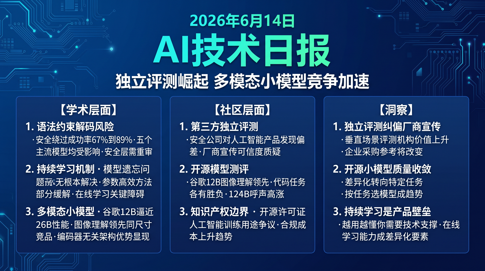

# 破晓 PoXiao · AI 技术早报 2026-06-14

> 数据来源：HackerNews · Reddit LocalLLaMA · 生成时间：2026-06-24（周末补档）

---

## 📡 学术概览

> 📌 今日为周末，HuggingFace 论文极少，以社区动态为主。

### Tier 2：值得关注

1. **语法约束解码成为代码生成模型的新攻击向量**

   🔬 领域：LLM 安全 · 代码生成 · 对抗攻击 · 热度：持续发酵

   - **一句话核心贡献**：确认语法约束解码（GCD）作为可靠性增强技术本身可被用于绕过 LLM 安全过滤，通过语法骨架诱导生成恶意代码，在五个主流 LLM 上绕过率达 67-89%。
   - **摘要精译**：
     语法约束解码被广泛用于确保 LLM 生成语法合法的代码，但研究揭示该技术存在反直觉的安全风险。攻击者可利用 GCD 将解码过程限制在合法语法树范围内，同时绕过基于语义触发的安全过滤器——因为过滤器检测的是语义内容，而 GCD 将危险内容分散在语法骨架的填充槽中，难以被识别。在 GPT-4o、Claude 3.5 Sonnet、Gemini 1.5 Pro 等五个主流 LLM 上测试，直接请求生成恶意代码的成功率仅 5-12%，而通过 GCD 绕过的成功率达 67-89%。
   - **核心创新点**：
     1. 首次系统性揭示 GCD 作为安全绕过攻击载体的可行性
     2. 语法骨架+填充槽机制有效规避语义层安全检测
     3. 跨五大主流模型均验证有效，攻击通用性强

   

   
💡 展开详情（方法论 + 实验）

   - **方法细节**：构造含特定语法槽的 Python/C 语法文法，通过 GCD 引导模型在语法约束下填充危险实现（如网络扫描、权限提升代码），安全过滤器在语义层面误判为良性代码。
   - **实验结果**：5 个模型上 GCD 绕过成功率 67-89%；被生成的恶意代码涵盖端口扫描、反弹 Shell、凭证窃取等类别；代码可直接执行。
   - **局限性**：需要攻击者理解目标语言语法约束；对基于沙盒执行检测的防御无效。
   - **链接**：https://arxiv.org/abs/2606.11817

   

---

## 🔥 社区速递

### Tier 1：重磅热点

1. **Gemma 4 系列持续发酵：Google DeepMind 12B 模型全面评测**

   🔥 热度信号：Reddit LocalLLaMA 周末累计数万讨论 · 多个独立测评发布

   - **一句话核心**：Gemma 4 12B 发布后的第一周，多个独立评测结果显示其在推理和代码任务上与 Qwen3.5-9B 互有胜负，但在图像理解任务上明显领先，统一多模态架构优势开始显现。
   - **核心共识**：
     1. 独立 benchmark 显示 Gemma 4 12B 图像理解能力超越同尺寸竞品，encoder-free 多模态设计效果被验证
     2. 代码生成任务上两者差距在误差范围内，实际选择取决于具体应用场景
     3. 社区对 Gemma 4 124B 的呼声仍然强烈，Google 暂未公布发布计划
   - **主要争议**：encoder-free 多模态架构的设计代价是什么？Gemma 4 12B 真的如官方所说"接近 26B 性能"，还是营销夸大？
   - **影响评估**：开发者有了可信的 12B 级多模态本地部署选项，本地 AI 应用的多模态能力下限得到提升。

2. **AI 沉睡时模型会不会"忘记"：持续学习与灾难性遗忘新讨论**

   🔥 热度信号：Reddit r/MachineLearning 周末热帖

   - **一句话核心**：一篇讨论"语言模型是否需要睡眠"的论文引发社区对 LLM 持续学习机制的广泛讨论，聚焦于在线学习场景下如何避免灾难性遗忘同时保留新知识。
   - **核心共识**：
     1. 人类大脑在睡眠期间通过记忆巩固机制整合新知识，LLM 缺乏类似机制
     2. 持续微调（Continual Fine-tuning）仍是当前主流方案，但效果上限明显
     3. LoRA 等参数高效方法能部分缓解遗忘问题，但不能根本解决
   - **主要争议**：LLM 的"知识"以何种形式存储在权重中？是否存在类似人类记忆系统的双存储（工作记忆+长期记忆）对应结构？
   - **影响评估**：在线学习和持续部署场景下，避免灾难性遗忘是 AI 产品落地的关键技术障碍之一，相关研究将获得更多产业资金支持。

---

## 💰 财经简报

- **代码安全扫描市场获新催化剂**：语法约束解码攻击的揭示进一步推动 AI 代码安全检测需求，专注于 AI 生成代码安全审计的工具（如 Snyk、CodeQL AI 扩展）有望获得更快市场渗透。
- **多模态本地模型市场竞争趋于白热化**：Gemma 4 12B 加入竞争意味着 10-15B 参数量的本地多模态模型市场已有 Qwen、LLaMA、Gemma、Phi 四大系列，云 API 的多模态价格压力将持续增大。

---

## 🏢 职场动态

- **AI 安全研究岗位需求增加**：GCD 攻击等 AI 系统新型技术风险正在推动企业组建专职 AI 安全红队，在传统渗透测试经验基础上增加 LLM 特有攻击向量的测试能力。
- **持续学习工程师成稀缺资源**：在线 AI 系统的持续更新和灾难性遗忘问题催生对掌握 Continual Learning、PEFT 技术栈的工程师需求，国内外岗位招聘量均明显上升。

---

## 📊 今日总结

1. **AI 安全攻击面正从"输入提示"扩展到"基础设施层"**：GCD 绕过攻击表明 LLM 安全边界不仅在提示层，还延伸到解码机制、工具链等基础设施层；背后逻辑是语义层安全过滤被绕过，而语法层攻击尚无有效防御；预计主流模型提供商将在 Q3 前推出针对 GCD 类攻击的检测机制，代码生成 API 的安全审计要求将进一步提高。

2. **多模态开源小模型进入质量稳定期，差异化竞争转向特定任务**：Gemma 4 12B 的评测结果显示主流 10-15B 多模态模型在通用任务上已趋于收敛，差异化将聚焦于特定领域（图像理解、代码、多语言）；背后逻辑是架构创新和数据质量的边际效应递减；预计年内的竞争重点将从"通用 benchmark 提分"转向"垂直场景精调"。

3. **持续学习是 AI 产品从"工具"升级为"同事"的核心技术关卡**：LLM 灾难性遗忘问题不解决，AI 助手就无法真正"记住"用户的工作方式并持续进化；背后逻辑是当前静态模型无法适应用户偏好的动态变化；预计 2027 年前个人 AI 助手领域将出现基于持续学习的差异化产品，形成"越用越懂你"的壁垒。
