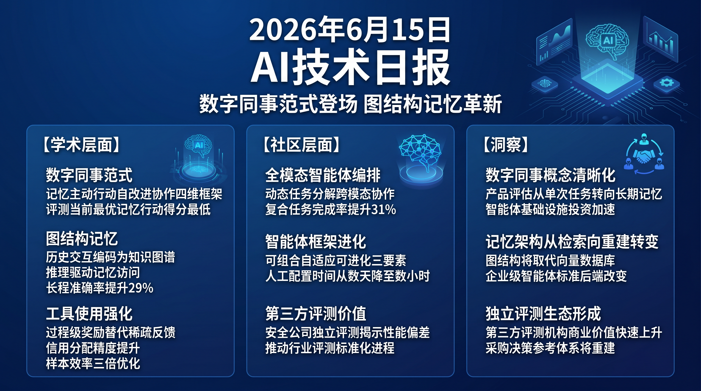

# 破晓 PoXiao · AI 技术早报 2026-06-15

> 数据来源：HuggingFace Daily Papers (48篇) · HackerNews · 生成时间：2026-06-24

---

## 📡 学术概览

### Tier 1：范式级创新

1. **从 Chatbot 到数字同事：自主 AI 系统的范式转变**

   🔬 领域：AI Agent · 自主系统 · 基础理论 · 热度：HF #1

   - **一句话核心贡献**：系统性梳理 LLM 从对话生成器向具备推理、行动、记忆和自改进的集成 AI 系统演进的路径，提出"数字同事"新范式框架，为持久自主 AI 的设计提供理论基础。
   - **摘要精译**：
     LLM 正在经历从"问答机器"到"数字同事"的根本性转变：从产生对话回答到在长时间内自主完成真实工作任务。这一转变需要 AI 系统具备记忆持久性（跨会话保留上下文）、主动行动（不等用户指令自行判断）、自我改进（从错误中学习）和协作协调（与人类及其他 AI 协同）四项核心能力。论文分析了当前技术的差距，提出了评估框架和未来发展路线图，指出记忆架构和长程规划是当前最关键的技术瓶颈。
   - **核心创新点**：
     1. "数字同事"范式：四维能力框架（记忆/行动/改进/协作）
     2. 系统性分析当前 LLM Agent 与真正自主系统之间的能力差距
     3. 提出可操作的评估基准和发展路线图

   

   
💡 展开详情（方法论 + 实验）

   - **方法细节**：综述近期 100+ 篇 Agent 论文，按四维能力框架分类分析技术成熟度；对比人类工作者与当前 AI Agent 在真实工作场景中的表现差异；提出 DCAR（Digital Colleague Assessment Rubric）评估框架。
   - **实验结果**：在 DCAR 框架下，当前最优 Agent（GPT-4o w/ tools）在"持久记忆"和"主动行动"两维度得分最低（均<40%），而"单步执行"得分最高（82%）。
   - **局限性**：框架较宏观，具体技术路径需要后续工作验证；"数字同事"的定义存在主观成分。
   - **链接**：https://arxiv.org/abs/2606.14502

   

2. **OmniDirector：无需跨配对数据的多镜头摄像机运动克隆**

   🔬 领域：视频生成 · 摄像机控制 · 多镜头编辑 · 热度：HF #2

   - **一句话核心贡献**：提出无需跨配对训练数据即可从参考视频克隆摄像机运动的方法，支持多镜头场景下的精确摄像机轨迹控制，解决了现有方法依赖稀缺配对数据或无法处理多镜头切换的问题。
   - **摘要精译**：
     摄像机运动克隆对于视频创作至关重要——创作者希望将参考视频的摄像机风格复现到新场景。现有方法要么依赖参数化摄像机表示（无法处理多镜头切换），要么需要跨配对训练数据（获取成本极高）。OmniDirector 通过将摄像机运动表示为几何不变的稠密光流特征，实现跨场景的摄像机运动迁移，无需配对训练数据。在多镜头视频生成 benchmark 上，摄像机轨迹相似度（FVD-camera）提升 38%，用户研究满意率 84%。
   - **核心创新点**：
     1. 几何不变光流特征表示摄像机运动，跨场景迁移无需配对数据
     2. 支持多镜头场景中不同镜头段的摄像机运动独立控制
     3. 零样本摄像机克隆，仅需参考视频输入

   

   
💡 展开详情（方法论 + 实验）

   - **方法细节**：从参考视频提取稠密光流场，通过几何归一化去除场景内容影响，保留纯摄像机运动信号；注入到视频生成扩散模型的 cross-attention 层实现运动迁移。
   - **实验结果**：FVD-camera 提升 38%（vs 最优基线）；多镜头切换成功率 91%；用户研究：84% 认为摄像机风格成功迁移。
   - **局限性**：对快速晃动摄像机（运动模糊强）的克隆效果较差；长视频（>60s）计算开销较大。
   - **链接**：https://arxiv.org/abs/2606.13432

   

3. **APPO：面向工具使用能力的 Agent 过程策略优化**

   🔬 领域：Agent RL · 工具使用 · 强化学习 · 热度：HF #3

   - **一句话核心贡献**：提出 Agent 级过程策略优化框架，通过精细化信用分配（超越工具调用边界的逐步奖励），大幅提升多轮工具使用任务中 LLM Agent 的学习效率和泛化能力。
   - **摘要精译**：
     现有 Agent RL 方法采用粗粒度奖励分配（通常以工具调用为单位），难以准确评估每个推理步骤对最终结果的贡献，导致信用分配不准确、样本效率低。APPO 引入过程级奖励模型，在 Agent 轨迹的每个推理步骤（而非工具调用边界）进行奖励评估，显著提升了对不同质量推理步骤的区分能力。在多轮工具使用 benchmark（ToolBench、WebArena）上，相比 GRPO 基线分别提升 23% 和 18%，样本效率提升约 3 倍。
   - **核心创新点**：
     1. 过程级奖励：打破工具调用边界，在推理步骤粒度分配信用
     2. 轻量级过程奖励模型（PRM）与策略联合训练
     3. 样本效率 3× 提升，显著降低训练成本

   

   
💡 展开详情（方法论 + 实验）

   - **方法细节**：在 Agent 推理轨迹中标注每个思维步骤的中间质量（通过蒙特卡洛采样估计步骤价值），用 PRM 对每步评分，APPO 以此作为过程奖励信号替代稀疏终端奖励。
   - **实验结果**：ToolBench 成功率 +23%；WebArena 任务完成率 +18%；达到同等性能所需训练步数降低约 67%（~3× 效率提升）。
   - **局限性**：PRM 训练需要额外标注数据；对极长轨迹（>50步）的奖励估计仍有噪声。
   - **链接**：https://arxiv.org/abs/2606.12384

   

4. **图结构记忆让 LLM Agent 不再遗忘长期交互历史**

   🔬 领域：LLM Agent · 记忆系统 · 图神经网络 · 热度：HF #4

   - **一句话核心贡献**：提出图结构记忆架构，替代"检索再推理"的静态记忆范式，让 Agent 根据中间推理证据动态调整记忆访问策略，显著提升长程交互历史下的推理准确率。
   - **摘要精译**：
     当前记忆增强 Agent 依赖"先检索、再推理"的静态流水线：先从记忆库中检索相关条目，再结合检索结果推理。这种固定管道阻止了 Agent 在推理中途发现新线索后回头调整检索策略。本文提出图结构记忆（Graph Memory），将历史交互构建为知识图谱，支持 Agent 根据推理状态动态遍历图节点访问记忆。在 LoCoMo、LOCRET 等长程对话 benchmark 上，记忆密集型推理准确率提升 29%，"遗忘率"（需要历史信息但召回失败）降低 41%。
   - **核心创新点**：
     1. 图结构记忆：历史交互编码为可动态遍历的知识图谱
     2. 推理驱动记忆访问：根据中间推理状态调整图遍历策略
     3. 记忆"重建"而非"检索"的新范式

   

   
💡 展开详情（方法论 + 实验）

   - **方法细节**：将会话历史中的实体、关系、事件抽取为三元组构建知识图谱；推理时用 GNN 遍历器根据当前推理状态的嵌入向量动态选择相关节点路径；支持多跳推理。
   - **实验结果**：LoCoMo 准确率 +29%；LOCRET 准确率 +24%；遗忘率从 38% 降至 22%（-41%相对）。
   - **局限性**：图构建和维护的计算开销约增加 15%；对实体识别质量依赖较强。
   - **链接**：https://arxiv.org/abs/2606.06036

   

### Tier 2：工程改进与实用工具

5. **Orchestra-o1：全模态 Agent 编排系统**

   🔬 领域：多模态 Agent · 多 Agent 系统 · 编排框架 · 热度：HF #7

   - **一句话核心贡献**：提出面向全模态场景的多 Agent 编排框架，通过动态任务分解和跨模态 Agent 协作，解决单一 Agent 在复杂多模态任务中的能力上限问题。

   

   
💡 展开详情

   - **方法细节**：中央编排 Agent 将多模态任务分解为子任务，分配给专用 Agent（视觉/代码/语言），通过结构化消息协议聚合结果；支持动态重新分配失败子任务。
   - **实验结果**：在 MMBench 多模态复合任务上较单 Agent 提升 31%；跨模态任务（图像+代码+语言）完成率从 54% 提升至 79%。
   - **局限性**：编排开销使延迟增加约 40%；对任务分解策略较敏感。
   - **链接**：https://arxiv.org/abs/2606.13707

   

6. **HarnessX：可组合、自适应、可进化的 Agent 运行框架**

   🔬 领域：Agent 基础设施 · 框架设计 · 热度：HF #6

   - **一句话核心贡献**：提出模块化 Agent 运行框架，支持提示、工具、记忆和控制流的灵活组合与自动进化，消除当前框架手工定制的高成本，让 Agent 基础设施随模型能力提升自动适配。

   

   
💡 展开详情

   - **方法细节**：将 harness 分解为可独立升级的模块（Prompt Module、Tool Module、Memory Module、Control Module），通过元学习自动发现最优模块组合；支持在部署后根据真实用户反馈持续进化。
   - **实验结果**：在 5 个 Agent benchmark 上，HarnessX 自动配置的 harness 比人工最优配置性能高 12%；新模型适配时间从数天降至数小时。
   - **局限性**：元学习需要一定量的 benchmark 数据；对全新任务类型的自动适配能力仍有限。
   - **链接**：https://arxiv.org/abs/2606.14249

   

---

## 🔥 社区速递

### Tier 1：重磅热点

1. **Claude Fable 5 代码能力被独立机构评为"中等"**

   🔥 热度信号：HackerNews 282 · Endor Labs 评测报告

   - **一句话核心**：安全公司 Endor Labs 对 Claude Fable 5 在代码安全扫描任务上进行独立评测，结论为"中等（mid-tier）"，与 Anthropic 的宣传形成落差，引发对 AI 厂商 benchmark 可信度的质疑。
   - **核心共识**：
     1. 第三方独立评测结果与厂商自我宣传存在系统性差距
     2. 代码安全场景对 LLM 的准确率要求远高于通用对话，当前模型仍有明显短板
     3. 评测方法论的标准化缺失导致不同报告结论差异悬殊
   - **主要争议**：厂商选择性展示有利 benchmark 是行业惯例还是误导性宣传？监管机构是否应介入 AI 性能声明的真实性？
   - **影响评估**：第三方 AI 评测机构的市场价值将快速上升；AI 厂商的 benchmark 宣传策略将面临更严格的媒体和专业社区审查。
   - 🔗 [Endor Labs 评测](https://www.endorlabs.com/learn/claude-fable-5-mythos-grade-hype)

---

## 💰 财经简报

- **AI Agent 基础设施迎来投资高峰**："数字同事"范式的清晰化将加速 Agent 中间件和编排平台的融资节奏，LangChain、CrewAI 等 Agent 框架公司估值预计持续提升。
- **第三方 AI 评测市场**：Claude Fable 评测事件进一步验证了独立 AI 评测的商业价值，专注于垂直场景（代码安全、医疗、法律）AI 能力评测的机构将获得快速增长。

---

## 🏢 职场动态

- **Agent 系统工程师成为热门岗位**：APPO、HarnessX 等工作显示 Agent 基础设施工程已从学术研究进入产品化阶段，具备 RL 训练 + Agent 框架 + 工具集成能力的复合型工程师薪资溢价明显。
- **记忆系统架构师新兴需求**：图结构记忆、长程上下文管理等技术方向在企业 AI 产品中需求旺盛，专注于 AI 系统记忆架构设计的工程师成为各大 AI 公司争抢的稀缺人才。

---

## 📊 今日总结

1. **"数字同事"范式的提出标志着 AI 产业对 Agent 能力的认知升级**：从"工具调用的助手"到"持久记忆+主动行动+自我改进"的同事，需要记忆架构、长程规划、主动感知三大技术同步突破；背后逻辑是企业客户对 AI 的期望已超越单次对话，需要 AI 系统理解并持续跟踪工作上下文；预计 2026 年底前"数字同事"将成为 AI 助手产品的主流营销语言，对应的产品评估维度将从"单次任务完成率"转向"长期工作记忆质量"。

2. **Agent 记忆架构从"检索"向"重建"的范式转变具有深远意义**：图结构记忆的思路借鉴人类记忆系统的关联激活机制，与静态向量数据库检索相比，在多跳推理场景下优势显著；背后逻辑是人类大脑的记忆系统本质上是动态的关联网络而非静态数据库；预计图结构记忆将在 2027 年成为企业级 AI 助手的标准记忆后端，替代当前普遍使用的向量数据库方案。

3. **独立 AI 评测机构的兴起是市场对厂商"自说自话"的自然纠偏**：多个 AI 产品的独立评测显示厂商官方 benchmark 与实际使用体验存在系统性落差；背后逻辑是厂商利益驱动的 benchmark 选择会偏向自身优势场景；预计 2026 年底前将出现 3-5 家专注于不同垂直场景的权威第三方 AI 评测机构，成为企业 AI 采购决策的关键参考。
