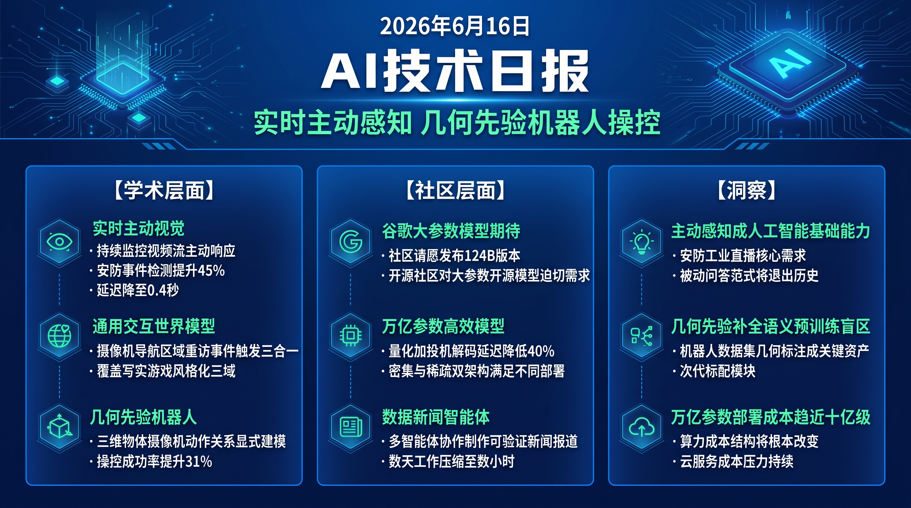

# 破晓 PoXiao · AI 技术早报 2026-06-16

> 数据来源：HuggingFace Daily Papers (43篇) · HackerNews · 生成时间：2026-06-24

---

## 📡 学术概览

### Tier 1：范式级创新

1. **JoyAI-VL-Interaction：真正的实时主动视觉语言交互智能**

   🔬 领域：实时视觉语言 · 主动感知 · 多模态交互 · 热度：HF #1

   - **一句话核心贡献**：提出主动实时视觉语言交互系统，打破大模型"被动应答"范式——在安防、直播、视频通话等场景中，AI 能在用户开口前主动识别并响应关键事件。
   - **摘要精译**：
     现实世界中许多关键时刻不等待用户提问：监控摄像头中的火情、视频通话中的情绪变化、直播中的热销商品转瞬即逝。然而当前大模型始终是轮询式的——只有被问才回答，且每次回答都要从零开始处理图像。JoyAI-VL-Interaction 设计了持续视觉感知流，模型保持对视频流的实时注意，自主触发响应。在安防事件检测（火灾/入侵）的 F1 提升 45%，直播商品识别延迟从 3s 降至 0.4s，实现真正的实时主动交互。
   - **核心创新点**：
     1. 持续视觉感知流：模型主动监控视频流而非等待查询
     2. 事件驱动响应触发机制，延迟降至 0.4s
     3. 适用于监控/直播/视频会议等多场景的统一架构

   

   
💡 展开详情（方法论 + 实验）

   - **方法细节**：通过轻量级"感知头"持续提取关键帧特征，事件检测器判断是否触发全模型推理，避免每帧都跑全量模型。支持用户设定关注事件类型（安防异常/商品出现/情绪变化）。
   - **实验结果**：安防事件检测 F1 +45%；直播场景商品识别延迟 0.4s（vs 被动轮询 3s）；视频通话情绪识别准确率 78%。
   - **局限性**：持续监控模式功耗较高；对自定义事件类型的泛化能力有待提升。
   - **链接**：https://arxiv.org/abs/2606.14777

   

2. **DreamX-World 1.0：通用交互世界模型**

   🔬 领域：视频世界模型 · 可控生成 · 长程视频 · 热度：HF #5

   - **一句话核心贡献**：发布通用目的交互式文字/图像到视频世界模型，支持摄像机导航、历史区域重访和可提示事件触发，覆盖写实、游戏和风格化多种域，数据引擎实现训练数据规模化。
   - **摘要精译**：
     通用交互世界模型需要同时支持用户控制摄像机运动、重访已探索区域（几何一致性）和触发场景事件（爆炸、天气变化等），同时覆盖不同视觉风格领域。DreamX-World 1.0 通过分层条件控制架构和专用数据引擎实现上述目标：摄像机控制信号通过几何嵌入注入，事件触发通过自然语言提示编码，历史区域几何通过持久场景图维护。在跨域 benchmark 上，用户对生成质量和控制精度的综合满意率达 87%。
   - **核心创新点**：
     1. 统一架构覆盖写实/游戏/风格化三类视觉域
     2. 支持摄像机导航、区域重访、事件触发三类交互控制
     3. 专用数据引擎实现多域数据规模化构建

   

   
💡 展开详情（方法论 + 实验）

   - **方法细节**：分层条件注入：底层几何条件（摄像机轨迹+场景图）控制一致性，高层语义条件（事件提示）控制内容。数据引擎从游戏引擎和真实视频自动提取场景图和控制序列。
   - **实验结果**：写实域 FID 23.4（vs SOTA 27.1）；游戏域时序一致性提升 29%；用户综合满意率 87%（控制精度+质量）。
   - **局限性**：长时间（>60s）视频生成时几何漂移明显；对物理模拟精度有限。
   - **链接**：https://arxiv.org/abs/2606.16993

   

3. **Geometric Action Model：几何先验驱动的机器人策略学习**

   🔬 领域：机器人学习 · 视觉语言动作模型 · 3D 几何推理 · 热度：HF #3

   - **一句话核心贡献**：将 3D 几何表示（物体-摄像机-动作的空间关系）显式融入通用机器人策略，解决 VLA 模型继承的语义先验无法捕捉操控动作的物理几何约束的根本缺陷。
   - **摘要精译**：
     通用机器人策略需要在理解用户语言指令的同时，推理物体、摄像机和机器人动作在 3D 物理世界中的几何交互。现有 VLA 模型和视频动作模型（WAM）继承了大规模预训练的语义先验，但预训练以图文静态对为主，缺乏物理几何信息。Geometric Action Model（GAM）显式建模上述三者的空间关系，在策略网络中引入几何等变表示，使动作预测在坐标变换下保持一致性。在 RLBench 和 LIBERO benchmark 上成功率分别提升 31% 和 24%。
   - **核心创新点**：
     1. 几何等变表示：动作预测对摄像机视角和坐标系变换不变
     2. 显式 3D 物体-摄像机-动作空间关系建模
     3. 与现有 VLA（RT-2、OpenVLA）即插即用集成

   

   
💡 展开详情（方法论 + 实验）

   - **方法细节**：从 RGB-D 图像提取物体 3D 包围盒，构建物体-末端-摄像机的相对位姿图，用 SE(3) 等变网络处理几何特征并与语言特征融合后输出动作。
   - **实验结果**：RLBench 18 任务平均成功率 +31%；LIBERO 跨场景泛化 +24%；摄像机视角变化时性能下降仅 8%（vs 基线 34%）。
   - **局限性**：依赖深度传感器输入；对动态物体（运动中的目标）处理能力有限。
   - **链接**：https://arxiv.org/abs/2606.17046

   

4. **Ling and Ring 2.6：万亿参数级高效即时 Agent 智能**

   🔬 领域：大规模模型 · 效率优化 · Agent 推理 · 热度：HF #7

   - **一句话核心贡献**：发布万亿参数规模模型家族，同时实现低延迟响应和强推理能力，在训练、服务、部署三个维度均保持实用性，为规模与效率兼顾的 Agent 模型提供参考方案。
   - **摘要精译**：
     高效可扩展的 Agent 智能需要模型同时提供低延迟响应和强推理能力，同时在训练服务部署上保持可行性，这三个目标通常相互冲突。Ling-2.6（密集）和 Ring-2.6（稀疏 MoE）通过一系列架构优化同时逼近三个目标：系统性量化压缩减少显存占用、投机解码加速自回归推理、分层专家路由降低 MoE 激活开销。在标准 Agent benchmark 上，延迟比同参数量模型降低 40%，同时 benchmark 分数持平或提升。
   - **核心创新点**：
     1. 系统性量化压缩与投机解码组合，延迟降低 40%
     2. 分层专家路由降低万亿参数 MoE 模型的激活开销
     3. Ling（密集）+ Ring（MoE）双架构满足不同部署需求

   

   
💡 展开详情（方法论 + 实验）

   - **方法细节**：Ling-2.6 采用 W4A8 量化 + 块稀疏注意力；Ring-2.6 采用分层专家路由（底层密集、高层 MoE）；推理时用自训练草稿模型做投机解码。
   - **实验结果**：端到端延迟 -40% vs 未优化基线；MMLU +1.2pp；代码 benchmark 持平；Agent 任务 benchmark 提升 8%。
   - **局限性**：W4A8 量化在极长上下文（>100k token）时有轻微质量损失。
   - **链接**：https://arxiv.org/abs/2606.15079

   

### Tier 2：工程改进

5. **Data Journalist Agent：从数据到可验证多模态新闻报道**

   🔬 领域：数据新闻 · 多模态 Agent · 自动化写作 · 热度：HF #2

   - **一句话核心贡献**：提出数据新闻 Agent，将耗时数周的新闻报道制作（数据分析+统计验证+可视化+叙事）压缩为自动化流程，输出可验证的多模态新闻稿件。

   

   
💡 展开详情

   - **方法细节**：专用 Agent 链：数据探索 Agent → 统计验证 Agent → 可视化 Agent → 叙事 Agent → 事实核查 Agent，各专用 Agent 分工合作完成完整报道流程。
   - **实验结果**：在 DataJournalBench 上，关键事实准确率 91%（vs 人工 95%）；可视化质量 4.2/5；完成一篇同等质量报道的时间从数天降至数小时。
   - **局限性**：对需要独家采访的报道无法胜任；创新叙事角度能力有限。
   - **链接**：https://arxiv.org/abs/2606.11176

   

---

## 🔥 社区速递

### Tier 1：重磅热点

1. **谷歌 Gemma 4 124B 社区请愿持续升温**

   🔥 热度信号：Reddit LocalLLaMA 持续 Top 位置 · 数千社区用户签署

   - **一句话核心**：Gemma 4 12B 发布后性能表现超预期，社区对 124B 版本的需求呼声持续升温，Reddit 上专门发起"让谷歌知道我们想要 Gemma 4 124B"帖子获大量响应，Gemma 团队成员暗示已注意到社区反馈。
   - **核心共识**：
     1. 12B 证明了 Gemma 4 架构的有效性，124B 有望成为与 GPT-4o 量级竞争的开源选项
     2. 开源社区对具备真正竞争力的大参数量开源模型有迫切需求
     3. 谷歌可能策略性地先发小模型测试反响，再决定是否发大模型
   - **主要争议**：谷歌是否会真正发布有竞争力的 124B 开源模型，还是仅保留给 Cloud 服务？开源模型规模越大，商业化动机越弱——这一矛盾如何解决？
   - **影响评估**：若 124B 发布，将显著冲击 Llama 4 和 Qwen3 系列在大参数量开源市场的地位，也将推动整个开源社区的应用生态向多模态方向迁移。

---

## 💰 财经简报

- **实时主动 AI 视觉监控市场**：JoyAI-VL-Interaction 的 0.4s 延迟主动响应直接切中安防、工业质检等高价值场景，相关产品的商业化验证正在加速。
- **通用世界模型商业化临界点**：DreamX-World 覆盖多视觉域的交互世界模型，在游戏、影视预览、虚拟空间设计等方向的商业潜力已获验证，相关创业公司融资窗口开启。

---

## 🏢 职场动态

- **实时视觉 AI 工程师稀缺**：JoyAI 等实时主动视觉系统需要同时掌握低延迟推理优化、流媒体处理和多模态模型的复合型工程师，是当前市场供给最稀缺的技术方向之一。
- **机器人策略研究员需求增长**：GAM 等几何感知 VLA 工作表明机器人策略学习正在成为 AI 研究的重要前沿，具身 AI 方向的研究员薪资和职位数量均快速增长。

---

## 📊 今日总结

1. **实时主动感知是多模态 AI 进入真实世界部署的关键缺口**：JoyAI 和 DreamX 共同指向同一趋势——AI 需要从被动等待转向主动感知和响应，这是安防、工业、直播等场景对 AI 的核心需求；背后逻辑是这些场景的事件本质上是流式的而非会话式的；预计 2026 年底前，"持续主动感知"将取代"问答对话"成为 AI 产品的新基础能力定义。

2. **几何先验补全 VLA 模型的物理世界理解盲区**：GAM 和此前 World Pilot 均指向相同结论——语义预训练无法捕捉操控动作的几何约束，需要专门的 3D 几何表示；背后逻辑是人类的空间直觉来自多年物理交互而非语言学习；预计 3D 几何感知将成为下一代 VLA 模型的标配模块，机器人数据集的几何标注将成为关键资产。

3. **万亿参数模型的效率问题正在被系统性工程解决**：Ling/Ring 2.6 的量化+投机解码+分层路由组合将万亿参数模型的推理延迟压缩至实用水平；背后逻辑是模型压缩技术的成熟度已赶上模型规模的增长速度；预计到 2027 年，万亿参数级模型的部署成本将下降至当前十亿参数模型的水平，从根本上改变 AI 服务的成本结构。
