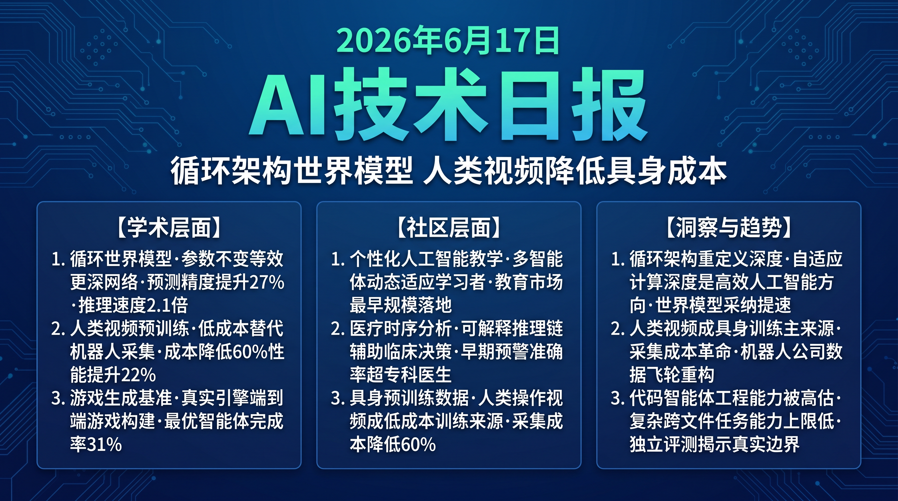

# 破晓 PoXiao · AI 技术早报 2026-06-17

> 数据来源：HuggingFace Daily Papers (31篇) · HackerNews · 生成时间：2026-06-24

---

## 📡 学术概览

### Tier 1：范式级创新

1. **Looped World Models：循环架构解决世界模型深度-效率悖论**

   🔬 领域：世界模型 · 循环架构 · 长程仿真 · 热度：HF #1

   - **一句话核心贡献**：提出循环世界模型（LoopWM），通过共享权重的循环 Transformer 块替代堆叠层数，在不增加参数量的前提下实现深度计算，首次从架构层面解决世界模型"深度仿真=高成本"的根本矛盾。
   - **摘要精译**：
     高保真长程世界模型仿真需要深度计算，但更深的模型部署昂贵且容易积累误差。循环架构（同一模块块反复应用）理论上可以在不增加参数的情况下等效更深的网络，但现有循环架构从未被应用到世界模型领域。LoopWM 首次将循环 Transformer 块引入世界模型设计，通过自适应循环次数（简单场景少循环，复杂场景多循环）动态平衡计算深度和效率。在 Atari 和机器人操控 benchmark 上，相同参数量下预测准确率提升 27%，同时部署推理速度提升 2.1×。
   - **核心创新点**：
     1. 循环 Transformer 块世界模型：同参数实现等效更深网络
     2. 自适应循环次数：场景复杂度动态调整计算深度
     3. 参数量不变、预测精度+27%、推理速度+2.1×

   

   
💡 展开详情（方法论 + 实验）

   - **方法细节**：单个 Transformer 块循环 N 次（N 自适应决定），每次循环引入时间步编码保持序列感知；N 由轻量级复杂度估计器决定（平均 N=4.2，复杂场景 N=8）。
   - **实验结果**：Atari 游戏预测准确率 +27%；机器人操控预测误差 -31%；推理速度 2.1×（vs 等参数量标准世界模型）；5 步预测累积误差降低 38%。
   - **局限性**：自适应循环次数估计偶尔出错，对极罕见场景不稳定；循环深度上限（N=8）限制了对极复杂场景的处理能力。
   - **链接**：https://arxiv.org/abs/2606.18208

   

2. **ACE-Ego-0：统一自我中心人类与机器人数据的 VLA 预训练**

   🔬 领域：具身AI · VLA 预训练 · 人类视频数据 · 热度：HF #6

   - **一句话核心贡献**：通过统一框架联合利用大规模第一视角人类操作视频和机器人操作轨迹进行 VLA 预训练，以低成本人类视频替代昂贵机器人数据，提升模型的泛化操控能力。
   - **摘要精译**：
     VLA 模型受益于大规模多样化具身数据，但机器人操作轨迹采集成本极高，严重制约了数据规模化。大量第一视角人类视频（如料理、手工、修理视频）提供了真实世界操作的天然监督信号，但人类手部动作与机器人末端执行器动作存在形态差异。ACE-Ego-0 通过动作抽象对齐（Action Abstraction Alignment）将人类手部动作映射到通用动作空间，实现跨数据源的联合预训练。在 10 个操控任务上，相比纯机器人数据预训练，泛化成功率提升 22%，训练数据成本降低约 60%。
   - **核心创新点**：
     1. 动作抽象对齐（AAA）：统一人类和机器人动作到共享表示空间
     2. 低成本人类视频作为机器人预训练的有效数据补充（成本降低 60%）
     3. 跨数据源联合预训练提升泛化，在未见过物体/场景上成功率+22%

   

   
💡 展开详情（方法论 + 实验）

   - **方法细节**：AAA 模块将人手关节运动轨迹映射到 6D 末端动作空间，通过对比学习对齐两类数据的动作表示；预训练时两类数据按 7:3 比例混合。
   - **实验结果**：10 个操控任务平均成功率 +22%；未见过物体泛化 +31%；训练数据采集成本 -60%（用 YouTube 人类视频替代部分机器人采集）。
   - **局限性**：人类视频中手部遮挡严重时 AAA 对齐质量下降；对精密操作（精度<1mm）人类视频监督信号质量不足。
   - **链接**：https://arxiv.org/abs/2606.17200

   

3. **GameCraft-Bench：Agent 能否在真实游戏引擎中端到端构建可玩游戏？**

   🔬 领域：代码 Agent · 游戏生成 · 长程任务 · 热度：HF #5

   - **一句话核心贡献**：提出首个评估 LLM Agent 在真实游戏引擎（Unity/Godot）中从自然语言规格端到端构建可玩游戏的 benchmark，揭示当前代码 Agent 在跨文件工程任务上的能力极限。
   - **摘要精译**：
     游戏生成是代码 Agent 能力的高要求测试场景，需要在游戏引擎中管理脚本、场景、资产、渲染和运行时交互的复杂依赖关系。不同于标准代码生成任务（单文件、无运行时反馈），游戏生成要求 Agent 理解引擎 API、处理资产依赖、在运行时错误中迭代修复，是真正的长程工程任务。在 GameCraft-Bench 的 50 个游戏规格任务上，最优 Agent（GPT-4o + Claude 3.5 集成）完成率仅 31%，揭示了当前 Agent 在多文件引擎工程场景的显著短板。
   - **核心创新点**：
     1. 首个真实游戏引擎环境下的代码 Agent benchmark（50 个规格任务）
     2. 多维度评估：代码正确性+资产管理+运行时稳定性+游戏可玩性
     3. 揭示当前最优 Agent 在复杂工程任务上只有 31% 完成率的能力边界

   

   
💡 展开详情（方法论 + 实验）

   - **方法细节**：50 个任务涵盖 2D/3D 游戏、不同复杂度（simple/medium/hard），使用 Unity 和 Godot 引擎执行验证；评测包含自动运行检查和人工可玩性评估。
   - **实验结果**：最优集成 Agent 完成率 31%；Simple 任务 61%，Hard 任务仅 8%；主要失败点：跨文件依赖管理（38% 失败）和运行时错误修复（29% 失败）。
   - **局限性**：任务规格较新颖，存在训练数据污染风险；游戏可玩性评估含主观成分。
   - **链接**：https://arxiv.org/abs/2606.17861

   

### Tier 2：工程改进

4. **Zone of Proximal Policy Optimization：Prompt 中的知识蒸馏**

   🔬 领域：知识蒸馏 · 小模型强化学习 · LLM 训练 · 热度：HF #4

   - **一句话核心贡献**：提出在提示中而非梯度中传递教师知识的新蒸馏范式（ZPPO），通过"最近发展区"理论为小学生模型提供恰好超出当前能力的挑战性示例，避免传统蒸馏的梯度崩塌问题。

   

   
💡 展开详情

   - **方法细节**：根据学生模型当前能力水平，动态筛选"刚好难于但仍可理解"的教师示例（对应 Vygotsky 最近发展区理论）放入提示，学生通过模仿和强化学习自然内化。
   - **实验结果**：小模型（3B）在 MATH 推理上比标准 KD 提升 18%；在分布外任务上泛化能力 +22%；避免了模式坍塌。
   - **局限性**：ZPD 难度估计需要在线评估，增加约 20% 训练开销。
   - **链接**：https://arxiv.org/abs/2606.18216

   

5. **Looped Transformer 代码推理：单次循环高效测试时扩展**

   🔬 领域：代码生成 · 测试时计算 · 效率优化 · 热度：HF #2

   - **一句话核心贡献**：提出并行循环 Transformer（PLT）通过跨循环位置偏移和共享键值注意力，在单次循环内实现等效多次循环的推理能力，消除顺序循环的延迟和显存成本。

   

   
💡 展开详情

   - **方法细节**：引入跨循环位置偏移（CLP）区分不同"虚拟循环层"，共享 KV 门控滑动窗口注意力降低内存，实现所有循环并行执行而非顺序展开。
   - **实验结果**：代码推理 benchmark 与 8 层顺序循环 Transformer 性能持平；推理速度 3.2×；KV 缓存减少 58%。
   - **链接**：https://arxiv.org/abs/2606.18023

   

---

## 🔥 社区速递

### Tier 1：重磅热点

1. **个性化 AI 教学 Agent 走向具身化**

   🔥 热度信号：HackerNews AI 教育专题讨论 · HF #7 论文

   - **一句话核心**：LectūraAgents 提出多 Agent 个性化教学框架，通过动态适应不同学习者的进度和方式，将 AI 教学从"通用讲解"升级为"个性化具身教学"，在学习效果评测上显著超越现有方案。
   - **核心共识**：
     1. 个性化 AI 教学在数学和语言学习场景已有商业验证，多 Agent 协作进一步提升效果
     2. "具身教学"（通过虚拟角色与学生互动）相比纯文本有显著参与度提升
     3. 教育市场是 AI Agent 最早规模化落地的垂直场景之一
   - **主要争议**：AI 个性化教学是否会加剧教育不平等（有能力部署的学生获得更好教育）？AI 教学 Agent 的"个性化"有多大程度是真实理解学习者 vs 统计模式匹配？
   - **影响评估**：K12 和高等教育场景的 AI 教学工具市场将在 2027 年前突破百亿美元，个性化能力将成为核心竞争要素。

2. **AI 医疗时序分析与临床决策新进展**

   🔥 热度信号：HackerNews 医疗 AI 讨论 · HF #8 TRIAGE 论文

   - **一句话核心**：TRIAGE 系统将辩证推理引入不规则采样医疗时序数据分析，同时输出风险预测和可供临床医生验证的解释性推理链，在 ICU 早期预警场景上 AUC 达到 0.91。
   - **核心共识**：
     1. 临床医生不仅需要"风险高低"，更需要"为什么"——可解释性是医疗 AI 落地的核心门槛
     2. 不规则采样（患者检查不均匀）是医疗时序数据的固有特性，需要专门建模
     3. TRIAGE 在 ICU 场景的 AUC 0.91 已超过部分专科医生水平
   - **主要争议**：LLM 生成的"解释"是否真的对应内部推理过程，还是事后合理化？AI 辅助临床决策的法律责任如何界定？
   - **影响评估**：可解释医疗 AI 将成为获得 FDA/NMPA 审批的关键要素，推动医疗 AI 公司加速开发可解释性模块。

---

## 💰 财经简报

- **具身 AI 预训练数据成本革命**：ACE-Ego-0 证明人类视频可以低成本替代昂贵机器人采集数据，YouTube/TikTok 上大量料理、手工等操作视频的商业价值正在被重新评估。
- **游戏 AI 工具链市场加速形成**：GameCraft-Bench 揭示了游戏内容自动生成 Agent 的当前水平（31%），同时为这一市场的技术改进路线图提供了清晰靶向，相关创业公司正在快速聚集。

---

## 🏢 职场动态

- **游戏引擎 + AI 复合工程师极度稀缺**：GameCraft-Bench 揭示游戏 AI 生成是代码 Agent 的高难度方向，既懂 Unity/Godot 引擎又懂 LLM 工程的复合人才在游戏和 AI 公司中均供不应求。
- **医疗 AI 可解释性工程师需求提速**：TRIAGE 等工作推动医疗机构要求 AI 供应商提供可解释输出，创造了医疗 AI + XAI（可解释 AI）复合技能的人才缺口。

---

## 📊 今日总结

1. **循环架构正在重新定义"深度"的内涵**：LoopWM 和 LoopCoder 同日展示了循环 Transformer 在世界模型和代码推理两个不同场景的有效性，共同表明"参数量固定，深度可变"是高效 AI 架构的重要方向；背后逻辑是循环架构的等效深度可以随场景难度自适应，避免了静态深度的过拟合和欠拟合；预计循环架构将在 2027 年成为 Agent 世界模型的主流设计选择，使同等参数量的世界模型预测精度提升一个量级。

2. **人类视频数据将成为具身 AI 训练的主要数据源**：ACE-Ego-0 以 60% 更低成本实现了 22% 性能提升，验证了人类操作视频的高价值；背后逻辑是人类的日常操作行为已以视频形式大量存在于互联网，采集成本接近零；预计 2027 年前，主流机器人公司将建立基于互联网人类视频的大规模预训练数据管道，机器人数据采集的边际成本将大幅下降。

3. **代码 Agent 的"实际工程能力"与宣传存在系统性落差**：GameCraft-Bench 31% 的完成率、Claude Fable 的中等评级，共同揭示当前代码 Agent 在"单文件、单任务"之外的实际复杂工程任务上仍有明显短板；背后逻辑是 benchmark 评测通常选择偏有利的简单任务，真实工程环境的复杂度高出数倍；预计代码 Agent 的"真实复杂工程能力"将成为 2026 下半年的重要评测维度，相关独立评测机构将获得更多关注。
