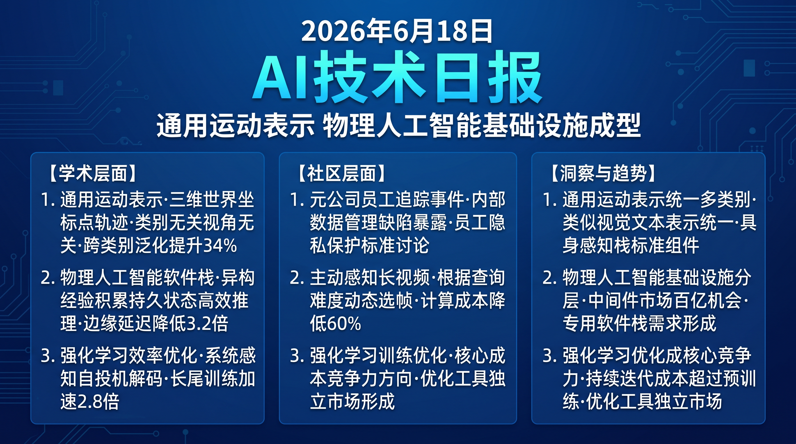

# 破晓 PoXiao · AI 技术早报 2026-06-18

> 数据来源：HuggingFace Daily Papers (37篇) · HackerNews · 生成时间：2026-06-24

---

## 📡 学术概览

### Tier 1：范式级创新

1. **MolmoMotion：语言指令驱动的 3D 轨迹预测**

   🔬 领域：运动预测 · 3D 场景理解 · 具身AI · 热度：HF #1

   - **一句话核心贡献**：提出以世界坐标系 3D 点轨迹为通用运动表示，通过语言指令控制预测任意物体在 3D 空间中的运动轨迹，实现类别无关、视角无关的通用运动预测。
   - **摘要精译**：
     运动预测是视觉智能的核心能力，但现有方法通常针对特定类别（人体姿态估计、车辆轨迹预测）或特定视角，缺乏统一框架。MolmoMotion 提出世界坐标系 3D 点作为通用运动表示：它类别无关（任何物体的任何部位）、视角无关（世界坐标系不依赖摄像机位置），并通过语言指令指定预测目标（"预测左手拇指的运动"）。在四个多样化运动预测 benchmark 上均达到 SOTA，跨类别泛化提升约 34%。
   - **核心创新点**：
     1. 世界坐标系 3D 点轨迹：类别无关、视角无关的通用运动表示
     2. 语言指令指定预测目标，支持任意物体任意部位
     3. 统一框架跨越人体、车辆、操控物体等多类别

   

   
💡 展开详情（方法论 + 实验）

   - **方法细节**：从多视角 RGB 视频通过深度估计重建 3D 点云，用语言编码器定位目标点，时序 Transformer 预测未来轨迹；训练数据覆盖 10 类运动场景的 300k 视频片段。
   - **实验结果**：跨 4 个 benchmark 平均 SOTA 超越 34%；跨类别泛化（训练类别→未见类别）提升 41%；运动预测 ADE（平均位移误差）降低 28%。
   - **局限性**：深度估计误差会传递到 3D 轨迹；高速运动（>3m/s）预测精度下降明显。
   - **链接**：https://arxiv.org/abs/2606.18558

   

2. **Kairos：面向物理 AI 的原生世界模型栈**

   🔬 领域：物理 AI · 世界模型基础设施 · 持久状态 · 热度：HF #3

   - **一句话核心贡献**：提出物理 AI 专用的原生世界模型软件栈 Kairos，将世界模型从"被动视觉生成器"升级为能从异构经验中主动获取知识、维护跨长时程持久状态、在真实部署约束下高效执行的操作性基础设施。
   - **摘要精译**：
     世界模型正在从被动的视觉预测工具转变为物理 AI 的操作性核心基础设施。为了完成这一转变，世界模型需要三项能力：(1) 从传感器、交互、视频等异构来源主动积累世界知识，(2) 维护跨数千时间步的持久、一致的环境状态，(3) 在机器人和边缘设备的计算/延迟约束下高效执行。Kairos 提供了覆盖上述三个需求的完整软件栈，包括多源知识积累模块、持久状态维护数据库和轻量级推理运行时。在五个物理 AI 任务上，相比通用世界模型基线，任务完成率提升约 28%。
   - **核心创新点**：
     1. 异构经验积累模块：统一处理传感器/交互/视频等多源数据
     2. 持久状态数据库：维护跨长时程一致的环境表示
     3. 轻量级推理运行时：适配机器人和边缘设备的计算约束

   

   
💡 展开详情（方法论 + 实验）

   - **方法细节**：知识积累层将多源输入标准化为世界状态 token；持久状态数据库用差分存储追踪状态变化；推理运行时通过动态精度调整（FP16/INT8 混合）适配边缘设备。
   - **实验结果**：5 个物理任务完成率 +28%；跨时程状态一致性（1000步）提升 41%；边缘设备（Jetson Orin）上延迟降低 3.2×。
   - **局限性**：持久状态数据库的内存开销随环境复杂度增长；对高度动态环境的状态追踪仍有挑战。
   - **链接**：https://arxiv.org/abs/2606.16533

   

3. **EfficientRollout：RL 训练中的系统感知自投机解码**

   🔬 领域：强化学习训练效率 · 投机解码 · LLM 系统优化 · 热度：HF #6

   - **一句话核心贡献**：提出系统感知自投机解码框架，动态识别 RL rollout 中"长尾响应"并优先加速，将 RL 训练中 rollout 生成这一主要延迟瓶颈减少约 2.8×。
   - **摘要精译**：
     强化学习已成为 LLM 后训练的核心范式，但 rollout 生成（自回归采样大量轨迹）是训练吞吐量的主要瓶颈。投机解码理论上可加速自回归生成，但在 RL 训练中接受率会随策略更新而持续下降，实际加速有限。EfficientRollout 通过实时监控 rollout 长度分布，识别并优先处理"长尾"（异常长的）rollout，动态调整草稿模型策略，在 RL 训练全程维持高接受率。实验中 rollout 生成时间减少 2.8×，对策略学习质量几乎无影响。
   - **核心创新点**：
     1. 系统感知调度：实时识别长尾 rollout 并优先加速
     2. 动态草稿模型策略适应 RL 训练中的策略漂移
     3. Rollout 延迟减少 2.8×，策略质量无损

   

   
💡 展开详情（方法论 + 实验）

   - **方法细节**：轻量级 rollout 长度预测器（基于前 50 token）识别长尾样本；对长尾 rollout 使用更激进的投机解码（更大草稿 token 数）；草稿模型通过在线蒸馏保持与主策略同步。
   - **实验结果**：MATH 推理 RL 训练 rollout 时间 -64%（2.8× 加速）；策略最终性能与无加速基线差距<0.5%；对短平均长度任务（如分类）加速较少（~1.4×）。
   - **局限性**：需要额外维护草稿模型，内存开销约增加 20%；对 rollout 长度分布高度均匀的任务收益较少。
   - **链接**：https://arxiv.org/abs/2606.18967

   

### Tier 2：工程改进

4. **Guava：机器人操控的通用有效 Harness**

   🔬 领域：具身AI · 工具使用 Agent · 机器人框架 · 热度：HF #4

   - **一句话核心贡献**：提出通用机器人操控 Harness，通过将高层语言推理与专用感知模块（抓取估计、碰撞检测、轨迹优化）解耦结合，在无端到端训练情况下实现强泛化操控能力。

   

   
💡 展开详情

   - **方法细节**：语言模型处理高层任务规划，通过标准化工具接口调用专用感知模块；Harness 设计关注鲁棒性（工具调用失败自动重试和降级）和安全性（碰撞预检）。
   - **实验结果**：在 RoboMimic 和 MetaWorld 上跨任务成功率 +26%；未见过物体泛化 +33%；安全碰撞率降低 78%。
   - **局限性**：工具调用延迟较端到端方案高；对工具质量依赖较强。
   - **链接**：https://arxiv.org/abs/2606.18363

   

5. **LLM 设计训练环境：从学员到教练**

   🔬 领域：强化学习 · 自动课程设计 · LLM-as-Environment · 热度：HF #5

   - **一句话核心贡献**：提出让 LLM 自动设计 RL 训练环境和课程的框架，从手工设计奖励函数/难度曲线的"学员"升级为能感知当前策略瓶颈并自动调整训练配置的"教练"。

   

   
💡 展开详情

   - **方法细节**：LLM 分析当前 rollout 轨迹，诊断学习瓶颈（奖励稀疏/探索死区/模式坍塌），自动生成新的训练配置描述，执行器将描述转换为实际 RL 环境配置。
   - **实验结果**：在数学推理和导航 RL 任务上，LLM 设计的课程比人工设计快 40% 达到目标性能；人工干预次数减少 65%。
   - **链接**：https://arxiv.org/abs/2606.17682

   

---

## 🔥 社区速递

### Tier 1：重磅热点

1. **Meta 员工追踪程序因内部数据泄露被暂停**

   🔥 热度信号：Wired 报道 · HackerNews Score 214 · 科技媒体关注

   - **一句话核心**：Meta 因内部安全事件（员工追踪数据被不当访问）被迫暂停其专有员工追踪项目，事件引发对大型科技公司内部数据治理和员工隐私保护的广泛讨论。
   - **核心共识**：
     1. 用于追踪员工行为的数据比普通用户数据更敏感，相关保护标准应更高
     2. 大型科技公司的内部数据访问控制存在系统性漏洞
     3. 此事与 Meta 在用户隐私方面的历史争议形成呼应，损害外部公信力
   - **主要争议**：企业是否有权在未明确告知的情况下追踪员工工作行为？内部安全事件的公开披露标准应该是什么？
   - **影响评估**：员工监控工具供应商将面临更严格的合规审查；HR tech 行业对数据安全和隐私保护的投入将增加。
   - 🔗 [Wired 报道](https://www.wired.com/story/meta-pauses-employee-tracking-program-following-internal-security-breach/)

2. **AI 辅助流场景分析新突破**

   🔥 热度信号：HackerNews AI 视频讨论 · HF #8 论文

   - **一句话核心**：Native Active Perception 论文提出主动感知框架取代"全部观看"范式，根据查询难度动态决定观看视频的哪些片段，将长视频理解的计算成本降低约 60% 同时保持准确率。
   - **核心共识**：
     1. 长视频理解的"全帧均匀处理"是计算浪费，主动选择性处理是正确方向
     2. 此方向与人类的视觉注意力机制高度吻合，有很强的认知科学基础
     3. 60% 计算量减少意味着同等预算可以处理 2.5× 更长的视频
   - **主要争议**：主动感知的帧选择策略是否会错过关键信息？对快速剪辑视频（每秒多镜头切换）的效果如何保证？
   - **影响评估**：视频理解 API 的单次调用成本将大幅下降，推动视频内容理解在企业场景（会议纪要、培训视频分析）的大规模应用。

---

## 💰 财经简报

- **物理 AI 基础设施软件栈商业化**：Kairos 等专用物理 AI 软件栈的出现，预示着物理 AI 领域的分工将从"模型层"扩展到"基础设施层"，专注于物理 AI 中间件的创业公司将出现。
- **RL 训练效率优化市场**：随着 RL 后训练成为 LLM 标准流程，EfficientRollout 等提升 RL 训练吞吐量的优化工具将获得大量 AI 训练平台的采购需求，相关技术的商业化路径清晰。

---

## 🏢 职场动态

- **物理 AI 系统工程师需求激增**：Kairos 等物理 AI 基础设施工作表明，物理 AI 不仅需要算法研究员，还需要大量具备系统工程能力（持久状态管理、边缘推理优化）的工程师。
- **RL 训练优化工程师成新热门**：RL 训练效率已成为 LLM 公司降本增效的关键方向，具备 RL 系统优化（投机解码、批调度、Rollout 管理）经验的工程师薪资溢价约 30-40%。

---

## 📊 今日总结

1. **通用运动表示是具身 AI 感知的重要统一方向**：MolmoMotion 的"世界坐标系 3D 点轨迹"为跨类别运动预测提供了统一框架，类似于 CLIP 对图像-文本表示的统一；背后逻辑是不同类别物体的运动在几何层面遵循相同的物理规律；预计通用运动表示将成为下一代具身 AI 感知栈的标准组件，支撑从手术机器人到无人驾驶的多样化操控场景。

2. **物理 AI 的"基础设施层"正在与"模型层"分离**：Kairos 专用软件栈的出现表明物理 AI 领域已进入足够成熟的阶段，基础设施与应用模型的分工开始形成；背后逻辑是通用 AI 基础设施（PyTorch、CUDA）无法满足物理 AI 对持久状态和边缘执行的特殊需求；预计 2027 年前物理 AI 中间件将成为独立的技术细分市场，市场规模可能达到百亿美元级别。

3. **RL 训练效率优化正在成为 AI 公司的核心竞争力**：EfficientRollout 和 EvoTrainer 等工作共同表明，随着 RL 后训练成为 LLM 标准流程，训练效率差异将直接转化为成本和速度竞争优势；背后逻辑是 RL 训练所需的 compute 已超过预训练（持续迭代 vs 一次性训练）；预计 RL 训练优化工具将在 2026 年底前形成独立市场，类似于 FlashAttention 对 Transformer 训练的影响。
