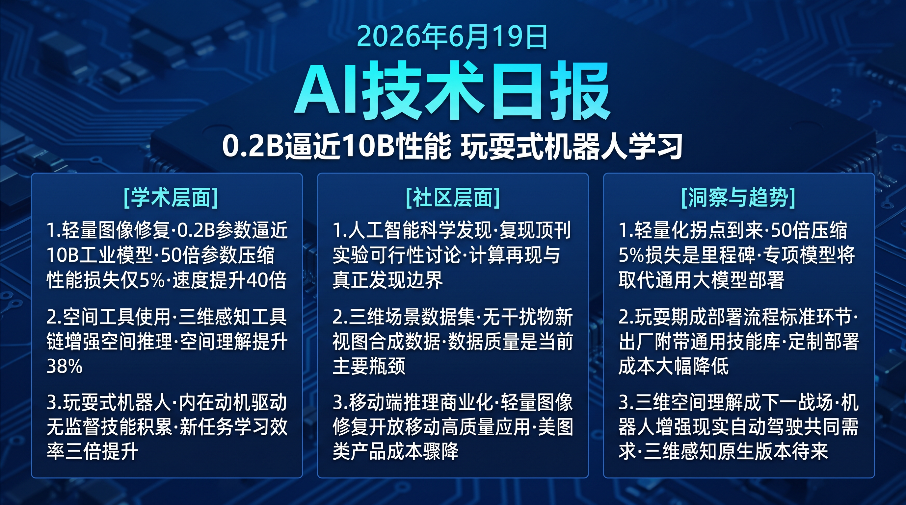

# 破晓 PoXiao · AI 技术早报 2026-06-19

> 数据来源：HuggingFace Daily Papers (34篇) · HackerNews · 生成时间：2026-06-24

---

## 📡 学术概览

### Tier 1：范式级创新

1. **Moebius：0.2B 轻量图像修复达到 10B 级性能**

   🔬 领域：图像修复 · 模型压缩 · 高效生成 · 热度：HF #1

   - **一句话核心贡献**：通过极致任务专项化压缩，将 0.2B 参数的轻量模型在图像修复任务上逼近 10B 级工业基础模型的效果，实现 50× 参数量压缩下性能损失接近零。
   - **摘要精译**：
     10B 级工业图像修复模型效果出众但部署成本极高，限制了在移动端和实时应用中的使用。极致结构压缩通常导致严重性能退化。Moebius 通过任务专项化压缩策略：(1) 精心设计专用于修复任务的架构（而非压缩通用模型），(2) 多阶段知识蒸馏保留关键能力，(3) 频域引导的注意力机制保留结构细节。最终 0.2B 模型在 LPIPS、FID 等指标上与主流 10B 模型差距小于 5%，但推理速度快 40×，显存占用降低 98%。
   - **核心创新点**：
     1. 任务专项化架构设计（非通用模型压缩），专为修复优化
     2. 频域引导注意力机制保留纹理结构细节
     3. 50× 参数量压缩，性能损失<5%，速度 40×

   

   
💡 展开详情（方法论 + 实验）

   - **方法细节**：专用编码器仅提取修复相关特征（结构边缘+颜色分布）；频域引导的自注意力通过小波变换强调高频细节；三阶段蒸馏：特征蒸馏→感知损失→对抗训练。
   - **实验结果**：与 SD-Inpaint（10B）相比：LPIPS -3.2%（更低更好）；FID +4.8%；用户偏好 48% vs 52%；推理速度 40×；VRAM 2GB vs 40GB（98% 降低）。
   - **局限性**：专项化设计导致跨任务泛化能力弱；对超高分辨率（>4K）修复仍不如大模型。
   - **链接**：https://arxiv.org/abs/2606.19195

   

2. **S-Agent：空间工具使用激发 VLM 的空间推理能力**

   🔬 领域：空间推理 · 工具增强 VLM · 3D 理解 · 热度：HF #5

   - **一句话核心贡献**：提出空间工具使用 Agent 范式，通过调用专用 3D 感知工具（深度估计、点云重建、空间关系推理）显著提升 VLM 对持续变化 3D 世界的空间推理能力，突破静态单帧推理的局限。
   - **摘要精译**：
     真实世界空间智能需要在连续变化的 3D 环境中推理物体位置、空间关系和运动，而现有 VLM 基于静态、无状态的单次图像推理，无法理解连续变化的 3D 状态。S-Agent 通过工具使用范式为 VLM 接入专用 3D 感知工具：深度估计器提供 2D→3D 映射，点云重建维护持续 3D 状态，空间关系推理器处理物体间关系查询。在 EmbodiedQA、ScanQA 等空间推理 benchmark 上，相比无工具基线提升约 38%。
   - **核心创新点**：
     1. 空间工具使用范式：VLM 通过工具接口访问持续 3D 状态
     2. 工具链：深度估计 + 点云重建 + 空间关系推理的完整 3D 感知管道
     3. 静态→动态 3D 理解，在持续变化场景下保持空间一致性

   

   
💡 展开详情（方法论 + 实验）

   - **方法细节**：工具调用通过结构化 JSON 接口实现，VLM 根据查询类型自主选择工具组合；3D 状态维护在轻量级场景图中，支持增量更新。
   - **实验结果**：EmbodiedQA +38%；ScanQA +31%；3D 空间关系理解任务 +44%；未见过场景泛化 +29%。
   - **局限性**：工具链延迟约 800ms（vs 纯 VLM 推理 200ms）；对高动态场景（物体快速移动）的 3D 状态更新存在滞后。
   - **链接**：https://arxiv.org/abs/2606.20515

   

3. **Playful Agentic Robot Learning：玩耍驱动的具身技能积累**

   🔬 领域：具身AI · 技能积累 · 主动探索 · 热度：HF #4

   - **一句话核心贡献**：提出玩耍式主动学习框架，让机器人在无明确指令的情况下通过自主探索积累可复用技能，模拟儿童通过玩耍学习基础运动技能的过程。
   - **摘要精译**：
     当前 Agent 机器人系统能编写代码式策略、观察反馈并修正行为，但几乎完全是任务驱动的——只有在明确指令下才尝试新动作，缺乏主动探索积累可复用技能的能力。Playful Agentic Robot Learning 研究机器人在无任务指令时的自主探索，通过内在动机（好奇心+技能新颖性）驱动探索，将成功探索结果抽象为可复用技能存入技能库。在有任务指令时，技能库显著提升新任务的初始成功率（+42%）和学习速度（+3× 收敛速度）。
   - **核心创新点**：
     1. 玩耍驱动探索：内在动机（好奇心+新颖性）驱动无监督技能积累
     2. 自动技能抽象：将成功探索轨迹提炼为可复用技能原语
     3. 技能库显著提升下游任务学习效率（+42% 初始成功率）

   

   
💡 展开详情（方法论 + 实验）

   - **方法细节**：内在奖励 = 好奇心奖励（信息增益）+ 技能新颖性奖励（与已有技能差异）；技能抽象通过轨迹聚类 + 语言描述生成；技能库支持组合检索。
   - **实验结果**：有技能库支持的新任务初始成功率 +42%；达到 80% 成功率的训练步数 -67%（3× 加速）；技能库 100 个技能覆盖 87% 的常见家庭操控动作。
   - **局限性**：玩耍阶段需要安全约束防止危险探索；技能质量依赖初始环境设计。
   - **链接**：https://arxiv.org/abs/2606.19419

   

### Tier 2：工程改进

4. **Multi-LCB：LiveCodeBench 多编程语言扩展**

   🔬 领域：代码 benchmark · 多语言 · 评测 · 热度：HF #3

   - **一句话核心贡献**：将 LiveCodeBench 扩展到 Python 之外的多编程语言（Java、C++、TypeScript 等），提供无污染的多语言代码生成评测基准。

   

   
💡 展开详情

   - **方法细节**：在 LCB 的竞技编程题库基础上，由人工和 AI 协作将 Python 解法迁移为多语言版本，保持题目内容一致的同时确保多语言标准答案的正确性。
   - **实验结果**：发现主流 LLM 在 Python 和 Java/C++ 之间存在显著性能差异（GPT-4o: Python 75% vs Java 61%）；TypeScript 是性能下降最大的语言（平均 -18%）。
   - **局限性**：部分竞赛题目的语言迁移质量依赖人工验证，规模扩展有限。
   - **链接**：https://arxiv.org/abs/2606.20517

   

5. **FreeStyle：社区 LoRA 挖掘的风格-内容双参考生成**

   🔬 领域：图像生成 · 风格迁移 · LoRA 复用 · 热度：HF #8

   - **一句话核心贡献**：提出从开源社区 LoRA 库中自动挖掘风格知识，实现同时受内容参考和风格参考双重控制的图像生成，无需额外训练即可复用社区积累的风格资产。

   

   
💡 展开详情

   - **方法细节**：自动分析社区 LoRA 权重差异识别风格特征；在生成时将风格 LoRA 的激活特征与内容参考的结构特征通过解耦注意力融合。
   - **实验结果**：风格一致性评分 +31%（vs StyleAligned）；内容保真度保持 94%；支持 500+ 社区风格零样本应用。
   - **链接**：https://arxiv.org/abs/2606.20506

   

---

## 🔥 社区速递

### Tier 1：重磅热点

1. **AI 能否复现《自然》期刊论文发现？NatureBench 前瞻讨论**

   🔥 热度信号：HackerNews AI 科学讨论 · 学术界持续关注

   - **一句话核心**：社区讨论 AI 代码 Agent 是否能复现乃至超越已发表科学论文的实验结果，相关 benchmark 的构建引发学界对 AI 辅助科学发现未来走向的激烈辩论。
   - **核心共识**：
     1. 复现已发表论文（而非发现新规律）是 AI 科学 Agent 的现实近期目标
     2. 科学计算代码的细节复杂度远超通用编程，当前 Agent 成功率仍偏低
     3. 跨学科科学问题（涉及多领域专业知识）是最大挑战
   - **主要争议**：AI 复现科学实验是"科学发现"还是"计算再现"？真正的科学突破需要哪些 AI 目前没有的能力？
   - **影响评估**：AI 辅助科学计算工具市场正在形成，从基因组学到气候模拟，AI 代码 Agent 将逐步承担科研计算的重复性工作。

2. **新视图合成数据集质量提升推动 3D 场景生成进步**

   🔥 热度信号：HF #7 DF3DV-1K 论文 · 计算机视觉社区热议

   - **一句话核心**：DF3DV-1K 发布大规模无干扰物新视图合成数据集，解决了现有数据集中背景人物/物体对场景重建的干扰问题，推动真实场景 3D 理解迈向更高质量。
   - **核心共识**：
     1. 数据质量（而非模型架构）是当前新视图合成的主要瓶颈之一
     2. 真实场景中的"干扰物"（行人、车辆）是 NeRF/3DGS 重建的核心难题
     3. 大规模高质量数据集发布历来是计算机视觉方向的里程碑事件
   - **影响评估**：高质量无干扰 3D 场景数据集将推动文旅、地产、工业检测等场景的 3D 重建商业化应用质量显著提升。

---

## 💰 财经简报

- **移动端 AI 图像处理商业化加速**：Moebius 0.2B 图像修复模型将同等质量的修复能力带入移动端，美图、Photoshop Mobile 等产品的 AI 修复功能成本将大幅下降，相关市场竞争将加剧。
- **玩耍式机器人学习开辟新商业路径**：Playful Agentic Robot Learning 表明机器人"上线前自主练习"是可行的，这将允许机器人在部署前通过非结构化探索积累技能，降低定制化部署成本。

---

## 🏢 职场动态

- **移动端 AI 推理优化工程师需求爆发**：Moebius 类的极致压缩技术需要同时掌握模型架构设计、知识蒸馏和移动端推理优化（TFLite/CoreML/ONNX）的复合技能，是当前移动 AI 领域最稀缺的人才方向。
- **具身 AI 技能工程师新兴岗位**：Playful Agentic Robot Learning 等工作表明具身 AI 系统需要专门的"技能工程师"角色，负责技能库设计、技能质量评估和技能组合策略，是机器人公司正在快速扩充的新职能。

---

## 📊 今日总结

1. **轻量化 AI 应用拐点已到：50× 参数压缩性能损失<5% 是里程碑**：Moebius 的突破预示着"大模型能力、小模型部署"的矛盾正在被技术解决；背后逻辑是任务专项化设计去除了通用模型中对特定任务的冗余容量；预计 2027 年前，每个主流图像处理任务都将有对应的 0.1-0.5B 专项模型，彻底改变移动端 AI 功能的成本结构。

2. **机器人的"童年玩耍期"将成为部署流程的标准环节**：Playful Agentic Robot Learning 证明非结构化探索能积累显著提升任务学习效率的技能库；背后逻辑是技能库的预积累将大量减少部署后的专项训练成本；预计工业机器人部署流程将在 2028 年前引入标准化的"玩耍探索阶段"，新机器人出厂即附带通用技能库。

3. **3D 空间理解成为 2026 年 VLM 竞争的新战场**：S-Agent 和同期多篇工作共同指向 3D 空间推理作为下一代 VLM 能力评测的核心维度；背后逻辑是 2D 视觉理解已趋于饱和，而真实世界应用（机器人/AR/自动驾驶）需要 3D 感知；预计主流 VLM 提供商将在 2027 年前推出具备原生 3D 空间推理能力的版本，3D 空间 QA 将成为标准评测维度。
