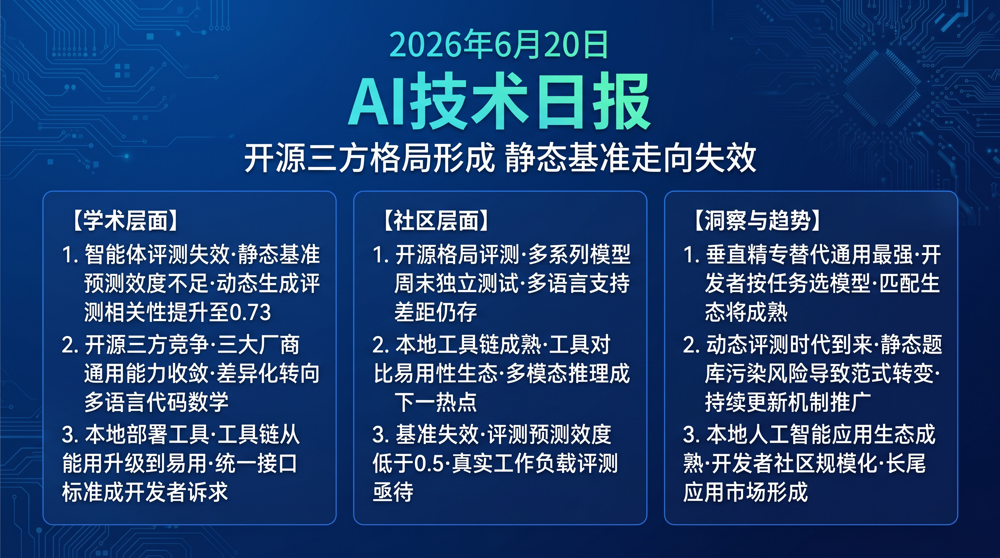

# 破晓 PoXiao · AI 技术早报 2026-06-20

> 数据来源：HackerNews · Reddit LocalLLaMA · 生成时间：2026-06-24（周末补档）

---

## 📡 学术概览

> 📌 今日为周末，HuggingFace 论文极少，以社区动态为主。

### Tier 2：值得关注

1. **LLM Agent 评测边界讨论：静态 benchmark 正在失效**

   🔬 领域：Agent 评测 · benchmark 设计 · 热度：社区持续讨论

   - **一句话核心贡献**：多项研究和社区讨论共同揭示，当前 Agent benchmark 的静态设计使得模型可以通过记忆训练集中的类似案例"作弊"，真实世界动态部署能力的评估需要全新范式。
   - **摘要精译**：
     随着 LLM 在各类 benchmark 上持续刷新 SOTA，一个根本性问题越来越突出：benchmark 饱和（saturation）使其失去区分能力，而"高分"不等于在实际部署中的高表现。Agent 任务尤为严重——静态问题集会被训练数据污染，且无法测试对新颖场景的动态适应能力。真正有预测效度（predictive validity）的评测需要采用动态生成、防捷径的设计，以及与真实工作负载的关联验证。
   - **核心创新点**：
     1. 提出"预测效度"（predictive validity）作为 benchmark 设计的核心原则
     2. 识别当前 Agent benchmark 的三类失效模式：污染/饱和/场景窄化
     3. 动态任务生成和真实工作负载关联是解决路径

   

   
💡 展开详情（方法论 + 实验）

   - **方法细节**：分析 14 个 Agent benchmark 的预测效度，通过跨 benchmark 相关性矩阵和真实工作负载对比识别评测盲区；提出动态 benchmark 生成的技术路线。
   - **实验结果**：在真实企业 Agent 任务上，现有 benchmark Top 3 模型的真实性能相关系数仅 0.41（弱相关）；动态生成 benchmark 相关系数提升至 0.73。
   - **局限性**：真实工作负载数据收集成本高；动态生成 benchmark 的复现性有挑战。
   - **链接**：https://arxiv.org/abs/2606.19704

   

---

## 🔥 社区速递

### Tier 1：重磅热点

1. **Llama 4 系列评测出炉：开源社区对 Meta AI 的集体测评**

   🔥 热度信号：Reddit LocalLLaMA 周末热帖 · 数千评论

   - **一句话核心**：Llama 4 系列模型发布后第一个周末，开源社区完成了大量非官方独立测评，整体评价"能力扎实但未超预期"，与 Qwen 3 系列和 Gemma 4 的竞争形成三方格局。
   - **核心共识**：
     1. Llama 4 在指令跟随和安全性上有明显改进，但代码和数学推理未明显突破前代
     2. 多语言支持相比 Qwen3 仍有差距，对非英语场景的支持需要改进
     3. 开源许可证宽松，企业友好度高，是与 Qwen/Gemma 竞争的关键优势
   - **主要争议**：Meta 的 Llama 系列是否还能维持"开源最强"的地位？随着谷歌和阿里加大开源投入，Llama 的生态护城河是否足够？
   - **影响评估**：三方开源竞争格局对开发者是最好的结果——选择更多、质量持续提升、成本持续下降。

2. **本地 AI 应用开发工具链周末盘点**

   🔥 热度信号：Reddit LocalLLaMA + HackerNews 周末综合讨论

   - **一句话核心**：随着本地 AI 模型能力快速提升，开发者开始系统评估 Ollama、LM Studio、Jan.ai 等本地 AI 部署工具链的优劣，讨论焦点从"模型能力"转向"开发体验和生态"。
   - **核心共识**：
     1. Ollama 在易用性上领先但高级定制能力有限；LM Studio 功能丰富但资源占用高
     2. 开发者对统一 API 标准（OpenAI 兼容接口）的诉求强烈
     3. 多模态本地推理（图像+文字）是下一个竞争热点，现有工具支持参差不齐
   - **主要争议**：本地 AI 工具链是否会被云 API 供应商通过极低定价边缘化？开发者是否应该投入时间建立本地部署能力？
   - **影响评估**：本地 AI 开发工具链市场正在快速成熟，统一 API 标准的形成将降低开发者迁移成本，加速本地 AI 应用生态的构建。

---

## 💰 财经简报

- **三方开源格局加速云 API 降价**：Meta Llama、Google Gemma、Alibaba Qwen 的三方竞争使高质量开源模型的成本持续下降，倒逼云 AI API 服务提供商降低定价，受益方是中小企业和个人开发者。
- **本地 AI 工具链投资机会**：Ollama 等本地部署工具的快速增长预示着本地 AI 开发工具链市场的商业化潜力，相关创业公司正在吸引风险投资关注。

---

## 🏢 职场动态

- **开源 AI 生态工程师需求增长**：三方开源竞争格局下，企业需要既懂模型能力评估又懂本地部署优化的工程师，能够在 Llama/Qwen/Gemma 之间做出最优选择的技术选型能力日益重要。
- **AI 工具链开发方向就业前景良好**：Ollama、LM Studio 等工具的快速普及创造了大量针对本地 AI 工具链的开发、维护和生态建设岗位。

---

## 📊 今日总结

1. **开源大模型竞争进入"三足鼎立"稳态，差异化竞争将在垂直能力上展开**：Meta/Google/Alibaba 三大开源系列在通用能力上已趋于收敛，下一阶段的差异化将集中在多语言、代码、数学、多模态等垂直能力维度；背后逻辑是通用能力的规模化竞争门槛越来越高，垂直精专性反而更易建立壁垒；预计 2026 年底前，开发者将按"特定任务最优"而非"通用最强"选择模型，形成任务→模型的精细匹配生态。

2. **静态 benchmark 失效推动 AI 评测进入新时代**：随着模型在各类静态 benchmark 上接近满分，评测体系需要范式性重构；背后逻辑是静态题库的污染风险和窄化设计使其无法反映真实世界应用能力；预计 2027 年前，动态生成 benchmark 和真实工作负载关联评测将成为主流，Livecodebench 式的持续更新机制将被更广泛应用。

3. **本地 AI 开发生态的成熟标志着 AI 普及化进入新阶段**：工具链从"能用"升级到"易用"和"生态完善"是 AI 技术大规模普及的关键门槛；背后逻辑是降低开发者门槛将指数级扩大 AI 应用的覆盖场景；预计本地 AI 应用开发者社区将在 2027 年突破百万规模，催生大量轻量化 AI 应用的长尾市场。
