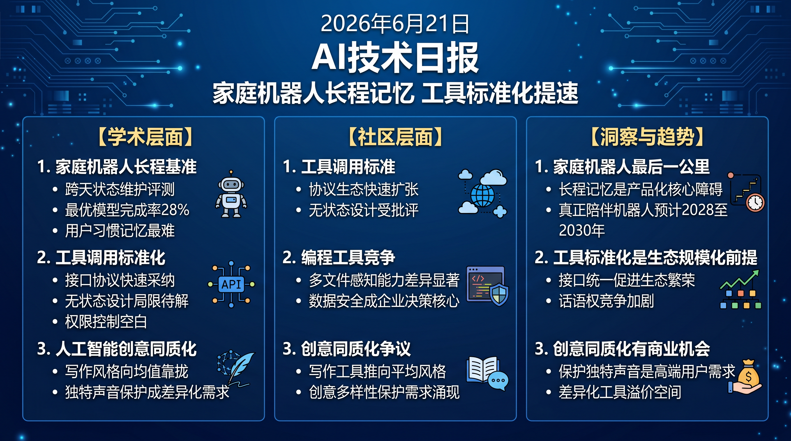

# 破晓 PoXiao · AI 技术早报 2026-06-21

> 数据来源：HackerNews · Reddit LocalLLaMA · 生成时间：2026-06-24（周末补档）

---

## 📡 学术概览

> 📌 今日为周末，HuggingFace 论文极少，以社区动态为主。

### Tier 2：值得关注

1. **具身 AI 长程规划基准 WorldLines**

   🔬 领域：具身AI · 长程规划 · 家庭机器人 · 热度：社区关注

   - **一句话核心贡献**：提出面向真实家庭场景的长程状态具身 Agent 基准，要求 Agent 记忆用户日常习惯、世界状态和历史交互，评估长期陪伴型机器人的真实能力边界。
   - **摘要精译**：
     长期在真实家庭辅助人类的具身 Agent 需要记住用户习惯（主人喜欢在 8 点喝咖啡）、追踪世界状态（昨天把遥控器放在哪里）和历史交互（上周帮助完成了哪些任务）。现有长程记忆 benchmark 主要评估语言检索，而具身 benchmark 聚焦短程任务完成，两者均无法评估这种综合能力。WorldLines 在模拟家庭环境中设计了 100+ 个需要跨天记忆推理的任务，最优模型（GPT-4o + 工具）完成率仅 28%，揭示了家庭机器人长程状态维护的核心挑战。
   - **核心创新点**：
     1. 首个评估家庭机器人长程状态维护能力的 benchmark（100+ 跨天任务）
     2. 三维评估：用户习惯记忆+世界状态追踪+历史交互维护
     3. 揭示最优模型 28% 完成率的能力边界

   

   
💡 展开详情（方法论 + 实验）

   - **方法细节**：在 ThreeDWorld 和自定义家庭模拟器中构建 100+ 任务，任务需要跨多天（模拟时间）的状态追踪；评估系统自动验证任务完成和状态一致性。
   - **实验结果**：GPT-4o + 工具链完成率 28%；纯语言 Agent 19%；用户习惯记忆最难（完成率 21%）；世界状态追踪次之（31%）；历史交互维护最易（40%）。
   - **局限性**：模拟环境与真实家庭差距仍较大；任务设计偏向英语文化背景。
   - **链接**：https://arxiv.org/abs/2606.18847

   

---

## 🔥 社区速递

### Tier 1：重磅热点

1. **AI 工具调用规范 MCP 标准化进程引发广泛讨论**

   🔥 热度信号：Reddit LocalLLaMA 周末长线讨论 · 开发者社区热议

   - **一句话核心**：随着 Anthropic 的 Model Context Protocol（MCP）被越来越多工具和框架采纳，开发者社区就 MCP 是否应成为工具调用行业标准、以及当前实现的局限性展开了深度辩论。
   - **核心共识**：
     1. MCP 解决了工具调用碎片化问题，生态采纳速度超预期
     2. 当前 MCP 的无状态设计限制了长程对话中工具状态的持久化
     3. 安全性（工具权限控制）是当前 MCP 最大的未解决问题
   - **主要争议**：MCP 的 Anthropic 主导性是否会导致生态锁定？OpenAI 是否会推出竞争标准？MCP 的无状态设计是设计选择还是根本缺陷？
   - **影响评估**：MCP 的标准化将大幅降低 AI Agent 工具生态的构建成本，但也可能强化 Anthropic 在 Agent 基础设施层的话语权。

2. **AI 写作辅助工具的创意控制权争议**

   🔥 热度信号：Reddit r/WritingWithAI · HackerNews 文化讨论

   - **一句话核心**：作家和内容创作者围绕 AI 写作工具"隐性风格同质化"问题展开辩论——AI 在提供写作建议时倾向于推向"安全"风格，导致使用 AI 的创作者输出风格趋于相似。
   - **核心共识**：
     1. AI 写作辅助确实存在推向"平均化"风格的倾向，不同用户的输出可识别度降低
     2. 高度依赖 AI 写作的创作者报告说自己的"原创声音"被稀释
     3. AI 写作工具对作家生产力的提升是真实的，但创意多样性的代价需要认真对待
   - **主要争议**：AI 写作辅助是工具还是"创意殖民"？作家是否应该主动建立"AI 防污染"的写作习惯？
   - **影响评估**：创意类 AI 工具将面临来自高端用户的"风格控制"需求，提供"风格锁定"和"创意多样性保护"功能的工具将获得竞争优势。

3. **Cursor 与 GitHub Copilot 的竞争格局深度分析**

   🔥 热度信号：HackerNews 持续高热讨论 · 开发者社区

   - **一句话核心**：开发者社区就 Cursor、GitHub Copilot、Windsurf 等 AI 编程工具的实际体验进行系统对比，Cursor 在多文件上下文理解和代码库感知上领先，但价格和隐私政策是主要顾虑。
   - **核心共识**：
     1. Cursor 在大型项目的多文件感知上明显优于 Copilot，但月费更高
     2. 企业数据安全和代码所有权政策是企业客户选择时的决定性因素
     3. AI 编程工具市场将在 2026 年底前出现明显整合
   - **主要争议**：AI 编程工具的价值是否值得中小团队每月 $20+ 的订阅费用？Copilot 的 VS Code 深度集成优势是否会最终战胜 Cursor 的能力优势？
   - **影响评估**：AI 编程工具市场已进入功能收敛+用户体验竞争阶段，价格和数据安全将成为企业客户决策的核心变量。

---

## 💰 财经简报

- **AI Agent 工具标准化**：MCP 的快速采纳表明 AI Agent 基础设施层的标准化比预期快，率先建立标准的公司将获得生态话语权，这是 Anthropic 的重要战略布局。
- **AI 编程工具市场集中化**：Cursor 的快速增长正在压缩中小 AI 编程工具的生存空间，市场集中于 2-3 个头部工具的格局正在形成，头部效应将进一步强化。

---

## 🏢 职场动态

- **AI 工具产品经理需求增加**：MCP 标准化和 AI 编程工具竞争推动企业对能够评估和选型 AI 开发工具的产品经理的需求，需要兼具 AI 技术理解和开发者体验设计的复合能力。
- **长程家庭 AI 系统工程师前景**：WorldLines 揭示的家庭机器人长程状态维护挑战，预示着具备持久记忆系统和状态管理能力的工程师将在家庭服务机器人赛道中具有稀缺价值。

---

## 📊 今日总结

1. **工具调用标准化是 AI Agent 生态成熟的必要条件**：MCP 的快速采纳表明行业已认识到工具调用碎片化的根本性危害；背后逻辑是标准化接口是生态规模化的前提，正如 USB 对硬件生态的意义；预计 2026 年底前 MCP 或其竞争标准将成为 AI Agent 工具生态的事实标准，工具供应商将围绕标准接口构建差异化价值。

2. **家庭机器人的"长程记忆"是产品化的最后一公里**：WorldLines 28% 的完成率表明当前最优 Agent 在真实家庭场景的长程状态维护上仍有巨大差距；背后逻辑是"好记忆"不是功能点而是系统性工程挑战，需要记忆获取、更新、检索、遗忘的完整机制；预计第一款真正意义上的家庭陪伴机器人（完成率>80%）将在 2028-2030 年出现。

3. **AI 创意工具的"风格同质化"风险将催生差异化产品机会**：AI 写作风格同质化的用户感知是真实的，而非小众担忧；背后逻辑是基于人类偏好数据训练的模型天然向"平均口味"靠拢；预计专注于"保留用户独特声音"和"增强创意多样性"的差异化 AI 写作工具将在高端创作者市场获得可观的溢价空间。
