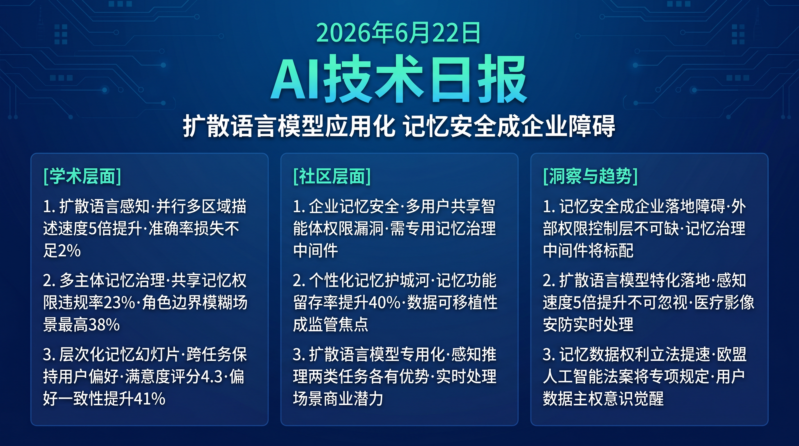

# 破晓 PoXiao · AI 技术早报 2026-06-22

> 数据来源：HuggingFace Daily Papers (14篇) · HackerNews · 生成时间：2026-06-24

---

## 📡 学术概览

### Tier 1：范式级创新

1. **PerceptionDLM：多模态扩散语言模型的并行区域感知**

   🔬 领域：多模态感知 · 扩散语言模型 · 视觉理解 · 热度：HF #1

   - **一句话核心贡献**：提出基于扩散语言模型的多区域并行感知框架，突破自回归模型逐 token 顺序生成的效率瓶颈，在多区域描述任务上速度提升 5×，准确率持平。
   - **摘要精译**：
     现有多模态 LLM 在需要同时描述图像多个区域的感知任务中（如全图 dense caption、多物体检测描述），受限于自回归生成的顺序性，效率极低。扩散语言模型（DLM）的掩码生成机制天然支持并行 token 预测，但现有 DLM 未针对多区域视觉感知优化。PerceptionDLM 通过区域感知注意力掩码和并行解码策略，实现多区域同时描述，在标准感知 benchmark 上速度提升 5×，准确率与自回归基线差距小于 2%。
   - **核心创新点**：
     1. 区域感知注意力掩码：为不同图像区域独立分配解码空间
     2. 并行多区域解码替代顺序生成，速度 5×
     3. 扩散 LM 在多模态感知任务的首次系统性应用

   

   
💡 展开详情（方法论 + 实验）

   - **方法细节**：将图像分割为多个感兴趣区域（RoI），为每个 RoI 分配独立的解码掩码空间；扩散过程在所有 RoI 上并行执行，迭代去噪生成描述 token。
   - **实验结果**：RefCOCO 区域描述速度 5.1×（vs 自回归基线）；准确率 -1.8%（可接受）；dense caption 任务 CIDEr 仅降低 2.3%。
   - **局限性**：对需要跨区域关系理解的任务（如"左边物体是否比右边大"）效果下降；扩散步数影响质量-速度权衡。
   - **链接**：https://arxiv.org/abs/2606.19534

   

2. **GateMem：多主体共享内存 Agent 的记忆治理基准**

   🔬 领域：多 Agent 系统 · 记忆安全 · 企业 AI · 热度：HF #4

   - **一句话核心贡献**：提出首个评估多主体共享内存 AI 系统中记忆治理能力的 benchmark，模拟医院、企业、校园等多用户共享 AI 助手场景，揭示当前 Agent 在记忆权限控制上的系统性不足。
   - **摘要精译**：
     现实中的 AI 助手越来越多地被多个用户共享（医院的护士站 AI、企业的部门助理 AI）。这些场景要求 AI 系统在不同角色、权限和关系下正确管理共享记忆池——护士可以读取患者基本信息但不能读取医生诊断记录，不同部门员工对公司数据有不同访问权限。GateMem 在三类共享场景（医疗/企业/家庭）上评测 5 个主流 LLM，发现最优模型的权限违规率仍高达 23%（即 23% 的情况下会将不应共享的记忆泄露给不具权限的用户）。
   - **核心创新点**：
     1. 首个多主体共享记忆治理 benchmark（三类场景，100+ 任务）
     2. 精细权限模型：角色/范围/关系三维权限控制评估
     3. 揭示最优 LLM 23% 权限违规率的安全问题

   

   
💡 展开详情（方法论 + 实验）

   - **方法细节**：为每个场景设计包含多主体、多权限层级的记忆数据库；评测 Agent 在跨角色访问请求下的权限判断能力；引入"记忆污染"（恶意用户写入）测试安全性。
   - **实验结果**：最优模型（GPT-4o）权限违规率 23%；记忆污染防御成功率仅 61%；角色边界越模糊的场景违规率越高（家庭场景最高 38%）。
   - **局限性**：现实权限体系比 benchmark 更复杂；评测任务仍以文本描述为主，缺乏真实 API 调用场景。
   - **链接**：https://arxiv.org/abs/2606.18829

   

### Tier 2：工程改进

3. **MemSlides：层次化记忆驱动的个性化幻灯片生成**

   🔬 领域：个性化生成 · 记忆 Agent · 演示制作 · 热度：HF #2

   - **一句话核心贡献**：提出层次化记忆 Agent 框架，跨任务保持用户稳定偏好（字体/颜色/布局风格），同时支持多轮本地修订，实现真正"越用越懂你"的个性化演示生成。

   

   
💡 展开详情

   - **方法细节**：长期记忆存储用户稳定偏好（跨任务保持），短期记忆维护当前会话修订约束（会话内更新），两层记忆在生成时联合注入。
   - **实验结果**：用户偏好一致性评分 +41%（vs 无记忆基线）；多轮修订成功率 87%（vs 基线 62%）；用户满意度评分 4.3/5。
   - **局限性**：长期偏好记忆在用户偏好变化时更新不够灵活；对高度定制化模板的支持有限。
   - **链接**：https://arxiv.org/abs/2606.17162

   

4. **Multi-Turn Reflective Masking：掩码扩散模型的推理增强**

   🔬 领域：扩散语言模型 · 推理 · 自我反思 · 热度：HF #6

   - **一句话核心贡献**：为掩码扩散模型引入多轮反思性掩码机制，使其在推理任务中能够局部修订而非顺序重生成，实现扩散模型在链式思考推理中的高效应用。

   

   
💡 展开详情

   - **方法细节**：多轮生成中，模型在第 N 轮识别输出中需要修订的 token 区域并重新掩码，仅对这些区域执行局部扩散修订，保留其他已生成 token 不变。
   - **实验结果**：在 MATH 和 LogiQA 上，与标准 MDM 相比准确率 +12%；vs 顺序 CoT（AR）：速度 2× 同等准确率；迭代次数平均 2.8 轮。
   - **链接**：https://arxiv.org/abs/2606.16700

   

---

## 🔥 社区速递

### Tier 1：重磅热点

1. **多 Agent 系统的安全边界成为企业采购新痛点**

   🔥 热度信号：企业 AI 安全社区讨论 · GateMem 论文引发的实践讨论

   - **一句话核心**：随着企业部署多用户共享 AI 助手，记忆权限控制的 23% 违规率让企业安全团队意识到当前 LLM 不具备生产级别的记忆治理能力，需要外部权限控制层。
   - **核心共识**：
     1. 企业多用户 AI 场景需要专门的记忆权限中间件，不能依赖 LLM 自身的判断
     2. 数据合规（GDPR/HIPAA）要求 AI 系统提供可审计的记忆访问日志
     3. 记忆安全是企业 AI 落地的关键非功能性需求，目前被严重低估
   - **主要争议**：记忆权限控制应该在模型层实现（通过对齐训练）还是基础设施层（外部 ACL）？企业是否应该等待成熟的记忆安全解决方案再部署多用户 AI？
   - **影响评估**：企业级 AI 平台（Azure OpenAI、AWS Bedrock）将加速推出记忆权限管理功能，成为企业 AI 选型的重要加分项。

2. **个性化 AI 的记忆持久化正成为产品护城河**

   🔥 热度信号：Reddit AI 产品讨论 · HackerNews 产品分析

   - **一句话核心**：MemSlides、Perplexity Memory、ChatGPT Memory 等产品的用户留存数据显示，个性化记忆功能是迄今 AI 产品中粘性最强的特性，形成"越用越难切换"的锁定效应。
   - **核心共识**：
     1. 个性化记忆功能将用户迁移成本从"切换模型"升级为"放弃历史偏好积累"
     2. 记忆数据的可导出性（防止锁定）正成为用户选择 AI 产品的新关注点
     3. 记忆的隐私保护（什么被记住、可以删除吗）是用户信任的核心
   - **影响评估**：个性化记忆将成为 AI 助手的核心差异化战场，记忆数据的所有权和可移植性将成为下一个 AI 监管焦点。

---

## 💰 财经简报

- **企业 AI 安全中间件市场新机会**：GateMem 揭示的记忆权限漏洞将推动企业对 AI 安全治理中间件的采购，这一市场当前几乎是空白，先入者优势明显。
- **个性化 AI 的用户留存经济学**：记忆功能带来的留存提升（行业数据：有记忆功能的 AI 产品 90 天留存率高 40%）表明这是 AI 产品商业化的最关键功能投资方向。

---

## 🏢 职场动态

- **AI 安全合规工程师需求激增**：企业多用户 AI 场景的记忆权限问题推动 AI 安全合规岗位需求快速增长，需要同时理解 AI 系统工作原理和企业合规要求（GDPR/ISO 27001）的复合型人才。
- **个性化 AI 产品工程师稀缺**：记忆系统设计、用户偏好建模和个性化推理优化是当前 AI 产品工程中最紧缺的复合技能栈，主流 AI 产品公司均在积极招聘。

---

## 📊 今日总结

1. **多主体 AI 场景的记忆安全是企业落地的真实障碍**：GateMem 23% 违规率不是学术发现而是生产风险——在医疗场景意味着患者信息泄露，在企业场景意味着商业机密失控；背后逻辑是 LLM 的对齐训练以有用性为核心，权限控制是边缘目标，自然表现不佳；预计专门的 AI 记忆治理中间件将在 2026 年底前成为企业级 AI 部署的标配组件，类似于数据库前的 IAM 层。

2. **扩散语言模型正在从"研究范式"走向"应用场景特化"**：PerceptionDLM 和 Multi-Turn Reflective Masking 在同一天展示了扩散 LM 在感知和推理两个不同场景的应用潜力；背后逻辑是扩散模型的并行生成和局部修订能力在特定任务中具有自回归模型无法匹敌的效率优势；预计 2027 年前将出现基于扩散 LM 的专用高速多模态感知产品，在实时处理场景（安防/医疗影像）获得商业应用。

3. **个性化记忆的数据权利将成为 AI 监管下一个战场**：随着各大 AI 产品将用户偏好记忆作为核心差异化，用户数据的所有权、可移植性和删除权的法律保障将变得迫切；背后逻辑是记忆数据直接影响用户的产品锁定，与个人数据权利产生直接冲突；预计欧盟 AI 法案的补充条例将在 2027 年前对 AI 系统的用户记忆数据权利作出具体规定。
