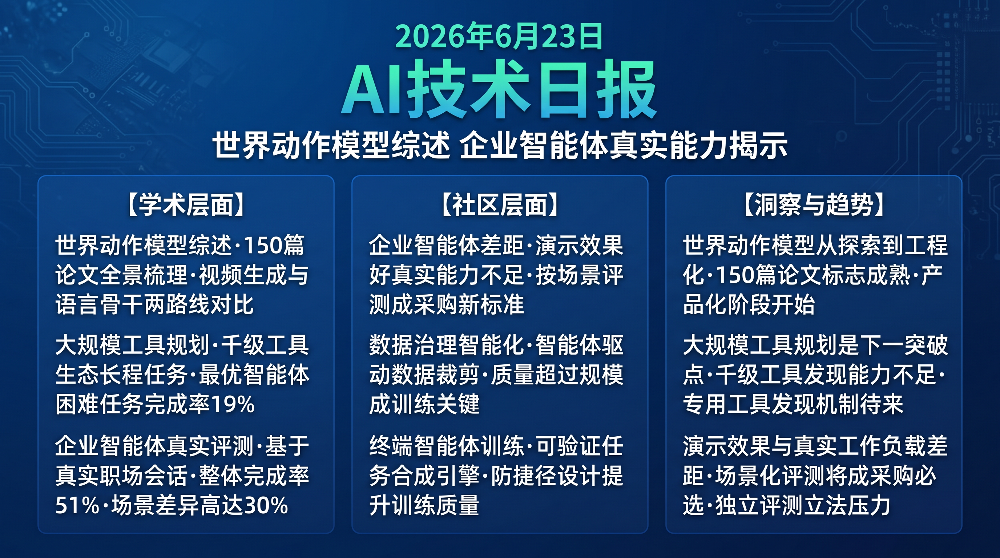

# 破晓 PoXiao · AI 技术早报 2026-06-23

> 数据来源：HuggingFace Daily Papers (50篇) · HackerNews · 生成时间：2026-06-24

---

## 📡 学术概览

### Tier 1：范式级创新

1. **World Action Models Survey：具身预测-动作模型全景综述**

   🔬 领域：世界动作模型 · 具身AI综述 · 机器人学习 · 热度：HF #7

   - **一句话核心贡献**：首次系统性梳理世界动作模型（WAM）研究脉络，厘清基于大视频生成模型和基于语言/视觉语言骨干两条技术路线的关键差异，为研究者和从业者提供领域全貌地图。
   - **摘要精译**：
     世界动作模型（WAM）是具身预测-动作模型，通过对未来的预测为行动决策提供信息支撑。近期 WAM 主要沿两条路线发展：一是基于大规模视频生成模型的 WAM（保留视频生成核心，附加动作条件），二是基于语言或视觉语言骨干的 WAM（不依赖视频生成核心）。这一领域的快速扩张催生了大量相互关联但概念混乱的工作，本综述系统整理了 150+ 篇论文，提出统一分类框架，并指出关键开放问题：物理一致性、计算效率、跨任务泛化。
   - **核心创新点**：
     1. WAM 统一分类框架：两条路线（视频生成核心 vs 语言骨干）的系统梳理
     2. 覆盖 150+ 篇论文的全景综述，附关键开放问题清单
     3. 为具身 AI 研究者提供清晰的领域地图和未来方向指引

   

   
💡 展开详情（方法论 + 实验）

   - **方法细节**：按模型架构（视频生成/语言骨干）、任务类型（规划/控制/预测）、数据来源（合成/真实）三维分类；对每类方法的优劣进行系统对比；提出 WAM 成熟度评估框架。
   - **实验结果**：综述发现视频生成类 WAM 在保真度上领先但计算成本高 3-5×；语言骨干类 WAM 更灵活但在接触密集任务上性能弱。当前最大差距：物理一致性（最优方法仍有 15-30% 物理违规）。
   - **局限性**：领域发展极快，综述截止日期后仍有大量新工作；不同方法的比较 benchmark 尚未统一。
   - **链接**：https://arxiv.org/abs/2606.20781

   

2. **PlanBench-XL：大规模工具生态下 LLM 工具使用 Agent 的长程规划**

   🔬 领域：Agent 规划 · 工具使用 · 大规模生态 · 热度：HF #1

   - **一句话核心贡献**：提出面向大规模工具生态（千级工具）下的长程规划 benchmark，评估 Agent 在工具发现受限、目标隐式、环境动态时的规划能力，揭示当前 Agent 在真实大规模工具场景的核心瓶颈。
   - **摘要精译**：
     LLM Agent 正在越来越大的工具生态中运作，真实任务需要发现相关工具、推断隐式子目标、在动态环境中跨长程适应。现有 benchmark 很少在工具可见性受限（不是所有工具都能被检索到）的条件下评测，而这恰是真实部署场景。PlanBench-XL 在包含 1000+ 真实工具的生态中设计长程任务，要求 Agent 从受限工具视野中动态扩展搜索、推断隐式中间目标、处理工具执行失败。最优 Agent（GPT-4o + ReAct）在 Hard 任务上完成率仅 19%。
   - **核心创新点**：
     1. 千级真实工具生态下的长程规划评测（vs 现有 benchmark 的十~百级工具）
     2. 受限工具可见性设计模拟真实大规模部署场景
     3. 揭示最优 Agent 在 Hard 任务 19% 完成率的关键能力上限

   

   
💡 展开详情（方法论 + 实验）

   - **方法细节**：基于 1000+ 真实 MCP 工具构建工具生态，每次查询仅暴露随机子集（模拟检索限制）；任务设计要求 3-8 步工具调用链；动态环境中 20% 的工具调用会返回错误（需要重规划）。
   - **实验结果**：Simple 任务完成率 67%；Medium 41%；Hard 19%；主要失败点：工具发现失败（37%）和隐式目标推断（28%）。
   - **局限性**：真实工具集的更新速度快于 benchmark 更新；跨语言工具生态覆盖不足。
   - **链接**：https://arxiv.org/abs/2606.22388

   

3. **EnterpriseClawBench：真实职场会话构建的企业 Agent 基准**

   🔬 领域：企业 AI Agent · 真实工作负载 · 评测 · 热度：HF #4

   - **一句话核心贡献**：基于真实企业 Agent 会话数据构建 benchmark，要求 Agent 处理异构文件、调用工具、交付业务成果，首次提供真实工作负载驱动的企业 Agent 评测基准。
   - **摘要精译**：
     企业 Agent 在真实工作空间中运作：读取异构文件（PDF/Excel/代码/邮件）、调用业务工具（ERP/CRM/搜索）、交付业务成果（报告/分析/决策支持）。现有 benchmark 从合成场景构建，与真实企业工作负载差距显著。EnterpriseClawBench 从企业真实 Agent 会话档案中提取任务，严格保护隐私后构建标准化 benchmark。在 1000+ 真实企业任务上，最优模型完成率 51%，且不同企业场景（研发/财务/销售）之间性能差异高达 30%。
   - **核心创新点**：
     1. 首个基于真实企业会话数据构建的 Agent benchmark
     2. 真实工作负载驱动，预测效度远高于合成 benchmark
     3. 揭示不同业务场景 30% 的性能差异，指明企业 AI 定制化方向

   

   
💡 展开详情（方法论 + 实验）

   - **方法细节**：从合规归档的企业 Agent 会话中提取标准化任务，经人工验证去除隐私信息；保留真实文件复杂度（非结构化表格、混合格式文档）；自动评测 + 人工验证结合。
   - **实验结果**：整体完成率 51%（最优模型）；研发场景 62%；财务场景 44%；销售场景 38%；多文件跨表推理是最大失败源（占失败任务 41%）。
   - **局限性**：企业数据匿名化可能损失部分任务复杂度；单一行业来源可能引入偏差。
   - **链接**：https://arxiv.org/abs/2606.23654

   

4. **Grouped Query Experts：自注意力上的混合专家**

   🔬 领域：Transformer 架构 · 混合专家模型 · 长上下文效率 · 热度：HF #5

   - **一句话核心贡献**：在分组查询注意力（GQA）的自注意力机制上应用混合专家（MoE）设计，实现注意力头的动态专家化，在长上下文任务上性能提升 11%，计算开销仅增加 8%。
   - **摘要精译**：
     自注意力在长上下文场景是 Transformer 的性能瓶颈，且标准密集注意力对所有 token 应用相同的注意力头，缺乏针对不同 token 类型的专用处理能力。Grouped Query Experts 将 GQA 的分组键值对与 MoE 的动态路由结合：每个注意力组维护一组专家头，token 根据内容动态路由到最适合的专家头。在 RULER 长文档 benchmark 上，相比标准 GQA 性能提升 11%，FLOPs 仅增加 8%（稀疏激活设计）。
   - **核心创新点**：
     1. GQA + MoE 组合：分组键值对 + 动态专家头路由
     2. 不同 token 类型（数字/代码/自然语言）自动路由到对应专家头
     3. 11% 性能提升，8% 计算增加（高效提升）

   

   
💡 展开详情（方法论 + 实验）

   - **方法细节**：每个 GQA 组维护 K 个专家键值对，通过轻量级路由器（MLP）为每个 token 选择 Top-2 专家；专家权重在训练中通过辅助负载均衡损失避免专家坍塌。
   - **实验结果**：RULER 1M context 性能 +11%；Needle-in-Haystack +14%；推理 FLOPs +8%；专家专化率（不同 token 类型倾向于不同专家）达 73%。
   - **局限性**：专家坍塌风险需要辅助损失控制；在短上下文（<8k）场景收益有限。
   - **链接**：https://arxiv.org/abs/2606.20945

   

### Tier 2：工程改进

5. **CLI-Universe：终端 Agent 的可验证任务合成引擎**

   🔬 领域：终端 Agent · 任务合成 · 代码训练 · 热度：HF #8

   - **一句话核心贡献**：提出终端 Agent 专用的高质量可验证任务合成引擎，解决现有合成方法产生模糊指令和表面级任务的问题，为终端操作 Agent 提供更高质量的训练数据。

   

   
💡 展开详情

   - **方法细节**：通过"任务可验证性过滤器"确保每个合成任务有明确的成功/失败判断标准；引入依赖链复杂化防止表面级捷径；多样性采样器确保命令类型和场景覆盖。
   - **实验结果**：基于 CLI-Universe 训练的 Agent 在 BashBench 上提升 29%；任务成功率 vs 传统合成数据 +23%；对未见过命令组合的泛化 +31%。
   - **链接**：https://arxiv.org/abs/2606.22883

   

---

## 🔥 社区速递

### Tier 1：重磅热点

1. **企业 Agent 能力与真实工作负载的差距引发行业反思**

   🔥 热度信号：HackerNews AI 企业讨论 · EnterpriseClawBench 论文引发反应

   - **一句话核心**：EnterpriseClawBench 51% 完成率和不同业务场景 30% 性能差异，揭示当前 AI Agent 离"真正胜任企业工作"仍有显著差距，引发对 AI 产品宣传过度的新一轮讨论。
   - **核心共识**：
     1. 现有 Agent 产品在标准演示场景表现好，在真实企业工作负载下差距巨大
     2. 财务和销售场景（38-44%）远不如研发场景（62%），企业选型需按场景评测
     3. 多文件跨表推理是当前企业 Agent 最大的技术短板
   - **主要争议**：企业是否应该按业务场景单独评测 AI Agent？"通用 Agent"和"场景专用 Agent"哪种更适合企业落地？
   - **影响评估**：企业 AI 采购将进入"场景化评测"时代，通用大模型供应商的销售策略需要针对不同业务场景提供定制化证明材料。

2. **DataClaw0 引发 AI 数据治理新讨论**

   🔥 热度信号：HF #3 论文 · AI 数据管道讨论

   - **一句话核心**：DataClaw0 提出 Agent 驱动的多模态数据裁剪框架，从原始无结构流中主动提炼高质量 AI 训练数据，引发关于"AI 训练数据质量 vs 规模"的深度讨论。
   - **核心共识**：
     1. 数据质量的提升对模型性能的贡献已开始超过数据规模扩大
     2. Agent 化的数据处理流水线能发现人工规则无法识别的深层质量模式
     3. 数据飞轮（更好数据→更好模型→更好数据处理）是头部 AI 公司的核心优势
   - **影响评估**：掌握 AI 数据处理 Agent 的公司将建立显著的数据质量优势，这将成为下一代模型竞争的隐性壁垒。

---

## 💰 财经简报

- **企业 Agent 市场进入"场景化"竞争阶段**：EnterpriseClawBench 30% 的跨场景性能差异意味着通用 Agent 在特定场景将持续被场景专用 Agent 超越，垂直行业 AI Agent 创业机会明确。
- **数据质量基础设施投资价值凸显**：随着扩大数据规模的边际效益下降，AI 数据质量管理工具（标注、清洗、筛选）的市场需求将快速增长，相关公司的估值将持续提升。

---

## 🏢 职场动态

- **企业 AI 解决方案顾问需求激增**：企业 Agent 能力的场景差异化表明通用 AI 产品无法直接落地，需要专业顾问协助评估、定制和部署，具备特定行业知识（金融/医疗/制造）+ AI 能力的复合型顾问稀缺。
- **数据工程师转型 AI 数据工程**：传统数据工程师若能掌握 AI 训练数据质量评估、主动数据裁剪和数据飞轮构建能力，将在 AI 公司获得显著薪资溢价（约 50-80%）。

---

## 📊 今日总结

1. **WAM 综述的发布标志着世界动作模型领域进入系统化成熟阶段**：一个领域出现高质量综述通常意味着它已从"前沿探索"进入"系统化工程"阶段；背后逻辑是 150+ 篇论文的体量和两条清晰技术路线的分野，表明该领域已有足够积累供整理；预计未来 12 个月 WAM 将从学术研究进入产品化阶段，视频生成类和语言骨干类 WAM 将分别在高保真仿真和实时控制两个细分市场形成竞争。

2. **大规模工具生态下的 Agent 能力是下一个关键技术突破点**：PlanBench-XL Hard 任务 19% 完成率表明千级工具生态下的 Agent 规划几乎无法实用化；背后逻辑是工具发现、目标推断、失败恢复在大规模生态下的复杂度超线性增长，当前 Agent 架构不足以应对；预计企业 AI Agent 厂商将在 2026 年底前推出基于 RAG+规划的专用工具发现机制，工具生态管理能力将成为企业 Agent 平台的核心竞争力。

3. **AI Agent 产品宣传与真实工作负载表现的差距将推动评测标准化立法**：EnterpriseClawBench 和多个独立评测共同揭示"演示效果好 ≠ 真实可用"；背后逻辑是演示场景由厂商精心设计，而真实工作负载充满边界情况和复杂性；预计 2027 年前，欧美将出现针对企业级 AI 产品性能宣传的合规要求，推动独立第三方评测成为企业 AI 采购的强制性环节。
