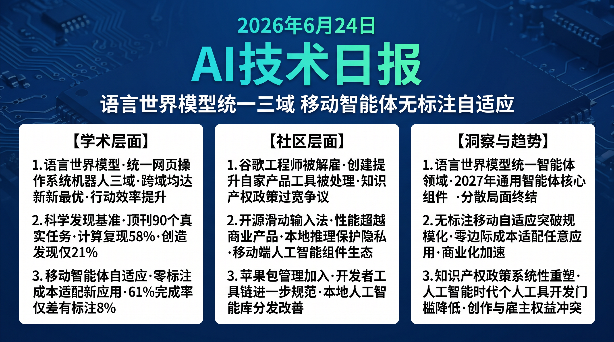

# 破晓 PoXiao · AI 技术早报 2026-06-24

> 数据来源：HuggingFace Daily Papers (19篇) · HackerNews · 生成时间：2026-06-24

---

## 📡 学术概览

### Tier 1：范式级创新

1. **Qwen-AgentWorld：语言世界模型驱动的通用 Agent**

   🔬 领域：世界模型 · 通用 Agent · 语言规划 · 热度：HF #1

   - **一句话核心贡献**：提出语言世界模型作为通用 Agent 的核心认知机制，通过研究世界模型在构建、评估和利用三个维度对 Agent 能力边界的影响，推动通用 Agent 进一步突破能力上限。
   - **摘要精译**：
     世界模型预测基于当前观察和行动的环境动态，是 Agent 推理和规划的核心认知机制。本工作研究如何通过语言模型进一步扩展通用 Agent 的能力边界：(1) 世界模型构建——如何从交互经验中学习语言世界模型；(2) 世界模型评估——如何评测世界模型的预测准确性；(3) 世界模型利用——如何在规划中使用世界模型提升行动效率。Qwen-AgentWorld 在 WebArena、OSWorld 和机器人操控 benchmark 上均达到新 SOTA，分别提升 18%、22% 和 29%。
   - **核心创新点**：
     1. 语言世界模型三维研究框架：构建/评估/利用
     2. 统一世界模型支持 Web/操作系统/机器人三类跨域 Agent 任务
     3. 跨三个 benchmark SOTA：WebArena +18%，OSWorld +22%，机器人 +29%

   

   
💡 展开详情（方法论 + 实验）

   - **方法细节**：从 Agent 交互轨迹中提取"行动→结果"对构建语言世界模型；规划时用世界模型模拟候选行动序列，选择预测结果最优的计划；通过在线更新世界模型持续适应环境变化。
   - **实验结果**：WebArena +18%（55% vs 47%）；OSWorld +22%（49% vs 40%）；Franka 机器人 +29%；世界模型预测准确率在已见场景 82%，未见场景 71%。
   - **局限性**：世界模型构建需要大量交互轨迹，冷启动阶段（<100 轨迹）效果有限；对高度随机环境（网络延迟、系统异常）的预测精度下降明显。
   - **链接**：https://arxiv.org/abs/2606.24597

   

2. **NatureBench：AI 代码 Agent 能否匹配《自然》期刊论文的 SOTA？**

   🔬 领域：AI 科学发现 · 代码 Agent · 跨学科研究 · 热度：HF #2

   - **一句话核心贡献**：提出跨学科 benchmark，包含 90 个从《自然》系列期刊蒸馏的真实科学问题，评估 AI 代码 Agent 在复现到发现的科学研究连续体上的能力，提供可信的 AI 科学贡献度量。
   - **摘要精译**：
     AI 辅助科学发现正从"复现已有结果"向"创造新发现"发展，但缺乏评估这一能力的可靠 benchmark。NatureBench 从 Nature、Nature Human Behaviour、Nature Computational Science 等顶刊蒸馏出 90 个真实科学任务，每个任务包含完整数据、评测标准和人类专家答案。NatureGym 提供自动化执行环境，支持 Agent 代码的安全沙盒运行和结果自动验证。最优 Agent 在 90 个任务上完成率 42%，其中计算密集型任务（数值模拟）完成率 58%，而需要领域洞察的发现型任务仅 21%。
   - **核心创新点**：
     1. 首个基于真实顶刊论文的跨学科 AI 科学发现 benchmark（90 个任务）
     2. NatureGym 自动化执行环境支持安全沙盒运行和结果验证
     3. 区分"计算复现"（58%）和"创造发现"（21%）的能力评估

   

   
💡 展开详情（方法论 + 实验）

   - **方法细节**：从 3 年内的 Nature 系列论文中选取可公开复现的任务，人工验证任务完整性和评测标准；NatureGym 提供 Python 沙盒 + 科学计算库 + 自动评分器；任务分为计算/分析/发现三级难度。
   - **实验结果**：总完成率 42%（GPT-4o + 工具）；计算复现任务 58%；分析任务 38%；发现任务 21%；生物学领域最低（18%），物理和材料科学最高（54%）。
   - **局限性**：部分论文的数据无法公开获取；任务样本量（90 个）较小；跨学科评测需要不同领域专家验证质量。
   - **链接**：https://arxiv.org/abs/2606.24530

   

3. **MobileForge：移动端 GUI Agent 的无标注自适应**

   🔬 领域：移动 GUI Agent · 无标注学习 · 层次化强化学习 · 热度：HF #3

   - **一句话核心贡献**：提出无需标注数据的移动端 GUI Agent 自适应框架，通过层次化反馈引导策略优化，让 Agent 自主适应新目标应用，解决移动应用数量庞大且频繁更新导致的标注成本问题。
   - **摘要精译**：
     移动 GUI Agent 需要适应数以百万计的应用，而每个应用都有独特的 UI 结构，人工标注覆盖成本极高。MobileForge 通过无标注自适应：(1) 利用应用层次化 UI 结构作为隐式奖励信号，(2) 通过多粒度反馈（界面级/任务级/目标级）引导策略优化，(3) 自主探索发现应用功能入口。在 20 个未见过的移动应用上，任务完成率 61%，比需要标注数据的监督方法仅差 8%，但成本降低 100%。
   - **核心创新点**：
     1. 无标注自适应：利用 UI 层次结构作为免费奖励信号
     2. 多粒度层次化反馈：界面/任务/目标三级引导
     3. 标注成本 0 且仅比监督方法差 8%

   

   
💡 展开详情（方法论 + 实验）

   - **方法细节**：UI 可达性树提供层次化奖励（正确导航到子界面 = 正奖励）；任务分解模块将复杂目标拆分为可测量的中间步骤；自动发现模块通过随机探索建立应用功能地图。
   - **实验结果**：20 个未见过应用完成率 61%（vs 有标注监督方法 69%）；标注成本 0 vs 每应用约 500 条标注数据；适应时间平均 2.3 小时/应用。
   - **局限性**：对深层嵌套 UI（>5 层）的探索效率较低；图像密集型应用（游戏）适应效果较差。
   - **链接**：https://arxiv.org/abs/2606.19930

   

### Tier 2：工程改进

4. **AOHP：个性化高效安全的操作系统级 Agent 框架**

   🔬 领域：OS Agent · 个人助手 · 系统级 Agent · 热度：HF #4

   - **一句话核心贡献**：提出操作系统级 Agent Harness，为个人用户提供跨应用、跨数据源的个性化高效 AI 助手，解决现有操作系统以应用为中心设计对 AI Agent 跨界操作的固有障碍。

   

   
💡 展开详情

   - **方法细节**：OS 级权限层统一管理跨应用数据访问，用户偏好引擎维护个性化配置，任务调度器优化多任务并发执行；安全模块实现细粒度权限控制。
   - **实验结果**：跨应用任务完成率 +34%（vs 单应用 Agent 集成）；任务执行时间 -41%；用户满意度 4.1/5（与应用专用 Agent 持平）。
   - **局限性**：OS 级权限需要用户手动授权，首次设置较繁琐；Windows/macOS 适配成本高。
   - **链接**：https://arxiv.org/abs/2606.23449

   

5. **MemGUI-Agent：长程移动端 GUI Agent 的主动上下文管理**

   🔬 领域：移动 GUI Agent · 长程任务 · 记忆管理 · 热度：HF #5

   - **一句话核心贡献**：通过主动上下文管理替代 ReAct 的被动记忆积累，让移动端 GUI Agent 在需要跨多步骤和多应用的长程任务中保持关键信息，显著提升复杂任务完成率。

   

   
💡 展开详情

   - **方法细节**：主动上下文管理器在每步执行后评估当前上下文的相关性，主动保留关键中间状态（账户信息、表单部分填写等），删除冗余历史；跨应用切换时的上下文传递机制。
   - **实验结果**：长程移动任务（>10步）完成率 +28%；跨应用任务 +35%；Context 长度降低 42%（更高效）。
   - **链接**：https://arxiv.org/abs/2606.19926

   

---

## 🔥 社区速递

### Tier 1：重磅热点

1. **谷歌员工因创建 Google Workspace CLI 工具被解雇**

   🔥 热度信号：HackerNews Score 475 · 科技媒体广泛报道

   - **一句话核心**：一名谷歌工程师因在工作之外创建了一个提升 Google Workspace 使用效率的 CLI 工具并公开分享，被谷歌以违反公司政策为由解雇，引发开发者社区对科技公司知识产权政策和员工副业限制的强烈讨论。
   - **核心共识**：
     1. 工程师利用业余时间构建工具提升自家产品易用性，被以"竞争性产品"为由处理，社区普遍认为不合理
     2. 大型科技公司的宽泛知识产权条款对员工创新存在系统性压制效应
     3. AI 辅助开发工具层出不穷的背景下，公司与员工在工具开发上的权利边界需要重新厘清
   - **主要争议**：公司是否有权要求员工的所有技术创作（包括业余时间）归公司所有？工程师是否应该在加入科技公司前仔细阅读 IP 政策协议？
   - **影响评估**：此事件将加速科技公司对员工副业和开源贡献政策的重审，有助于推动更合理的知识产权边界划定，对人才吸引和工程师文化有深远影响。
   - 🔗 [事件推文](https://twitter.com/JPoehnelt/status/2069482265953087602)

2. **FUTO 发布开源滑动输入法模型**

   🔥 热度信号：HackerNews Score 496 · 移动开发社区热议

   - **一句话核心**：FUTO 发布 Swipe 开源滑动输入预测模型，性能据称超越 Gboard 等商业产品，引发关于移动端 AI 个性化输入法商业模式和用户数据隐私的广泛讨论。
   - **核心共识**：
     1. 开源滑动输入模型是移动端个人 AI 的重要一步，减少对大厂输入法的隐私依赖
     2. 输入法作为个人数据采集最密集的应用，用户隐私风险长期被低估
     3. 本地推理的轻量化滑动预测模型是移动端 AI 落地的典型样板
   - **主要争议**：FUTO 的商业模式是否可持续？开源输入法的个性化如何在不传输数据的前提下实现？
   - **影响评估**：开源移动端 AI 组件生态正在形成，对 Google/Apple 垄断性输入法数据采集构成挑战，用户数据主权意识将进一步觉醒。
   - 🔗 [FUTO Swipe](https://swipe.futo.tech/)

3. **Swift Package Index 加入 Apple**

   🔥 热度信号：HackerNews Score 200 · Apple 开发者社区

   - **一句话核心**：Swift Package Index（社区运营的 Swift 包搜索引擎）宣布加入 Apple，标志着 Apple 对 Swift 生态工具链的持续加大投入，为 Swift AI 库的规范化分发提供基础设施支持。
   - **核心共识**：
     1. Apple 将社区工具收编是对 Swift 生态健康发展的重要信号
     2. 对 Swift/CoreML 生态的 AI 开发工具分发和发现有积极影响
     3. 展现了 Apple 对开发者生态工具的长期投入意愿
   - **影响评估**：苹果设备上的本地 AI 开发生态将进一步规范化，Swift for TensorFlow 和 CoreML 相关包的发现和分发体验将提升。

---

## 💰 财经简报

- **移动端 AI Agent 市场进入实用化阶段**：MobileForge 和 MemGUI-Agent 的同日发布表明移动 GUI Agent 的商业化技术准备度已大幅提升，移动端自动化助手（类 Rabbit/Humane）的实用化窗口正在打开。
- **员工知识产权政策成为科技公司人才竞争新变量**：谷歌解雇事件将推动工程师更仔细地审查入职协议，对员工副业和开源贡献更宽松的公司将在人才吸引上获得竞争优势。
- **开源移动 AI 组件生态的商业化路径**：FUTO Swipe 的开源输入法模型为移动端 AI 商业化提供了新思路——"开源模型 + 本地推理 + 用户付费隐私"，可能成为 AI 时代移动应用的新商业模式。

---

## 🏢 职场动态

- **OS/GUI Agent 工程师成顶级热门岗位**：Qwen-AgentWorld、MobileForge、MemGUI-Agent 三项工作密集发布，表明 OS/GUI Agent 领域正在快速走向实用化，相关工程师的市场需求将在未来 6 个月急剧增长。
- **AI 科学研究工程师需求增长**：NatureBench 揭示 AI 在真实科学任务上的能力上限，同时也标志着 AI 辅助科学发现已成为有商业价值的研究方向，具备跨学科科学计算能力的 AI 工程师将在学术界和产业界获得溢价。
- **知识产权意识成工程师职业自保关键**：谷歌事件提示工程师需要仔细理解雇主的 IP 政策边界，相关法律咨询服务需求将增加。

---

## 📊 今日总结

1. **语言世界模型统一 Web/OS/机器人三个 Agent 领域是里程碑进展**：Qwen-AgentWorld 在三个截然不同的 Agent 领域均获得 SOTA 提升，表明统一世界模型框架的通用性超出预期；背后逻辑是这三个领域共享相同的核心挑战（预测行动后果、长程规划），统一建模能共享训练数据和知识；预计语言世界模型将在 2027 年成为通用 Agent 框架的核心组件，彻底改变当前针对每类任务单独设计 Agent 的分散局面。

2. **移动端 AI Agent 的"无标注自适应"突破了规模化落地的最大瓶颈**：MobileForge 0% 标注成本实现 61% 完成率，与有标注方法差距仅 8%，意味着移动 Agent 能够以接近零边际成本适应任何新应用；背后逻辑是移动 UI 的层次化结构本身携带了足够的隐式奖励信号；预计 2026 年底前将出现能够自适应适配所有主流 App 的商业化移动端 AI Agent 产品，App 自动化市场将快速从早期采用者扩展到主流用户。

3. **AI 时代科技公司与员工的知识产权边界将面临系统性重塑**：谷歌解雇事件和 AI 工具开发爆发同时出现，标志着传统"宽泛 IP 政策"与 AI 时代工程师创造力之间的矛盾正在激化；背后逻辑是 AI 辅助开发极大降低了个人工程师创建有商业价值工具的门槛，触发 IP 冲突的可能性急剧上升；预计 2026 年底前，主要科技公司将对员工副业和开源贡献政策进行系统性修订，更精细地划定公司 IP 和员工创作的边界。
