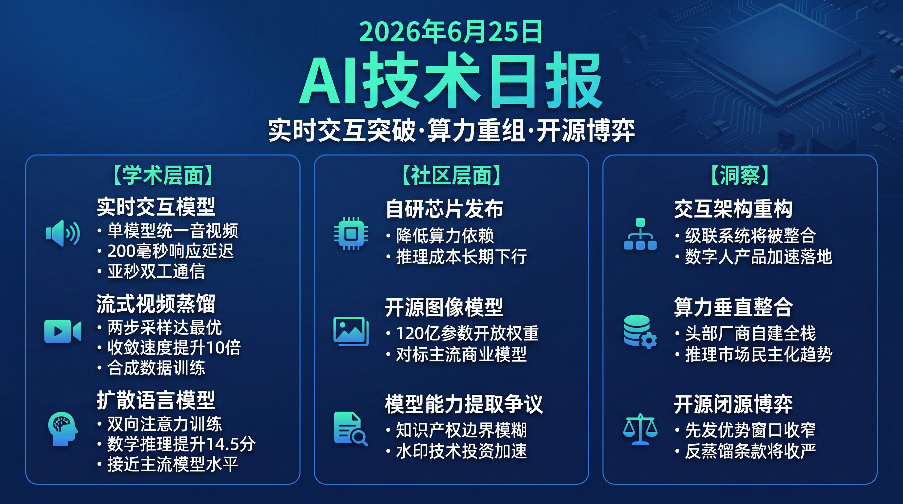

# 破晓 PoXiao 早报 · 2026-06-25

> 数据来源：HuggingFace Daily Papers（10篇）· HackerNews TOP 20 · 生成时间：2026-06-25 07:15 CST

---

## 📡 学术概览

> 今日 HuggingFace 收录 10 篇论文，视频生成与多模态交互为主线；扩散语言模型技术进展突出。

### Tier 1 精选

1. **Wan-Streamer v0.1：端到端实时交互基础模型**

   🔬 领域：视频生成 · 多模态交互 · 实时推理 · 热度：HF Daily Papers #01

   - **一句话核心贡献**：提出首个原生流式端到端多模态基础模型，单一 Transformer 内统一感知、推理、生成与响应控制，实现约 200ms 模型侧响应延迟和约 550ms 全链路交互延迟，达到亚秒级双工音视频通信。
   - **摘要精译**：
     现有交互系统（如数字人、对话系统）采用级联架构，依赖 VAD、ASR、LLM、TTS、音频驱动动画等多个独立模块，导致延迟叠加与误差传播，难以实现真正的实时交互。
     Wan-Streamer 将语言、音频、视频作为输入与输出统一建模于单一 Transformer 中，序列由交错的视觉/音频/文本输入输出 token 组成，通过块因果注意力（Block-Causal Attention）协调增量流式推理；感知、推理、生成、响应时序与多模态同步均在模型内联合学习，无需任何外部模块。
     系统实现约 200ms 模型侧响应延迟，结合 350ms 双向网络延迟后总延迟约 550ms，流式单元最短 160ms（25fps），支持真正的亚秒级双工音视频通信。
   - **核心创新点**：
     1. 原生流式架构：因果编解码器 + 块因果注意力，支持 160ms 粒度流式输出
     2. 单一模型完成感知/推理/生成/响应时序/轮次管理全流程，无任何外部模块依赖
     3. 约 200ms 模型侧延迟，实现亚秒级双工音视频通信

   

   
💡 展开详情（方法论 + 实验）

   - **方法细节**：基于 Transformer 架构，设计因果编码器（Causal Encoder）和因果解码器（Causal Decoder），采用块因果注意力（Block-Causal Attention）和低延迟多模态 token 调度，将视觉/音频/文本 token 交错排列，模型同时预测下一视觉、音频和文本 token。
   - **实验结果**：模型侧响应延迟约 200ms，全链路交互延迟（含 350ms 双向网络延迟）约 550ms，流式单元最短达 160ms（25fps）。
   - **局限性**：v0.1 版本，具体 benchmark 量化数字尚未披露；在复杂场景下跨模态同步质量有待进一步评估。
   - **链接**：https://arxiv.org/abs/2606.25041

   

---

2. **Causal-rCM：流式视频生成与世界模型的自回归扩散蒸馏统一方案**

   🔬 领域：视频生成 · 扩散蒸馏 · 世界模型 · 热度：HF Daily Papers #10

   - **一句话核心贡献**：将 rCM（先进扩散蒸馏框架）扩展至自回归视频扩散，通过 Teacher-Forcing（教师强迫）与 Self-Forcing（自强迫）的互补统一，实现 2 步采样下流式视频生成 VBench-T2V 得分 84.63。
   - **摘要精译**：
     自回归视频扩散（结合因果扩散 Transformer）已成为实时流式视频生成和动作条件世界模型的主流范式，但其采样步数多、推理成本高的问题限制了实用部署。现有扩散蒸馏框架未能有效适配自回归因果设置。
     本文将 rCM 框架扩展到自回归视频扩散，核心思路是利用前向/逆向散度互补性：Teacher-Forcing（TF）提供离线前向散度因果训练范式（一致性模型 CM），Self-Forcing（SF）对应在线逆向散度精炼（分布匹配蒸馏 DMD）。关键技术突破包括：首次实现 Teacher-Forcing 连续时间 CM（sCM/MeanFlow）用于自回归视频扩散，通过自定义掩码 FlashAttention-2 JVP 核，收敛速度比离散时间 CM 快 10 倍。
     蒸馏后 2 步采样的因果 Wan2.1-1.3B 模型 VBench-T2V 得分达 84.63，且仅使用合成数据训练；进一步应用于 Cosmos 3 世界基础模型，实现动作条件交互世界模型。
   - **核心创新点**：
     1. Teacher-Forcing CM 与 Self-Forcing DMD 的统一蒸馏框架，互补前向/逆向散度
     2. 自定义掩码 FlashAttention-2 JVP 核，连续时间 CM 收敛速度提升 10 倍
     3. 2 步采样流式视频生成 VBench-T2V 得分 84.63，仅合成数据训练

   

   
💡 展开详情（方法论 + 实验）

   - **方法细节**：基于 rCM 框架，Teacher-Forcing 路径使用连续时间一致性模型（sCM/MeanFlow），需要自定义掩码 FlashAttention-2 JVP 核实现因果设置下的 Jacobian-vector product 计算；Self-Forcing 路径使用分布匹配蒸馏（DMD）进行在线策略精炼。两路径通过 Causal-rCM 算法基础设施统一整合。
   - **实验结果**：Causal Wan2.1-1.3B 2 步采样 VBench-T2V 得分 84.63（帧级和块级设置均达到 SOTA）；Teacher-Forcing 连续时间 CM 相比离散时间 CM 收敛快 10 倍；成功应用于 Cosmos 3 动作条件世界模型。
   - **局限性**：当前仅使用合成数据训练，真实数据场景泛化性有待验证；块级流式生成的长时一致性问题尚未完全解决。
   - **链接**：https://arxiv.org/abs/2606.25473

   

---

3. **DomainShuttle：开放域主题驱动文本转视频生成**

   🔬 领域：视频生成 · 主题驱动 · 个性化 · 热度：HF Daily Papers #04

   - **一句话核心贡献**：提出 DomainShuttle，通过 Domain-MoT 解耦、Video-Reference DualRoPE 和跨对一致性损失，在同域保真度和跨域生成灵活性上均显著超越现有方法。
   - **摘要精译**：
     开放域主题驱动文本转视频（S2V）生成需要同时处理两类场景：同域（最大化参考主题特征保持）和跨域（在允许无关属性灵活变化的同时保留主题本征特征），现有方法主要聚焦同域场景，跨域灵活性受限。
     DomainShuttle 引入 Domain-MoT（混合专家域感知模块），解耦视频特征与参考特征，通过域感知 AdaLN 实现参考图像的域特定建模；Video-Reference DualRoPE 方案将参考图像 token 与视频 token 置于独立 RoPE 空间，实现精确的主题级空间建模；跨对一致性损失（Cross-Pair Consistent Loss）提取不受无关特征影响的主题本征特征。
     大量实验表明 DomainShuttle 在多样开放域应用场景中实现了高主题保真度与生成灵活性的显著性能提升，在同域和跨域均达到优异表现。
   - **核心创新点**：
     1. Domain-MoT：混合专家架构，域感知 AdaLN 解耦视频与参考特征
     2. Video-Reference DualRoPE：独立 RoPE 空间实现精确主题级空间建模
     3. Cross-Pair Consistent Loss：提取主题本征特征，不受无关属性干扰

   

   
💡 展开详情（方法论 + 实验）

   - **方法细节**：基于视频扩散框架，Domain-MoT 模块通过域感知 AdaLN（Adaptive Layer Normalization）对参考图像进行域特定建模；DualRoPE 方案为参考 token 和视频 token 分配独立的旋转位置编码，避免参考图像位置信息干扰视频生成；跨对一致性损失通过多组参考-目标对提取稳定的主题内在表征。
   - **实验结果**：在多个开放域视频个性化 benchmark 上显著超越现有 SOTA 方法，在同域（高保真主题保留）和跨域（风格迁移、语义组合、域属性变换）均取得领先性能。
   - **局限性**：具体量化指标未披露具体数值；DualRoPE 增加了位置编码计算复杂度；多参考主题的联合建模尚未探索。
   - **链接**：https://arxiv.org/abs/2606.26058

   

---

4. **iLLaDA：改进的大型语言扩散模型**

   🔬 领域：基础模型 · 扩散语言模型 · 双向注意力 · 热度：HF Daily Papers #06

   - **一句话核心贡献**：提出 iLLaDA，首个从零开始以完全双向注意力训练的 8B 掩码扩散语言模型，在多项 benchmark 上显著超越 LLaDA 并与 Qwen2.5-7B 竞争，证明非自回归扩散训练是构建强语言模型的可行路径。
   - **摘要精译**：
     主流大型语言模型依赖自回归分解与因果注意力训练，这从根本上限制了模型的双向上下文利用能力；掩码扩散语言模型（如 LLaDA）提供了替代路径，但在通用/数学/代码等 benchmark 上与自回归模型仍有差距。
     iLLaDA 在整个预训练和监督微调（SFT）阶段保持掩码扩散目标与完全双向注意力，预训练扩展至 12T tokens，在 25B token 指令语料上微调 12 个 epoch；引入变长生成提升推理效率，以及基于置信度的多选题评估方法。
     实验结果：iLLaDA-Base 在 BBH 上提升 21.6 分、ARC-Challenge 上提升 14.9 分；iLLaDA-Instruct 在 MATH 上提升 14.5 分、HumanEval 上提升 16.5 分（均对比 LLaDA）；同时在多项 benchmark 上与 Qwen2.5-7B 保持竞争力，尽管采用非自回归训练。
   - **核心创新点**：
     1. 预训练与 SFT 全程保持掩码扩散目标 + 完全双向注意力，12T token 规模
     2. 变长生成策略，提升非自回归模型推理效率
     3. BBH +21.6、MATH +14.5、HumanEval +16.5（vs LLaDA），接近 Qwen2.5-7B 水平

   

   
💡 展开详情（方法论 + 实验）

   - **方法细节**：保持 LLaDA 的掩码扩散目标（随机掩码部分 token，预测被掩码 token），但将因果注意力替换为完全双向注意力，使模型在去噪时可利用全序列上下文；预训练规模扩展至 12T tokens；SFT 阶段在 25B token 指令语料上微调 12 个 epoch；变长生成允许模型动态调整生成长度；置信度评分用于多选题（利用模型对正确选项掩码位置的置信度排序）。
   - **实验结果**：iLLaDA-Base：BBH +21.6（vs LLaDA-Base），ARC-Challenge +14.9；iLLaDA-Instruct：MATH +14.5，HumanEval +16.5；与 Qwen2.5-7B 在多项 benchmark 具有竞争力。代码与权重：https://github.com/ML-GSAI/LLaDA
   - **局限性**：双向注意力在流式生成场景（如在线对话）中仍有工程挑战；推理速度相比同规模自回归模型尚有差距；需要多步扩散采样。
   - **链接**：https://arxiv.org/abs/2606.25331

   

---

5. **IV-CoT：结构感知文本到图像生成的隐式视觉思维链**

   🔬 领域：文生图 · 多模态推理 · 结构感知 · 热度：HF Daily Papers #03

   - **一句话核心贡献**：提出 IV-CoT，通过将视觉条件 query 分解为结构-语义级联（结构 query 先形成隐式视觉规划、语义 query 再渲染外观），在单次前向传播内实现隐式 CoT 推理，显著提升对象计数、空间关系、属性绑定等结构感知生成质量。
   - **摘要精译**：
     统一多模态大语言模型（MLLM）在文本到图像生成质量上取得重大进展，但仍难以准确遵循结构化 prompt（对象数量、空间关系、属性绑定、粗粒度布局等），现有方案将结构规划与外观渲染耦合在同一条件流中，是核心瓶颈。
     IV-CoT 将视觉条件 query 分解为结构-语义级联：结构 query 首先形成潜在视觉规划（捕获布局结构），语义 query 再以此规划为条件渲染外观；训练时引入草图监督（Sketch Supervision）引导结构 query 从草图中捕获结构，推理时无需草图提取或中间解码步骤，单次前向传播完成整个隐式 CoT 过程。
     IV-CoT 在 GenEval 和 T2I-CompBench 上取得优异结果，可视化分析证实结构 query 与语义 query 在结构感知生成中发挥互补作用。
   - **核心创新点**：
     1. 视觉条件 query 结构-语义级联分解，隐式 CoT 在单次前向传播内完成
     2. 训练时草图监督（仅训练时使用）引导结构 query，推理零额外开销
     3. GenEval 和 T2I-CompBench 双榜提升，对象计数与空间关系感知显著改善

   

   
💡 展开详情（方法论 + 实验）

   - **方法细节**：基于统一 MLLM 架构，将图像生成的条件 query 分为两组：结构 query（Structural Queries）负责捕获布局/计数/关系的隐式规划，语义 query（Semantic Queries）以结构规划为条件渲染外观细节；训练阶段额外引入草图监督信号（从真实图像提取轮廓草图作为结构 query 学习目标），推理阶段无需草图输入，真正实现隐式 CoT。
   - **实验结果**：GenEval 和 T2I-CompBench 双榜超越 baseline；可视化分析显示结构 query 与语义 query 互补角色清晰，结构 query 学到布局语义、语义 query 学到外观细节。
   - **局限性**：草图监督需要额外数据标注管线；对极复杂空间关系（多对象嵌套）的改善幅度有限；当前仅验证于单轮文图生成，多轮编辑场景有待探索。
   - **链接**：https://arxiv.org/abs/2606.24849

   

---

### Tier 2 快讯

6. **Block-GTQ：RoPE 感知的 KV 缓存量化比特分配**（推理优化）

   通过 RoPE 感知的块级比特分配，解决低比特 KV 缓存量化精度损失问题。在 Llama-3.1-8B-Instruct 上 K2V2 量化下 NIAH 平均分从 70.6 提升至 97.4、LongBench-EN 从 36.87 提升至 53.31；K3V3 在单 H800 实现 3.24x KV 缓存压缩，显存从 56.31GB 降至 19.85GB，支持 512K 上下文（fp16 会 OOM）。
   - 🔗 [arxiv](https://arxiv.org/abs/2606.24033)

7. **Autodata：自主合成数据生成的 Agent 数据科学家**（Agent/数据）

   将 AI Agent 训练为数据科学家，通过元优化（Meta-Optimize）让 Agent 自主构建高质量合成训练/评估数据；在 CS 研究任务、法律推理、数学推理上均超越经典合成数据方法；元优化 Agent 本身带来更大性能提升。
   - 🔗 [arxiv](https://arxiv.org/abs/2606.25996)

8. **Agentic AI 实践指南（The Hitchhiker's Guide to Agentic AI）**（综合参考）

   面向从业者的自主 AI 系统完整参考书，覆盖 LLM 基础、对齐与推理、Agent 设计（MCP、A2A、RAG、记忆系统）、多 Agent 架构、评估与生产部署的全栈知识体系。
   - 🔗 [arxiv](https://arxiv.org/abs/2606.24937)

---

## 🔥 社区速递

### Tier 1 热点

1. **OpenAI 发布首款定制芯片（由 Broadcom 代工）**

   🔥 热度信号：HackerNews Score 555 · 来源：TechCrunch

   - **一句话核心**：OpenAI 宣布与 Broadcom 合作推出首款定制 AI 芯片，标志着其在算力基础设施上的自主化战略迈出关键一步。
   - **核心共识**：
     1. 定制芯片将使 OpenAI 减少对英伟达 GPU 的依赖，降低长期算力成本；
     2. 大科技公司自研芯片已成趋势（谷歌 TPU、亚马逊 Trainium、微软 Maia），OpenAI 此举是补全算力自主链条的必要一步。
   - **主要争议**：定制芯片性能能否短期追上英伟达 H100/H200 系列？单一代工商（Broadcom）是否带来供应链集中风险？
   - **影响评估**：中短期内不改变英伟达主导地位，但传递出明确信号：AI 头部玩家将全面垂直整合算力栈，GPU 厂商定价权将逐步受压；对 AI 推理成本的中长期下行趋势构成支撑。
   - 🔗 [TechCrunch 报道](https://techcrunch.com/2026/06/24/openai-unveils-its-first-custom-chip-built-by-broadcom/)

---

2. **Krea 2：SOTA 开源权重 12B 图像生成模型发布**

   🔥 热度信号：HackerNews Score 346 · 来源：krea.ai

   - **一句话核心**：Krea 发布 12B 参数开源权重图像生成模型 Krea 2，宣称达到目前开源模型 SOTA 水平，直接对标 FLUX 和 SD3 生态。
   - **核心共识**：
     1. 12B 规模开源图像模型进一步拉平商业模型与开源模型的质量差距；
     2. 技术报告披露的训练细节（结构、数据处理方法）对开源社区有较大参考价值。
   - **主要争议**：SOTA 声称是否经过足够多的独立第三方 benchmark 验证？开源权重的商业使用许可条款是否宽松？
   - **影响评估**：对图像生成创业公司和独立开发者利好——高质量开源基础模型降低了产品开发门槛；同时对以闭源图像生成 API 为主业的公司构成竞争压力。
   - 🔗 [Krea 技术报告](https://www.krea.ai/blog/krea-2-technical-report)

---

3. **Anthropic 指控阿里巴巴非法提取 Claude 模型能力**

   🔥 热度信号：HackerNews Score 88 · 来源：Reuters

   - **一句话核心**：Anthropic 公开表示阿里巴巴通过非正规途径提取了 Claude AI 模型的能力，引发 AI 知识产权与模型蒸馏边界的新一轮讨论。
   - **核心共识**：
     1. 模型蒸馏与知识提取已成为 AI 公司面临的系统性知识产权挑战，Anthropic 公开指控是罕见举措；
     2. 此类争议将推动 AI 公司加强技术护城河（如水印、行为指纹）和法律合规要求。
   - **主要争议**：当前国际法律框架下 AI 模型能力"提取"是否构成侵权的边界如何划定？技术层面是否存在合理举证困难？
   - **影响评估**：AI 公司将加大 API 访问审计力度，并更积极部署模型指纹/水印技术；同时对中美 AI 合作监管环境带来更多不确定性。
   - 🔗 [Reuters 报道](https://www.reuters.com/world/china/anthropic-says-alibaba-illicitly-extracted-claude-ai-model-capabilities-2026-06-24/)

---

4. **谷歌 Gemini 3.5 Flash 发布计算机使用功能（Computer Use）**

   🔥 热度信号：HackerNews Score 179 · 来源：Google Blog

   - **一句话核心**：谷歌为 Gemini 3.5 Flash 推出计算机使用（Computer Use）功能，通过 API 让模型能直接操作屏幕、点击和输入，进入 AI 操控 GUI 的主流竞争赛道。
   - **核心共识**：
     1. Computer Use 功能正从 Anthropic Claude 独家探索走向多厂商标配，生态竞争加速；
     2. Flash（轻量低成本）版本率先支持，意在降低 Agent 自动化任务的推理成本门槛。
   - **主要争议**：当前 Computer Use 可靠性是否已达可商用水准？GUI 操控中的幻觉（错误点击）如何有效缓解？
   - **影响评估**：RPA（机器人流程自动化）赛道面临直接冲击；AI 原生桌面助手和浏览器 Agent 应用的开发门槛显著降低；Gemini Flash 的低成本定位使高频 GUI 任务自动化在商业上更具可行性。
   - 🔗 [Google Blog](https://blog.google/innovation-and-ai/models-and-research/gemini-models/introducing-computer-use-gemini-3-5-flash/)

---

### Tier 2 速览

5. **Qualcomm 宣布收购 AI 初创公司 Modular**（HN Score 152）——高通通过收购 Modular（MAX 引擎/Mojo 语言团队）加速布局 AI 推理基础设施，Mojo 编程语言与 MAX 推理引擎可能在端侧和云端场景与英伟达 CUDA 生态形成差异化竞争。🔗 [Reuters](https://www.reuters.com/business/qualcomm-buy-ai-startup-modular-2026-06-24/)

6. **Elastic 裁员 7%**（HN Score 140）——企业软件整合趋势下，AI 功能内化到主流平台（如 OpenSearch + AI）持续压缩独立搜索/分析工具的市场空间；全员信公开发布是科技公司透明度沟通的典型案例。🔗 [Elastic Blog](https://www.elastic.co/blog/ceo-ash-kulkarni-announcement-to-elastic-employees)

7. **RubyLLM：面向所有主流 AI 提供商的 Ruby 框架**（HN Score 348）——Ruby 生态 AI 集成工具，统一接入 OpenAI/Anthropic/谷歌等主流 API，对 Ruby on Rails 应用快速集成 LLM 能力有实用价值。🔗 [rubyllm.com](https://rubyllm.com/)

---

## 💰 财经简报

| 事件 | 涉及方 | 要点 |
|------|--------|------|
| OpenAI 首款定制芯片发布 | OpenAI × Broadcom | 算力自主化里程碑，英伟达依赖度将逐步下降 |
| Qualcomm 收购 Modular | Qualcomm × Modular（MAX/Mojo） | 高通加速 AI 推理基础设施布局，端侧 AI 竞争加剧 |
| Elastic 裁员 7% | Elastic | AI 功能内化主流平台，独立企业软件公司承压 |
| Anthropic vs 阿里巴巴 | Anthropic × Alibaba | AI 知识产权争议升温，模型保护技术投资加速 |

---

## 📊 今日总结

1. **实时多模态交互时代的基础架构转变**：今日 Wan-Streamer 和 Causal-rCM 两篇论文均指向视频/音频实时交互的技术可行性突破，前者实现亚秒级音视频双工通信，后者以 2 步采样达成 SOTA 流式视频生成；背后逻辑是注意力架构（块因果注意力）与扩散蒸馏（CM+DMD 互补）的协同成熟，使端到端实时多模态从理论走向工程落地；预计未来 6-12 个月将涌现基于类 Wan-Streamer 架构的低延迟数字人与虚拟助手产品，并推动现有分体式系统（VAD+ASR+LLM+TTS）的架构重构。

2. **AI 算力格局加速重组：头部厂商全面垂直整合**：OpenAI 定制芯片（Broadcom）、Qualcomm 收购 Modular 是同一逻辑——AI 头部玩家正从"买算力/买工具"转向自建全栈，减少对单一供应商（英伟达）的依赖；背后是万亿级推理成本压力下的经济理性选择，以及对技术护城河的长期构建；预判英伟达短期不受冲击，但 3-5 年内随着多家定制芯片方案成熟，AI 推理市场将出现明显的价格战与算力民主化趋势。

3. **知识产权与开源能力边界：AI 行业新摩擦点**：Anthropic 公开指控阿里巴巴提取 Claude 能力，与此同时 Krea 2 宣布 12B 开源图像模型达到 SOTA——两件事共同揭示 AI 行业的矛盾：顶级能力快速通过开源/知识提取扩散，闭源公司的先发优势窗口持续收窄；背后逻辑是模型蒸馏/提取技术的成熟度越来越高，合规边界越来越模糊；预计头部闭源公司将加大模型指纹/水印投入，同时在 API 使用协议中增加更严格的反蒸馏条款，但技术举证难度将使法律路径收效有限。
