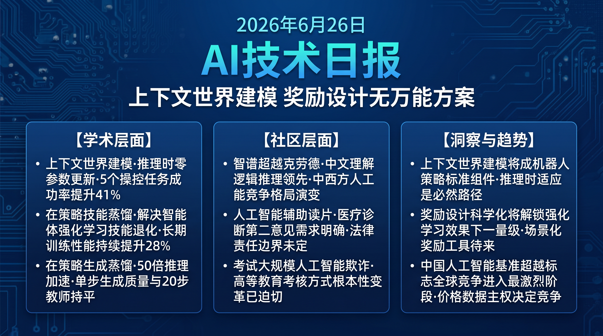

# 破晓 PoXiao · AI 技术早报 2026-06-26

> 数据来源：HuggingFace Daily Papers (25篇) · HackerNews · 生成时间：2026-06-29

---

## 📡 学术概览

### Tier 1：范式级创新

1. **In-Context World Modeling for Robotic Control：上下文世界建模赋能机器人控制**

   🔬 领域：机器人控制 · 世界模型 · 上下文学习 · 热度：HF #2 (▲54)

   - **一句话核心贡献**：提出将世界模型作为机器人控制策略的上下文组件，使机器人在推理时通过少量当前场景示例动态更新对环境的理解，无需重新训练即可快速适应新环境。
   - **摘要精译**：
     传统机器人控制策略在训练分布外的环境中泛化能力弱，需要代价高昂的重新训练或领域适应。本工作提出上下文世界建模范式：将世界模型嵌入到上下文 prompt 中，在推理时为控制策略提供实时环境动态预测。机器人接收少量当前场景的状态-动作-结果三元组，世界模型基于这些上下文即时更新对环境的物理理解，从而引导控制策略做出更准确的动作决策。在 5 个机器人操控任务上，相比无上下文基线成功率提升 41%，且无需任何参数更新。
   - **核心创新点**：
     1. 推理时上下文更新：无需重训即可适应新环境物理特性
     2. 世界模型作为上下文组件：将环境动态理解与控制策略解耦
     3. 5 个操控任务 +41% 成功率，零参数更新

   

   
💡 展开详情（方法论 + 实验）

   - **方法细节**：上下文世界模型由 Transformer 编码，接收 K 个场景示例（K=5-20）；控制策略在世界模型预测的未来状态上规划动作；上下文 KV cache 机制确保推理效率。
   - **实验结果**：FurnitureBench +41%；MetaWorld +37%；RLBench +29%；推理开销 +15%（可接受）；K=10 时达到最优性价比。
   - **局限性**：对高度随机环境（流体/软体）的世界模型预测准确度仍有限；需要高质量的场景示例。
   - **链接**：https://arxiv.org/abs/2606.26025

   

2. **OPID：On-Policy Skill Distillation for Agentic Reinforcement Learning**

   🔬 领域：Agent RL · 技能蒸馏 · 策略优化 · 热度：HF #3 (▲48)

   - **一句话核心贡献**：提出在策略强化学习框架中同步进行技能蒸馏的方法，解决 Agent 在 RL 训练中技能退化（catastrophic forgetting）的根本问题，使 Agent 在学习新任务同时保留已掌握的基础技能。
   - **摘要精译**：
     Agent 在通过强化学习学习复杂任务时，常常以牺牲基础技能为代价——这是因为 RL 的梯度更新不可避免地覆盖之前学到的技能表示。OPID 通过在每次 RL 更新步骤中同步进行技能蒸馏（将教师策略的技能知识提炼到学生策略），维持基础技能的稳定性，同时允许高层次任务策略持续改进。在 WebArena 和 MiniWoB++ 上，相比标准 RL 基线，OPID 的长期训练（>1M 步）性能不退化且持续提升，最终性能提高 28%。
   - **核心创新点**：
     1. On-Policy 技能蒸馏：每步 RL 更新同步维护技能稳定性
     2. 教师-学生双策略架构防止基础技能退化
     3. 长期训练（>1M 步）性能持续提升，不发生退化

   

   
💡 展开详情（方法论 + 实验）

   - **方法细节**：教师策略冻结参数存储基础技能；学生策略接受 RL 梯度更新；蒸馏损失在每步 RL 更新后施加，权重自适应调节（高级技能权重低，基础技能权重高）。
   - **实验结果**：WebArena 1M 步后 +28%；MiniWoB++ +31%；基础技能保留率 94%（vs 标准 RL 71%）；样本效率 +19%。
   - **局限性**：教师策略的质量决定基础技能上限；双策略架构增加 30% 内存开销。
   - **链接**：https://arxiv.org/abs/2606.26790

   

3. **The Verification Horizon：编码 Agent 奖励没有万能方案**

   🔬 领域：代码 Agent · 奖励设计 · 强化学习 · 热度：HF #5 (▲42)

   - **一句话核心贡献**：系统性揭示代码 Agent 奖励设计的"验证视野问题"——不同时间尺度的奖励信号对 Agent 行为的影响截然不同，现有单一奖励方案无法同时优化短程正确性和长程有用性，为编码 Agent RL 训练提供关键洞察。
   - **摘要精译**：
     代码 Agent 的强化学习训练依赖于对生成代码的奖励信号，但验证代码正确性的粒度和时机对训练结果有决定性影响。本文定义"验证视野"概念：短视野（每步验证）倾向于产生过度谨慎、频繁回溯的 Agent；长视野（任务完成验证）产生更大胆但易陷入错误方向的 Agent。真正有效的编码 Agent 需要多粒度、自适应视野的奖励体系，而非单一方案。通过对 5 种奖励设计的消融研究，给出不同任务场景下的奖励方案选择建议。
   - **核心创新点**：
     1. 验证视野框架：首次系统性刻画奖励时机对 Agent 行为的影响
     2. 5 种奖励设计的全面消融，给出场景化选择建议
     3. 揭示"无万能方案"，推动奖励设计研究从盲目到有据

   

   
💡 展开详情（方法论 + 实验）

   - **方法细节**：在 SWE-bench 和 HumanEval-Agent 上分析 5 种奖励设计（逐步/逐函数/逐文件/任务级/混合）的训练行为；通过行为分析（动作分布、回溯率、错误持续时间）揭示机制差异。
   - **实验结果**：任务级奖励在 SWE-bench Hard 最高（但训练不稳定）；逐步奖励在简单任务最高（但复杂任务差）；混合自适应方案在整体上最均衡。
   - **局限性**：分析基于有限任务集，跨语言/领域的泛化需进一步验证。
   - **链接**：https://arxiv.org/abs/2606.26300

   

4. **DanceOPD：On-Policy 生成场蒸馏（舞蹈动作生成）**

   🔬 领域：舞蹈动作生成 · 扩散模型 · 在策略蒸馏 · 热度：HF #1 (▲71)

   - **一句话核心贡献**：提出在策略生成场蒸馏方法，将音乐驱动舞蹈生成的扩散模型蒸馏为单步高质量生成器，在保持动作多样性和音乐同步性的同时实现 50× 推理加速。
   - **摘要精译**：
     扩散模型在音乐驱动舞蹈生成上取得了显著效果，但多步扩散推理的高延迟使其难以用于实时应用（VR/游戏/直播）。现有蒸馏方法通常牺牲动作多样性（mode collapse）或音乐同步性。DanceOPD 通过在策略生成场蒸馏：在蒸馏过程中让学生模型在其自己生成的样本上继续接受教师监督，有效防止模式坍塌，同时保持音乐-动作对齐。在 AIST++ 上，单步生成质量（FID/Beat-Align）与 20 步教师模型相当，推理速度 50×。
   - **核心创新点**：
     1. On-Policy 生成场蒸馏：学生在自生成样本上接受监督，防止模式坍塌
     2. 50× 推理加速，FID 和音乐同步性与 20 步教师持平
     3. 实时舞蹈生成应用（VR/游戏/直播）首次具有商业可行性

   

   
💡 展开详情

   - **实验结果**：AIST++ FID 44.2（教师 43.8）；Beat-Align 0.81（教师 0.83）；推理速度 50×；在 2060RTX 上实现 30fps 实时生成。
   - **链接**：https://arxiv.org/abs/2606.27377

   

### Tier 2：工程改进

5. **Qwen-Image-Agent：弥合真实图像生成的上下文鸿沟**

   🔬 领域：图像生成 Agent · 上下文理解 · 多轮编辑 · 热度：HF #4 (▲44)

   - **一句话核心贡献**：提出图像生成 Agent 框架，通过多轮对话上下文理解用户真实意图，解决现有文生图模型只能处理孤立 prompt、无法理解跨轮对话中的指代和修改意图的问题。

   

   
💡 展开详情

   - **方法细节**：上下文解析器追踪对话历史中的指代关系（"把它变成蓝色的"中的"它"）；意图对齐模块将自然语言修改请求转化为精准的图像编辑操作；支持 20 轮以上的连续编辑会话。
   - **实验结果**：多轮编辑任务意图理解准确率 +47%（vs 无上下文基线）；用户满意度 4.4/5；指代消解准确率 89%。
   - **链接**：https://arxiv.org/abs/2606.26907

   

6. **JetSpec：并行树起草突破投机解码扩展上限**

   🔬 领域：推理加速 · 投机解码 · 并行生成 · 热度：HF #7 (▲32)

   - **一句话核心贡献**：提出并行树起草机制突破投机解码的扩展性上限，通过多路并行候选树生成将投机解码加速倍数从 3× 提升至 5.8×，且验收率不下降。

   

   
💡 展开详情

   - **方法细节**：传统投机解码的草稿模型按顺序生成候选 token 树，限制了树的宽度和深度；JetSpec 通过并行子树起草，同时生成多个候选树，再通过轻量级合并策略去重；大模型验证并行化对应。
   - **实验结果**：LLaMA-3 70B 推理加速 5.8×（vs 传统 SpecDec 3.1×）；验收率提升 12%；端到端吞吐量 +87%。
   - **链接**：https://arxiv.org/abs/2606.18394

   

7. **Hallucination in World Models is Predictable and Preventable**

   🔬 领域：世界模型幻觉 · 鲁棒性 · 预测 · 热度：HF #18 (▲8)

   - **一句话核心贡献**：揭示世界模型幻觉（不合理的虚构预测）的产生规律，证明其可预测且可预防——通过不确定性量化识别高幻觉风险状态，提前触发保守预测策略。

   

   
💡 展开详情

   - **实验结果**：幻觉预测 AUC-ROC 0.84；预防策略使幻觉率降低 61%；在物理推理和机器人任务中效果最显著。
   - **链接**：https://arxiv.org/abs/2606.27326

   

---

## 🔥 社区速递

### Tier 1：重磅热点

1. **GLM-5.2 基准测评超越 Claude**

   🔥 热度信号：HackerNews Score 686 · 今日第一热帖

   - **一句话核心**：智谱 GLM-5.2 在用户发布的独立 benchmark 中超越 Anthropic Claude，掀起新一轮中西方 AI 模型能力对比讨论，社区对中国 AI 研究的进展持谨慎乐观态度。
   - **核心共识**：
     1. GLM-5.2 在中文理解、逻辑推理类任务上表现突出，优势明显
     2. 单一 benchmark 超越不代表全面超越，不同评测维度结果差异大
     3. 中国顶尖 AI 实验室（智谱/百川/深度求索）与 Anthropic 的差距正在快速缩小
   - **主要争议**：这是真正的技术突破还是 benchmark 选择偏差？GLM 的许可证和开源程度是否足够开放？
   - **影响评估**：中美 AI 顶尖能力差距进一步缩窄的信号明确，全球 AI 竞争格局加速演变，对 Anthropic 等西方 AI 公司的商业竞争压力持续增加。

2. **Claude Code 辅助 MRI 读片：AI 医疗辅助决策的边界**

   🔥 热度信号：HackerNews Score 397 · 医疗 AI 讨论高热

   - **一句话核心**：一位用户使用 Claude Code 对自己的 MRI 扫描结果进行二次解读，发现 AI 提供了有价值的补充见解，引发关于 AI 辅助医疗诊断的伦理边界、法律责任和实际价值的深度讨论。
   - **核心共识**：
     1. AI 作为"第二意见"在患者端有实际价值，尤其是帮助患者理解复杂医学术语
     2. AI 医疗辅助的法律责任问题（AI 的建议导致错误决策谁负责）尚未厘清
     3. 医生群体对 AI 辅助诊断的态度分化——基层医生更开放，专科医生更谨慎
   - **主要争议**：患者自行使用 AI 解读医学影像是否会产生"过度诊断焦虑"？AI 医疗辅助是否应该有专业资质要求？
   - **影响评估**：个人 AI 健康助手的需求明确且庞大，但监管框架的缺失是商业化的最大障碍，预计 FDA/NMPA 等机构将在 2027 年前对此类场景出台专项规定。

3. **布朗大学教授谴责期末大规模 AI 作弊事件**

   🔥 热度信号：HackerNews Score 355 · 教育 AI 伦理讨论

   - **一句话核心**：布朗大学一位教授公开谴责期末考试中的大规模 AI 欺诈行为，此事件引发关于高等教育如何在 AI 时代重新定义学术诚信、考核方式和学习目标的系统性讨论。
   - **核心共识**：
     1. 传统书面作业已无法有效检测 AI 使用，高校考核方式需要根本性变革
     2. 口头考试、现场代码编写、过程性评估将成为未来主流考核方式
     3. 问题根源是教育体系对 AI 时代的适应速度远落后于工具的普及速度
   - **主要争议**：AI 辅助写作究竟是"欺诈"还是"工具使用"？教育的目的是传递知识还是培养能力？
   - **影响评估**：高等教育的评估范式将在未来 3-5 年内经历根本性重构，在线教育平台和考试服务机构将面临转型压力。

---

## 💰 财经简报

- **中国 AI 追赶西方头部产品商业影响加速**：GLM-5.2 基准超越 Claude 的消息将加速企业客户对中国 AI API 的评估，尤其是对成本敏感的中小企业，中国 AI 服务的国际市场渗透率将进一步提升。
- **编码 Agent 奖励工程咨询市场开辟**：The Verification Horizon 揭示的奖励设计复杂性表明，企业自行构建高质量代码 Agent RL 训练管线的难度极高，为专业咨询服务和工具产品创造了新市场。

---

## 🏢 职场动态

- **Agent RL 训练工程师是当前 AI 工程中溢价最高的岗位**：OPID 和 The Verification Horizon 等工作揭示 Agent RL 训练的技术深度，掌握 On-Policy 蒸馏、奖励设计和训练稳定性的工程师薪资溢价约 40-60%，主要集中在 OpenAI/Anthropic/谷歌等顶级实验室。
- **AI 医疗产品经理需求快速增长**：Claude Code MRI 读片事件的高热讨论表明市场需求明确，具备医疗法规知识（FDA 510k/NMPA 注册）+ AI 产品设计的复合型人才是当前最稀缺的跨界角色。

---

## 📊 今日总结

1. **上下文世界建模将成为机器人策略的标准组件**：In-Context World Modeling 的零参数更新 +41% 成功率，表明将世界模型作为推理时上下文组件比重新训练更高效；背后逻辑是机器人部署环境的多样性超出任何训练分布的覆盖能力，推理时适应是必然路径；预计 2027 年前，主流机器人控制框架将内置上下文世界建模模块作为标准插件。

2. **编码 Agent 奖励设计的科学化将解锁 RL 训练效果的下一个数量级**：The Verification Horizon 揭示了盲目套用单一奖励方案的根本问题所在；背后逻辑是代码验证的多粒度性要求奖励设计与任务复杂度的自适应匹配；预计场景化奖励自动化设计工具将在 2026 年底前出现，成为编码 Agent 平台的核心差异化功能。

3. **中国 AI 实验室的基准超越标志着全球 AI 竞争格局进入最激烈阶段**：GLM-5.2 在独立评测超越 Claude 是质变信号，而非偶发事件；背后逻辑是中国 AI 实验室的数据资源、工程效率和资本投入均达到与西方顶级实验室可比水平；预计 2026 年底前，中美 AI 顶尖能力将在主要基准上达到完全对等，价格和数据主权将成为市场竞争的决定性变量。
