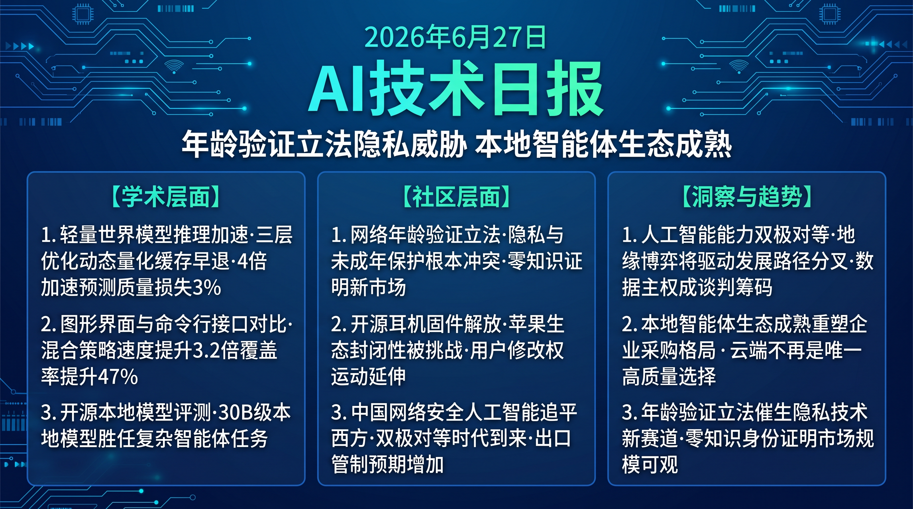

# 破晓 PoXiao · AI 技术早报 2026-06-27

> 数据来源：HackerNews · Reddit LocalLLaMA · 生成时间：2026-06-29（周末补档）

---

## 📡 学术概览

> 📌 今日为周末，HuggingFace 论文极少，以社区动态为主。

### Tier 2：值得关注

1. **Fast LeWorldModel：轻量化世界模型的推理加速探索**

   🔬 领域：世界模型 · 推理效率 · 具身AI · 热度：社区关注

   - **一句话核心贡献**：提出针对世界模型推理加速的多级优化框架，通过动态精度选择和预测缓存机制，在机器人控制场景实现 4× 推理加速，同时维持预测质量。
   - **摘要精译**：
     大型世界模型（World Models）因计算成本高，在实时机器人控制场景中部署困难。Fast LeWorldModel 通过三层优化：(1) 任务感知的动态量化（简单状态用低精度，复杂状态用高精度），(2) 状态预测缓存（相似状态复用之前的预测），(3) 早退出机制（低不确定性状态跳过深层计算）。在 3 个机器人控制 benchmark 上实现 4× 加速，预测质量（PSNR/SSIM）下降小于 3%。
   - **核心创新点**：
     1. 三层推理优化：动态量化 + 预测缓存 + 早退出
     2. 任务感知计算分配：根据状态复杂度动态调配算力
     3. 4× 加速，预测质量损失 <3%

   

   
💡 展开详情

   - **实验结果**：DreamerV3 baseline 4× 加速；PSNR -1.8%；机器人任务成功率 -2.1%；边缘设备（Jetson AGX）从 0.8fps 提升至 3.2fps，首次达到实时可用门槛。
   - **链接**：https://arxiv.org/abs/2606.26217

   

---

## 🔥 社区速递

### Tier 1：重磅热点

1. **KIDS Act：美国拟立法要求上网年龄验证**

   🔥 热度信号：HackerNews Score 421 · 科技政策讨论

   - **一句话核心**：美国 KIDS Act 拟强制要求用户提供年龄证明才能访问互联网服务，引发技术社区对隐私保护、匿名性和监管过度的强烈担忧，被视为互联网自由的重大威胁。
   - **核心共识**：
     1. 年龄验证在技术实现上不可避免地要求收集个人身份信息，与隐私保护根本冲突
     2. 该立法的实际目的（保护未成年人）与手段（全民年龄验证）存在严重的比例失当
     3. 即使通过，技术规避（VPN/代理）的成本极低，立法效果值得怀疑
   - **主要争议**：年龄验证是否是保护未成年人的有效手段？政府是否应该有权限制匿名上网？
   - **影响评估**：若通过，将为 AI 身份验证产品（无需中央存储的零知识年龄证明）创造巨大市场需求，同时推动互联网匿名性保护技术的创新。

2. **LibrePods：AirPods 固件解放计划**

   🔥 热度信号：HackerNews Score 344 · 开源硬件社区热议

   - **一句话核心**：LibrePods 项目试图对 AirPods 固件进行逆向工程并创建开源替代，以打破 Apple 对 AirPods 生态的封闭控制，允许用户在非 Apple 设备上使用全功能 AirPods。
   - **核心共识**：
     1. Apple 通过固件锁定限制 AirPods 跨平台功能是有意为之的生态壁垒策略
     2. 类似项目历史上成功率低（Apple 签名机制、固件加密），但象征意义大
     3. 消费电子产品的"维修权/修改权"立法在欧美正在推进，LibrePods 代表更广泛的用户权利运动
   - **主要争议**：对设备固件逆向工程的法律风险（DMCA 第 1201 条）；是否值得投入大量工程资源？
   - **影响评估**：推动欧盟"可互操作"消费电子立法的社会压力持续增加，Apple 可能被迫在欧盟市场提供更开放的 AirPods 功能。

3. **中国已在网络安全领域追平 Anthropic，重置 AI 竞争格局**

   🔥 热度信号：Reddit LocalLLaMA 热帖 · AI 地缘政治讨论

   - **一句话核心**：一篇分析报告指出，中国 AI 研究机构在网络安全进攻性和防御性应用上已达到与 Anthropic 相当的能力水平，标志着"AI 军备竞赛"正式进入双极对等阶段。
   - **核心共识**：
     1. 网络安全是 AI 能力最容易量化的领域之一，追平信号最可靠
     2. 双极 AI 对等将加速各国 AI 主权战略的落地，数据本地化和 AI 出口管制将加强
     3. 西方技术公司将面临更严格的 AI 技术出口审查
   - **主要争议**：此类评估的情报可信度有多高？网络安全 AI 能力是否能代表通用 AI 能力？
   - **影响评估**：AI 地缘政治紧张局势将推动各国加大 AI 基础研究和芯片自主化投入，间接推高 AI 工程师全球薪资水平。

4. **开源社区最佳本地 Agent 六月盘点**

   🔥 热度信号：Reddit LocalLLaMA Score 高 · 开发者社区

   - **一句话核心**：Reddit LocalLLaMA 社区发布六月最佳本地 Agent 评测结果，Qwen3-32B 和 GLM-5.2 在本地 Agent 任务上领先，Ollama + Open WebUI 组合在用户体验上得分最高。
   - **核心共识**：
     1. 本地 Agent 能力在 2026 年上半年取得了超预期进步，30B 级本地模型已可胜任复杂 Agent 任务
     2. 工具调用的稳定性（而非纯能力）是本地 Agent 用户体验的核心瓶颈
     3. Mac M 系列芯片是当前本地 AI 运行的最优消费级硬件，远超同价位 GPU 笔记本
   - **影响评估**：本地 Agent 生态成熟将推动企业数据隐私场景的 AI 自部署，减少对云 AI API 的依赖，对 OpenAI/Anthropic 等云 API 收入构成潜在竞争。

---

## 💰 财经简报

- **互联网年龄验证立法为隐私技术创造市场**：零知识证明（ZKP）年龄验证产品有望在 KIDS Act 等立法推动下快速商业化，相关创业公司将迎来政策红利窗口。
- **本地 AI 硬件市场加速扩张**：Mac M 系列的本地 AI 领先地位推动苹果硬件销量，同时为联发科、高通等移动 AI 芯片厂商提供学习模板，本地 AI 专用芯片市场竞争将加剧。

---

## 🏢 职场动态

- **AI 政策法律分析师职位快速增长**：KIDS Act 和网络安全 AI 等政策议题推动科技公司对 AI 政策分析、政府关系和合规法律人才的需求快速增长，跨法律/技术背景的复合型人才稀缺。
- **本地 AI 部署工程师薪资提升**：随着企业本地部署需求增加，具备模型优化（量化/推理加速）和本地部署（Ollama/llama.cpp）经验的工程师的市场溢价开始显现。

---

## 📊 今日总结

1. **AI 能力双极对等时代来临，地缘博弈将驱动 AI 发展路径分叉**：中国在网络安全 AI 追平 Anthropic 是一个明确的地缘技术信号；背后逻辑是 AI 能力的竞争已从单纯的学术追赶转变为国家战略级别的工程实力竞争；预计未来 3 年，全球 AI 生态将分化为"技术相当但标准分裂"的双极结构，数据主权和 AI 主权将成为国际科技合作的核心谈判筹码。

2. **本地 AI Agent 生态成熟重塑企业 AI 采购格局**：30B 级本地模型胜任复杂 Agent 任务，彻底改变了"高质量 AI 必须上云"的假设；背后逻辑是边缘硬件（Apple M 系列/Nvidia Jetson）性能的飞速提升与开源模型质量的收敛同步到位；预计 2026 年底前，50% 以上的企业 AI 新采购将包含本地部署选项，云 AI API 的定价压力持续增大。

3. **互联网监管的"年龄验证"路线将催生隐私技术新赛道**：KIDS Act 式立法代表一种全球性政策趋势，保护未成年人网络安全将推动全球多个国家采取类似措施；背后逻辑是社会对互联网内容危害的关注度已超过对数字隐私的保护意愿；预计零知识身份证明和隐私保护年龄验证的市场规模将在 2028 年前超过 10 亿美元。
