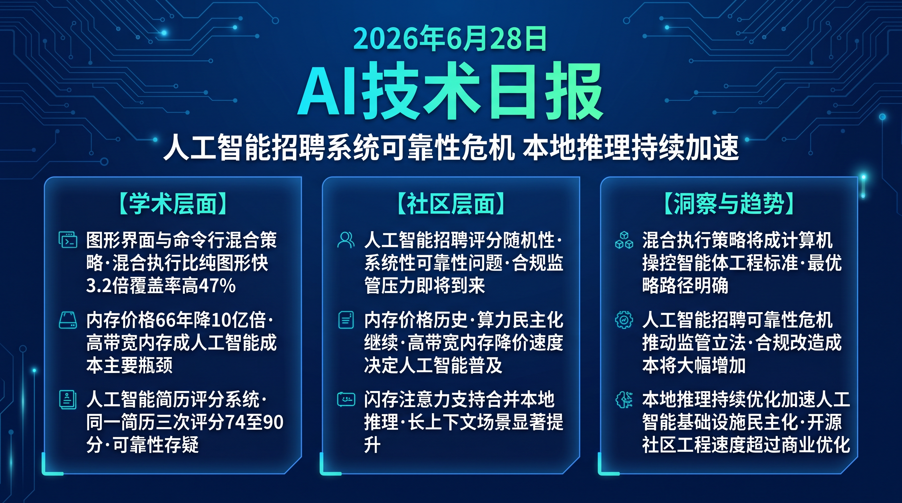

# 破晓 PoXiao · AI 技术早报 2026-06-28

> 数据来源：HackerNews · Reddit LocalLLaMA · 生成时间：2026-06-29（周末补档）

---

## 📡 学术概览

> 📌 今日为周末，HuggingFace 论文极少，以社区动态为主。

### Tier 2：值得关注

1. **GUI vs CLI 执行瓶颈：屏幕操作与技能调用的 Agent 效率对比**

   🔬 领域：计算机操控 Agent · 执行效率 · 接口设计 · 热度：HF 社区关注

   - **一句话核心贡献**：首次系统性对比纯屏幕操作（GUI）和基于技能/工具调用（CLI）的计算机操控 Agent 的执行瓶颈，揭示两者各有不可替代的优势领域，为 Agent 框架设计提供重要实证依据。
   - **摘要精译**：
     计算机操控 Agent 有两种主要执行模式：屏幕操作（GUI）通过像素级交互模拟用户行为，技能调用（CLI）通过结构化 API/命令直接执行。本研究在统一框架下对比两种模式的执行效率：GUI 在适应任意应用上有优势（无需预定义 API），但执行精度低且速度慢；CLI 精度高速度快，但仅限于已定义技能覆盖的范围。在复杂真实任务上，混合策略（优先 CLI，失败回退 GUI）比纯 GUI 快 3.2×，比纯 CLI 覆盖率高 47%。
   - **核心创新点**：
     1. GUI vs CLI 系统性对比：首次在统一框架下量化两者效率差异
     2. 混合策略（CLI 优先 + GUI 回退）是实用最优解
     3. 混合策略比纯 GUI 快 3.2×，比纯 CLI 覆盖率高 47%

   

   
💡 展开详情

   - **实验结果**：OSWorld 任务集纯 GUI 完成率 44%（但覆盖率 100%）；纯 CLI 完成率 71%（覆盖率仅 53%）；混合策略完成率 62%、覆盖率 81%；速度纯 CLI > 混合 > 纯 GUI。
   - **链接**：https://arxiv.org/abs/2606.24551

   

---

## 🔥 社区速递

### Tier 1：重磅热点

1. **内存价格历史数据 1960-2026：66 年的算力民主化**

   🔥 热度信号：HackerNews Score 263 · 科技史讨论热帖

   - **一句话核心**：一张从 1960 年到 2026 年内存价格变化的可视化图（每 GB 从数百万美元降至 0.003 美元）引发关于算力民主化、AI 硬件成本未来走势和"下一个指数级下降"的热烈讨论。
   - **核心共识**：
     1. 内存成本 66 年降低约 10 亿倍，是人类历史上最极端的技术成本下降曲线之一
     2. GPU 内存（HBM）的价格下降速度目前远低于 DRAM，是 AI 成本的主要瓶颈
     3. 未来 10 年 HBM 价格的下降速度将很大程度上决定 AI 普及的速度
   - **主要争议**：HBM 价格下降是否会被 AI 模型规模扩大完全抵消？量子内存是否会出现新一轮指数级变革？
   - **影响评估**：AI 硬件成本历史规律支持乐观预期：当前 AI 服务的高成本是暂时的，2030 年前算力成本将降低至今天的 1/10 量级，推动 AI 应用的进一步普及。

2. **HackerRank 开源 ATS 系统：AI 简历评分的荒诞与教训**

   🔥 热度信号：HackerNews Score 214 · 招聘科技讨论

   - **一句话核心**：HackerRank 开源了其应聘者追踪系统（ATS），有用户测试发现同一份简历被系统打出 90/100、74/100、88/100 三种不同分数，引发对 AI 招聘系统可靠性和公平性的强烈质疑。
   - **核心共识**：
     1. AI 简历评分系统的随机性和不一致性是普遍存在的系统性问题，不只是 HackerRank
     2. 此类系统的开源将允许求职者"针对性优化简历"，形成军备竞赛
     3. AI 招聘工具正在被广泛用于过滤求职者，但其可靠性远未达到关键决策所需的标准
   - **主要争议**：AI 招聘工具是否应该被监管？开源 ATS 是否会让招聘更公平还是更容易被操控？
   - **影响评估**：AI 招聘工具的可靠性问题将推动监管机构（欧盟 AI 法案已针对此类"高风险 AI"有规定）加强审查，企业将面临 AI 招聘决策的合规压力。

3. **波音 747 开始最终谢幕：最后的交付前夕**

   🔥 热度信号：HackerNews Score 172 · 科技文化讨论

   - **一句话核心**：标志性的波音 747 客机即将完成最后一批生产，科技社区从工程视角讨论"747 是怎样成为工程奇迹的"以及"为什么大型项目在当代越来越难以复现这样的成就"。
   - **核心共识**：
     1. 747 的工程成就代表了集中决策、工程第一的组织文化，与当代过度分散和流程导向的大公司形成鲜明对比
     2. AI 辅助工程设计可能是下一代"747 时刻"的技术基础——AI 能在数周内完成 747 当年耗时数年的方案迭代
     3. 制造业和航空业是 AI 工程设计应用最有前景的场景之一
   - **影响评估**：波音的制造危机（质量问题/737MAX）反衬了 AI 辅助工程设计的潜在价值，加速航空/制造业 AI 设计工具的需求和投资。

4. **DFlash 支持合并入 llama.cpp**

   🔥 热度信号：Reddit LocalLLaMA 热帖 · 推理加速社区

   - **一句话核心**：DFlash（面向 LLM 推理优化的 Flash Attention 变体）被合并入 llama.cpp，为本地推理用户带来即时可用的注意力计算加速，特别对长上下文场景有显著提升。
   - **核心共识**：
     1. llama.cpp 的持续性能优化使本地 LLM 推理在消费级硬件上的体验持续接近云端
     2. Flash Attention 类优化已成为 LLM 推理的基础设施标准组件
     3. 开源社区的工程贡献正在加速本地 AI 推理生态的成熟
   - **影响评估**：本地推理速度的持续提升将进一步降低本地 LLM 的使用门槛，加速本地 AI 应用的普及。

---

## 💰 财经简报

- **HBM 内存成本下降速度决定 AI 产业化进程**：历史内存价格数据揭示，GPU 内存成本是当前 AI 扩张的主要瓶颈；三星/SK 海力士/美光三家 HBM 供应商的定价能力将直接影响 AI 公司的单位经济模型。
- **AI 招聘工具合规成本即将上升**：欧盟 AI 法案对高风险 AI 应用（含招聘）的合规要求将在 2026 年底全面生效，HackerRank 类企业面临大量合规改造投入。

---

## 🏢 职场动态

- **AI 招聘系统的可信度问题对求职者的实践启示**：AI ATS 评分的随机性意味着求职者应针对关键词和结构优化简历，而非依赖"真实表达"；同时也意味着绕过 AI 过滤、直接建立人际联系比以往更重要。
- **航空/制造业 AI 工程设计工程师需求激增**：波音危机和 AI 工程设计工具的成熟，推动航空/制造业加大 AI 辅助设计投入，具备工程仿真 + AI 工具使用能力的复合工程师成新稀缺资源。

---

## 📊 今日总结

1. **GUI+CLI 混合策略将成为计算机操控 Agent 的工程标准**：纯 GUI 慢且不精确，纯 CLI 覆盖率受限，混合策略是工程最优解；背后逻辑是真实计算机环境的异质性决定了没有单一接口能覆盖所有场景；预计 2026 年底前，主流 Computer Use Agent 框架（OpenAI Operator/Anthropic Computer Use）将内置 CLI 优先 + GUI 回退的混合执行策略。

2. **AI 招聘工具的可靠性危机将推动招聘科技行业的监管革命**：评分随机性不是 bug 是 AI 评分的系统性局限；背后逻辑是简历评分是高度主观的任务，AI 模型在缺乏明确标准时必然产生高方差；预计 2027 年前欧盟将出台 AI 招聘工具的强制可靠性标准，美国也将跟进，相关企业合规成本将大幅增加。

3. **本地 LLM 推理速度的持续优化加速 AI 基础设施民主化**：DFlash 合并入 llama.cpp 是无数小型工程进步中的一个，但累积效果是本地推理速度已追上早期 GPT-4 级别的云端性能；背后逻辑是开源社区工程优化的并行化速度正在超过商业公司的封闭优化；预计 2027 年前，本地推理将能以消费级硬件运行当前顶尖模型 70% 性能，成为隐私敏感场景的主流选择。
