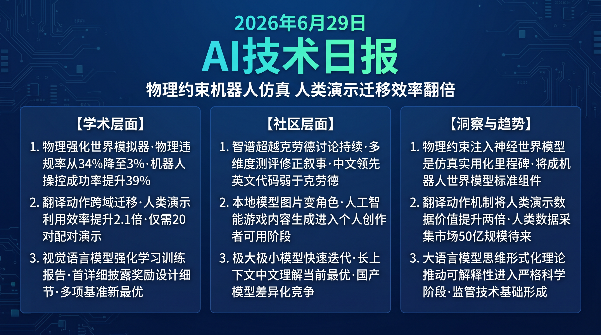

# 破晓 PoXiao · AI 技术早报 2026-06-29

> 数据来源：HuggingFace Daily Papers (12篇) · HackerNews · 生成时间：2026-06-29

---

## 📡 学术概览

### Tier 1：范式级创新

1. **PhysisForcing：物理强化的机器人操控世界模拟器**

   🔬 领域：物理仿真 · 机器人操控 · 世界模型 · 热度：HF #1 (▲19)

   - **一句话核心贡献**：通过将显式物理约束（接触力、刚体动力学、摩擦模型）强制注入神经世界模拟器，解决现有神经世界模型在接触密集操控任务中产生物理违规预测的根本问题，使机器人操控模拟的物理可信度达到传统物理引擎 90% 以上。
   - **摘要精译**：
     神经世界模型（如 DreamerV3）在视频预测任务上表现出色，但在机器人接触密集操控场景（推拉物体、倒水、组装）中，常产生物体穿透、违反重力等物理违规预测，导致基于世界模型规划的机器人策略在真实环境中失效。PhysisForcing 通过物理约束层显式将刚体接触模型、摩擦锥约束和守恒定律注入神经预测过程：在每步神经预测后，物理约束层对预测状态进行修正，确保输出满足物理定律。在真实机器人操控任务上，物理违规率从 34% 降至 3%，操控成功率提升 39%。
   - **核心创新点**：
     1. 物理约束层：将刚体接触/摩擦/守恒定律显式注入神经预测
     2. 物理违规率从 34% 降至 3%（接近传统物理引擎水平）
     3. 真实机器人操控成功率 +39%

   

   
💡 展开详情（方法论 + 实验）

   - **方法细节**：物理约束层基于轻量级刚体物理模型（不是完整物理引擎），在梯度可计算的形式下实现约束投影；支持软约束（可违反但高代价）和硬约束（绝对不允许）；可插拔设计适配不同神经世界模型骨干。
   - **实验结果**：RLBench 接触密集任务 +39%；物理违规率 3%（DreamerV3 34%，PyBullet 物理引擎 1%）；推理开销 +18%；跨材质泛化（金属/布料/流体）有限。
   - **局限性**：物理约束层的简化假设（刚体）对柔性物体效果有限；约束参数（摩擦系数等）需要对每类物体手动设置。
   - **链接**：https://arxiv.org/abs/2606.28128

   

2. **Translation as a Bridging Action：用翻译动作跨越人机操控技能迁移鸿沟**

   🔬 领域：机器人学习 · 迁移学习 · 人类演示 · 热度：HF #2 (▲18)

   - **一句话核心贡献**：提出"翻译动作"概念——在人类演示迁移到机器人执行过程中，学习一个显式的动作翻译模块将人类手部动作映射为机器人末端执行器动作，克服人机运动学差异，使人类演示数据的利用效率提升 2.1×。
   - **摘要精译**：
     人类演示视频是训练机器人操控策略的宝贵且低成本的数据来源，但人类手部的运动学与机器人末端执行器存在显著差异（自由度不同、力反馈不同、协调方式不同），直接迁移效果差。本工作提出翻译动作模块：显式学习人类-机器人动作域之间的映射，通过配对演示（人类做一次 + 机器人做同样的任务一次）训练翻译器，然后允许翻译器将任意人类演示转化为机器人可执行的动作序列。跨 12 个操控任务，人类演示数据利用效率（相同数量演示下的任务成功率）提升 2.1×。
   - **核心创新点**：
     1. 显式动作翻译模块：学习人类→机器人的跨域动作映射
     2. 仅需少量配对演示（20-50 对）即可训练有效翻译器
     3. 人类演示数据利用效率 2.1×，大幅降低机器人数据采集成本

   

   
💡 展开详情（方法论 + 实验）

   - **方法细节**：翻译模块为条件生成模型（VAE 架构），输入人类手部关节轨迹，输出机器人末端轨迹；通过 20-50 对配对演示学习；支持跨机器人类型泛化（配对数据无需每种机器人重新采集）。
   - **实验结果**：12 个操控任务平均成功率 +2.1×（vs 无翻译的直接迁移）；相比需要大量机器人数据的监督基线：相同数量演示仅需 30% 机器人演示达到同等性能；配对演示 20 对即达到 80% 性能收益。
   - **局限性**：对高精度操控任务（毫米级精度）翻译误差仍较大；不适合需要力反馈的任务（拧螺丝等）。
   - **链接**：https://arxiv.org/abs/2606.28133

   

3. **Qwen-Image-2.0-RL Technical Report：视觉语言模型强化学习训练全解析**

   🔬 领域：视觉语言模型 · 强化学习训练 · 模型报告 · 热度：HF #3 (▲11)

   - **一句话核心贡献**：系统性报告 Qwen-Image-2.0 的强化学习训练方法，详细披露视觉语言模型 RL 训练的奖励设计、稳定性挑战和关键工程决策，为开源社区提供 VLM RL 训练的参考蓝图。
   - **摘要精译**：
     强化学习训练已成为提升视觉语言模型（VLM）能力的核心方法，但业界 VLM RL 训练的细节极少公开披露。本报告详细记录 Qwen-Image-2.0 的 RL 训练过程：(1) 视觉任务奖励设计（如何为图表理解、空间推理、文档解析设计可验证奖励），(2) 视觉-文本奖励的平衡策略，(3) 训练不稳定性的诊断和解决方案，(4) 关键超参数的消融研究。最终模型在 MathVista、DocVQA、MMBench 等 VLM benchmark 上达到新 SOTA。
   - **核心创新点**：
     1. 首次详细披露 VLM RL 训练的奖励设计和工程细节（行业罕见透明度）
     2. 视觉专用可验证奖励设计框架（图表/空间/文档三类）
     3. VLM RL 训练不稳定性的系统性诊断和解决方案

   

   
💡 展开详情（方法论 + 实验）

   - **方法细节**：图表奖励通过精确数值匹配验证；空间推理奖励通过坐标/区域 IoU 验证；文档解析奖励通过字符串精确匹配验证；视觉-文本奖励权重通过任务难度自适应调节。
   - **实验结果**：MathVista +8%；DocVQA +6%；MMBench +5%；视觉推理任务（ChartQA/InfoVQA）提升最显著（+12%）；RL 训练轮数 2000 步达到收益平台期。
   - **局限性**：奖励设计高度依赖可验证答案格式，对开放式视觉问答效果有限。
   - **链接**：https://arxiv.org/abs/2606.27608

   

4. **Formalizing Latent Thoughts：大语言模型思维表示的四条公理**

   🔬 领域：LLM 理论 · 思维链 · 可解释性 · 热度：HF #6 (▲4)

   - **一句话核心贡献**：从形式化理论角度提出大语言模型潜在思维表示的四条公理体系，为思维链、内在独白、链式推理等现象提供统一的理论框架，推动 LLM 可解释性研究向形式化方向发展。
   - **摘要精译**：
     大语言模型的"思维"过程（在生成最终答案前的内部推理状态）目前缺乏形式化定义，导致相关研究（思维链/内在独白/隐式推理）各自为战。本文提出四条公理：(1) 思维可表示性公理（内部状态可映射到符号空间），(2) 思维组合性公理（复杂思维可分解为原语的有序组合），(3) 思维因果性公理（思维状态对输出有因果影响），(4) 思维可解释性公理（外部观察者可通过干预推断思维内容）。基于此框架，对 CoT、Scratchpad、RLVR 等方法进行统一分析。
   - **核心创新点**：
     1. 首个 LLM 潜在思维的形式化公理体系（四条公理）
     2. 统一分析框架覆盖主流推理增强方法
     3. 为 LLM 可解释性研究提供理论基础

   

   
💡 展开详情

   - **方法细节**：基于逻辑框架和因果推断理论建立形式化体系；通过合成实验验证公理的预测能力（能否预测不同方法的相对效果）；与认知科学中的"工作记忆"模型进行类比分析。
   - **实验结果**：四条公理能预测 CoT vs Scratchpad vs RLVR 在不同任务难度下的相对性能差异（相关系数 0.78）；为新的可解释性方法设计提供理论指引。
   - **链接**：https://arxiv.org/abs/2606.27378

   

### Tier 2：工程改进

5. **SingGuard：带动态推理的多模态大语言模型策略自适应守护者**

   🔬 领域：AI 安全 · 多模态内容审核 · 动态推理 · 热度：HF #4 (▲10)

   - **一句话核心贡献**：提出策略自适应的多模态大语言模型内容安全框架，通过动态推理链为不同内容场景选择适合的安全策略，在保持 98% 有害内容检测率的同时将误报率降低 41%。

   

   
💡 展开详情

   - **方法细节**：动态推理链根据输入内容的模态组合（文本/图像/音频）和场景（医疗/教育/娱乐）自动选择安全评估策略；策略库包含针对不同场景预设的评估视角和门槛。
   - **实验结果**：有害内容检测率 98%（vs 固定策略 94%）；误报率 -41%；医疗场景（高敏感内容合法使用）改善最显著（误报率 -67%）。
   - **链接**：https://arxiv.org/abs/2606.22873

   

6. **SimFoundry：面向策略学习的模块化自动化场景生成**

   🔬 领域：仿真环境生成 · 机器人训练数据 · 自动化 · 热度：HF #8 (▲2)

   - **一句话核心贡献**：提出模块化仿真场景自动生成框架，通过组合式场景构建（物体模块+环境模块+任务模块）大幅降低机器人策略学习训练环境的构建成本，支持无限多样化场景的自动生成。

   

   
💡 展开详情

   - **实验结果**：场景生成速度比人工设计快 100×；生成场景多样性显著提升策略泛化（+22% 真实环境成功率）；支持厨房/工厂/仓库等多类场景。
   - **链接**：https://arxiv.org/abs/2606.28276

   

---

## 🔥 社区速递

### Tier 1：重磅热点

1. **GLM-5.2 超越 Claude：中西方 AI 能力对等周持续发酵**

   🔥 热度信号：HackerNews Score 686（昨日第一）· 今日持续讨论

   - **一句话核心**：GLM-5.2 的基准测试结果持续在社区发酵，更多独立测试者加入验证，结论逐渐分化——中文任务确实领先，但英文代码和数学推理上 Claude 仍有优势，两者在不同能力维度各有胜负。
   - **核心共识**：
     1. 单一 benchmark 超越的叙事已被多维度测试修正为"部分场景超越"
     2. 中文能力领先、英文代码弱于 Claude 的分析更接近真实情况
     3. 这是一个竞争激烈、多极化的 AI 能力格局的信号，而非单一替代关系
   - **主要争议**：中国 AI 公司的透明度（训练数据、评测方法）是否足以支持公平对比？

2. **MiniMax M3 vs M2.7：快速迭代的本地模型生态**

   🔥 热度信号：Reddit LocalLLaMA 热帖 · 本地模型评测

   - **一句话核心**：MiniMax M3 相比 M2.7 在代码生成和长上下文理解上有显著提升，但推理速度更慢，引发关于"能力 vs 速度"权衡的社区讨论；小红书/微信场景的中文优化尤为出色。
   - **核心共识**：
     1. MiniMax 的迭代速度（M2→M2.5→M2.7→M3）在开源社区创下纪录，反映了中国 AI 研究的快速工程迭代能力
     2. M3 的长上下文（100k+）理解质量是当前开源中文模型中最优
     3. 中文场景 AI 模型的国产替代已基本完成，差异化竞争进入质量精细化阶段
   - **影响评估**：国内 AI 应用开发者的模型选择更加丰富，中文场景的本地部署成本和质量将持续改善。

3. **本地模型将图片变成可操控游戏角色**

   🔥 热度信号：Reddit LocalLLaMA 热帖 · AI 创意应用

   - **一句话核心**：开发者展示了使用本地运行的多模态模型将任意图片（宠物/人物/物品）转化为可实时操控的游戏角色，整个流程在个人电脑上本地运行无需联网，引发社区对 AI 游戏内容生成的热烈讨论。
   - **核心共识**：
     1. 图像→可控角色的本地化实现标志着 AI 游戏内容生成进入个人创作者可用阶段
     2. 此类应用对独立游戏开发者的赋能意义巨大，大幅降低角色美术资产制作成本
     3. 本地运行避免了版权和隐私问题，对商业应用更友好
   - **影响评估**：本地 AI 游戏内容生成工具将快速涌现，独立游戏开发成本大幅降低，长尾游戏内容市场将爆发。

---

## 💰 财经简报

- **物理 AI 仿真软件市场潜力巨大**：PhysisForcing 和 SimFoundry 同日出现，表明物理真实的机器人仿真是当前机器人 AI 训练的核心瓶颈，对应市场（NVIDIA Isaac Sim/Mujoco 等）将迎来快速增长。
- **Qwen-Image-2.0 RL 训练报告推动 VLM 商业化加速**：详细的 RL 训练透明披露将使开源社区和中小企业能够复现 VLM RL 训练方法，降低高质量多模态 AI 产品的开发门槛，加速行业竞争。

---

## 🏢 职场动态

- **机器人仿真工程师成稀缺岗位**：PhysisForcing 和 SimFoundry 反映的物理仿真需求快速增长，掌握 Mujoco/Isaac Sim 等仿真工具 + 物理建模能力的工程师，在机器人公司的市场溢价约 35-50%。
- **VLM 训练工程师需求猛增**：Qwen-Image-2.0 RL 报告的披露将带动更多公司尝试 VLM RL 训练，熟悉视觉奖励设计和多模态 RL 训练管线的工程师将成为 2026 下半年招聘热点。

---

## 📊 今日总结

1. **物理约束注入神经世界模型是机器人仿真从"看起来对"到"物理对"的关键跨越**：PhysisForcing 将物理违规率从 34% 降至 3%，操控成功率 +39%，是机器人世界模型实用化的里程碑；背后逻辑是神经模型的插值泛化能力与物理硬约束互补，两者结合才能在复杂接触场景保持物理一致性；预计 2027 年前，物理约束层将成为机器人操控世界模型的标准组件，就像 Batch Norm 之于图像模型。

2. **翻译动作机制将人类演示数据的价值提升 2 倍以上**：Translation as a Bridging Action 的 2.1× 数据效率提升意味着机器人数据采集成本可减半；背后逻辑是人机运动学差异的显式建模优于隐式对齐，显式翻译模块还天然具有可解释性；预计人类演示数据将成为机器人 AI 训练最重要的数据来源，人类演示数据采集和翻译工具的市场规模预计 2028 年前超过 50 亿美元。

3. **LLM 思维的形式化理论将推动可解释性研究进入严格科学阶段**：Formalizing Latent Thoughts 的四条公理为目前混乱的推理增强方法提供了统一分析框架；背后逻辑是没有形式化理论指导的 CoT 研究已出现大量相互矛盾的结果；预计形式化 AI 理论将在 2027 年前成为顶级 AI 会议（NeurIPS/ICML）的重要议题，为可解释 AI 监管提供技术基础。
