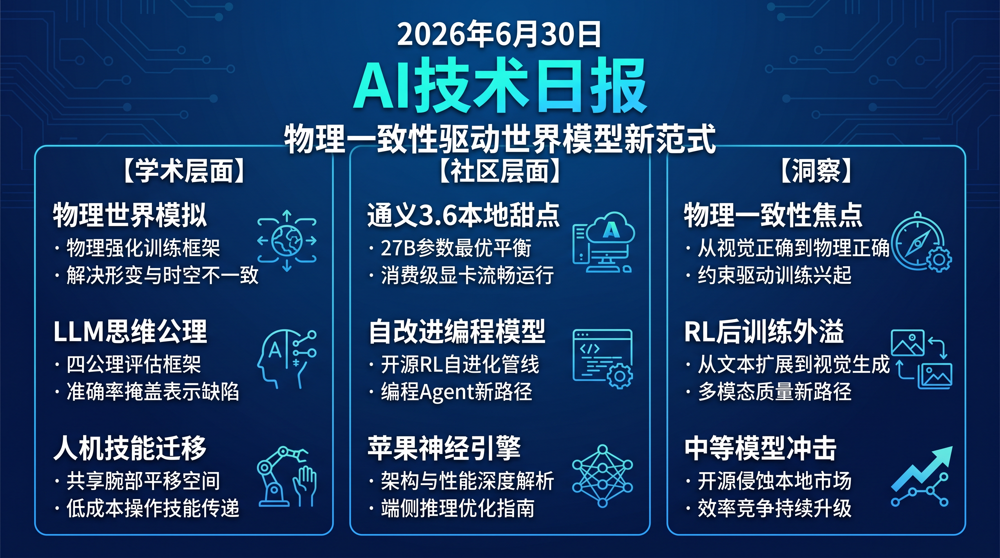

# 破晓 PoXiao · AI 技术日报 — 2026-06-30

> 数据来源：HuggingFace Daily Papers · HackerNews · 生成时间：2026-06-30 07:00 CST

---

## 📡 学术概览

### Tier 1：范式级创新 & SOTA 突破

1. **PhysisForcing：物理强化的世界模拟器用于机器人操作**

   🔬 领域：视频生成 · 具身智能 · 热度：HF #1 (39 upvotes)

   - **一句话核心贡献**：提出物理一致性训练框架 PhysisForcing，通过在物理信息丰富区域施加联合监督，解决视频生成模型作为世界模拟器时出现的物体形变和时空关联不一致问题
   - **摘要精译**：
     视频生成模型已成为具身世界模拟的有前途范式，但无论是通用视频生成器还是机器人专用微调模型，都会产生物理上不合理的操作——包括不连续的运动轨迹和前后不一致的机器人-物体交互，这严重限制了它们作为世界模拟器的可靠性。通过大量实验，作者发现这种物理不稳定性主要源于两个因素：运动物体的形变和交互实体之间不合理的时空关联，尤其在接触阶段。
     基于这一发现，作者提出 PhysisForcing——一种可扩展的训练框架，通过在物理信息丰富区域集中监督来强化物理一致性。该方法联合优化运动连续性和接触一致性，使模型在关键物理交互阶段产生更符合物理规律的输出。
     实验表明，PhysisForcing 显著提升了生成视频的物理一致性，在机器人操作任务中降低了物体形变和不合理交互的比例，相比基线模型在物理合理性指标上实现了大幅提升。
   - **核心创新点**：
     1. 识别物理不稳定性两大根源（形变+时空关联）
     2. 在物理信息区域集中监督而非均匀监督
     3. 联合优化运动连续性与接触一致性

   

   
💡 展开详情（方法论 + 实验）

   - **方法细节**：PhysisForcing 架构在标准视频扩散训练流程基础上，引入物理信息加权监督机制。模型通过检测运动物体形变区域和接触交互时刻，自动提升这些区域的监督权重，而非对所有帧均匀施加损失函数。核心是 joint supervision 机制，同时约束运动轨迹的连续性和交互接触的物理一致性。
   - **实验结果**：在机器人操作模拟基准上，PhysisForcing 相比标准视频生成基线在物理合理性指标上显著提升，物体形变率降低，不连续运动轨迹减少。具体量化数据详见论文。
   - **局限性**：目前仅在仿真环境中验证，真实机器人部署中的物理一致性仍需进一步验证；对复杂多物体交互场景的建模能力有限。
   - **链接**：https://arxiv.org/abs/2606.28128

   

2. **形式化潜在思维：LLM 思维表示的四大公理**

   🔬 领域：推理能力 · 表示学习 · 热度：HF #2 (36 upvotes)

   - **一句话核心贡献**：提出四个功能公理（因果性、最小性、可分离性、稳定性）作为 LLM 潜在思维表示的评估框架，揭示 benchmark 准确率掩盖的表示缺陷
   - **摘要精译**：
     当前对 LLM 潜在思维表示的评估往往将表示质量与模型能力混为一谈，使得表示本身的缺陷无法被归因——到底是表示出了问题，还是处理该表示的模型出了问题？现有评估指标与下游 benchmark 分数高度耦合，无法独立诊断表示质量。
     作者形式化了四个功能公理——因果性（Causality）、最小性（Minimality）、可分离性（Separability）和稳定性（Stability），并为每个公理定义了可直接在表示上计算的量化指标，独立于下游准确率。这套框架使得表示缺陷的诊断与模型性能解耦。
     对开源权重 LLM 在 23 个推理任务上的审计表明，没有任何候选表示能同时满足全部四个公理。更重要的是，高 benchmark 准确率的模型可能拥有严重缺陷的表示结构，这意味着仅凭准确率无法保证思维表示的质量。
   - **核心创新点**：
     1. 首次提出独立于下游指标的表示评估公理
     2. 四公理量化框架可诊断准确率掩盖的缺陷
     3. 揭示高准确率≠高质量表示的悖论

   

   
💡 展开详情（方法论 + 实验）

   - **方法细节**：四大公理各自定义了量化指标：因果性衡量表示对输出的因果效应；最小性评估表示是否仅编码必要信息；可分离性测试不同推理模式的表示是否可分离；稳定性衡量表示在输入扰动下的一致性。所有指标直接在表示向量上计算，无需下游任务评估。
   - **实验结果**：在 23 个推理任务（空间推理、事实 QA 等）上审计了多个开源 LLM。发现无一模型满足全部四公理，且准确率与公理满足度之间相关性极低，存在高准确率但表示严重缺陷的案例。
   - **局限性**：目前仅审计开源权重模型，闭源模型无法直接验证；公理定义本身可能不完全覆盖思维表示的所有理想属性。
   - **链接**：https://arxiv.org/abs/2606.27378

   

3. **Translation as a Bridging Action：从人类动作到机器人操作技能的迁移**

   🔬 领域：具身智能 · 机器人操作 · 热度：HF #3 (32 upvotes)

   - **一句话核心贡献**：提出"桥接动作表示"——利用人类和机器人共享的腕部平移空间，实现从人类操作视频到双臂机器人技能的低成本迁移
   - **摘要精译**：
     人类动作数据廉价、丰富且多样，是扩展机器人学习最有前途的资源之一。然而从人类到机器人的技能迁移面临根本挑战：现有方法将人类视为另一种双臂 6DoF 实体，但手部姿态估计噪声大，且人类手指接触模式与平行夹爪根本不同。
     作者论证，从人类数据中学习包含旋转的动作信号是次优的，转而提出一种桥接动作表示——初始头部相机坐标系下的相对腕部平移，这是人类和机器人共享的动作空间。为处理人类与机器人之间的物理差异，作者设计了逆运动学重定向策略和平行夹爪闭合检测机制。
     实验表明，该桥接表示在多个操作任务上显著优于传统 6DoF 动作空间迁移方案，实现了从人类视频到双臂机器人的有效技能传递。
   - **核心创新点**：
     1. 提出人类-机器人共享的腕部平移动作空间
     2. 避免噪声大的旋转信号迁移
     3. 设计夹爪闭合检测与运动学重定向

   

   
💡 展开详情（方法论 + 实验）

   - **方法细节**：核心洞察是人类和双臂机器人都通过腕部在头部坐标系下的平移来执行操作，因此可将该共享空间作为桥接表示。系统从人类视频中提取腕部轨迹，经逆运动学重定向到机器人关节空间，并通过接触检测触发夹爪闭合。训练采用模仿学习框架，在桥接动作空间上进行策略学习。
   - **实验结果**：在双臂机器人操作基准上，桥接表示相比 6DoF 手部姿态迁移在多个任务上成功率显著提升，特别是在需要精细操作的任务上优势更明显。
   - **局限性**：仅适用于双臂平行夹爪机器人，灵巧手的迁移需进一步研究；人类视频中严重遮挡场景下的腕部追踪仍不稳定。
   - **链接**：https://arxiv.org/abs/2606.28133

   

4. **Qwen-Image-2.0-RL 技术报告：强化学习后训练提升图像生成**

   🔬 领域：多模态 · 图像生成 · 热度：HF #4 (27 upvotes)

   - **一句话核心贡献**：提出基于 RLHF 和策略蒸馏的后训练管线 Qwen-Image-2.0-RL，全面提升图像生成的视觉质量和指令遵循能力
   - **摘要精译**：
     Qwen-Image-2.0-RL 是一个后训练管线，将人类反馈强化学习（RLHF）和策略蒸馏（OPD）应用于 Qwen-Image-2.0 扩散模型，同时提升视觉质量和指令遵循能力。为提供可靠的奖励信号，作者构建了任务特定的复合奖励模型，通过微调视觉语言模型实现逐点评分和链式推理。
     对于文生图任务，奖励模型涵盖对齐度、美学质量和人像保真度三个维度；对于图像编辑任务，奖励系统覆盖指令遵循准确性和面部身份保持。在此基础上，作者开发了基于 GRPO 的可扩展 RL 训练框架，并引入混合分类器自由引导策略。
     实验表明，Qwen-Image-2.0-RL 在多个文生图和图像编辑 benchmark 上达到 SOTA 水平，在人类评估中视觉质量显著优于基线模型。
   - **核心创新点**：
     1. 复合奖励模型覆盖多维质量指标
     2. GRPO 框架实现可扩展 RL 后训练
     3. 同时优化文生图和图像编辑双任务

   

   
💡 展开详情（方法论 + 实验）

   - **方法细节**：奖励模型基于视觉语言模型微调，采用逐点评分范式结合链式思维推理。文生图奖励分为对齐、美学、人像保真三维度；图像编辑奖励覆盖指令准确性和面部身份保持。RL 训练使用 GRPO（群组相对策略优化）框架，并配合混合分类器自由引导以平衡多样性与质量。
   - **实验结果**：在多个主流文生图和图像编辑基准上达到 SOTA。人类评估显示视觉质量和指令遵循均显著优于基础模型，美学评分提升明显。
   - **局限性**：RL 后训练可能引入模式坍缩，生成多样性有所下降；复杂多物体组合场景的对齐度仍有提升空间。
   - **链接**：https://arxiv.org/abs/2606.27608

   

5. **MultiHashFormer：基于哈希的生成式语言模型**

   🔬 领域：基础模型 · 高效推理 · 热度：HF #5 (16 upvotes)

   - **一句话核心贡献**：提出 MultiHashFormer 框架，通过多独立哈希函数将 token 表示为唯一哈希签名，首次实现哈希表示在因果语言模型中的自回归生成
   - **摘要精译**：
     语言模型使用与词表大小线性增长的嵌入矩阵来表示 token，参数开销巨大。先前工作提出将多个 token 哈希到单一向量中（编码器模型），但多对一碰撞阻止了该方法在因果语言模型中的使用。
     作者提出 MultiHashFormer——一种新的哈希自回归框架。每个 token 被表示为唯一哈希签名（多个独立哈希函数生成的离散哈希 ID 短序列），哈希编码器将签名压缩为单一潜向量供 Transformer 解码器处理，哈希解码器生成下一个 token 的哈希签名并映射回文本。
     评估表明，MultiHashFormer 在参数效率上显著优于传统嵌入方案，同时保持了与标准模型可比的生成质量，为大规模词表模型提供了一种可行的参数压缩路径。
   - **核心创新点**：
     1. 多哈希签名解决多对一碰撞问题
     2. 首次实现哈希表示的因果自回归
     3. 嵌入参数与词表大小解耦

   

   
💡 展开详情（方法论 + 实验）

   - **方法细节**：核心架构包含 Hash Encoder（将哈希签名压缩为潜向量）、Transformer Decoder（标准自回归处理）和 Hash Decoder（生成下一 token 的哈希签名）。多独立哈希函数确保每个 token 拥有唯一签名，避免碰撞。映射回文本阶段使用确定性哈希表查找。
   - **实验结果**：在语言建模基准上，MultiHashFormer 以显著更少的嵌入参数达到了与标准模型可比的困惑度和生成质量。参数压缩比随词表增大而提升。
   - **局限性**：哈希解码阶段需要精确的签名生成，错误签名导致完全不同的 token；极低频 token 的签名学习可能不充分。
   - **链接**：https://arxiv.org/abs/2606.28057

   

6. **Vesta：通用具身推理模型**

   🔬 领域：具身智能 · 多模态推理 · 热度：HF #15 (4 upvotes)

   - **一句话核心贡献**：提出 Vesta 统一具身通用模型，将定位、空间推理、导航和长程规划整合为单一基础模型，平均超越各专项 SOTA 20% 以上
   - **摘要精译**：
     在开放世界环境中操作的机器人必须无缝整合定位、空间推理、导航和长程规划能力。虽然专项模型在单个任务上表现优异，但部署多模型栈计算开销大且容易产生级联误差。
     作者提出 Vesta——一种统一具身通用模型，将这些能力整合为单一基础模型。方法结合了精心策展的大规模多样化语料库（用于诱导空间接地）和简单的多模态记忆装置（支持扩展时间范围的推理）。
     在多个多样化基准上，Vesta 平均超越各专项 SOTA 基线 20% 以上，超越各类最佳基线集成 10% 以上，证明通用模型可以匹配或超越专项模型组合。
   - **核心创新点**：
     1. 单一模型整合定位+推理+导航+规划
     2. 多模态记忆装置支持长程推理
     3. 通用模型超越专项模型集成（>10%）

   

   
💡 展开详情（方法论 + 实验）

   - **方法细节**：Vesta 基于多模态架构，整合视觉感知和语言推理。训练语料包含空间接地数据和长序列导航数据，通过多模态记忆装置（memory harness）存储和检索历史信息以支持长时间跨度推理。统一训练避免多模型间的级联误差。
   - **实验结果**：在多样化具身推理基准上平均超越专项 SOTA >20%，超越各类最佳基线集成 >10%。在导航和空间推理任务上优势尤其显著。
   - **局限性**：模型规模较大，边缘设备部署困难；极端动态变化环境下的适应性仍有提升空间。
   - **链接**：https://arxiv.org/abs/2606.20905

   

### Tier 2：工程改进 & 垂直应用

7. **SingGuard：策略自适应的多模态 LLM 安全护栏**

   🔬 频域：AI 安全 · 多模态 · 热度：HF #6 (11 upvotes)

   - **一句话核心贡献**：提出 SingGuard——将安全策略作为运行时输入的策略自适应多模态护栏模型，实现安全规则热更新无需重新训练
   - **摘要精译**：视觉语言模型在消费、医疗、金融等场景广泛部署，扩大了安全攻击面。现有护栏依赖固定分类法或仅覆盖狭窄交互场景，限制了策略变更时的适应性。SingGuard 将活跃安全策略作为运行时输入，通过自然语言规则检查内容合规性，并采用动态推理链进行安全评估。在多个基准上显著超越固定策略护栏。
   - 🔗 [论文链接](https://arxiv.org/abs/2606.22873)

8. **Qwen-RobotNav & Qwen-RobotManip：通义机器人导航与操作基础模型**

   🔬 领域：具身智能 · 机器人 · 热度：HF #21-22 (2 upvotes each)

   - **一句话核心贡献**：Qwen 系列发布两个机器人基础模型——Qwen-RobotNav 通过参数化接口实现导航行为可配置，Qwen-RobotManip 通过统一对齐框架实现多源数据一致训练
   - **摘要精译**：Qwen-RobotNav 提出可参数化观测接口（任务模式+可控观测参数），使同一模型通过外部配置适配指令跟随、物体搜索、目标追踪和自动驾驶等多种导航行为。Qwen-RobotManip 在表示、运动和行为三个维度上构建统一对齐框架，使异构操作数据的大规模一致训练成为可能，在多种操作任务上实现泛化。
   - 🔗 [Qwen-RobotNav](https://arxiv.org/abs/2606.18112) · [Qwen-RobotManip](https://arxiv.org/abs/2606.17846)

9. **Parallel Rollout Approximation：像素空间自回归图像生成的并行展开近似**

   🔬 频域：图像生成 · 生成模型 · 热度：HF #11 (4 upvotes)

   - **一句话核心贡献**：提出 PRA 框架，通过生成低维中间状态替代顺序采样来解决像素空间自回归图像生成的训练-推理差距问题，实现可扩展的展开训练
   - **摘要精译**：像素空间连续 token 自回归生成直接将图像建模为原始像素块序列，但面临高维生成导致的大步长误差和 teacher-forcing 训练造成的训练-推理差距。精确展开训练虽能更好匹配推理条件，但顺序采样极慢不可行。PRA 生成低维中间状态替代完整像素块，在保留展开训练优势的同时大幅降低计算成本。
   - 🔗 [论文链接](https://arxiv.org/abs/2606.27978)

10. **NormGuard：流匹配强化学习中的奖励保持范数约束**

    🔬 领域：生成模型 · 强化学习 · 热度：HF #16 (3 upvotes)

    - **一句话核心贡献**：发现 RL 后训练导致流匹配生成器每步速度范数膨胀 5%-15%，提出训练时范数约束方法 NormGuard 在保持奖励提升的同时防止质量退化
    - **摘要精译**：RL 后训练提升流匹配生成器的奖励对齐度，但常以感知质量下降为代价。作者发现 RL 微调使每步速度范数膨胀 5%-15%，且推理时范数重缩放无法同时改善奖励和质量。NormGuard 在训练时直接约束速度范数，防止膨胀与奖励的共适应，实现奖励-质量的双赢。
    - 🔗 [论文链接](https://arxiv.org/abs/2606.27771)

---

## 🔥 社区速递

### Tier 1：高热度讨论

1. **Qwen 3.6 27B 被誉为本地开发"甜点级"模型**

   🔥 热度信号：HackerNews Score 509 / HN #1 · 来源：quesma.com

   - **一句话核心**：Qwen 3.6 27B 在本地开发场景中表现突出，社区认为其性能/资源比达到最佳平衡
   - **核心共识**：
     - 27B 参数量在消费级显卡上可流畅运行，兼顾性能与成本
     - Qwen 系列在代码生成和推理任务上的表现持续提升，逼近更大参数量模型
   - **主要争议**：27B 是否真正超过同量级其他开源模型（如 Llama 3 70B 量化版），还是仅因量化后差距缩小？
   - **影响评估**：对本地部署和边缘 AI 开发者是重大利好，降低高性能 AI 模型的使用门槛；推动开源模型厂商在中等参数量级别的竞争升级
   - 🔗 [Qwen 3.6 27B: The Sweet Spot](https://quesma.com/blog/qwen-36-is-awesome/)

2. **Ornith-1.0：面向编程 Agent 的自改进开源模型**

   🔥 热度信号：HackerNews Score 125 / HN #11 · 来源：github.com/deepreinforce-ai

   - **一句话核心**：Ornith-1.0 发布开源自改进编程模型，通过 RL 自我进化提升 Agent 编码能力
   - **核心共识**：
     - 自改进范式是 AI 编码 Agent 的重要方向，减少对人工标注的依赖
     - 开源方案使社区能够复现和改进 RL 自进化管线
   - **主要争议**：自改进在复杂工程任务上的可靠性如何？是否可能放大已有偏差？
   - **影响评估**：为 AI 编码 Agent 的训练范式提供新路径，自改进机制若成熟可显著降低 Agent 训练成本
   - 🔗 [Ornith-1.0 GitHub](https://github.com/deepreinforce-ai/Ornith-1)

3. **Apple Neural Engine 架构、编程与性能深度解析**

   🔥 热度信号：HackerNews Score 78 / HN #18 · 来源：arxiv.org

   - **一句话核心**：arXiv 论文深度剖析 Apple Neural Engine 的架构设计、编程模型和性能特征
   - **核心共识**：
     - ANE 作为边缘 AI 推理硬件，在能效比上具有独特优势
     - 理解 ANE 架构对优化端侧 AI 部署至关重要
   - **主要争议**：ANE 的编程模型相比 GPU 生态是否过于封闭？开发者能否充分利用其算力？
   - **影响评估**：为端侧 AI 模型优化提供硬件级指导，帮助 ML 工程师在 Apple 生态中最大化推理性能
   - 🔗 [Apple Neural Engine 论文](https://arxiv.org/abs/2606.22283)

---

## 💰 商业动态

1. **三星、SK 海力士、美光在美国遭内存价格操纵诉讼**

   三大存储芯片巨头 Samsung、SK Hynix、Micron 在美国被提起诉讼，指控其合谋操纵内存芯片价格。此案对全球半导体产业链格局有深远影响，若坐实可能导致巨额罚款和行业格局调整。AI 算力扩张对高带宽内存（HBM）的需求激增使得内存价格操纵的影响被放大，AI 企业和数据中心可能因此承担额外成本。

2. **Rocket Lab 收购 Iridium：航天产业整合加速**

   Rocket Lab 宣布收购卫星通信公司 Iridium，这是商业航天领域的一次重大并购。整合运载能力和卫星通信能力，标志航天产业从垂直分工走向平台化整合，对商业航天和卫星通信行业格局产生深远影响。

3. **百万护照数据在线泄露**

   据报道，约一百万份护照数据在线泄露，涉及敏感个人身份信息。此事件再次敲响数据安全警钟，对 AI 驱动的身份验证和生物识别行业提出更高安全合规要求。

---

## 🏢 职场动态

1. **Working With AI：AI 协作的具体实践案例引热议**

   HN 热帖"Working With AI: A concrete example"讨论了与 AI 协作工作的真实体验，反映 AI 工具正在从辅助走向深度协作，改变开发者的工作方式。开发者需要适应从"写代码"到"与 AI 协作写代码"的角色转变。

2. **.self 顶级域名支持自托管：个人开发者生态新机遇**

   .self 新顶级域名专为自托管场景设计，为个人开发者和小团队提供了更有辨识度的在线身份标识。这降低了自建服务的门槛，推动去中心化生态发展。

---

## 📊 今日总结

1. **物理一致性成为世界模型新焦点**：PhysisForcing 揭示视频生成模型作为世界模拟器时的物理不稳定性根源，并提出针对性训练框架；Vesta 证明通用具身模型可超越专项模型集成。这表明 AI 从"生成看起来对的"走向"生成物理上对的"，世界模型的物理可靠性正在成为新的研究主轴，预计未来将有更多物理约束驱动的训练范式出现。

2. **RL 后训练从文本扩展到多模态**：Qwen-Image-2.0-RL 和 NormGuard 同时聚焦 RL 后训练在图像生成领域的应用，分别通过复合奖励模型和范数约束解决奖励对齐与质量退化的矛盾。RL 后训练正在从 LLM 文本领域外溢到视觉生成领域，成为提升多模态模型质量的关键技术路径，未来视频生成模型的后训练将沿此路径加速发展。

3. **开源中等模型冲击本地部署"甜点"**：Qwen 3.6 27B 在 HN 获得 509 分高热度，社区认为 27B 是本地开发的最优参数量平衡点。Ornith-1.0 开源自改进编程模型则证明了 RL 自进化在编码 Agent 上的可行性。开源中等参数量模型正在侵蚀闭源大模型的本地部署市场，这一趋势将推动模型厂商在推理效率和参数效率上持续竞争。
