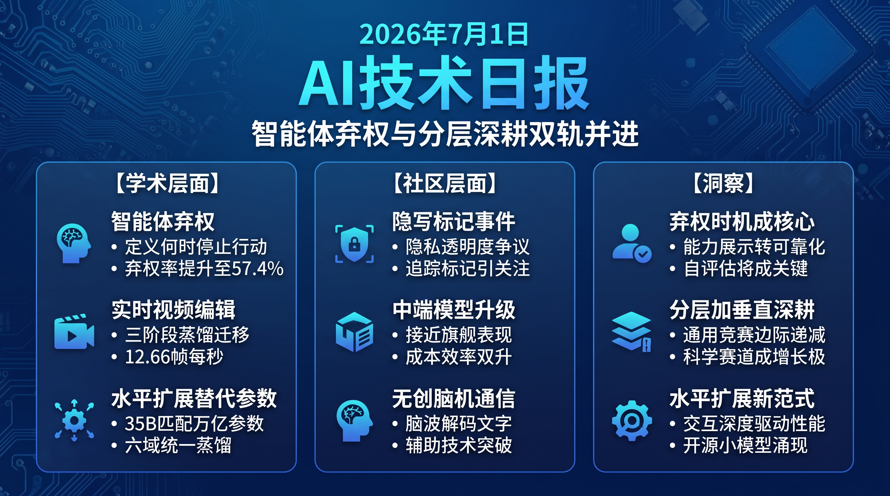

# 破晓 PoXiao · AI 技术日报 | 2026-07-01

> 数据来源：HuggingFace Daily Papers · HackerNews · Reddit LocalLLaMA
> 生成时间：2026-07-01 07:00 CST
> Profile：chenglitao · 视频生成(5.5) · 基础模型/推理(5.0) · 多模态/3D/具身(4.5)

---

## 📡 学术概览

### Tier 1 — 范式级创新

1. **Agentic Abstention：智能体何时该停下来而不是继续行动？**

   🔬 领域：Agent · 推理能力 · 热度：HF #1 (120 upvotes)

   - **一句话核心贡献**：定义了"智能体弃权"问题——LLM Agent 应何时在不确定性下停止调用工具而非盲目行动，并提出 CONVOLVE 方法将 Llama-3.3-70B 及时弃权率从 26.7% 提升至 57.4%。
   - **摘要精译**：
     LLM Agent 被期望在多轮交互中使用搜索、浏览器和终端工具完成用户目标，但并非所有目标都可在可用环境中实现，此时可靠 Agent 应识别进一步交互无益并弃权。与标准单轮"回答或弃权"不同，智能体弃权是序贯决策问题：Agent 在每轮可选择回答、弃权或继续收集信息，且弃权需求仅在环境交互后才显现。
     本文正式定义了 Agentic Abstention 问题，在 WebShop、终端环境和问答三个场景中评估 13 个 LLM-as-Agent 系统和 2 个 Agent 框架，涵盖 28,000+ 任务。核心发现：主要挑战不仅是 Agent 能否弃权，更在于何时弃权——部分 Agent 从不在该弃权时弃权，另一些则仅在大量无效交互后才弃权，尤其在指令"看似可行但环境揭示不可行"的任务上差距最大。
     实验表明更大或更强模型有时在及时弃权上表现更差。作者提出 CONVOLVE 上下文工程方法，将完整交互轨迹蒸馏为可复用停止规则，在 WebShop 上将 Llama-3.3-70B 及时弃权召回率从 26.7 提升至 57.4，无需更新模型参数。
   - **核心创新点**：
     1. 定义"智能体弃权"序贯决策问题
     2. 揭示更强模型弃权时机反而更差
     3. CONVOLVE 蒸馏交互轨迹为停止规则

   

   
💡 展开详情（方法论 + 实验）

   - **方法细节**：CONVOLVE 通过上下文工程将 Agent 的完整交互轨迹压缩为可复用的停止规则模板，注入后续任务的系统提示中，无需修改模型权重。评估覆盖 WebShop（购物）、SWE-bench（终端）和 HotpotQA（问答）三大场景。
   - **实验结果**：在 WebShop 上，CONVOLVE 将 Llama-3.3-70B 的及时弃权召回率从 26.7 提升至 57.4；Claude Sonnet 系列在"看似可行实则不可行"任务上弃权时机差距最大。
   - **局限性**：CONVOLVE 的停止规则泛化能力受限于轨迹质量；未探索多模态 Agent 场景下的弃权问题。
   - **链接**：https://arxiv.org/abs/2606.28733

   

2. **LiveEdit：面向实时扩散流式视频编辑**

   🔬 领域：视频生成 · 视频编辑 · 热度：HF #2 (70 upvotes)

   - **一句话核心贡献**：提出三阶段蒸馏流水线，将双向基础模型的编辑能力逐步迁移至高效单向流式编辑器，实现 12.66 FPS 的实时流式视频编辑。
   - **摘要精译**：
     流式视频编辑虽进展迅速，但实际部署仍受两大核心问题制约：维持背景和非编辑区域随时间稳定，以及满足实时交互场景的低延迟需求。现有流式视频生成方法主要面向合成任务，因严格内容保持和区域特定控制要求无法直接用于编辑。
     本文提出新型流式视频编辑框架，执行因果逐帧编辑，兼具强内容保持和实时响应能力。关键设计是三阶段蒸馏流水线，将编辑能力从强大双向基础模型逐步迁移至高效单向流式编辑器，在不牺牲视觉保真度的情况下实现稳定长时编辑。进一步引入面向自回归的掩码缓存，跨帧复用区域相关计算，大幅减少冗余处理并加速推理。
     在专用流式视频编辑基准上的广泛评估表明，该方法在流式基线中达到最优视觉质量，同时将推理速度大幅提升至 12.66 FPS，适用于交互式和增强现实应用。
   - **核心创新点**：
     1. 三阶段蒸馏从双向到单向迁移编辑能力
     2. AR 掩码缓存跨帧复用减少冗余计算
     3. 首个流式视频编辑专用评测基准

   

   
💡 展开详情（方法论 + 实验）

   - **方法细节**：三阶段蒸馏：Stage 1 双向模型编辑能力建立 → Stage 2 单向模型蒸馏 → Stage 3 推理加速优化。AR 掩码缓存机制复用帧间区域相关计算，避免每帧独立处理。
   - **实验结果**：在流式编辑基准上达到 SOTA 视觉质量，推理速度 12.66 FPS（远超实时需求），支持交互式和 AR 场景。
   - **局限性**：三阶段蒸馏流程训练复杂度高；长视频场景下内容保持仍可能退化。
   - **链接**：https://arxiv.org/abs/2606.26740

   

3. **Scaling the Horizon, Not the Parameters：35B Agent 达到万亿参数性能**

   🔬 领域：基础大模型 · Agent · 热度：HF #3 (67 upvotes)

   - **一句话核心贡献**：提出 Agents-A1，一个 35B MoE Agent 模型通过扩展智能体水平（horizon）而非参数量，在 SEAL-0 (56.4)、IFBench (80.6) 等长时任务上匹配甚至超越 Kimi-K2.6、DeepSeek-V4-pro 等万亿参数模型。
   - **摘要精译**：
     当前大模型性能提升主要依赖参数规模扩展，但本文提出不同路径：通过扩展智能体水平而非参数量来达到万亿参数级别性能。Agent 水平扩展从两个维度展开——扩展长时轨迹和扩展异构 Agent 能力。
     为此，作者构建了长时知识-行动基础设施，连接外部知识、动作、观察和验证器输出，生成平均 45K token 的智能体轨迹。基于此，提出三阶段训练方案：全领域监督微调对齐基础模型 → 领域级教师模型捕获专业知识 → 多教师领域路由策略蒸馏统一六个异构领域至单一可部署学生模型。
     Agents-A1 在长时 Agent 基准上实现强劲且广泛的表现，在 SEAL-0 (56.4)、IFBench (80.6)、HiPhO (46.4)、FrontierScience-Olympiad (79.0)、MolBench-Bind (56.8) 上领先，在 SciCode (44.3)、HLE (47.6)、BrowseComp (75.5) 上与万亿参数模型高度竞争。
   - **核心创新点**：
     1. 水平扩展替代参数扩展的新范式
     2. 45K token 长时知识-行动基础设施
     3. 多教师领域路由策略蒸馏

   

   
💡 展开详情（方法论 + 实验）

   - **方法细节**：三阶段训练：(1) 全域 SFT 对齐基础模型于广泛 Agent 行为；(2) 领域级教师模型（如编码、科学、浏览器等）捕获专业知识；(3) 多教师领域路由策略蒸馏 + 显著词汇对齐，统一 6 个领域至 35B MoE 学生。长时轨迹平均 45K token。
   - **实验结果**：SEAL-0 56.4、IFBench 80.6、HiPhO 46.4 均超越或匹配 Kimi-K2.6 / DeepSeek-V4-pro 等万亿参数模型。
   - **局限性**：Agent 轨迹构建依赖高质量基础设施，成本较高；35B MoE 仍需较大显存。
   - **链接**：https://arxiv.org/abs/2606.30616

   

4. **TUA-Bench：通用终端使用 Agent 基准测试**

   🔬 领域：Agent · 基准测试 · 热度：HF #4 (44 upvotes)

   - **一句话核心贡献**：提出首个通用终端使用 Agent 基准，包含 120 个跨 5 大任务家族的真实任务，最强 Agent (Claude Opus 4.8) 仅达 65.8% 总体性能，揭示终端智能仍有巨大提升空间。
   - **摘要精译**：
     随着 LLM 和 Agent 框架的进步，终端 Agent 已能执行超越编码的通用计算机任务。但现有基准不能充分评估通用终端 Agent：GUI 基准主要针对图形界面，终端基准则侧重编程工作流。
     本文引入 TUA-Bench，通用终端使用 Agent 基准，涵盖 120 个真实任务跨 5 大任务家族——文档编辑、邮件管理、实时网络信息检索等日常数字活动，以及与博士级领域专家共同设计的科学工程工作流。每个任务手动设计、在真实终端中运行确定性设置脚本，并采用基于执行结果的评分协议。
     实验发现最强前沿 Agent——Claude Code with Claude Opus 4.8 最大推理努力——仅达 65.8% 总体性能，各任务轨道存在显著差距，凸显从狭窄任务专用助手到通用终端 Agent 的鸿沟。
   - **核心创新点**：
     1. 首个覆盖非编程通用终端任务的基准
     2. 120 任务含博士级领域专家设计
     3. 揭示最强 Agent 仅达 65.8% 性能

   

   
💡 展开详情（方法论 + 实验）

   - **方法细节**：5 大任务家族：日常数字活动（文档编辑、邮件管理、网页检索）、科学工作流、工程工作流、信息管理、系统维护。每个任务含确定性环境设置脚本，执行结果自动化评分。
   - **实验结果**：Claude Opus 4.8 (max reasoning) 65.8% 总体性能；日常任务较好但科学工程差距显著；终端 Agent 从编码走向通用仍有本质差距。
   - **局限性**：120 任务规模相对有限；评分协议依赖确定性环境，真实终端环境更复杂。
   - **链接**：https://arxiv.org/abs/2606.28480

   

5. **ReFreeKV：迈向无阈值 KV 缓存压缩**

   🔬 领域：基础大模型 · 推理优化 · 热度：HF #5 (43 upvotes)

   - **一句话核心贡献**：提出首个无阈值 KV 缓存压缩方法 ReFreeKV，自适应调整预算分配，在 13 个数据集上实现跨域稳健压缩，解决现有方法对输入特定阈值的根本性依赖。
   - **摘要精译**：
     为降低 LLM 推理显存消耗，KV 缓存剪枝方法已被广泛研究。但这些方法在多数数据集实现无损压缩时，严重依赖一个未被充分强调的前提——需为每个输入/领域预设 KV 缓存预算阈值以获得最优性能。
     然而，这种输入敏感设计在开放域场景中根本受限：输入跨多种领域、长度和难度级别，缺乏阈值选择的明确边界。因此对输入特定阈值的依赖成为根本性局限，导致在任意输入上产生大幅性能退化。
     本文提出新目标，为稳健 KV 压缩消除阈值约束，倡导"无阈值"方法来自适应调整预算分配同时保持全缓存性能。进而提出 ReFreeKV 作为该目标的首个实例化方法，在 13 个跨不同上下文长度、任务类型和模型规模的数据集上验证其有效性和效率。
   - **核心创新点**：
     1. 揭示输入特定阈值是 KV 压缩根本局限
     2. 提出"无阈值"自适应预算分配目标
     3. ReFreeKV 跨 13 数据集稳健压缩

   

   
💡 展开详情（方法论 + 实验）

   - **方法细节**：ReFreeKV 通过自适应预算分配替代硬编码阈值，在运行时根据输入特征动态调整 KV 缓存保留策略。实验覆盖 13 个数据集，涵盖长上下文、短上下文、不同任务类型和多种模型规模。
   - **实验结果**：在 13 个数据集上实现接近全缓存的性能，同时显著降低显存消耗；对比需要阈值调优的方法，ReFreeKV 在开放域输入上退化幅度更小。
   - **局限性**：自适应分配增加少量计算开销；超大规模上下文（>100K tokens）场景尚未充分验证。
   - **链接**：https://arxiv.org/abs/2502.16886

   

6. **Trimming the Long-Tail：视觉世界模型评估的长尾修剪**

   🔬 领域：视频生成 · 世界模型 · 热度：HF #7 (35 upvotes)

   - **一句话核心贡献**：提出 Tailor-Bench 基准，设计常规→非常规→不可能三种渐进场景，揭示视觉世界模型在罕见物理交互上存在严重长尾差距——性能从常规到不可能场景急剧退化。
   - **摘要精译**：
     物理交互遵循长尾分布：常见和常规交互主导人类经验和视觉数据，而大量罕见和非常规交互则被严重忽视。尽管近期视觉世界模型在现有基准上实现了令人印象深刻的真实感，但它们主要聚焦于模拟常见物理交互。
     这引发核心问题：当前视觉世界模型是否真正内化和泛化了物理原理？本文引入 Tailor-Bench，挑战世界模型模拟非常规物理交互的能力。设计三种渐进场景模式：常规场景反映常见工具-任务对，非常规场景用属性兼容替代品替换常规工具测试功能泛化，不可能场景引入属性违反工具探测约束感知。
     实验结果揭示物理世界建模存在明显长尾差距：性能从常规到非常规再到不可能场景逐步退化，表明超越常见交互的泛化能力有限。图像模型无法实现正确状态变化，视频模型进一步遭受时间不一致性。
   - **核心创新点**：
     1. 三级渐进场景揭示长尾差距
     2. 非常规工具测试功能泛化
     3. 不可能场景探测物理约束感知

   

   
💡 展开详情（方法论 + 实验）

   - **方法细节**：Tailor-Bench 包含两种互补设置：预测生成（无引导推断结果）和描述生成（指定目标忠实实现）。三级场景（Regular → Unconventional → Impossible）逐步挑战模型对物理规律的泛化。
   - **实验结果**：性能从 Regular 到 Impossible 显著退化；图像模型失败于正确状态变化，视频模型额外面临时间不一致；模型依赖表层视觉模式而非物理推理。
   - **局限性**：基准规模有限；主要关注物体交互物理，未覆盖流体/粒子等连续物理现象。
   - **链接**：https://arxiv.org/abs/2606.24256

   

### Tier 2 — 工程改进与实用工具

7. **Video-MME-Logical：视频时序-逻辑推理诊断基准** (HF #8, 23↑)
   - 围绕状态追踪、顺序计数、时间排序等 5 种时序-逻辑操作设计 25 个细粒度任务类别，揭示 MLLM 随复杂度增大的人机差距。
   - 🔗 https://arxiv.org/abs/2606.27828

8. **AsyncOPD：异步策略蒸馏的陈旧容忍度研究** (HF #9, 23↑)
   - 首次系统研究异步 OPD 中陈旧数据影响，发现正向 KL 更稳健，提出 AsyncOPD 流水线将吞吐提升 1.6-3.8 倍。
   - 🔗 https://arxiv.org/abs/2606.24143

9. **OSWorld 2.0：长时真实计算机使用基准** (HF #15, 15↑)
   - 108 个长时工作流任务，人类完成需 1.6 小时、Claude Opus 4.7 平均需 318 次工具调用，揭示前沿 Agent 在真实复杂工作流上的本质差距。
   - 🔗 https://arxiv.org/abs/2606.29537

10. **DreamForge-World 0.1 Preview：低算力实时可控世界模型** (HF #19, 8↑)
   - 基于 Wan2.1-T2V-1.3B 适配残差动作路径，在单张 RTX 4090 上实现 14-15 FPS、480p 分辨率的实时交互世界模拟，支持键盘鼠标控制和中途重提示。
   - 🔗 https://arxiv.org/abs/2606.30292

---

## 🔥 社区速递

### Tier 1 — 热点聚焦

1. **Claude Code 被发现隐写标记请求**

   🔥 热度信号：技术社区 Score 1249 · 来源：thereallo.dev

   - **一句话核心**：研究人员发现 Claude Code 在用户请求中隐写嵌入隐藏标记，用于追踪和识别 AI 生成内容。
   - **核心共识**：
     1. AI 工具在用户不知情下嵌入隐藏标记引发隐私透明度担忧
     2. 隐写技术本身是双刃剑——可防滥用但需知情同意
   - **主要争议**：AI 公司是否有权在用户请求中嵌入隐藏追踪标记而不告知用户？
   - **影响评估**：对 AI 工具开发者而言，此事件可能推动行业建立内容标记透明度标准；对普通用户而言，需关注 AI 工具的隐私政策和数据处理方式。
   - 🔗 [thereallo.dev](https://thereallo.dev/blog/claude-code-prompt-steganography)

2. **Claude Sonnet 5 发布**

   🔥 热度信号：技术社区 Score 773 · 来源：anthropic.com

   - **一句话核心**：Anthropic 发布 Claude Sonnet 5，社区高度关注其性能提升和与竞品的对比。
   - **核心共识**：
     1. Sonnet 5 在编码和推理任务上有显著提升，接近 Opus 级别表现
     2. Anthropic 持续缩小其不同层级模型间的性能差距
   - **主要争议**：Sonnet 5 是否已足以替代 Opus 用于大多数实际任务？
   - **影响评估**：中端模型性能持续逼近旗舰模型，对开发者和企业意味着可用更低成本获得接近顶级的能力，可能重塑 API 定价策略。
   - 🔗 [Anthropic 官方公告](https://www.anthropic.com/news/claude-sonnet-5)

3. **Claude Science 发布**

   🔥 热度信号：技术社区 Score 316 · 来源：claude.com

   - **一句话核心**：Anthropic 推出 Claude Science 产品，聚焦科学研究和数据分析场景的 AI 辅助。
   - **核心共识**：
     1. AI for Science 是 2026 年最明确的商业化方向之一
     2. 科学场景对准确性和可验证性要求极高，与通用对话有本质区别
   - **主要争议**：AI 辅助科学研究的可靠性边界在哪里？
   - **影响评估**：标志着 AI 公司从通用助手向专业领域纵深拓展的战略转向，对科研工作者是重大工具升级信号。
   - 🔗 [Claude Science](https://claude.com/product/claude-science)

4. **Nano Banana 2 Lite：谷歌 DeepMind 图像生成新模型**

   🔥 热度信号：技术社区 Score 272 · 来源：deepmind.google

   - **一句话核心**：谷歌 DeepMind 发布 Gemini Image Flash Lite 模型，主打轻量快速图像生成。
   - **核心共识**：
     1. 图像生成模型正沿"更小更快"方向演进，与 LLM 的蒸馏趋势一致
     2. 轻量模型使端侧和实时应用场景更加可行
   - **主要争议**：轻量模型在创意质量上能否与全尺寸模型拉开足够差距？
   - **影响评估**：轻量图像生成模型的发布将加速图像生成在移动端和实时交互场景的普及，开发者应关注 API 定价和延迟表现。
   - 🔗 [DeepMind 官方页面](https://deepmind.google/models/gemini-image/flash-lite/)

5. **脑波转文字：Meta 实现无创脑机接口通信**

   🔥 热度信号：技术社区 Score 64 · 来源：ai.meta.com

   - **一句话核心**：Meta 发布 Brain2Qwerty，通过脑波信号和 AI 实现无需手术的脑-文字通信路径。
   - **核心共识**：
     1. 无创脑机接口是通信障碍患者的重要突破
     2. AI 解码脑信号的能力超出此前预期
   - **主要争议**：无创方案的准确率和实用性与有创方案差距多大？
   - **影响评估**：对 AI 研究者而言开辟了多模态输入新方向；对医疗和辅助技术领域，可能改变重度沟通障碍患者的交互方式。
   - 🔗 [Meta AI Blog](https://ai.meta.com/blog/brain2qwerty-brain-ai-human-communication/)

---

## 💰 商业动态

1. **Anthropic 双发：Sonnet 5 + Claude Science 同日上线**
   Anthropic 一日发布两款产品——Claude Sonnet 5 升级中端模型性能，Claude Science 进军 AI for Science 赛道。中端模型逼近旗舰 + 垂直领域深耕的双线策略，显示 AI 公司正从"通用模型竞赛"转向"性能分级 + 场景深耕"的精细化阶段。

2. **DeepMind 轻量图像模型 Nano Banana 2 Lite 发布**
   谷歌 DeepMind 推出 Gemini Image Flash Lite，轻量化图像生成模型。与主推全尺寸模型并行，轻量模型瞄准端侧部署和实时交互市场，图像生成领域也进入"蒸馏提速"周期。

3. **Zluda 6：非英伟达 GPU 运行 CUDA 应用**
   Zluda 6 发布，支持在非英伟达 GPU 上运行未修改的 CUDA 应用。HN 热度 138，对 AI 基础设施领域意义重大——打破英伟达 CUDA 生态锁定，为 AMD/Intel GPU 在 AI 训练推理市场创造可能性。

---

## 🏢 职场动态

1. **Agent 从"能做"到"知道何时停"**
   多篇论文聚焦 Agent 可靠性——Agentic Abstention 研究 Agent 弃权时机，TUA-Bench 揭示通用终端 Agent 仅 65.8% 完成率，OSWorld 2.0 显示长时工作流人类需 1.6 小时。Agent 能力边界正在被精确标定，可靠性工程师将成为热门角色。

2. **35B 匹配万亿参数：小模型高能力时代来临**
   Agents-A1 用 35B 参数匹配万亿参数模型性能，显示"水平扩展"而非"参数扩展"的可行路径。对从业者而言，小团队也有机会训练出匹配巨头的 Agent 模型。

---

## 📊 今日总结

1. **Agent 可靠性从"能做"进入"何时停"阶段**：今天 Agentic Abstention (HF #1)、TUA-Bench、OSWorld 2.0 三篇论文从不同维度标定 Agent 的能力边界和弃权时机，最强 Agent 在通用终端任务仅 65.8% 完成率；背后逻辑是 Agent 研究已从"能做什么"转向"何时不应做"，这标志着 Agent 技术从能力展示进入工程可靠化阶段；预测接下来半年，Agent 弃权/置信度/自我评估能力将成为核心差异化指标。

2. **AI 公司从通用竞赛转向分层+垂直深耕**：Anthropic 同日发布 Sonnet 5（中端逼近旗舰）和 Claude Science（垂直场景），DeepMind 推出轻量图像模型；这反映行业共识——通用模型边际收益递减，分层定价和垂直深耕成为商业新范式；预测 AI for Science 和轻量端侧部署将成为 2026H2 两大增长极。

3. **水平扩展替代参数扩展的新训练范式浮现**：Agents-A1 以 35B MoE 匹配万亿参数模型，通过 45K token 长时轨迹和三阶段蒸馏实现性能跃迁，而非简单堆参数；这暗示 Agent 领域的 Scaling Law 正在从"参数量驱动"转向"交互深度驱动"；预测 35B 级别的开源 Agent 模型将在下半年密集涌现，小团队也能训练出匹敌巨头的 Agent。
