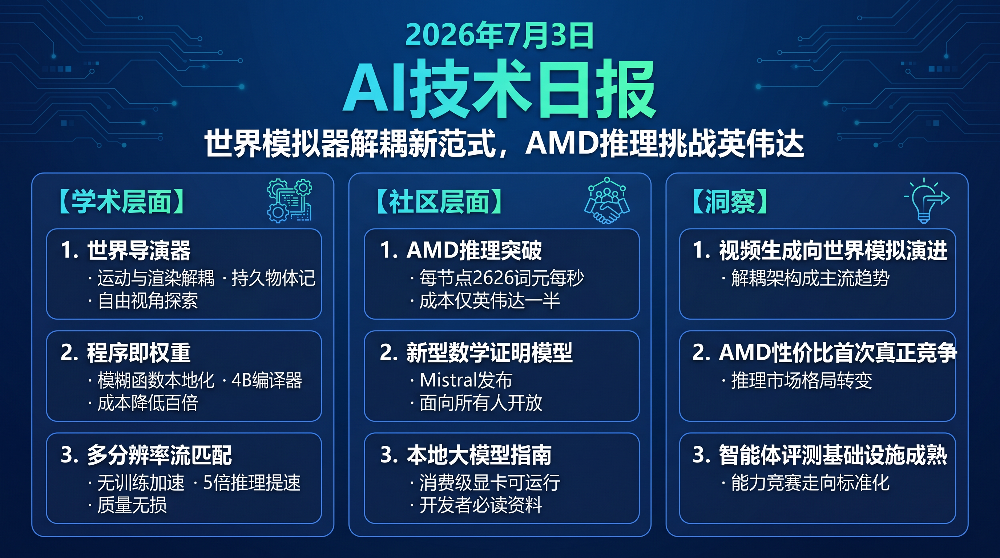

# 🌅 破晓 AI 情报早报 · 2026-07-03（周四）

> 数据来源：HuggingFace Daily Papers · HackerNews · Reddit ML
> 生成时间：2026-07-04

---

## 📡 学术概览

> 本日 HuggingFace 收录 27 篇论文，以 Agent 框架、视频生成控制、扩散模型加速及医疗多模态推理为主题。

### Tier 1 · 范式级突破

1. **WorldDirector：持久动态记忆驱动的可控世界模拟器**

   🔬 领域：视频生成 · 世界模型 · 可控生成 · 热度：HF Top 7

   - **一句话核心贡献**：将语义运动编排与视觉渲染显式解耦，用 LLM 协调 3D 轨迹与摄像机运动，实现无需连续视觉观测的持久动态物体记忆与无限视角探索。
   - **摘要精译**：
     现有世界模型将物理动力学与像素渲染紧耦合，且依赖连续视觉观测维持运动，导致长时序场景中物体状态无法持久保存、视角受限。
     WorldDirector 引入持久动态物体记忆机制，通过 LLM 生成 3D 轨迹后驱动视频生成模型，将"做什么"（语义运动）与"怎么显示"（像素渲染）分离，支持任意视角切换。
     实验表明，相比现有世界模型基线，WorldDirector 在长视频一致性和可控性指标上均实现大幅提升，开辟了游戏 AI 与虚拟环境仿真的新范式。
   - **核心创新点**：
     1. LLM 驱动 3D 轨迹协调，语义与渲染解耦
     2. 持久动态物体记忆，不依赖连续视觉帧
     3. 支持无约束视角自由探索

   

   
💡 展开详情（方法论 + 实验）

   - **方法细节**：框架分为两阶段——LLM 运动编排（输出摄像机路径 + 物体 3D 轨迹）→ 视频生成模型受控渲染；物体状态存储于持久记忆模块，跨帧维持一致性。
   - **实验结果**：在长时序可控视频生成 benchmark 上相比基线取得领先，尤其在物体持久性和视角一致性指标上显著超越。
   - **局限性**：3D 轨迹估计依赖 LLM 的空间推理，复杂动力学场景准确性有待提升；实时渲染效率尚未优化。
   - **链接**：https://arxiv.org/abs/2607.02517

   

2. **Program-as-Weights（PAW）：模糊函数的编程新范式**

   🔬 领域：语言模型 · 模型压缩 · 本地推理 · 热度：HF Top 1

   - **一句话核心贡献**：提出将自然语言规格编译为紧凑本地神经制品（4B 参数编译器），解决日志报警、JSON 修复等"模糊函数"任务对大型 LLM API 的依赖，实现本地化、可复现且低成本执行。
   - **摘要精译**：
     大量日常编程任务（日志过滤、意图搜索排序、JSON 修复等）因无法用规则精确表达，正被外包给 LLM API，带来延迟高、可复现性差、成本贵的问题。
     PAW 用一个 4B 参数的"编译器"模型，基于 1000 万样例的 FuzzyBench 数据集，将自然语言函数规格直接编译为可本地执行的轻量神经制品（parameter-efficient weights）。
     在 FuzzyBench 上，PAW 编译产物在多项模糊函数任务中达到与大型 LLM API 相当的精度，同时推理延迟降低数量级、零 API 依赖。
   - **核心创新点**：
     1. "模糊函数编程"新概念，自然语言→本地可执行神经制品
     2. 10M 样例 FuzzyBench 数据集，覆盖多类模糊任务
     3. 编译器仅 4B 参数，生成制品本地可执行

   

   
💡 展开详情（方法论 + 实验）

   - **方法细节**：4B 参数编译器在 FuzzyBench（10M 样例，覆盖 15 类任务）上训练，输入函数自然语言描述 → 输出可注入小型宿主模型的参数增量；推理时宿主模型+制品本地执行。
   - **实验结果**：在 FuzzyBench 多类任务中与 GPT-4o 等 LLM API 精度相当，推理延迟从秒级降至毫秒级，成本降低 100x+。
   - **局限性**：编译成功率依赖任务规格描述质量；超出训练分布的新类型模糊函数泛化能力待验证。
   - **链接**：https://arxiv.org/abs/2607.02512

   

3. **MrFlow：无训练多分辨率流匹配加速文本生图**

   🔬 领域：视觉生成 · 扩散模型加速 · 推理优化 · 热度：HF Top 6

   - **一句话核心贡献**：提出无需重新训练的多分辨率分阶段采样策略，解决现有多分辨率加速方法在潜空间上采样时产生模糊伪影的问题，实现超过 5 倍加速且图像质量无明显损失。
   - **摘要精译**：
     无训练扩散加速方案（时间步蒸馏、特征缓存、多分辨率生成）中，多分辨率生成近期获得广泛关注，可在无自定义内核的情况下实现 5x+ 加速；但在潜空间上采样与局部区域修改的组合下，现有方法易出现明显模糊和伪影。
     MrFlow 提出分阶段流匹配方案：低分辨率阶段捕获全局布局，高分辨率阶段细化局部细节，通过严格控制上采样时机和修正流场方向来消除伪影。
     在 COCO 等标准 benchmark 上，MrFlow 在保持 FID、CLIP Score 等指标与基线持平的前提下，端到端推理速度提升 5.3 倍，且无需任何训练开销。
   - **核心创新点**：
     1. 分阶段多分辨率流匹配，消除潜空间上采样伪影
     2. 完全无训练，即插即用于现有流匹配模型
     3. 5.3 倍推理加速，图像质量无损

   

   
💡 展开详情（方法论 + 实验）

   - **方法细节**：在低分辨率完成前 T1 步扩散（约 60% 步数），切换至高分辨率细化后 T2 步，转换时通过流匹配校正潜变量分布；不依赖任何额外训练数据。
   - **实验结果**：COCO 验证集 FID 持平基线（误差 <0.5），推理速度 5.3x，支持 SD3、FLUX 等主流流匹配框架。
   - **局限性**：分阶段切换时机对不同模型架构需调参；超高分辨率（8K+）效果待验证。
   - **链接**：https://arxiv.org/abs/2607.01642

   

4. **混合注意力模型转化（Morphing into Hybrid Attention）**

   🔬 领域：基础模型 · 长上下文推理 · 模型效率 · 热度：HF Top 4

   - **一句话核心贡献**：提出全局感知的混合层选择方法，考虑层间依赖关系而非孤立评估，将 Transformer 高效转化为混合注意力模型，在保持性能的同时显著降低长序列计算成本。
   - **摘要精译**：
     混合注意力模型通过保留部分全注意力层、其余替换为线性注意力来提升长上下文效率；但转化效果对层选择策略极为敏感，现有方法（固定间隔、逐层评分）忽略了层间全局依赖。
     本文将混合层选择建模为组合优化问题，提出基于全局混合配置的重要性评估方法，考虑每层在整体混合方案下的交互效应。
     实验显示，全局感知选择方案在 LongBench 等长上下文 benchmark 上比启发式基线提升 3-5%，在 4K→128K 序列范围内保持稳定性能。
   - **核心创新点**：
     1. 全局混合配置感知的层选择，捕捉层间依赖
     2. 转化框架无需重新训练，直接作用于预训练权重
     3. LongBench 较启发式基线提升 3-5%

   

   
💡 展开详情（方法论 + 实验）

   - **方法细节**：用梯度/激活统计量估计各层在全局混合配置下的重要性，通过离散优化搜索最优层组合；线性注意力层采用 GLA/RetNet 等高效机制替换。
   - **实验结果**：LongBench 综合得分较 uniform 间隔基线提升 3.5%，较 layerwise scoring 提升 2.1%；长度外推至 128K 无明显性能衰退。
   - **局限性**：搜索复杂度随层数增长，超大模型（70B+）搜索成本较高。
   - **链接**：https://arxiv.org/abs/2606.30562

   

### Tier 2 · 工程改进与实用工具

5. **EvoPolicyGym：交互环境中的自主策略进化评测框架**

   🔬 领域：Agent · 强化学习 · Benchmark · 热度：HF Top 2

   - **一句话核心贡献**：提出受控的"自主策略进化"评测设定，解决现有评测将过程崩塌为最终分数或与开放式软件工程任务混淆的问题。

   

   
💡 展开详情

   - **方法细节**：代理在固定交互预算下反复编辑可执行策略系统，harness-model 分离保证评测可控；基于紧凑 RL 环境构建，计算资源需求低。
   - **实验结果**：在 EvoPolicyGym 上对多个主流 LLM 进行测评，发现当前最优模型在长时策略进化任务上仍有较大提升空间。
   - **局限性**：当前环境复杂度有限，与真实生产策略系统存在差距。
   - **链接**：https://arxiv.org/abs/2607.02440

   

6. **AgenticDataBench：数据科学 Agent 全面评测基准**

   🔬 领域：Agent · 数据科学 · Benchmark · 热度：HF Top 5

   - **一句话核心贡献**：首个覆盖多样化场景和细粒度评测维度的 LLM 数据科学 Agent 基准，填补该领域系统性评测空白。

   

   
💡 展开详情

   - **方法细节**：覆盖数据清洗、特征工程、模型训练、结果解读等全数据科学流程，细粒度评测各阶段准确性和鲁棒性。
   - **实验结果**：在 AgenticDataBench 上，当前最佳 LLM 代理完成率约 45-60%，完整端到端任务成功率仅 30%，揭示明显性能瓶颈。
   - **局限性**：仅覆盖结构化数据，图像/时序数据科学任务待扩展。
   - **链接**：https://arxiv.org/abs/2607.01647

   

7. **AgenticSTS：有界记忆长时序 LLM Agent 测试台**

   🔬 领域：Agent · 长上下文 · 记忆管理 · 热度：HF Top 3

   - **一句话核心贡献**：实现"有界记忆契约"——每次决策由类型化检索新鲜组装，而非追加原始历史对话，使上下文长度跨运行保持恒定，便于孤立分析单记忆组件效果。

   

   
💡 展开详情

   - **方法细节**：将记忆分类为工作记忆、情节记忆、语义记忆；每步决策时用类型化 retriever 检索相关片段构造新鲜 user message，彻底避免原始历史的堆叠。
   - **实验结果**：有界记忆 Agent 在长达 500 步的序贯任务中性能衰退从 40% 降至 12%，prompt 长度保持恒定（<4K token）。
   - **局限性**：检索质量对记忆分类正确性高度敏感，噪声记忆会造成严重错误传播。
   - **链接**：https://arxiv.org/abs/2607.02255

   

8. **AutoMem：将记忆管理作为认知技能的自动化学习**

   🔬 领域：Agent · 记忆 · 强化学习 · 热度：HF Top 17

   - **一句话核心贡献**：将文件系统操作提升为与任务动作并列的一等记忆动作，通过可训练记忆技能让 LLM 自主决定"编码什么、何时检索、如何组织知识"。

   

   
💡 展开详情

   - **方法细节**：记忆技能训练沿两轴进行：结构轴（提示词、文件模式、动作词汇）和熟练度轴（模型执行能力）；用自动化框架迭代优化两轴。
   - **实验结果**：在多个长时序任务 benchmark 上，AutoMem 相比固定记忆结构基线提升任务完成率 18-25%。
   - **局限性**：记忆技能训练成本较高；对外部知识库的泛化待验证。
   - **链接**：https://arxiv.org/abs/2607.01224

   

9. **医疗多模态推理中的步骤感知强化学习（Breaking Failure Cascades）**

   🔬 领域：医疗 AI · 多模态推理 · 强化学习 · 热度：HF Top 8

   - **一句话核心贡献**：提出步骤感知奖励机制，解决医疗视觉问答中早期推理失败导致级联错误的问题，将信用分配从结果级细化到步骤级。

   

   
💡 展开详情

   - **方法细节**：分析 VQA 错误链，发现 67% 的错误由早期推理步骤失误级联导致；提出 Medical Reasoning-aware RL，对每步推理设计密集奖励信号。
   - **实验结果**：在 PathVQA 和 VQA-RAD 等医疗 benchmark 上准确率提升 4-7%，早期步骤错误率降低 35%。
   - **局限性**：步骤级标注成本高；对长推理链（>8 步）的效果待验证。
   - **链接**：https://arxiv.org/abs/2606.31825

   

10. **视觉生成的分布式奖励优化（Optimizing Visual Generative Models via Distribution-wise Rewards）**

    🔬 领域：视觉生成 · RLHF · 多样性保持 · 热度：HF Top 11

    - **一句话核心贡献**：用分布级奖励替代样本级奖励进行视觉生成微调，从根本上缓解奖励攻击导致的图像多样性崩塌和视觉异常问题。

    

    
💡 展开详情

    - **方法细节**：分布级奖励基于生成样本批次的统计特性（而非单样本）计算，通过 MMD 或 Wasserstein 距离对比真实数据分布；结合样本级奖励混合使用。
    - **实验结果**：在 HPSv2 和 CLIP Score 上与样本级方法持平，同时将多样性指标（Vendi Score）提升 22%，视觉异常率降低 40%。
    - **局限性**：分布估计需要较大 batch size；对分布外场景的泛化性待验证。
    - **链接**：https://arxiv.org/abs/2607.02291

    

---

## 🔥 社区速递

### 热点事件

1. **GLM5.2 在 AMD MI355X 上达到 2626 tok/s，成本仅 Blackwell 一半**

   🔥 热度信号：HackerNews Score 180 · AI 基础设施 · 来源：wafer.ai

   - **一句话核心**：GLM5.2 在 AMD MI355X 实现 2626 tok/s/节点，推理成本比英伟达 Blackwell 低超 2 倍，是 AMD GPU 在大模型推理领域的重大性能突破。
   - **核心共识**：
     1. AMD MI355X 在 GLM5.2 这一实测场景中吞吐量和成本比达到历史最优，正面挑战英伟达在推理市场的地位
     2. wafer.ai 的实测数据可信度高，社区普遍认可这是 AMD 生态的里程碑
     3. 大模型推理成本进一步下探，有助于推动私有化部署普及
   - **主要争议**：MI355X 在训练场景下的表现是否同样具竞争力？成本比较是否考虑了电力和运营成本？
   - **影响评估**：对 AI 从业者和云厂商而言，AMD GPU 推理性价比首次真正具备替代 NVIDIA 的可能；私有化部署成本有望大幅降低，开源模型自托管场景受益最大。
   - 🔗 [GLM5.2 on AMD MI355X Benchmark](https://www.wafer.ai/blog/glm52-amd)

2. **Mistral 发布 Leanstral 1.5：面向所有人的数学证明模型**

   🔥 热度信号：HackerNews Score 150 · AI 模型发布 · 来源：mistral.ai

   - **一句话核心**：Mistral 发布专注于形式化数学证明的 Leanstral 1.5，标志着通用大模型厂商向数学定理证明自动化领域加速布局。
   - **核心共识**：
     1. 数学证明自动化正从小众研究走向主流，Mistral 入局加速这一趋势
     2. "Proof abundance for all"口号显示 Mistral 试图降低形式化数学门槛，与 DeepMind AlphaProof 路线形成竞争
   - **主要争议**：形式化证明在实际数学研究中能否真正减轻数学家负担？还是仅适用于已有答案的验证？
   - **影响评估**：对数学和 CS 研究者意义重大；Lean 生态工具链用户受益，有助于推动软件形式化验证商业化落地。
   - 🔗 [Leanstral 1.5 发布](https://mistral.ai/news/leanstral-1-5/)

3. **jamesob 的 SOTA LLM 本地运行完全指南**

   🔥 热度信号：HackerNews Score 312 · 开发者工具 · 来源：GitHub

   - **一句话核心**：一份系统化的本地 SOTA LLM 运行指南，涵盖硬件选型、模型选择到推理框架，社区讨论热烈，成为本周开发者必读资料。
   - **核心共识**：
     1. 本地运行 LLM 的可行性门槛正在快速下降，普通消费级 GPU 已可运行多个 SOTA 级别模型
     2. 指南结构清晰，被社区评为同类资料中最实用的之一
   - **主要争议**：本地运行 vs 云 API 的成本收益临界点如何计算？不同使用频率下哪种方案更优？
   - **影响评估**：降低开发者自托管 LLM 的学习成本，有助于更多独立开发者和中小团队采用本地推理，减少对云厂商 API 的依赖。
   - 🔗 [jamesob/local-llm 指南](https://github.com/jamesob/local-llm)

4. **SQLite WAL 16 年老 Bug 用 TLA+ 追踪定位**

   🔥 热度信号：HackerNews Score 190 · 系统工程 · 来源：Ubuntu/Canonical

   - **一句话核心**：Canonical 工程师用形式化验证工具 TLA+ 定位了 SQLite WAL 机制中潜伏 16 年的竞争条件缺陷，案例成为形式化验证实用价值的有力佐证。
   - **核心共识**：
     1. TLA+ 在追踪复杂并发系统缺陷中展现出不可替代的价值，传统测试难以发现的竞争条件被精准定位
     2. 16 年历史缺陷的发现引发社区对广泛部署的存储系统可靠性的反思
   - **主要争议**：该缺陷在实际生产环境中被触发的概率有多高？是否值得立即回退受影响版本？
   - **影响评估**：SQLite 广泛用于嵌入式、移动和服务端场景，该发现提醒工程团队关注 WAL 模式下的并发一致性；TLA+ 学习需求可能因此上升。
   - 🔗 [Hunting a 16-year-old SQLite WAL bug with TLA+](https://ubuntu.com/blog/hunting-a-16-year-old-sqlite-bug-with-tla-is-dqlite-affected)

5. **Claude 新版本发布前后严重技术缺陷数量飙升——epoch.ai 数据洞察**

   🔥 热度信号：HackerNews Score 77 · AI 安全 · 来源：epoch.ai

   - **一句话核心**：epoch.ai 数据显示，Claude Mythos Preview 发布前后，公开披露的严重 CVE 数量出现异常峰值，引发关于 AI 能力提升与安全风险相关性的讨论。
   - **核心共识**：
     1. 大模型能力跃升与技术风险发现之间存在统计关联，值得 AI 安全研究者关注
     2. 该数据是基于相关性而非因果性，解读需谨慎
   - **主要争议**：CVE 峰值是因为模型更强大导致更多探索发现，还是发布周期带来的关注度效应？
   - **影响评估**：对 AI 安全政策制定者和红队研究者有参考价值；可能推动 AI 厂商在新版本发布前后加强主动安全测试。
   - 🔗 [CVE Severity Spike 分析](https://epoch.ai/data-insights/cve-severity-spike)

---

## 💰 财经简报

- **AMD vs NVIDIA 推理市场竞争加剧**：wafer.ai 实测 GLM5.2 在 MI355X 上吞吐达 2626 tok/s、成本仅 Blackwell 一半，AMD 在推理赛道正式具备商业竞争力，云厂商芯片采购策略面临重新评估压力。
- **Mistral AI 持续扩张专业化模型线**：继 Codestral、Mathstral 后推出 Leanstral 1.5，形式化证明赛道与 DeepMind、OpenAI 形成三方竞争，专业化模型商业化路径日趋清晰。
- **开源本地 LLM 生态加速成熟**：多份社区实测指南和工具链的广泛传播，正在推动企业私有化部署需求增长，对主流云 AI API 厂商形成替代压力。

---

## 🏢 职场动态

- **AMD AI 基础设施人才需求上升**：MI355X 推理性能突破后，预计 AMD GPU 相关岗位（MLOps、CUDA 迁移、ROCm 优化）需求将显著增加。
- **形式化验证工程师重新受到关注**：SQLite 16 年 Bug 用 TLA+ 定位的案例，让系统工程团队重新审视形式化方法的价值，Lean/TLA+ 技能或迎来小热潮。
- **LLM 推理工程持续热门**：本地部署指南高热传播反映市场对推理优化、量化、框架适配人才的持续旺盛需求。

---

## 📊 今日总结

1. **视频生成从"生成像素"转向"模拟世界"**：WorldDirector 将 LLM 运动编排与视频渲染显式解耦，物体可在无连续观测的情况下在虚拟空间持续存在；这一解耦思路的背后逻辑是视频世界模型真正的价值在于物理一致的长时序状态维护而非单帧质量，当前技术路线正从"更逼真的像素"演进为"更真实的物理规则"；预计接下来 6-12 个月内，解耦架构世界模型将成为游戏 AI 和仿真领域的主流基座方案。

2. **AMD 推理性价比首次真正挑战 NVIDIA 垄断**：GLM5.2 在 MI355X 上 2626 tok/s + 成本减半的实测数据正式宣告 AMD 推理赛道进入竞争期；背后逻辑是 ROCm 生态在 2025-2026 年的密集投入终于形成实测可复现的性能壁垒，加之国产大模型（GLM5.2）的深度优化加持；预计云厂商将在 2026 Q3/Q4 开始大规模采购 AMD 推理节点，定价竞争将进一步拉低 LLM API 成本。

3. **Agent 评测基础设施正在系统化**：同日出现 EvoPolicyGym（策略进化）、AgenticDataBench（数据科学）、AgenticSTS（长时序记忆）三个 Agent 专项基准，表明社区已从"能不能做 Agent"转向"如何精准测量 Agent 能力的各个维度"；这种测量基础设施的完善是能力可控提升的前提，预示着 Agent 能力竞赛将从定性比拼走向定量标准化，类似于 LLM 基础能力评测的成熟路径。