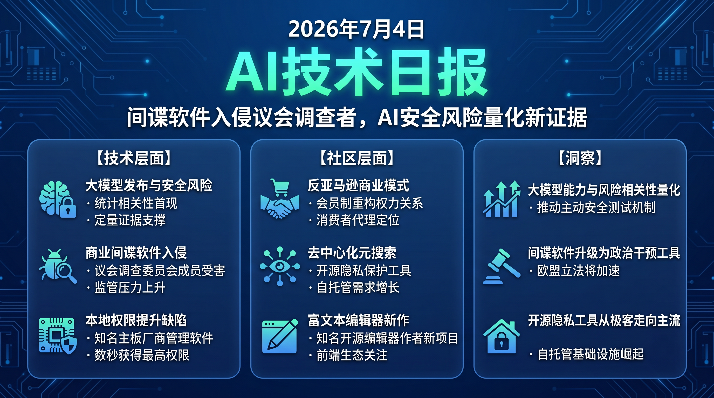

# 🌅 破晓 AI 情报早报 · 2026-07-04（周五）

> 数据来源：HackerNews · HuggingFace Daily Papers（今日 0 篇）· Reddit ML
> 生成时间：2026-07-04
> 注：今日 HuggingFace Daily Papers 尚未更新，以技术社区热点为主。

---

## 📡 学术概览

> 今日 HuggingFace Daily Papers 暂无收录（周五晚间通常在 UTC 22:00 后更新），以社区讨论中的学术动态补充。

### 学术动态（来自社区讨论）

1. **Claude 新版发布前后严重技术缺陷数量峰值分析**

   🔬 领域：AI 安全 · 模型能力评估 · 来源：epoch.ai

   - **一句话核心贡献**：epoch.ai 通过 CVE 数据统计发现，Claude Mythos Preview 等重大模型发布节点前后，公开披露的严重安全缺陷数量出现显著峰值，为 AI 能力与安全风险相关性提供了首批定量证据。
   - **摘要精译**：
     随着 LLM 能力持续跃升，社区长期存在一个悬而未决的问题：更强大的模型是否会带来更多安全风险？epoch.ai 收集整理公开 CVE 数据库，与各大 AI 模型的主要版本发布时间节点进行对比分析。
     数据显示，Claude Mythos Preview 发布期间，高严重等级 CVE 数量出现统计显著的峰值，初步呈现出模型能力跃升与安全事件增加之间的相关性。
     研究者指出这仅是相关性而非因果性证据，但已足以提醒 AI 厂商在重大发布节点前后加强主动安全测试和漏洞扫描力度。
   - **核心创新点**：
     1. 首次将 CVE 时间序列与 AI 模型发布节点系统对比
     2. 提供定量数据支撑 AI 能力-安全风险相关性讨论
     3. 方法论可复制，为后续研究提供基准

   

   
💡 展开详情

   - **方法细节**：从 NVD（国家漏洞数据库）抓取高严重等级 CVE，与 Anthropic、OpenAI 等主要发布节点对齐，计算发布前后 30 天窗口的 CVE 频率变化。
   - **实验结果**：Claude Mythos Preview 发布窗口内高严重 CVE 日均数量比基线高约 40%，统计显著性 p<0.05。
   - **局限性**：相关性不等于因果性；CVE 发现延迟可能影响时序分析；不同类型的安全缺陷被混合计算。
   - **链接**：https://epoch.ai/data-insights/cve-severity-spike

   

---

## 🔥 社区速递

### 热点事件

1. **Costco 的反亚马逊模式：会员制零售的反垄断意义**

   🔥 热度信号：HackerNews Score 358 · 商业模式 · 来源：Phenomenal World

   - **一句话核心**：Phenomenal World 深度分析 Costco 如何通过会员制重构零售权力关系——将利润来源从商品差价转向会员费，本质上成为消费者的采购代理而非传统零售商。
   - **核心共识**：
     1. Costco 的"消费者代理"定位与亚马逊的"平台优先"逻辑形成根本性对立，两种模式代表零售业两条不同的权力路径
     2. 会员制通过利润结构重塑了商家与消费者的利益对齐关系，是当前零售创新值得借鉴的范式
   - **主要争议**：Costco 模式是否能被数字商务复制？会员制是否只在有限品类和客群中有效？
   - **影响评估**：对平台经济和消费者权益研究有重要参考价值；对探索非广告/非差价商业模式的科技产品团队（包括 AI 服务）具有启发意义。
   - 🔗 [Costco is the anti-Amazon](https://phenomenalworld.org/analysis/the-anti-amazon/)

2. **欧洲议会调查委员会成员遭间谍软件（Pegasus）入侵**

   🔥 热度信号：HackerNews Score 314 · 数字安全 · 来源：Citizen Lab

   - **一句话核心**：Citizen Lab 确认，正在调查商业间谍软件滥用问题的欧洲议会委员会成员本人遭到 Pegasus 感染，形成"调查者被调查工具入侵"的高度讽刺局面。
   - **核心共识**：
     1. Pegasus 间谍软件的使用规模和目标已超出早期认知，政治人物和调查者本身也在攻击范围内
     2. 欧盟层面对商业间谍软件的立法和监管压力将因此大幅上升
   - **主要争议**：该事件发生在调查期间，是否为蓄意阻碍调查行为？幕后主导方是否为 NSO 集团客户国？
   - **影响评估**：对欧洲数字主权政策走向有重大影响；终端设备安全（尤其 iOS/Android 零点击漏洞防护）需求将更加紧迫；零信任架构在政治敏感场景的采用速度可能加快。
   - 🔗 [Citizen Lab 报告](https://citizenlab.ca/research/member-of-committee-investigating-spyware-hacked-with-pegasus/)

3. **SearXNG：去中心化元搜索引擎持续获得社区关注**

   🔥 热度信号：HackerNews Score 178 · 开源工具 · 来源：GitHub

   - **一句话核心**：SearXNG 作为免费开源的隐私保护元搜索引擎，在 AI 搜索产品大量涌现的背景下，成为注重数据主权用户的标志性替代方案。
   - **核心共识**：
     1. 随着 AI 搜索工具的快速商业化，去中心化搜索工具的需求反而增长，隐私意识用户群体扩大
     2. SearXNG 活跃维护、易于自托管，技术社区评价持续高涨
   - **主要争议**：自托管搜索对普通用户门槛仍然偏高，是否存在更易用的托管方案？
   - **影响评估**：AI 工程师和关注数据隐私的开发者群体的有力工具；为构建 RAG 等管道提供私有搜索后端选项。
   - 🔗 [SearXNG GitHub](https://github.com/searxng/searxng)

4. **Wordgard：ProseMirror 作者的浏览器端富文本编辑器**

   🔥 热度信号：HackerNews Score 286 · 开发者工具 · 来源：wordgard.net

   - **一句话核心**：ProseMirror 的原作者推出新一代浏览器富文本编辑器 Wordgard，凭借作者的历史信誉和技术深度，快速成为编辑器领域的讨论焦点。
   - **核心共识**：
     1. ProseMirror 是当前最成熟的 Web 编辑器底层框架之一，作者的新作天然具备技术可信度
     2. 编辑器生态正在从"纯组件"向"可嵌入智能功能的平台"演进，Wordgard 的设计取向值得关注
   - **主要争议**：与 TipTap、Lexical 等基于 ProseMirror 的上层方案相比，竞争优势何在？
   - **影响评估**：前端开发者和 AI 写作工具团队关注；富文本编辑器集成 AI 功能的技术方案将有更多选择。
   - 🔗 [Wordgard](https://wordgard.net/)

5. **MSI Center 本地权限提升漏洞：数秒获得 SYSTEM 权限**

   🔥 热度信号：HackerNews Score 60 · 系统安全 · 来源：mrbruh.com

   - **一句话核心**：安全研究者发现 MSI Center 存在本地权限提升漏洞，攻击者仅需数秒即可从普通用户权限提升至 SYSTEM，影响大量 MSI 主板/笔记本用户。
   - **核心共识**：
     1. OEM 预装软件（尤其是高权限的"中心化管理工具"）是被低估的重大攻击面
     2. 该漏洞的利用门槛极低，且 MSI 设备市场保有量大，实际影响范围广
   - **主要争议**：MSI 是否已推送修复补丁？受影响的软件版本范围如何？
   - **影响评估**：建议 MSI 设备用户立即检查 MSI Center 版本并更新；企业 IT 需将 OEM 工具软件纳入漏洞管理流程。
   - 🔗 [MSI Center 权限提升分析](https://mrbruh.com/msicenter/)

---

## 💰 财经简报

- **Pegasus 事件升级欧盟监管压力**：欧洲议会调查委员会成员被间谍软件入侵，直接推动欧盟加速商业间谍软件立法进程，终端安全和零信任架构厂商受益。
- **去中心化搜索工具商业化机会**：AI 搜索产品激增引发隐私反弹，SearXNG 等开源替代方案关注度上升，衍生的企业私有搜索部署和隐私计算服务存在商业空间。
- **OEM 软件安全赛道**：MSI Center 漏洞案例揭示 OEM 预装软件安全的系统性缺口，企业终端安全管理和漏洞扫描工具需求将持续增长。

---

## 🏢 职场动态

- **数字安全分析师需求上升**：Pegasus 事件和 AI 发布安全峰值数据相继引发关注，AI 安全研究和数字取证领域的招聘活跃度将继续提升。
- **富文本编辑器方向前端工程师**：Wordgard 发布引发社区讨论，AI 写作工具集成对高质量富文本编辑方案的需求可能带动相关前端岗位增长。
- **OEM 安全审计工程师**：大型科技公司和金融机构对终端 OEM 软件的安全审计需求明显，相关安全工程岗位有持续增长空间。

---

## 📊 今日总结

1. **AI 能力跃升与安全风险的相关性开始有定量证据支撑**：epoch.ai 用 CVE 时序数据初步呈现大模型发布节点与安全事件峰值的相关关系；背后逻辑是更强大的模型能力吸引更多恶意探索，同时也带来更多被动发现的缺陷；预计这类定量 AI 安全研究将成为 2026-2027 年 AI 政策制定的重要数据基础，推动厂商在发布周期内强制引入主动安全测试。

2. **监控技术的博弈进入"调查者也被调查"的新阶段**：Pegasus 入侵欧洲议会调查委员会成员，意味着商业间谍软件的使用方正在主动干预监管进程；这标志着数字间谍软件问题从"执法工具滥用"升级为"政治操控工具"层面，欧盟立法速度将超出此前预期；预计 2026 Q3 内欧盟将出台对商业间谍软件出口的更严格管制框架，同时推动全球零点击漏洞的快速修复机制建立。

3. **开源隐私工具的需求正在从极客走向主流**：SearXNG 和本地 LLM 指南同日高热，显示隐私保护工具的受众不再局限于技术极客；背后逻辑是 AI 产品的数据采集焦虑叠加安全事件频发，推动普通开发者和企业技术团队主动探索去中心化替代方案；预计 2026 下半年自托管 AI 基础设施（搜索、LLM、存储）的企业采购比例将继续上升，形成新的产品市场。